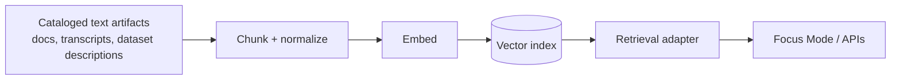

# Vector Dependency Scripts


These scripts manage the **vector index dependency** used for **semantic similarity search** in KFM.

> The vector index is a *derived* retrieval accelerator (not a system of record).  
> Source-of-truth remains in KFM catalogs + governed artifacts; the vector index can always be rebuilt.

---

## What this dependency does

KFM uses **hybrid retrieval**:
- **Keyword/full-text** search (e.g., “drought 1935”)
- **Vector/semantic** search (embeddings) to find relevant passages even when exact keywords differ

This folder covers the **vector** side: running the vector service and managing its lifecycle (init, health, backup, restore, rebuild).

### How it fits KFM



---

## Trust membrane and governance rules

**Non-negotiable:** clients (browser/UI, external partners) must **never** connect to the vector index directly.  
All access flows through governed backend APIs/services with policy enforcement and audit logging.

Operational governance expectations for this dependency:

- **Default-deny** mindset: vector access is an internal dependency; exposure requires explicit review.
- **Evidence-first**: index builds and rebuilds should emit receipts/metadata so results remain auditable.
- **Sensitivity-aware**: do not embed or index content that policy marks as restricted without applying required redaction/generalization.

---

## Directory layout

> The exact files may differ per environment. Keep this README updated if you add/remove scripts.

```text
infra/apps/dependencies/vector/
├── scripts/
│   ├── README.md                 # you are here
│   ├── up.sh                     # start vector service (dev/local)
│   ├── down.sh                   # stop vector service
│   ├── status.sh                 # show container/pod status
│   ├── logs.sh                   # tail logs
│   ├── health.sh                 # readiness/liveness check
│   ├── init.sh                   # create collection/index (idempotent)
│   ├── snapshot.sh               # backup/snapshot the index
│   ├── restore.sh                # restore from snapshot
│   └── reset.sh                  # destructive: wipe local data volumes (dev only)
└── (engine-specific files...)    # compose/kube manifests, config, etc.
```

---

## Quickstart

### Prerequisites

- A container runtime: Podman or Docker
- `bash`, `curl`, `jq`
- Network access to pull images (unless using a local registry/cache)

### 1) Configure env

These scripts should read configuration from environment variables. If your repo uses a `.env` pattern:

```bash
cp .env.example .env
# edit .env
```

### 2) Start the vector dependency

```bash
./up.sh
./health.sh
```

### 3) Initialize the index / collection

```bash
./init.sh
```

### 4) Stop

```bash
./down.sh
```

---

## Script registry

Scripts should be:

- **Idempotent by default** (safe to re-run)
- **Fail-fast** (`set -euo pipefail`)
- **Self-documenting** (`--help` and clear errors)
- **Non-interactive-friendly** (usable in CI or a Makefile)

| Script | What it does | Idempotent | Notes |
|---|---:|:---:|---|
| `up.sh` | Start the vector service | ✅ | Should not wipe data |
| `down.sh` | Stop the vector service | ✅ | Should not wipe data |
| `status.sh` | Show status/ports | ✅ | Useful for debugging |
| `logs.sh` | Tail logs | ✅ | Consider `--follow` and `--since` |
| `health.sh` | Check readiness | ✅ | Exit non-zero on failure |
| `init.sh` | Create collection/index settings | ✅ | Must be safe to run repeatedly |
| `snapshot.sh` | Create snapshot/backup | ✅ | Output should be append-only |
| `restore.sh` | Restore snapshot | ⚠️ | Should require explicit snapshot ref |
| `reset.sh` | Delete local volumes/data | ❌ | Dev-only. Require confirmation flag |

---

## Configuration contract

> Keep configuration **engine-agnostic**. Specific engines (FAISS, Annoy, Milvus, OpenSearch kNN, etc.) can map these settings.

### Required settings

| Variable | Example | Meaning |
|---|---|---|
| `VECTOR_ENDPOINT` | `http://127.0.0.1:6333` | Base URL for the vector service |
| `VECTOR_COLLECTION` | `kfm_text_chunks_v1` | Collection / index name |
| `VECTOR_DIMENSIONS` | `1536` | Embedding vector length |
| `VECTOR_DISTANCE` | `cosine` | Similarity metric (`cosine`, `dot`, `l2`) |
| `VECTOR_INDEX_TYPE` | `hnsw` | Index algorithm (if applicable) |
| `VECTOR_API_KEY` | _(secret)_ | Only if the engine supports/needs auth |

### Embedding manifest

Every embedding run should have a deterministic manifest (store it with receipts/build artifacts), including:

- embedding model id
- dimensions
- normalization policy
- chunking policy version
- build timestamp and spec hash

Changing any of these typically requires a **full re-index**.

---

## Rebuild and migration strategy

Vector indexes evolve. Treat the index like a cache with a controlled migration plan:

1. Create a **new** collection/index (e.g., `_v2`)
2. Backfill embeddings from governed processed artifacts
3. Run smoke tests (retrieval quality + latency)
4. Flip the **alias** / routing pointer (engine-dependent)
5. Deprecate old index after a retention window

---

## Backup and restore

### Snapshot rules

- Snapshots are **append-only** (never overwrite)
- Backups must be tested by **restoring** into a clean environment
- Include enough metadata to reproduce: engine version, schema, embedding manifest refs

### Minimum restore drill

```bash
./down.sh
./reset.sh --yes-really   # dev only
./up.sh
./restore.sh --snapshot <ref>
./health.sh
```

---

## Security notes

- Bind to `localhost` by default in dev
- Do not expose the vector service publicly without auth + network policy + governance review
- Never commit secrets (`VECTOR_API_KEY`, credentials) to git
- Prefer image pinning by digest in production manifests, plus SBOM/signature verification if available

---

## Troubleshooting

### Common issues

- **Port already in use** → check what is listening and update your port bindings.
- **SELinux / permissions** (common with volumes) → adjust volume labels/options per your runtime.
- **Health check fails** → check logs and engine config; confirm the index directory is writable.

Useful commands:

```bash
./status.sh
./logs.sh --follow
```

---

## Definition of Done

When changing these scripts, confirm:

- [ ] `./up.sh` → service becomes healthy
- [ ] `./init.sh` is idempotent (running twice does not error or recreate destructively)
- [ ] `./snapshot.sh` produces a restorable artifact
- [ ] `./restore.sh` + `./health.sh` passes in a clean environment
- [ ] Secrets are not printed to stdout or stored in repo
- [ ] Scripts are linted (`shellcheck`) and formatted (`shfmt`) in CI

---

## References

- KFM governance notes and the “search + vectors” workstream (see project docs)
- Vector retrieval tuning and embedding manifest guidance (see project docs)