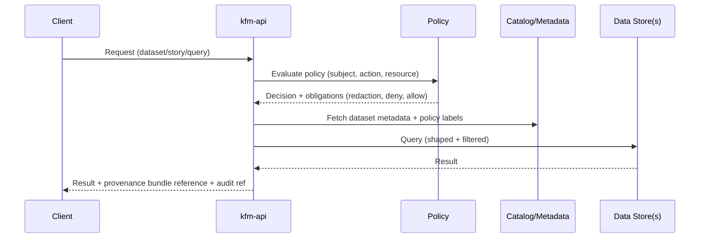

# 🧭 KFM API (kfm-api) — Infra App


This folder contains **infrastructure-as-code** to deploy **KFM’s governed backend API** (“kfm-api”) to Kubernetes/OpenShift environments.

KFM’s core system is explicitly a **pipeline → catalog → database → API → UI** platform, where **clients do not directly access databases** and *all access is mediated by the backend API enforcing validation + governance rules*. [oai_citation:3‡Kansas Frontier Matrix (KFM) – Comprehensive Technical Blueprint.pdf](sediment://file_000000006dbc71f89a5094ce310a452d)

> [!IMPORTANT]
> **Trust membrane (non-negotiable):**
> External clients (web UI, scripts, public consumers) **must never access PostGIS/Neo4j/object storage directly**. All access is via `kfm-api` through the governed policy boundary. [oai_citation:4‡Kansas Frontier Matrix (KFM) – Comprehensive Technical Blueprint.pdf](sediment://file_000000006dbc71f89a5094ce310a452d)

---

## 🎯 What belongs here

This directory should contain (or evolve toward) declarative deployment config such as:

- `Deployment` / `StatefulSet` + probes + resources
- `Service` (ClusterIP) + `Ingress` / `Route`
- `ConfigMap` for non-secret config
- `Secret` **references** (never plaintext secrets committed)
- `NetworkPolicy` (default deny + explicit egress)
- `HPA` (autoscaling) + `PodDisruptionBudget`
- Optional: `ServiceMonitor` / OpenTelemetry collector wiring

> [!NOTE]
> The exact file names may vary by repo conventions; the *intent* is stable: this folder is the **GitOps-friendly desired state** for the `kfm-api` workload.

---

## 🧱 Architecture context

KFM is governed by a canonical order:

**Raw → Processed → Catalog/Prov → Database → API → UI**  
Any shortcut (e.g., “inject data straight into UI” or “UI queries DB”) is considered flawed unless explicitly justified and reviewed. [oai_citation:5‡Kansas Frontier Matrix (KFM) – Comprehensive Technical Blueprint.pdf](sediment://file_000000006dbc71f89a5094ce310a452d)

### High-level flow (trust membrane)

```mermaid
flowchart LR
  Client[Web UI / External Clients] -->|HTTPS| API[kfm-api (FastAPI)]
  API -->|AuthN/AuthZ + Policy| Policy[Policy Engine / OPA rules]
  API -->|Ports & Repos| PostGIS[(PostGIS)]
  API -->|Ports & Repos| Neo4j[(Neo4j)]
  API -->|Signed/Versioned assets| Obj[(Object Store)]
  API -->|Read metadata| Catalog[Catalogs: DCAT / STAC]
  API -->|Attach lineage| Prov[PROV / provenance store]
  API -->|Logs/Metrics/Traces| Obs[Observability]
```

### Request lifecycle (governed)



---

## 🗂️ Directory layout

Recommended GitOps layout (Kustomize-style overlays):

```text
infra/
  apps/
    kfm-api/
      base/
        kustomization.yaml
        deployment.yaml
        service.yaml
        ingress.yaml            # or route.yaml for OpenShift
        networkpolicy.yaml
        hpa.yaml
        pdb.yaml
      overlays/
        dev/
          kustomization.yaml
          patch-env.yaml
          patch-resources.yaml
        stage/
          kustomization.yaml
        prod/
          kustomization.yaml
      README.md
```

> [!TIP]
> If you are using **Argo CD / OpenShift GitOps**, a common pattern is that everything under `apps/` is automatically discovered and deployed via an `ApplicationSet` (directory generator). Commit a new folder + Kustomize entrypoint and GitOps deploys it. [oai_citation:6‡Docker-GitOps-OpenShift.pdf](sediment://file_00000000004c71f8a55fb8ae2e980ace)

---

## 🚀 Deploy

### Prereqs

- `kubectl` (or `oc` for OpenShift)
- `kustomize` (often bundled as `kubectl kustomize`)
- Access to the target cluster/namespace

### Render & apply (example)

```bash
# from repo root
kubectl apply -k infra/apps/kfm-api/overlays/dev
```

Preview changes:

```bash
kubectl diff -k infra/apps/kfm-api/overlays/dev
```

Rollout status:

```bash
kubectl rollout status deployment/kfm-api
kubectl get pods -l app.kubernetes.io/name=kfm-api
```

Rollback (if needed):

```bash
kubectl rollout undo deployment/kfm-api
```

---

## 🧪 Health, readiness, and probes

`kfm-api` should expose at least a **health endpoint** suitable for Kubernetes probes.

Example pattern used in KFM FastAPI guidance:

- `GET /api/v1/health` → `200 OK` when service is up [oai_citation:7‡KFM-Software Support.pdf](sediment://file_00000000ab28722fa3482ac03433a8e1)

Recommended probe wiring:

- **livenessProbe**: `GET /api/v1/health`
- **readinessProbe**: `GET /api/v1/health` (or a deeper readiness check if available)

> [!WARNING]
> Keep health endpoints **non-sensitive** and avoid leaking internal details (no DB hostnames, no dataset existence hints).

---

## 🔐 Governance & policy invariants

KFM is “governance by default” and **fails closed** if checks/policies are missing or fail. [oai_citation:8‡Kansas Frontier Matrix (KFM) – Comprehensive Technical Blueprint.pdf](sediment://file_000000006dbc71f89a5094ce310a452d)

### Policy labels and redaction

Data sources and outputs are labeled (minimum set):

- `public`
- `restricted`
- `sensitive-location`

…and restricted fields/locations must be **redacted per rules**. [oai_citation:9‡KFM_Comprehensive_Data_Source_Integration_Blueprint_v1_massive.pdf](sediment://file_000000000bbc722f8debeb7985ab63ea)

> [!IMPORTANT]
> Infra should support **policy config injection** (ConfigMap/Secret refs) so policy updates can be deployed safely and auditable.

### Provenance-first API responses

Contract expectations from KFM’s integration blueprint:

- API responses must include a **provenance bundle reference** (or hash)  
- API must respect **policy redaction**  
- Contract tests should verify the above [oai_citation:10‡KFM_Comprehensive_Data_Source_Integration_Blueprint_v1_massive.pdf](sediment://file_000000000bbc722f8debeb7985ab63ea)

> [!NOTE]
> Treat this as an enforceable contract: infra + CI should make it hard to deploy a build that violates provenance/policy invariants.

---

## ⚙️ Configuration

### Non-secret configuration (ConfigMap)

Typical knobs (names may vary by implementation):

- `LOG_LEVEL`
- `PUBLIC_BASE_URL`
- `OTEL_EXPORTER_OTLP_ENDPOINT` (if using OpenTelemetry)
- `CORS_ALLOWED_ORIGINS` (tight allow-list)
- `RATE_LIMIT_*` (if implemented)

### Secrets (Secret references only)

- PostGIS DSN / credentials
- Neo4j URI / credentials
- Object-store credentials (if used)
- JWT signing keys / OAuth client secrets (if used)

> [!DANGER]
> **Never commit secrets** to this repo. Use Sealed Secrets, External Secrets Operator, or Vault-backed injection.

---

## 🐳 Image & runtime notes

KFM’s FastAPI guidance includes a **multi-stage Dockerfile** pattern and warns against relying on deprecated base images; `tiangolo/uvicorn-gunicorn-fastapi` is explicitly marked deprecated in favor of newer approaches. [oai_citation:11‡KFM-Software Support.pdf](sediment://file_00000000ab28722fa3482ac03433a8e1)

Infra responsibilities:

- Define the **image repository + tag** (or digest pin)
- Provide safe defaults for:
  - resource requests/limits
  - non-root containers
  - read-only root filesystem (when possible)
  - security context / seccomp profile
  - network policies

---

## 📈 Observability

Recommended (implementation-dependent):

- **Structured logs** (JSON)
- **OpenTelemetry** traces/metrics (exporter + sampling)
- Dashboards for:
  - request rate / latency (p50/p95/p99)
  - error rate (4xx/5xx)
  - policy denies vs allows
  - provenance bundle generation rate/failures

> [!IMPORTANT]
> Logs must not leak restricted fields. Redaction applies to telemetry too.

---

## 🧰 Common operations

### Update the deployed image

If using Kustomize image overrides:

```bash
cd infra/apps/kfm-api/overlays/dev
kustomize edit set image kfm-api=REGISTRY/ORG/kfm-api:NEW_TAG
```

Commit and let GitOps reconcile.

### Scale up/down quickly (non-prod)

```bash
kubectl scale deployment/kfm-api --replicas=2
```

---

## ✅ Change checklist (infra PR)

- [ ] `kustomize build` works for all overlays (`dev`, `stage`, `prod`)
- [ ] Probes point to a stable, non-sensitive health path
- [ ] NetworkPolicy exists (default deny + explicit egress)
- [ ] Secrets are referenced, not embedded
- [ ] Resource requests/limits set (and reviewed)
- [ ] Contract expectations preserved:
  - [ ] provenance bundle returned
  - [ ] redaction enforced
- [ ] Rollout/rollback plan documented in PR description

---

## 📚 References (governing docs)

- **KFM Comprehensive Technical Blueprint** (trust membrane, canonical pipeline order, fail-closed governance) [oai_citation:12‡Kansas Frontier Matrix (KFM) – Comprehensive Technical Blueprint.pdf](sediment://file_000000006dbc71f89a5094ce310a452d) [oai_citation:13‡Kansas Frontier Matrix (KFM) – Comprehensive Technical Blueprint.pdf](sediment://file_000000006dbc71f89a5094ce310a452d)
- **KFM Data Source Integration Blueprint v1.0 (2026-02-12)** (validation gates, policy labels, API contract tests for provenance/redaction) [oai_citation:14‡KFM_Comprehensive_Data_Source_Integration_Blueprint_v1_massive.pdf](sediment://file_000000000bbc722f8debeb7985ab63ea)
- **KFM Software Support** (FastAPI + GraphQL patterns, health test example, container guidance) [oai_citation:15‡KFM-Software Support.pdf](sediment://file_00000000ab28722fa3482ac03433a8e1) [oai_citation:16‡KFM-Software Support.pdf](sediment://file_00000000ab28722fa3482ac03433a8e1)
