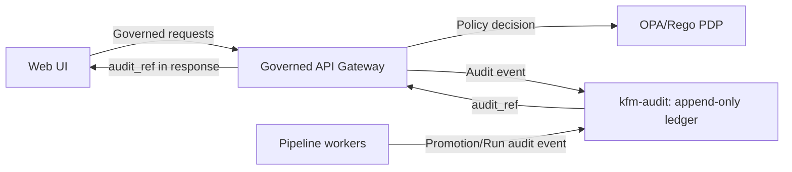

# KFM Audit Ledger (`kfm-audit`) 🧾🔒


**Path:** `infra/apps/kfm-audit/`

`kfm-audit` is the **append-only audit ledger** service/app for Kansas Frontier Matrix (KFM). Its job is to ensure that **every governed response yields an `audit_ref`**, and that audit/provenance logging remains a **non-optional** enforcement point of the KFM trust membrane.

---

## Why this exists

KFM’s system invariants require:

- A **trust membrane**: UI/external clients **never** access databases or object storage directly; everything crosses the governed API boundary.
- **Fail-closed governance**: policy must prove “allow.”
- **Audit + provenance on all governed interactions**.
- An **append-only audit ledger** where **every governed response yields an `audit_ref`**.

> [!IMPORTANT]
> KFM’s integration blueprint treats “audit/provenance logging for every read/write crossing the trust membrane” as a **build invariant enforced by tests**, not a documentation suggestion.  
> If the audit ledger cannot be written, the system should **not** silently return un-audited responses.

---

## What this app is (and is not)

### ✅ This app is
- A **durable, append-only ledger** of governance-relevant events:
  - governed API requests/responses
  - OPA policy decisions (allow/deny + redaction class)
  - pipeline/promotions events that must be auditable
  - Focus Mode outputs that require `audit_ref`
- A store of **audit references** (`audit_ref`) and (optionally) **linked provenance bundles** (PROV)

### ❌ This app is not
- A general analytics pipeline
- A replacement for cluster-level Kubernetes audit logging
- A place to store raw sensitive payloads or secrets

---

## Key invariants (must hold)

| Invariant | Meaning | Notes |
|---|---|---|
| **Append-only** | No “edit history” via UPDATE-in-place | “Corrections” are new events (revision/tombstone patterns) |
| **`audit_ref` everywhere** | Every governed response MUST include an `audit_ref` | Required by KFM blueprint artifacts and Focus Mode contract patterns |
| **Tamper-evidence** | Ledger must be detectably immutable | Hash-chaining / periodic notarization recommended |
| **No sensitive leakage** | Audit logs must not leak restricted coordinates/PII | Redaction must be policy-aligned; store abstractions not raw values |
| **Trust membrane only** | Frontend never calls `kfm-audit` directly | Access is via governed API / internal service accounts |

> [!TIP]
> The KFM blueprint identifies key audit risks: **non-tamper-evident logs**, **PII in logs**, and **insufficient retention controls**.  
> Treat these as explicit acceptance gates for this app.

---

## Suggested directory layout (recommended)

> This repo’s exact layout may differ; keep this README aligned to the manifests that exist here.

```text
infra/
└── apps/
    └── kfm-audit/
        ├── README.md                 # you are here
        ├── base/                     # base k8s manifests (Deployment/Service/etc.)
        ├── overlays/                 # env overlays (dev/stage/prod)
        │   ├── dev/
        │   ├── stage/
        │   └── prod/
        ├── policies/                 # NetworkPolicy / RBAC hardening
        └── dashboards/               # optional: Grafana dashboards / alerts (if used)
```

---

## Architecture fit



---

## Event model (conceptual)

KFM’s ecosystem already uses the concepts of:
- **receipts** (run_record / validation_report / run_manifest)
- **catalog artifacts** (DCAT/STAC/PROV)
- **evidence refs**
- **audit_ref** included in user-visible outputs (especially Focus Mode)

A practical `AuditEvent` should minimally support:

- **who** (agent/principal)
- **what** (action, resource, dataset/version/story/focus)
- **why** (policy decision, policy pack version, sensitivity label)
- **when** (timestamps)
- **evidence pointers** (resolvable refs, not raw payloads)
- **integrity** (hash of canonical event payload, chain pointer)

<details>
<summary><strong>Example (proposed) AuditEvent payload</strong> (not confirmed in repo)</summary>

```json
{
  "occurred_at": "2026-02-16T20:01:02Z",
  "actor": {
    "kind": "service",
    "id": "kfm-api",
    "on_behalf_of": "user:abc123"
  },
  "request": {
    "request_id": "req_01J0....",
    "method": "POST",
    "path": "/api/v1/ai/query",
    "ip_hash": "sha256:...",
    "user_agent_hash": "sha256:..."
  },
  "policy": {
    "decision": "allow",
    "policy_bundle_digest": "sha256:....",
    "sensitivity_class": "public",
    "redaction_applied": false
  },
  "artifact_refs": [
    { "kind": "dcat", "ref": "dcat:dataset/kfm.ks.boundaries@v2026_02_01" },
    { "kind": "prov", "ref": "prov:bundle/sha256:..." }
  ],
  "result": {
    "status": 200,
    "response_body_hash": "sha256:..."
  },
  "integrity": {
    "event_hash": "sha256:...",
    "prev_event_hash": "sha256:..."
  }
}
```
</details>

> [!NOTE]
> Provenance can contain sensitive information (internal identifiers, paths, intermediate data).  
> Prefer publishing **high-level provenance** externally while keeping detailed provenance access-restricted, and avoid logging sensitive content by value.

---

## API surface (proposed, not confirmed in repo)

Because this is an **infra app** folder, the exact API may live elsewhere. If `kfm-audit` is a standalone service, a minimal contract could look like:

- `POST /audit/v1/events` → returns `{ audit_ref }`
- `GET /audit/v1/events/{audit_ref}` → returns a sanitized event (privileged)
- `GET /audit/v1/prov/{audit_ref}` → returns linked PROV bundle (privileged or policy-controlled)

**Non-negotiable behavior:** the caller must be able to **attach `audit_ref` to the governed response**.

---

## Deployment

This README avoids assuming Helm vs Kustomize. Use the option that exists in this directory:

### Option A: Kustomize (if `kustomization.yaml` exists)
```bash
kubectl apply -k infra/apps/kfm-audit/overlays/dev
```

### Option B: Helm (if `Chart.yaml` exists)
```bash
helm upgrade --install kfm-audit infra/apps/kfm-audit/chart -n kfm --create-namespace
```

---

## Configuration (proposed checklist)

| Setting | Purpose | Guidance |
|---|---|---|
| Storage backend | Where audit events persist | Postgres is common for MVP; object storage for cold archive |
| Retention | How long hot data stays queryable | Define retention + archive strategy; deletion must remain auditable |
| Integrity strategy | Tamper evidence | Hash chain + periodic notarization/export |
| Redaction strategy | Prevent sensitive leakage | Store pointers/hashes, not raw sensitive payloads |
| Access control | Who can read audit entries | Default-deny; treat as sensitive system data |

> [!CAUTION]
> Audit logs themselves can become a data leak vector.  
> Do **not** store raw PII or restricted coordinates; store **abstract references** and hashed/derived fields only.

---

## Operations & SRE notes

### Backups
- Ensure ledger storage is backed up with tested restore procedures.
- Prefer **append-only** backup strategies (WAL archiving / immutable snapshots).

### Monitoring
Track:
- write latency + error rate
- queue depth (if buffering)
- ledger growth rate
- percent of governed responses missing `audit_ref` (**must be 0**)

---

## CI / Governance gates (Definition of Done)

- [ ] **Contract test:** every governed endpoint response includes `audit_ref`
- [ ] **Failure mode:** audit write failure does not result in an un-audited “success” response
- [ ] **Schema validation:** audit events validate against a versioned schema
- [ ] **Security:** RBAC + NetworkPolicy restricts access to audit store/service
- [ ] **Privacy:** test corpus shows no sensitive fields stored by value
- [ ] **Immutability:** UPDATE/DELETE are blocked at the storage layer (except controlled retention mechanism)
- [ ] **Integrity:** event hashing (and chain if enabled) verifies in CI on sample fixtures

---

## References (design drivers)

These project documents define the non-negotiable audit expectations:

- **KFM Data Source Integration Blueprint v1.0 (2026-02-12)** — trust membrane mechanics; audit/provenance logging as enforced invariant; clean layers + governed boundary. *(path not confirmed in repo)*
- **KFM Blueprint & Ideas** — explicit “audit ledger (append-only)” requirement; “audit_ref everywhere”; architecture diagrams placing Audit Ledger in the trust membrane. *(path not confirmed in repo)*
- **KFM Software Support** — provenance security, redaction, and immutability/tamper-resistance patterns for provenance/audit trails. *(path not confirmed in repo)*

---
