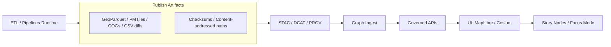

# infra/apps/kfm-pipelines


KFM Pipelines is the **GitOps “app”** that deploys and configures the **pipeline runtime** (orchestrator + workers + policy/telemetry hooks) for Kansas Frontier Matrix.

> [!IMPORTANT]
> This folder is **Infrastructure-layer** only (Kubernetes/OpenShift manifests).
> Pipeline *code* and dataset semantics live elsewhere (e.g., `src/pipelines/**`, `docs/pipelines/**`) — do **not** put business logic or raw data here.

---

## What this app is for

This GitOps app exists to ensure that every pipeline run produces **governed, replayable, auditable outputs**:

- **Deterministic promotion** (stable IDs, stable partitioning, replayability)
- **Evidence-first publishing** (artifacts + catalogs + provenance with checksums/digests)
- **Fail-closed enforcement** (missing required fields/signatures/labels blocks promotion)
- **Sensitivity & sovereignty as machine-checkable fields** (not prose)
- **Human QA routing** for failures / below-threshold quality

---

## Where it fits in the KFM system



**Operational intent:** pipeline work materializes artifacts + updates catalogs + emits provenance/lineage/telemetry, so downstream layers (graph, API, UI) can resolve claims to evidence.

---

## Repository layout

This directory is expected to follow the standard GitOps “**base + overlays**” pattern (Kustomize):

```text
infra/apps/kfm-pipelines/
├── README.md
├── base/
│   ├── kustomization.yaml
│   ├── rbac/                     # service accounts, roles, rolebindings
│   ├── runtime/                  # orchestrator + workers (deployments/jobs/cronjobs)
│   ├── config/                   # configmaps (non-secret)
│   ├── network/                  # networkpolicy (if used)
│   └── policies/                 # admission/constraint templates (if used)
└── overlays/
    ├── dev/
    │   └── kustomization.yaml    # env deltas (image tags, resources, toggles)
    ├── stage/
    │   └── kustomization.yaml
    └── prod/
        └── kustomization.yaml
```

> [!NOTE]
> If your platform team manages namespaces centrally, manifests here should avoid hardcoding `metadata.namespace` and rely on the GitOps controller / project conventions.

---

## Environments and promotion

**Do not** represent environments by long-lived branches. Prefer:
- one trunk (main) + short-lived PR branches
- **directories / overlays** for env-specific deltas

This keeps promotion auditable and avoids “configuration drift by cherry-pick.”

---

## Deploy / reconcile (platform operator)

### With kubectl + Kustomize (manual apply)
```bash
# dev
kubectl apply -k infra/apps/kfm-pipelines/overlays/dev

# stage
kubectl apply -k infra/apps/kfm-pipelines/overlays/stage

# prod
kubectl apply -k infra/apps/kfm-pipelines/overlays/prod
```

### With Argo CD / OpenShift GitOps (recommended)
This directory is usually referenced by an `Application` or `ApplicationSet` entry elsewhere in the GitOps repo.

Example `Application` (illustrative):
```yaml
apiVersion: argoproj.io/v1alpha1
kind: Application
metadata:
  name: kfm-pipelines
spec:
  project: kfm
  source:
    repoURL: https://example.invalid/your-org/kfm.git
    targetRevision: main
    path: infra/apps/kfm-pipelines/overlays/dev
  destination:
    server: https://kubernetes.default.svc
    namespace: kfm-pipelines
  syncPolicy:
    automated:
      prune: true
      selfHeal: true
```

---

## Pipeline contract this runtime must support

### Dataset-family “Minimal Pipeline Blueprint”
Every dataset family should be able to plug into a predictable structure (example):

```text
<dataset-family>/
├── pipeline.yaml        # inputs, outputs, schedule, resources
├── schemas/             # normalized schemas
├── qa/                  # validators + drift thresholds
├── stac/                # templates for items/collections/assets
├── dcat/                # dataset/distribution templates (JSON-LD)
├── prov/                # activity templates + emitted run bundles
└── graph/               # ingest mapping rules (if graph-ingested)
```

### Orchestration assets and freshness pools
The runtime should support “asset-style” execution (e.g., Dagster-like assets) with:
- explicit freshness targets / schedules
- execution pool assignment
- idempotent materializations
- emitting catalogs + provenance + telemetry per run

---

## Governance and policy gates

This app should integrate (or provide hook points) for enforcement at **three levels**:

| Gate Type | Where it runs | Blocks what? | Examples |
|---|---|---|---|
| **Pre-materialization** | runtime | bad inputs | schema validation, CRS sanity, bbox checks |
| **Post-materialization** | runtime | bad outputs | row-count checks, tile coverage, index health, catalog schema validation |
| **Policy gates** | CI and/or admission | unsafe promotion | OPA/Rego rules for required fields, redaction, sovereignty flags, promotion prerequisites |

> [!IMPORTANT]
> Governance must be **fail-closed**: if required fields/labels/signatures are missing, promotion should fail.

### Sensitivity & sovereignty (machine-checkable)
Policy must enforce that sovereignty/sensitivity labels are consistent across:
- STAC properties/assets
- DCAT `accessRights`
- PROV activities/records

If your repo supports exceptions, they must be **signed** and also recorded in PROV.

---

## Observability expectations

Minimum telemetry signals the runtime should emit per run:

- `run.lifecycle` (queued → started → succeeded/failed/cancelled)
- `freshness.delta_minutes` (observed staleness vs target)
- `pool.wait_ms` (queue pressure)
- `artifact.size_bytes`
- `artifact.uri` (content-addressed paths)

> [!TIP]
> Treat telemetry as a governed interface: it’s how you prove “freshness” and “evidence completeness” over time.

---

## Change management

### Common changes and where they belong

| Change | Edit | Notes |
|---|---|---|
| Update pipeline image tag | `overlays/*` | Keep prod pinned; promote via PR |
| Resource sizing (CPU/mem) | `overlays/*` | Prefer env-specific deltas |
| Add new worker pool | `base/runtime/` + `overlays/*` | Match pools to workload classes |
| Add new policy rule | `base/policies/` + CI | Test rule changes like code |
| Add new pipeline schedule | runtime config | Ensure it’s recorded and reproducible |

---

## Definition of Done (DoD)

When this app is “production-ready”:

- [ ] GitOps sync works (dev/stage/prod overlays)
- [ ] Pipelines can publish **immutable, content-addressed** artifacts
- [ ] STAC/DCAT validate and cross-link before promotion
- [ ] PROV emitted on PASS and FAIL; signatures/attestations enforced where required
- [ ] Policy gates are fail-closed (OPA/Rego or equivalent)
- [ ] Sensitivity/sovereignty flags are consistent across catalogs + provenance
- [ ] Telemetry is emitted and dashboards show run + freshness
- [ ] Failures route to a human QA workflow with diffs + evidence links

---

## Troubleshooting

<details>
  <summary><strong>Argo CD shows OutOfSync</strong></summary>

- Ensure the overlay path is correct (e.g., `infra/apps/kfm-pipelines/overlays/dev`)
- Confirm Kustomize renders deterministically (no generated names unless pinned)
- Check cluster RBAC: the GitOps controller must have rights to apply resources
</details>

<details>
  <summary><strong>Promotion is blocked by policy</strong></summary>

- Check required governance labels are present
- Confirm catalog/provenance cross-links exist (STAC ↔ DCAT ↔ PROV)
- If an exception is required, ensure it is signed and recorded in provenance
</details>

---

## Ownership

- **Infra ownership:** Platform/SRE (cluster-level access)
- **Pipeline ownership:** Data Engineering (pipeline contracts, validation, artifacts)
- **Governance ownership:** KFM governance reviewers (policy/sovereignty exceptions)

> Update CODEOWNERS and team references to match your org structure.
