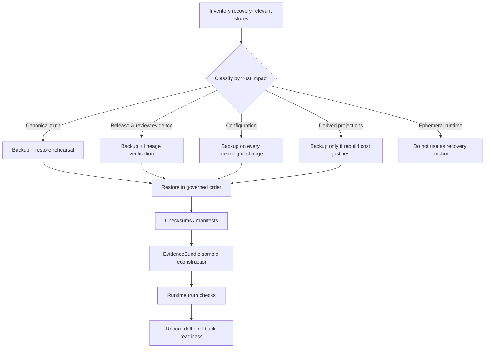

<!-- [KFM_META_BLOCK_V2]
doc_id: kfm://doc/<uuid-NEEDS-VERIFICATION>
title: Backup, Restore, and Recovery
type: standard
version: v1
status: draft
owners: <owners-NEEDS-VERIFICATION>
created: YYYY-MM-DD
updated: YYYY-MM-DD
policy_label: <policy_label-NEEDS-VERIFICATION>
related: [<infra-index-NEEDS-VERIFICATION>, <docs-runbooks-NEEDS-VERIFICATION>, <policy-readme-NEEDS-VERIFICATION>, <contracts-readme-NEEDS-VERIFICATION>]
tags: [kfm, infra, backup, restore, recovery]
notes: [Directory role is doctrine-grounded; mounted repo path contents, owners, dates, and adjacent links still need direct repo verification.]
[/KFM_META_BLOCK_V2] -->

# infra/backup — Backup, Restore, and Recovery

Backup, restore, retention, and drill guidance for KFM trust-bearing systems and release-bearing artifacts.


| Field | Value |
|---|---|
| Status | **Experimental** |
| Owners | **NEEDS VERIFICATION** |
| Path | `infra/backup/` |
| Quick jumps | [Scope](#scope) · [Repo fit](#repo-fit) · [Accepted inputs](#accepted-inputs) · [Exclusions](#exclusions) · [Backup classes](#backup-classes) · [Restore order](#restore-order) · [Verification gates](#verification-gates) · [Open items](#open-items) |

> [!IMPORTANT]
> This README is **doctrine-grounded** but **repo-state cautious**. Current-session evidence strongly supports KFM backup and restore doctrine, but it does **not** confirm the mounted contents of `infra/backup/` in this session. Treat any starter structure below as **PROPOSED** until the actual repo tree is inspected.

> [!CAUTION]
> Backup and recovery tooling must **not** become a trust bypass. Public clients and normal UI surfaces still go through governed APIs, policy checks, release state, and evidence resolution.

## Scope

This directory is for the operational material that makes KFM recovery **inspectable, rehearsed, and reversible**:

- backup class definitions
- retention and cadence rules
- restore order and post-restore verification
- rollback notes for ops-significant changes
- drill records and lessons learned
- environment-specific recovery guidance

In KFM, backup is not just about bytes on disk. Recovery has to preserve:

- what was published
- under which release state
- with which evidence linkage
- under which policy and review conditions
- what was later corrected, superseded, or withdrawn

## Repo fit

| Aspect | Current guidance |
|---|---|
| Role in repo | `infra/` should hold **environment wiring and delivery mechanics**, not unexplained business rules. |
| What this directory should do | Keep recovery mechanics visible, reviewable, and separate from domain logic. |
| Upstream links | **NEEDS VERIFICATION** — no adjacent `infra/` index or platform README was directly confirmed in this session. |
| Downstream links | **NEEDS VERIFICATION** — likely restore drills, environment-specific job definitions, incident records, and ops runbooks. |
| Current evidence posture | `infra/backup/` is a **PROPOSED** family in architecture material, not a mounted repo fact established here. |

## Accepted inputs

The following material belongs here when it exists and is ratified:

| Accepted input | Why it belongs here |
|---|---|
| Backup tier matrix | Makes protection levels explicit across canonical, derived, and ephemeral surfaces. |
| Restore runbooks | Recovery is part of trust, not an afterthought. |
| Retention schedules | Keeps RPO/RTO and storage decisions visible and reviewable. |
| Integrity verification checklists | Prevents “backup exists” from being mistaken for “restore is trustworthy.” |
| Drill reports and after-action notes | Turns recovery into practiced capability. |
| Environment-specific backup notes | Keeps local, compose/systemd, and hosted recovery differences explicit. |
| Rollback instructions for ops-significant changes | Recovery and rollback should be designed before incident response begins. |

## Exclusions

This directory should stay narrow. It is an ops surface, not a catch-all.

| Exclusion | Why it stays out | Where it goes instead |
|---|---|---|
| Authoritative policy rule bodies | Policy law should stay versioned in its own home. | `policy/` |
| Authoritative machine contracts and schemas | Contract law should stay singular and versioned. | `contracts/` (or the single schema home once confirmed) |
| Domain/business semantics | Recovery docs should not own business logic. | Packages, domain docs, or service docs |
| Large live backup payloads | Git docs are not the recovery substrate. | Controlled backup storage / snapshot systems |
| Secrets, credentials, keys | Recovery material must not leak privileged access. | Secret manager / environment-secure storage |
| Ad hoc DBA scratch notes | Unreviewed notes create drift and “trust theater.” | Ratified runbooks or tickets only |

## Directory tree

### Illustrative starter layout (**PROPOSED**)

```text
infra/backup/
├── README.md
├── runbooks/
│   ├── restore.md
│   ├── quarterly-drill.md
│   └── rollback.md
├── policies/
│   ├── retention-matrix.md
│   └── protection-tiers.md
├── env/
│   ├── local/
│   ├── systemd-or-compose/
│   └── hosted/
├── checks/
│   ├── integrity.md
│   └── post-restore-verification.md
├── manifests/
│   └── examples/
└── reports/
    └── drills/
```

> [!NOTE]
> Adopt a subtree like the above **only after** comparing it to the actual repo. KFM guidance consistently prefers inventory-first cleanup over aesthetic refactors.

## Quickstart

1. Inventory every recovery-relevant store and artifact.
2. Classify each one by protection tier.
3. Write restore order before writing automation.
4. Define post-restore verification that proves both data integrity and governed runtime truthfulness.
5. Run at least one restore drill and record what failed, what passed, and what must change.

### Illustrative starter manifest (**PROPOSED**)

```yaml
backup_scope:
  canonical_db: daily
  canonical_artifact_tree: per-release
  configuration: on-change
  derived_layers: conditional
restore_checks:
  - checksums_present
  - release_lineage_verified
  - evidence_bundle_sample_resolves
  - answer_path_passes
  - abstain_or_deny_path_passes
  - rollback_notes_current
```

## Usage

Add or update material here when one of these is true:

| Trigger | Update expected |
|---|---|
| New canonical store or release-bearing artifact | Protection tier, cadence, and restore notes |
| Infra change that can affect publication truth or audit continuity | Rollback note + config recovery note |
| Quarterly recovery exercise | Drill report + lessons learned |
| Incident involving data loss, stale recovery, or rollback failure | Corrective runbook update |
| New environment class | Environment-specific restore path and verification |

## Recovery model



## Backup classes

| Class | Typical examples | Priority | Default handling |
|---|---|---|---|
| Canonical truth | PostgreSQL/PostGIS, `RAW`, `PROCESSED`, `CATALOG`, `PUBLISHED` | **Highest** | Back up and rehearse restore |
| Release and review evidence | manifests, proof objects, receipts, correction notices, review records | **Highest** | Back up with canonical scope |
| Configuration | `/etc/kfm`, proxy config, firewall exports, unit files | **High** | Back up on every meaningful change |
| Derived projections | search, graph, vector, tiles, caches | **Medium** | Back up only when rebuild cost justifies it |
| Ephemeral runtime | `/run`, temp files, short-lived caches | **Low** | Do not treat as recovery anchor |

## Cadence

| Surface | Starter cadence |
|---|---|
| Canonical DB | Daily, plus pre-change snapshots where feasible |
| Canonical artifact tree | Daily or per release |
| Config and unit files | After every meaningful change |
| Derived layers | Optional, based on rebuild time and operational cost |
| Restore drills | At least quarterly, and before major risk-bearing changes |

## Restore order

Recovery should be executed as an ordered system, not as a bag of snapshots.

| Step | Restore / verify |
|---|---|
| 1 | Clean host or clean VM image |
| 2 | Base OS and hardening baseline |
| 3 | Config, users, groups, firewall, SSH, AppArmor posture |
| 4 | Canonical PostgreSQL/PostGIS database |
| 5 | Canonical artifact tree and catalog/release evidence |
| 6 | Governed API |
| 7 | One-shot worker surfaces |
| 8 | Rebuild derived layers from restored published scope |
| 9 | Runtime and citation verification tests |

## Verification gates

A backup is not trustworthy until restore verifies the system that KFM actually claims to be.

| Gate | What to prove |
|---|---|
| Integrity | Checksums or manifest presence where used |
| Lineage | Release lineage still reconstructs correctly |
| Evidence | A sample `EvidenceBundle` can be reconstructed |
| Runtime | One request returns **ANSWER** truthfully |
| Negative paths | One request **ABSTAINS** or **DENIES** truthfully |
| Recovery scope | Backup date and scope still satisfy the intended RPO |
| Trust posture | Published scope is still distinct from canonical and derived internals |
| Audit continuity | Logs, review records, and correction lineage still exist where required |

## Definition of done

A backup lane is not “done” when the snapshot succeeds. It is done when recovery is boring.

- [ ] Protection tiers are mapped to actual KFM stores and artifacts
- [ ] Owners are confirmed for this directory and for every public release surface
- [ ] Cadence is documented and environment-specific where needed
- [ ] Restore order exists for each supported environment class
- [ ] Post-restore verification proves integrity, lineage, evidence reconstruction, and governed runtime outcomes
- [ ] One restore drill has been executed and archived
- [ ] One rollback path is documented for every ops-significant change class
- [ ] Adjacent links are updated after direct repo inspection
- [ ] This README does not imply automation that the repo does not actually contain

## FAQ

### Does this README prove backup automation already exists?

No. This file is a directory contract and operating guide. It should not be read as proof that scheduled jobs, workflow gates, or restore tooling are already mounted in the repo.

### Should derived layers be restored before canonical truth?

No. Derived layers are subordinate and usually rebuildable. Restore canonical truth, release evidence, and governed services first.

### Should live backup payloads live in Git?

Normally no. Keep the repo for runbooks, rules, templates, reports, and verification logic. Keep live backup material in controlled backup storage.

### Can a recovery path ignore runtime truth checks if the database restore succeeded?

No. KFM recovery is incomplete until the system can still answer, abstain, or deny truthfully over released evidence.

## Open items

<details>
<summary>Open verification items that should be retired before calling this directory stable</summary>

1. Confirm that `infra/backup/` actually exists in the mounted repo.
2. Confirm adjacent infra and runbook files, then replace placeholder relationship fields and any missing relative links.
3. Confirm owners, created date, updated date, and policy label for the KFM meta block.
4. Confirm whether the repo already contains environment-specific backup definitions for local, compose/systemd, or hosted deployments.
5. Confirm current RPO/RTO targets, if any, and whether they are already documented elsewhere.
6. Confirm whether any encrypted fixture-style recovery examples already exist and should be referenced instead of proposed.
7. Confirm the single authoritative contract/schema home before linking backup verification to any schema-driven checks.

</details>

[Back to top](#infrabackup--backup-restore-and-recovery)
