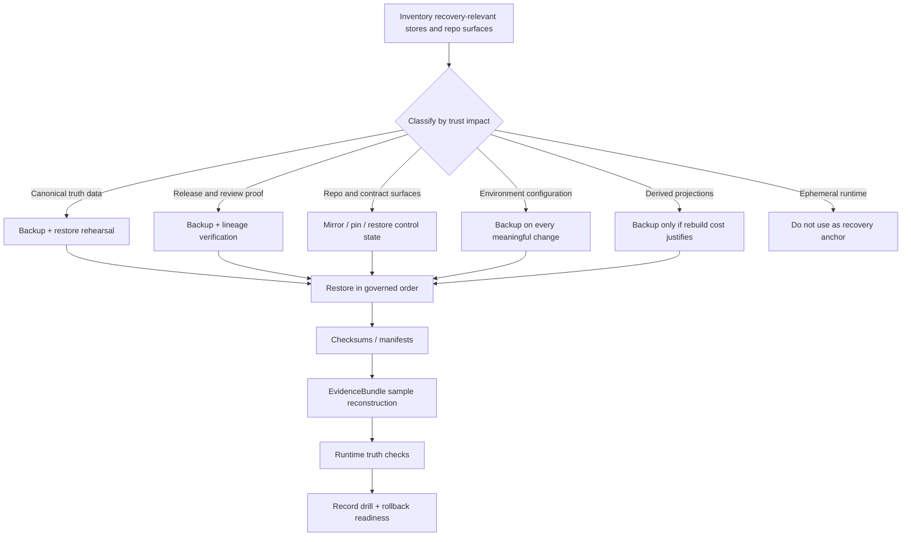

<!-- [KFM_META_BLOCK_V2]
doc_id: kfm://doc/<uuid-NEEDS-VERIFICATION>
title: Backup, Restore, and Recovery
type: standard
version: v1
status: draft
owners: @bartytime4life
created: <created-NEEDS-VERIFICATION>
updated: 2026-03-29
policy_label: public
related: [../README.md, ../../docs/runbooks/README.md, ../../policy/README.md, ../../contracts/README.md]
tags: [kfm, infra, backup, restore, recovery]
notes: [Owners grounded from /.github/CODEOWNERS for /infra/; current public main confirms infra/backup, infra/README.md, docs/runbooks/README.md, policy/README.md, and contracts/README.md; created date still needs history verification.]
[/KFM_META_BLOCK_V2] -->

# infra/backup — Backup, Restore, and Recovery

Backup, restore, retention, and restore-drill guidance for KFM trust-bearing systems and release-bearing artifacts.

> **Status:** experimental  
> **Owners:** `@bartytime4life`  
> 
> 
> 
> 
>
> **Repo fit:** path `infra/backup/README.md` · parent [infra index][infra-index] · runbook coordination [docs/runbooks][runbooks] · policy boundary [policy][policy] · contract boundary [contracts][contracts]  
> **Quick jumps:** [Scope](#scope) · [Repo fit](#repo-fit) · [Accepted inputs](#accepted-inputs) · [Exclusions](#exclusions) · [Directory tree](#directory-tree) · [Quickstart](#quickstart) · [Usage](#usage) · [Diagram](#diagram) · [Operating tables](#operating-tables) · [Task list](#task-list--definition-of-done) · [FAQ](#faq) · [Appendix](#appendix)

> [!IMPORTANT]
> This README is **repo-grounded and doctrine-bounded**. Current public `main` confirms `infra/backup/README.md` as a checked-in directory surface beneath the top-level `infra/` tree. It does **not** by itself prove active scheduled backup jobs, tested restore tooling, live environment usage, or private operational material.

> [!CAUTION]
> Backup and recovery must **not** become a trust bypass. Public clients and normal UI surfaces still go through governed APIs, policy evaluation, release state, and evidence resolution after recovery.

## Scope

`infra/backup/` is the repository surface for making KFM recovery **inspectable, rehearsed, and reversible**.

Use it for:

- backup class definitions
- retention and cadence rules
- restore order and post-restore verification
- rollback notes for ops-significant changes
- restore-drill records and after-action notes
- environment-specific recovery guidance
- recovery references for trust-bearing repo and release surfaces

Do not use it for:

- storing live backup payloads
- replacing `policy/` with backup-local policy law
- replacing `contracts/` with backup-local schema authority
- keeping informal operator lore that never becomes a ratified runbook or reviewed note

In KFM, recovery has to preserve more than bytes on disk. It has to preserve:

- what was published
- under which release state
- with which evidence linkage
- under which policy and review conditions
- what was corrected, superseded, narrowed, or withdrawn later

## Repo fit

**Path:** `infra/backup/README.md`  
**Role:** directory README for backup, restore, rollback, and recovery planning inside the runtime-facing infrastructure lane.

### Current evidence posture

| Surface | Status | What is currently evidenced |
|---|---|---|
| `infra/backup/README.md` | **CONFIRMED** | Public `main` contains this directory and README |
| Additional checked-in files under `infra/backup/` | **NEEDS VERIFICATION** | No additional files in this subtree were directly opened during this review |
| [`../README.md`][infra-index] | **CONFIRMED** | `infra/` is already framed as bring-up, deployment, restore, rollback, and operational-correction surface |
| [`../../docs/runbooks/README.md`][runbooks] | **CONFIRMED** | `docs/runbooks/` exists and explicitly covers recovery, correction, rollback, restore, incident handling, and reliability-trigger response |
| [`../../policy/README.md`][policy] | **CONFIRMED** | Policy exists as a deny-by-default documentation surface; mounted `.rego` bundles and runnable policy tests remain unverified |
| [`../../contracts/README.md`][contracts] | **CONFIRMED** | Contract families and proof-object doctrine are documented here |
| [`../../schemas/README.md`][schemas] | **CONFIRMED** | `schemas/` exists, but authoritative schema-home resolution is still pending |
| [`../../.github/workflows/README.md`][workflows] | **CONFIRMED** | Workflow orchestration lane exists as a documentation/control surface; active public workflow YAML still needs direct verification |

### Upstream, adjacent, and downstream links

| Direction | Surface | Why it matters | Status |
|---|---|---|---|
| Upstream | [repo root][repo-root] | Root doctrine, trust posture, and repository-wide boundaries | **CONFIRMED** |
| Upstream | [infra index][infra-index] | Parent `infra/` rules, peer lanes, and runtime-facing directory logic | **CONFIRMED** |
| Upstream | [docs/runbooks][runbooks] | Operator procedure surface for restore, rollback, correction, and incident handling | **CONFIRMED** |
| Adjacent | [policy][policy] | Rights, sensitivity, deny-by-default, correction, and runtime trust consequences | **CONFIRMED** |
| Adjacent | [contracts][contracts] | Contract families for release proof, evidence, runtime envelopes, and correction lineage | **CONFIRMED** |
| Adjacent | [schemas][schemas] | Schema-home ambiguity still matters before wiring schema-driven recovery checks | **CONFIRMED** |
| Adjacent | [workflow guidance][workflows] | Validation, promotion, release evidence, and correction-ready control surface | **CONFIRMED** |
| Downstream peers | `../local/`, `../systemd/`, `../compose/`, `../hosted/`, `../kubernetes/`, `../terraform/` | Restore guidance eventually has to reconcile with real environment lanes | **CONFIRMED** as directory surfaces / **NEEDS VERIFICATION** for live use |

### Repo-fit rule

`infra/backup/` should version **how KFM is recovered and verified**, not act as the recovery substrate itself. Trust-bearing runtime restoration depends on the neighboring repo surfaces staying legible and distinct.

[Back to top](#infrabackup--backup-restore-and-recovery)

## Accepted inputs

The following material belongs here when it exists and is ratified:

| Accepted input | Why it belongs here |
|---|---|
| Protection-tier matrix | Makes protection levels explicit across canonical, derived, and ephemeral surfaces |
| Restore runbooks | Recovery is part of trust, not an afterthought |
| Retention schedules | Keeps RPO/RTO and storage decisions visible and reviewable |
| Integrity verification checklists | Prevents “backup exists” from being mistaken for “restore is trustworthy” |
| Restore-drill reports and after-action notes | Turns recovery into practiced capability |
| Environment-specific backup notes | Keeps `local`, `systemd`, `compose`, `hosted`, `kubernetes`, and related differences explicit |
| Pinned repo-state recovery notes | The governed runtime cannot be recovered from databases alone; repo/control surfaces matter too |
| Rollback instructions for ops-significant changes | Recovery and rollback should be designed before incident response begins |

## Exclusions

This directory should stay narrow. It is an ops surface, not a catch-all.

| Exclusion | Why it stays out | Where it goes instead |
|---|---|---|
| Authoritative policy rule bodies | Backup docs should not fork deny-by-default law | `policy/` |
| Authoritative machine contracts and schemas | Backup docs should not create a second trust-object authority surface | `contracts/` and the eventually singular schema home |
| Domain/business semantics | Recovery docs should not own business logic | packages, service docs, or domain docs |
| Live backup payloads and snapshot blobs | Git is not the recovery substrate | controlled backup storage / snapshot systems |
| Secret values, keys, credentials | Recovery material must not leak privileged access | secret manager / environment-secure storage |
| Ad hoc operator scratch notes | Unreviewed notes create drift and trust theater | ratified runbooks, reviewed tickets, or incident records |

## Directory tree

### Current public snapshot (**CONFIRMED**)

```text
infra/
├── README.md
├── backup/
│   └── README.md
├── compose/
├── dashboards/
├── gitops/
├── hosted/
├── kubernetes/
├── local/
├── monitoring/
├── systemd-or-compose/
├── systemd/
└── terraform/
```

### Suggested growth shape (**PROPOSED**)

```text
infra/backup/
├── README.md
├── runbooks/
│   ├── restore.md
│   ├── quarterly-drill.md
│   └── rollback.md
├── matrices/
│   ├── retention.md
│   └── protection-tiers.md
├── env/
│   ├── local.md
│   ├── systemd-or-compose.md
│   ├── hosted.md
│   └── kubernetes.md
├── checks/
│   ├── integrity.md
│   ├── post-restore-verification.md
│   └── runtime-truth-checks.md
├── manifests/
│   └── examples/
└── reports/
    └── drills/
```

> [!NOTE]
> The **current** public-tree signal is intentionally separated from the **proposed** maturation shape. Add structure only after comparing it to the active branch and any private operational material that is not visible on public `main`.

## Quickstart

1. Start with the adjacent trust surfaces: [infra index][infra-index], [docs/runbooks][runbooks], [policy][policy], and [contracts][contracts].
2. Inventory every recovery-relevant store, artifact, and repo/control surface.
3. Classify each one by trust impact and recovery priority.
4. Write restore order before writing automation.
5. Define post-restore verification that proves both data integrity and governed runtime truthfulness.
6. Run at least one restore drill and archive what failed, what passed, and what must change.

### Illustrative starter manifest (**PROPOSED**)

```yaml
backup_scope:
  canonical_db: nightly
  canonical_artifact_tree: versioned
  repo_and_contract_surfaces: on-change
  environment_configuration: on-change
  derived_layers: conditional
restore_checks:
  - checksums_present
  - release_lineage_verified
  - evidence_bundle_sample_resolves
  - runtime_answer_path_passes
  - runtime_negative_path_passes
  - rollback_notes_current
```

## Usage

Add or update material here when one of these is true:

| Trigger | Update expected |
|---|---|
| New canonical store or release-bearing artifact | Protection tier, cadence, and restore notes |
| New trust-bearing repo/control surface | Mirror, checkout, or pinned-ref recovery note |
| Infra change affecting publication truth or audit continuity | Rollback note plus config-recovery update |
| Quarterly recovery exercise | Drill report plus lessons learned |
| Incident involving data loss, stale recovery, or rollback failure | Corrective runbook update |
| New environment class or deployment lane | Environment-specific restore path and verification |

## Diagram



## Operating tables

### Backup classes

| Class | Typical examples | Priority | Default handling |
|---|---|---|---|
| Canonical truth data | PostgreSQL/PostGIS, `RAW`, `WORK`, `PROCESSED`, `CATALOG`, `PUBLISHED` | **Highest** | Back up and rehearse restore |
| Release and review evidence | `ReleaseManifest`, receipts, proof packs, `ReviewRecord`, `CorrectionNotice`, audit-relevant logs | **Highest** | Back up with canonical scope |
| Repository and contract surfaces | `infra/`, `.github/`, `policy/`, `contracts/`, `schemas/`, `docs/runbooks/` | **High** | Mirror or recover at a pinned, reviewable ref |
| Environment configuration | `/etc/kfm`, systemd units, reverse-proxy config, firewall exports, storage mappings, secret references | **High** | Back up on every meaningful change |
| Derived projections | search, graph, vector, tiles, caches, exports, scenes | **Medium** | Back up only when rebuild cost justifies it |
| Ephemeral runtime | `/run`, temp files, transient caches, one-shot workdirs | **Low** | Do not treat as recovery anchor |

### Cadence

| Surface | Starter cadence |
|---|---|
| Canonical database | Nightly, plus pre-change snapshots where feasible |
| Canonical artifact tree / object storage | Versioned storage plus per-release or scheduled snapshotting |
| Repo and contract surfaces | On every approved change; protect tags, refs, and mirrors |
| Config and unit files | After every meaningful change |
| Derived layers | Optional, based on rebuild time and operational cost |
| Restore drills | At least quarterly, with one tested restore path archived each cycle |

### Restore order

Recovery should be executed as an ordered system, not as a bag of snapshots.

| Step | Restore / verify |
|---|---|
| 1 | Clean host, VM, or controlled environment baseline |
| 2 | Base OS and hardening posture |
| 3 | Environment configuration: users, groups, firewall, SSH, proxy, storage mounts |
| 4 | Pinned repo and control-plane state: `infra/`, `.github/`, `policy/`, `contracts/`, `schemas/`, `docs/runbooks/` or equivalent release bundle |
| 5 | Canonical PostgreSQL/PostGIS database |
| 6 | Canonical artifact tree and catalog/release evidence |
| 7 | Governed API |
| 8 | One-shot worker or projection surfaces |
| 9 | Rebuild derived layers from restored published scope |
| 10 | Runtime, citation, and correction-state verification tests |

> [!NOTE]
> If a release receipt, proof pack, or pinned checkout exists, restore from that declared state rather than from ad hoc branch or local operator memory.

### Verification gates

A backup is not trustworthy until restore verifies the system KFM actually claims to be.

| Gate | What to prove |
|---|---|
| Integrity | Checksums, manifests, or equivalent integrity signals are present and valid |
| Lineage | Release lineage still reconstructs correctly |
| Evidence | A sample `EvidenceBundle` can be reconstructed |
| Runtime | One request returns **ANSWER** truthfully over released scope |
| Negative paths | One request **ABSTAINS**, **DENIES**, or **ERRORS** truthfully where expected |
| Control surfaces | Repo/control state matches the intended ref or release bundle |
| Recovery scope | Backup date and scope still satisfy the intended RPO/RTO |
| Trust posture | Published scope is still distinct from canonical and derived internals |
| Audit continuity | Review records, logs, and correction lineage still exist where required |

## Task list / Definition of done

A backup lane is not “done” when a snapshot succeeds. It is done when recovery is boring.

- [ ] Protection tiers are mapped to actual KFM stores, proof objects, and repo/control surfaces
- [ ] Owners are confirmed for this directory and any narrower `/infra/backup/` rule, if one is needed
- [ ] Cadence is documented and environment-specific where needed
- [ ] Restore order exists for each supported environment class
- [ ] Post-restore verification proves integrity, lineage, evidence reconstruction, and governed runtime outcomes
- [ ] At least one restore drill has been executed and archived
- [ ] At least one rollback path is documented for every ops-significant change class
- [ ] Adjacent relative links stay current as repo structure evolves
- [ ] This README does not imply automation or maturity that the repo does not actually contain

## FAQ

### Does the public repo prove live backup automation already exists?

No. The public repo proves this directory and README exist. It does **not** prove scheduled jobs, tested restore tooling, or private backup storage arrangements.

### Why does this directory point to `docs/runbooks/` instead of keeping every procedure here?

Because `infra/backup/` should stay the infrastructure-facing boundary for backup and restore guidance, while `docs/runbooks/` remains the broader operator procedure surface for recovery, correction, rollback, incident handling, and reliability-trigger response.

### Should derived layers be restored before canonical truth?

No. Derived layers are subordinate and usually rebuildable. Restore canonical truth, release evidence, and governed services first.

### Should live backup payloads live in Git?

Normally no. Keep the repo for rules, runbooks, templates, receipts, and verification logic. Keep live backup material in controlled backup storage.

### Can recovery skip runtime truth checks if the database restore succeeded?

No. KFM recovery is incomplete until the system can still answer, abstain, deny, or error truthfully over released evidence.

## Appendix

<details>
<summary>Open verification items to retire before calling this directory stable</summary>

1. Confirm whether any additional checked-in files belong under `infra/backup/` beyond the current README.
2. Confirm the original created date and whether a narrower `/infra/backup/` ownership rule should replace the current `/infra/` fallback.
3. Confirm environment-specific restore definitions in `../local/`, `../systemd/`, `../compose/`, `../hosted/`, `../kubernetes/`, and related lanes.
4. Confirm current RPO/RTO targets and whether they already live in a ratified reliability or SLO surface.
5. Confirm whether encrypted example manifests, restore-drill reports, or receipt-style recovery artifacts already exist elsewhere in repo or private ops storage.
6. Resolve the single authoritative contract/schema home before wiring schema-driven recovery gates against both `contracts/` and `schemas/`.

</details>

<details>
<summary>PROPOSED restore-drill record starter</summary>

| Field | Purpose |
|---|---|
| Drill ID | Stable reference for the drill event |
| Scope | Systems, datasets, repo surfaces, and release refs included |
| Snapshot / backup refs | Snapshot IDs, object versions, commit/tag refs, or mirror refs |
| Start / finish time | Measured duration and comparison to target |
| RPO / RTO target | What the drill was intended to prove |
| Actual result | Recovery duration, data loss window, and gaps observed |
| Verification outcome | Integrity, lineage, runtime, and negative-path results |
| Corrections required | What must change before the next drill |
| Review / sign-off | Who reviewed the drill and where the record lives |

</details>

[Back to top](#infrabackup--backup-restore-and-recovery)

[repo-root]: ../../README.md
[infra-index]: ../README.md
[runbooks]: ../../docs/runbooks/README.md
[policy]: ../../policy/README.md
[contracts]: ../../contracts/README.md
[schemas]: ../../schemas/README.md
[workflows]: ../../.github/workflows/README.md
