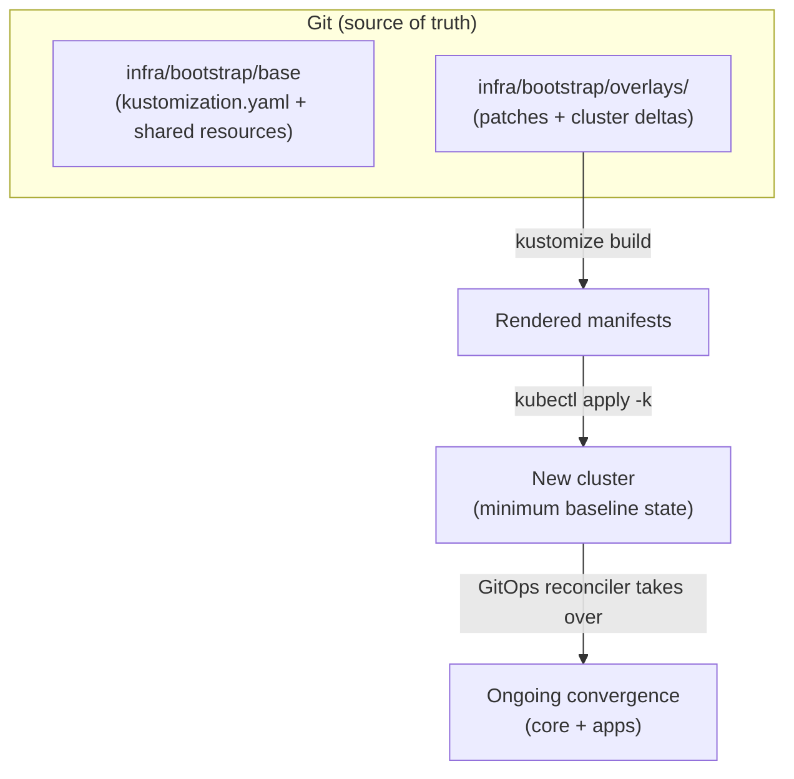

# Bootstrap Base (`infra/bootstrap/base`)


This directory is the **Kustomize “base”** for bootstrapping a Kubernetes/OpenShift cluster for **Kansas Frontier Matrix (KFM)**.

In Kustomize terms:

- A **base** is a directory with a `kustomization.yaml` that defines a reusable set of resources and *has no knowledge of overlays*.
- An **overlay** references one or more bases and applies environment/cluster-specific deltas.

> [!IMPORTANT]
> **Do not apply this base directly** unless you *know exactly* what you’re doing.  
> Bootstrapping is normally done via an overlay (e.g., `infra/bootstrap/overlays/<cluster>`), which composes this base + cluster-specific patches/values.

---

## What belongs here

This base should contain only **environment-agnostic** bootstrap resources that are safe to reuse across clusters.

Typical examples (adjust to match this repo’s actual contents):

- namespaces needed early (e.g., `kfm-system`, `kfm-ingest`, `kfm-observability`)
- CRDs that must exist before other resources can reconcile
- baseline RBAC/service accounts for the bootstrap controllers
- baseline policy enforcement “hooks” (labels/constraints/templates), if they are identical across clusters
- “entrypoint” objects that let the GitOps controller take over after initial apply

> [!WARNING]
> **No secrets in `base/`.**  
> Do not commit plaintext credentials, tokens, kubeconfigs, private keys, or any “real” secret material here.

---

## What does *not* belong here

| Don’t put this in `base/` | Put it in… | Why |
|---|---|---|
| Cluster-specific settings (domain names, storage class names, node selectors, region/zone, SCC/PSA labels that differ per cluster) | `../overlays/<cluster>/` | Keeps the base reusable and avoids per-cluster drift |
| Environment-specific workload config (dev/stage/prod toggles) | app/environment overlays (not bootstrap) | Bootstrap should be minimal and stable |
| Anything that varies between clusters (image registries, ingress class, LB annotations) | overlays | Same reason—DRY + clarity |
| Sensitive material (tokens, passwords, private certs) | External secrets mechanism (preferred) or encrypted secret format | Git is the source of truth, but **must not become the source of leaks** |

---

## How bootstrap is intended to work



---

## Quick start

> [!NOTE]
> The overlay name(s) are repo-specific. Replace `<cluster>` with a real overlay directory (for example `default`).

```bash
# From repo root
kubectl apply -k infra/bootstrap/overlays/<cluster>
```

If you need to inspect what will be applied:

```bash
kustomize build infra/bootstrap/overlays/<cluster> | less
```

---

## Change workflow

A common GitOps workflow is **trunk-based development** with **directories (overlays) for deltas**, not long-lived environment branches:

- work in a short-lived branch
- open a PR into the protected trunk branch (e.g., `main`)
- keep environment/cluster differences in `overlays/` directories

> [!TIP]
> Protect the trunk branch with required reviews + required status checks so Git remains a trustworthy “source of truth”.

---

## Governance + safety rules (KFM)

KFM’s infrastructure is a governed surface. Treat changes here like production changes.

### Non-negotiables

- **PR-first**: changes must come through pull requests; no direct pushes to protected branches.
- **Fail-closed gates**: policy/schema/security checks must block merges when they fail.
- **Network boundaries / trust membrane**: clients and UIs must not bypass governed APIs to reach storage directly.
- **Determinism + reproducibility**: bootstrap output should be buildable the same way from the same inputs.

> [!TIP]
> Consider enabling branch protection + required status checks specifically for `infra/**` paths.

---

## CI / validation checklist (recommended)

When updating anything under `infra/bootstrap/base`, ensure CI runs at least:

- [ ] `kustomize build infra/bootstrap/overlays/<cluster>` succeeds (no missing refs)
- [ ] server-side dry run (if a cluster is available):  
  `kubectl apply --dry-run=server -k infra/bootstrap/overlays/<cluster>`
- [ ] schema validation (CRDs + manifests) with `kubeconform`/`kubeval` (or equivalent)
- [ ] policy-as-code checks (OPA/Conftest, Gatekeeper constraints, etc.)
- [ ] secret scanning (detect accidental credentials in YAML)

---

## Troubleshooting

<details>
<summary><strong>CRDs / ordering issues</strong></summary>

If resources fail because CRDs aren’t present yet, ensure:

1. CRDs are included in bootstrap (base or overlay).
2. Anything depending on CRDs is applied after CRDs exist.

In some setups, this means splitting bootstrap into phases (e.g., `bootstrap-crds` then `bootstrap-core`).

</details>

<details>
<summary><strong>“It works on one cluster but not another”</strong></summary>

That usually means something cluster-specific accidentally landed in `base/`.

Use the table in **What does not belong here** as the remediation guide:
move the differing values into the appropriate overlay and keep `base/` generic.

</details>

---

## Ownership

This directory is high-impact.

Suggested owner model (adjust to your repo):

- **CODEOWNERS**: Infra / Platform maintainers
- Required reviewers: security/governance reviewer for any change touching policy, auth, or cluster-wide permissions

---

## References

- Kustomize bases and overlays (conceptual model)
- GitOps repo patterns for `bootstrap/base/overlays/`
- KFM governance invariants (PR-first, fail-closed, trust membrane)

(Keep this section as pointers; avoid copying large excerpts.)
