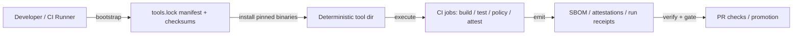

# tools.lock


A governed, reproducible **toolchain lock** for CI/CD and developer automation.

This directory is the **single source of truth** for the versions (and integrity metadata) of *non-language* tooling that our pipelines execute (cluster CLIs, policy gates, supply-chain verifiers, etc.). Changes here are treated like dependency updates: reviewed, test-gated, and easy to roll back.

> 🧭 If a referenced file (manifest, schema, install script) doesn’t exist yet, treat this README as the **contract/spec** for what we should add next.

---

## Contents

- [Why this exists](#why-this-exists)
- [What gets locked](#what-gets-locked)
- [Directory layout](#directory-layout)
- [How CI uses tools.lock](#how-ci-uses-toolslock)
- [Manifest contract](#manifest-contract)
- [Updating tool versions](#updating-tool-versions)
- [Validation gates](#validation-gates)
- [Governance & security notes](#governance--security-notes)
- [FAQ](#faq)

---

## Why this exists

KFM’s DevOps model assumes **version-controlled infrastructure and code**, plus **CI pipelines running automated tests on every commit**. A reproducible toolchain is foundational to that workflow.

**tools.lock** exists to:

1. **Prevent “works on my machine” drift** by pinning exact tool versions.
2. **Reduce supply-chain risk** by pairing pins with integrity checks (checksums and/or signature verification).
3. **Make audit + provenance easier** by providing a stable “environment fingerprint” that can be recorded in run manifests/receipts.

> 🔒 If you can’t prove what tool version produced an artifact, you can’t fully trust or reproduce it.

---

## What gets locked

We lock versions of **externally downloaded executables** used by CI or release automation.

Typical examples (illustrative, not exhaustive):

| Category | Examples |
|---|---|
| Kubernetes / OpenShift deployment | `oc`, `kubectl`, `helm`, `kustomize` |
| Container build + registry | `podman`, `buildah`, `skopeo` |
| Policy gates | `opa`, `conftest` |
| Supply-chain evidence | `cosign`, SBOM generators, vulnerability scanners |

> ℹ️ The **actual** tool list is defined by the manifest file(s) in this directory.  
> If you don’t see a tool here, CI should not silently depend on it.

---

## Directory layout

```text
infra/
└─ ci/
   └─ tools.lock/
      ├─ README.md                      # this file
      ├─ tools.lock.yaml                # canonical manifest (recommended)
      ├─ tools.lock.schema.json         # manifest schema (recommended)
      ├─ tools.lock.checksums.txt       # sha256 sums for fetched artifacts (recommended)
      ├─ install/
      │  ├─ install.sh                  # installs pinned tools (recommended)
      │  ├─ install.ps1                 # Windows install helper (optional)
      │  └─ verify.sh                   # verifies checksums/signatures (recommended)
      └─ .gitignore                     # ignores local tool cache dirs (recommended)
```

> ✅ If your repo uses different filenames, keep the same **conceptual contract**:
> _a single manifest + a verification step that fails closed_.

---

## How CI uses tools.lock



A typical job sequence:

1. **Bootstrap**: run `install/install.sh` to download/install pinned tool binaries into a deterministic path.
2. **Verify**: run `install/verify.sh` to check checksums (and signatures where applicable).  
   - If verification fails, the workflow **fails closed**.
3. **Run jobs**: execute CI tasks (build, test, SBOM, attestation, policy checks).
4. **Record provenance**: capture the tools.lock digest in run artifacts (see *Governance & security notes*).

---

## Manifest contract

The goal is to keep the manifest **machine-readable** and **diff-friendly**.

### Minimal fields (recommended)

| Field | Required | Notes |
|---|---:|---|
| `schema` | ✅ | Versioned schema identifier, e.g. `kfm.tools.lock/v1` |
| `generated_at` | ✅ | ISO timestamp for traceability |
| `tools[]` | ✅ | List of tool entries |
| `tools[].id` | ✅ | Stable tool identifier (`oc`, `podman`, etc.) |
| `tools[].version` | ✅ | Semver/string version or build identifier |
| `tools[].platforms[]` | ✅ | Explicit target platforms (`linux_amd64`, `darwin_arm64`, …) |
| `tools[].source.url` | ✅ | Download URL (or OCI digest reference) |
| `tools[].source.sha256` | ✅ | Expected checksum for the fetched artifact |
| `tools[].install.binary` | ✅ | Binary name to expose in `PATH` |

### Example (illustrative)

```yaml
schema: kfm.tools.lock/v1
generated_at: "YYYY-MM-DDTHH:MM:SSZ"
tools:
  - id: oc
    version: "X.Y.Z"
    platforms: ["linux_amd64", "darwin_arm64"]
    source:
      url: "https://example.invalid/oc-X.Y.Z-${platform}.tar.gz"
      sha256: "…"
    install:
      archive: "tar.gz"
      binary: "oc"
```

> ✅ Recommendation: validate the manifest in CI against `tools.lock.schema.json` **before** using it.

---

## Updating tool versions

Treat tool updates as **security-impacting dependency updates**.

### Process

1. Update the tool entry in `tools.lock.yaml` (version + URL + checksum).
2. Regenerate `tools.lock.checksums.txt` (if used).
3. Run local verification:
   ```bash
   ./infra/ci/tools.lock/install/install.sh
   ./infra/ci/tools.lock/install/verify.sh
   ```
4. Ensure CI gates pass (policy checks, attestation verification, etc.).
5. Open a PR with:
   - **Why** the bump is needed (feature, bugfix, CVE, compatibility).
   - **Rollback plan** (usually: revert the PR).

### Rollback

Because versions are pinned, rollback is easy:

- revert the tools.lock change commit, or
- pin back to the prior known-good version + checksum.

---

## Validation gates

CI SHOULD enforce all of the following:

- [ ] `tools.lock.yaml` validates against `tools.lock.schema.json`
- [ ] Downloads are **pinned** (explicit versions; avoid floating “latest”)
- [ ] Every fetched artifact has a recorded checksum and it is verified
- [ ] Signature verification is performed where available (e.g., cosign attest/verify)
- [ ] Tooling changes require review (branch protection / CODEOWNERS)
- [ ] The tools.lock digest is captured in build/run receipts (environment fingerprint)

---

## Governance & security notes

### Fail-closed promotion

Where KFM uses promotion gates (SBOM + attestations + policy), **verification tooling must be reproducible**. tools.lock supports that by pinning the verifier toolchain.

### Environment fingerprinting

Where pipelines emit run manifests/receipts, include an `env_snapshot` (hash of the lockfile and/or image digest). This enables “drift detection” between runs and supports audit.

### Trust membrane reminder

This directory is **Infra/CI only**. It MUST NOT change the trust membrane:
frontend/external clients never access databases/object stores directly; all access stays behind the governed API boundary.

### No secrets

This directory MUST NOT contain secrets (tokens, kubeconfigs, private keys). Inject secrets at runtime from the approved secrets management path.

---

## FAQ

### Why not install tools from apt/yum/brew in CI?

Package managers often yield **non-deterministic** results over time (repo updates, mirror drift). tools.lock prefers explicit version + integrity metadata.

### Does tools.lock replace language lockfiles?

No. Keep language-level lockfiles (npm/pnpm/pip/poetry/etc.) in their respective project folders. tools.lock is for the **extra** executables CI relies on.

### Is this required for local development?

Not always. But if your task runs in CI (build/policy/attest), you should be able to reproduce it locally using the same pinned toolchain.

---

## Owners

- **Primary**: Infra/CI maintainers
- **Review required**: Security/Compliance when supply-chain verification tools change
