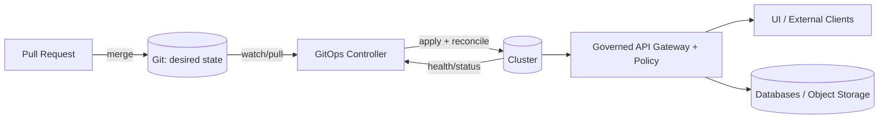

# infra/clusters — Cluster Desired State (GitOps)

> [!IMPORTANT]
> **KFM invariants apply here.**
> - **Trust membrane:** UI/external clients never access databases/object stores directly; access is only via the governed API + policy boundary.
> - **Fail-closed:** policy and validation gates must deny by default when uncertain.
> - **Auditability:** changes must be reviewable, traceable, and reproducible.

This folder is the *cluster-scoped* configuration “source of truth” for environments that run Kansas Frontier Matrix (KFM).

It is intended for GitOps-style reconciliation (e.g., Argo CD / Flux / OpenShift GitOps): Git stores the desired state; a controller continuously applies it and detects drift.

---

## What belongs in `infra/clusters`

Cluster-scoped and environment-scoped *runtime* configuration, such as:

- GitOps bootstrap (install/controller wiring)
- Cluster “core” components (namespaces/projects, RBAC, network policies, ingress, storage classes, observability add-ons)
- Policy enforcement components (where applicable) and configuration that supports the KFM trust membrane boundary
- Deployment declarations for KFM services (when those services are cluster-managed)

What **does not** belong here:

- Application source code
- Raw datasets or publishable artifact bundles
- Credentials, plaintext secrets, private keys, tokens, kubeconfigs

> [!NOTE]
> Data promotion and catalogs (DCAT/STAC/PROV) are governed artifacts — they may be *referenced* by deployments, but they are not stored here as raw data payloads.

---

## Non‑negotiables

Use this checklist for any PR touching `infra/clusters`:

- [ ] Trust membrane preserved: no direct DB/object-store exposure to the frontend or unauthenticated clients  
- [ ] Policy remains fail-closed (defaults deny; exceptions are explicit, reviewed, and documented)  
- [ ] Auditability: change is tied to a PR, reviewed, and produces an operationally meaningful diff  
- [ ] No secrets committed (plaintext) and no sensitive location leakage in manifests/logging fields  
- [ ] Rollback path exists (revert commit returns cluster to previous known-good state)

---

## Directory layout

The layout below is intentionally “boring” and repeatable across clusters.

### High-level structure

```text
infra/
└── clusters/
    ├── README.md                # (this file)
    ├── _shared/                 # Optional: shared building blocks (no cluster identity)
    │   ├── components/
    │   └── policies/
    ├── <cluster-id>/            # One folder per real cluster
    │   ├── cluster.meta.yaml    # Non-secret metadata (env, region, owner, purpose)
    │   ├── bootstrap/           # Minimal bootstrap to install GitOps + connect repo
    │   ├── components/          # Reusable GitOps controller config (projects/appsets/etc.)
    │   ├── core/                # Cluster core workloads (platform-owned)
    │   └── apps/                # Tenant/app workloads (release-owned)
    └── <cluster-id-2>/
        └── ...
```

### Per-cluster GitOps “shape”

This structure mirrors a common GitOps repo pattern:

- `bootstrap/` (base + overlays)
- `components/` (ApplicationSets / projects / controller configuration)
- `core/` (cluster baseline functionality)
- `apps/` (workloads, usually split into `base/` + `overlays/{dev,stage,prod}`)

Example:

```text
infra/clusters/<cluster-id>/
├── bootstrap/
│   ├── base/
│   └── overlays/
│       └── default/
├── components/
│   ├── applicationsets/
│   └── gitops-projects/
├── core/
│   ├── gitops-controller/
│   ├── namespaces-rbac/
│   ├── network-policies/
│   └── observability/
└── apps/
    ├── kfm-api/
    │   ├── base/
    │   └── overlays/
    │       ├── dev/
    │       ├── stage/
    │       └── prod/
    └── kfm-ui/
        ├── base/
        └── overlays/
            ├── dev/
            ├── stage/
            └── prod/
```

> [!TIP]
> Prefer **directories + overlays** for environments (dev/stage/prod) rather than long-lived branches.
> Keep Git history linear and reviewable (PR → merge to trunk/main).

---

## Cluster identity and naming

Use a stable, human-scannable `cluster-id`. Recommended format:

`<env>-<region>-<provider>-<ordinal>`

Examples:

- `dev-us-central1-aws-01`
- `stage-us-central1-ocp-01`
- `prod-us-central1-ocp-01`

<details>
  <summary>Suggested <code>cluster.meta.yaml</code> (non-secret)</summary>

```yaml
cluster_id: prod-us-central1-ocp-01
environment: prod              # dev | stage | prod
region: us-central1
platform: openshift            # kubernetes | openshift | etc.
owner_team: platform           # non-personal label
purpose: kfm-primary
gitops_controller: argocd       # argocd | flux | openshift-gitops (update as chosen)
notes: >
  No secrets in this file. Do not include API endpoints, kubeconfigs, or IPs unless governance-approved.
```

</details>

---

## GitOps reconciliation flow



---

## How to add a new cluster (thin slice)

> [!IMPORTANT]
> Add clusters in **reviewable, reversible slices**. Avoid “big bang” merges.

1. **Create the cluster folder**
   - `infra/clusters/<cluster-id>/`
   - Add `cluster.meta.yaml` (no secrets).

2. **Bootstrap GitOps**
   - Add `bootstrap/base/` and `bootstrap/overlays/default/`.
   - Ensure bootstrap installs/configures the GitOps controller and points it at the correct paths.

3. **Install core components**
   - Add only minimal `core/` slices first:
     - namespaces/projects
     - RBAC
     - baseline network policy
     - observability hooks (if available)

4. **Add one workload**
   - Add a single “hello world” style workload under `apps/<name>/base` with overlays.
   - Verify reconciliation and rollback.

5. **Iterate**
   - Expand core and apps gradually with PR-sized changes.

---

## Secrets and sensitive configuration

**Hard rules:**

- Never commit plaintext secrets.
- Never commit kubeconfigs, private keys, tokens, or provider credentials.
- Avoid embedding sensitive coordinates, restricted locations, or private URLs in manifests.

**Allowed patterns (choose one; document in `cluster.meta.yaml`):**

- Encrypted secrets stored in Git (with strict key management)
- External secrets references (vault/operator pulls secrets at runtime)
- Sealed secrets (cluster-side controller decrypts)

> [!WARNING]
> Even “non-secret” fields can become sensitive (hostnames, bucket names, internal domains, archaeology site coordinates).
> If there’s any doubt, treat as sensitive and route through governance review.

---

## Governance review checklist (infra impact)

Use before enabling patterns in production:

- [ ] **Policy review:** CARE/consent fields and data sovereignty flags reviewed by governance owners
- [ ] **Trust membrane:** frontend never accesses databases/object stores directly; all access through governed API boundary
- [ ] **Security:** signature verification and policy enforcement happen server-side; browser only sees verified/sanitized links
- [ ] **Licensing:** SPDX/license signals propagate to catalogs and enforcement points
- [ ] **Immutability:** promoted artifacts are content-addressed; updates create new versions (new digests/attestations)
- [ ] **Audit:** discovery/promotion actions are logged and retained

---

## Definition of Done for PRs touching `infra/clusters`

- [ ] Folder structure follows the conventions above
- [ ] `kustomize build` (or equivalent render) succeeds for affected overlays
- [ ] Validation gates pass (lint/schema/policy checks as configured)
- [ ] No new direct-exposure paths (DB/object storage) are introduced
- [ ] Rollback tested via `git revert` on the change set (at least once per cluster onboarding)
- [ ] `cluster.meta.yaml` updated when behavior changes (controller, env, purpose)

---

## Troubleshooting quick checks

1. **Render locally** (before blaming the cluster)
   - Confirm the target overlay renders and is deterministic.

2. **Check controller health**
   - GitOps controller pods healthy?
   - Application/AppSet status healthy?
   - Drift detected? (compare desired vs live)

3. **Check policy failures**
   - If requests are failing, confirm policy evaluations are returning explicit deny reasons (without leaking sensitive info).

4. **Rollback**
   - If in doubt, revert the last known-good commit and let the controller reconcile back.

---

## Defaults and decisions (update as KFM hardens)

| Topic | Default | Status |
|------|---------|--------|
| GitOps controller | Argo CD–style patterns | Update if Flux/OpenShift GitOps differs |
| Env separation | Directories + overlays | Required |
| Secrets | External secrets / sealed/encrypted | Choose one per cluster |
| Trust membrane enforcement | Governed API gateway + OPA policy-as-code | Required |

---
