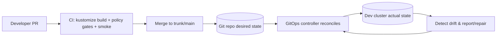

# 🧭 KFM Dev Cluster — `infra/clusters/dev`


> [!IMPORTANT]
> **This folder is governed infrastructure-as-code for the KFM _dev_ environment.**
> Even in dev, KFM’s governance invariants apply: **trust membrane**, **policy boundary**, and **PR-first** operations.

---

## 📌 What this directory is

This directory contains the **dev-cluster overlay** (or dev environment overlay) for deploying KFM to Kubernetes/OpenShift using a **GitOps** workflow and a **Kustomize**-style base/overlay pattern.

- **Goal:** Dev deployments are reproducible, reviewable, and drift-resistant.
- **Scope:** *Environment-specific deltas* only (replicas, resources, hostnames, feature flags, dev-only tooling toggles).
- **Non-goal:** Hand-managed “kubectl apply” as a normal workflow (that defeats GitOps reconciliation).

---

## 🔒 KFM governance invariants this folder must uphold

> [!NOTE]
> These are *invariants*, not “nice-to-haves.” If you need to break them, you must use a documented break-glass procedure and follow up with a PR to restore desired state.

### Trust membrane (infra-enforced)
- **No direct client access to storage:** no public routes/ingress to PostGIS/Neo4j/object storage.
- **All external access terminates at the governed API boundary** (API gateway + policy).
- **UI is a thin client** and must only talk to the governed API surface.

### Fail-closed policy boundary
- Requests that require access to governed data MUST be evaluated by policy (OPA/Rego or equivalent).
- If the policy engine is unavailable, authorization should **fail closed** (deny by default).

### PR-first operations (GitOps)
- All changes flow through PRs with CI gates.
- GitOps controller reconciliation is the normal deploy mechanism; manual changes create drift and should be avoided.

---

## 🧱 How GitOps + this overlay typically works



---

## 🗂️ Directory layout

> [!TIP]
> This is the **recommended** layout for `infra/clusters/dev`. If your repo differs, adapt this README to match reality.

```text
infra/
└── clusters/
    └── dev/
        ├── README.md                # ← you are here
        ├── kustomization.yaml       # dev overlay entrypoint (recommended)
        ├── patches/                 # strategic merge / json6902 patches (dev-only)
        │   ├── api-replicas.yaml
        │   ├── ui-featureflags.yaml
        │   └── resources-dev.yaml
        ├── namespaces/              # namespace/project definitions (if managed here)
        │   └── kfm-dev.yaml
        ├── network/                 # NetworkPolicies / Routes / Ingress (dev-specific)
        │   ├── default-deny.yaml
        │   └── allow-api-to-data.yaml
        ├── policies/                # policy bundles / config wiring (if deployed per-cluster)
        │   └── opa-config.yaml
        └── secrets/                 # encrypted-only (SOPS/SealedSecrets/ExternalSecrets)
            └── (no-plaintext-here)
```

---

## ✅ What belongs here (and what does not)

### Belongs in `infra/clusters/dev`
- dev-only deltas:
  - replicas, resource requests/limits, HPA thresholds
  - hostnames / ingress/route tweaks for dev
  - dev-only feature flags (e.g., “enable verbose telemetry”)
  - dev-only synthetic data toggles (NEVER production data by default)

### Does **not** belong here
- Application source code
- Shared/base manifests that should apply to all envs
- Plaintext secrets (ever)
- “Temporary” manual fixes that aren’t backported to Git

---

## 🧪 Preview manifests locally (recommended)

Kustomize overlay model:
- base = reusable foundation
- overlay = environment deltas

### Render (no apply)
```bash
# Kubernetes-native kustomize rendering
kubectl kustomize infra/clusters/dev > /tmp/kfm-dev.rendered.yaml

# Optional: sanity-check what would be applied
kubectl apply --dry-run=server -f /tmp/kfm-dev.rendered.yaml
```

### Apply (break-glass only)
> [!WARNING]
> Prefer GitOps sync. Manual apply should be rare and followed by a PR to eliminate drift.

```bash
kubectl apply -k infra/clusters/dev
```

---

## 🌐 Exposure & access patterns (dev)

> [!IMPORTANT]
> Avoid exposing internal services directly. Prefer platform-native routing and short-lived port-forwarding for debugging.

### OpenShift-friendly guidance
- **Routes are the preferred** method to expose services with a URL.
- **NodePort is discouraged**; use port-forwarding for local/dev access when appropriate.

```bash
# Example: local-to-pod port forwarding for debug access
oc port-forward <pod-name> 8080:8080
```

---

## 🔐 Secrets & sensitive config

**Rules**
- ✅ Encrypt at rest in Git (SOPS/SealedSecrets) or reference an external secret store (ExternalSecrets).
- ❌ Never commit plaintext secrets.
- ✅ Keep dev credentials scoped and rotatable.

**Operational note**
- Treat dev secrets as **real** secrets. Assume compromise.

---

## 🛡️ Policy, security, and governance checks (CI gates)

Changes under `infra/clusters/dev/` MUST pass the following (minimum) gates:

### Required CI gates
- [ ] `kustomize build` / `kubectl kustomize` succeeds
- [ ] `kubectl apply --dry-run=server` succeeds (or equivalent)
- [ ] Policy checks pass (Conftest/OPA or equivalent)
- [ ] No plaintext secrets detected (secret scanning)
- [ ] RBAC is least-privilege (no “cluster-admin everywhere”)
- [ ] NetworkPolicy defaults to deny + explicit allows
- [ ] Rollback plan included (usually “git revert”)

### Recommended CI gates
- [ ] kubeconform/kubeval schema validation (version-aligned)
- [ ] image reference policy (pin by digest for prod; dev policy defined explicitly)
- [ ] SBOM provenance for deployed images (if your pipeline supports it)

---

## 🔁 Rollback strategy

**Default rollback** is Git-based:

1. Revert the merge commit (or revert the manifest change)
2. GitOps controller reconciles back to the previous desired state
3. Validate health and policy

```bash
git revert <merge-commit-sha>
git push
```

---

## 🧰 Operator runbook (dev)

### Quick health triage
```bash
# namespace list (adjust)
kubectl get ns | grep -i kfm

# workloads
kubectl get deploy,statefulset,daemonset -A | grep -i kfm

# recent events
kubectl get events -A --sort-by=.lastTimestamp | tail -n 50
```

### Drift awareness
- If GitOps is enabled, **OutOfSync** indicates drift or a reconciliation problem.
- Treat drift as a governance incident: fix in Git, then reconcile.

---

## 🧾 Definition of Done (DoD) for changes here

A PR touching `infra/clusters/dev/` is done when:

- [ ] The change is small, reviewable, and reversible
- [ ] The intent is documented in the PR description and (if needed) in this README
- [ ] CI gates pass (policy + render + schema + secret scan)
- [ ] No trust-membrane violations introduced (no public data-store exposure)
- [ ] No “manual-only” steps required after merge
- [ ] Post-merge validation steps are listed (smoke endpoints, logs, metrics)

---

## 📚 Provenance & references (governance artifacts)

> [!NOTE]
> Paths below are **not confirmed in repo**. If these PDFs live elsewhere, update this section to point to the canonical locations.

- **KFM_Comprehensive_Data_Source_Integration_Blueprint_v1_massive.pdf** — governance invariants, trust membrane, fail-closed policy boundary
- **KFM-Bluprint-&-Ideas.pdf** — integration map + PR-first + policy gating expectations
- **Docker-GitOps-OpenShift.pdf** — GitOps + Kustomize base/overlay patterns

---
