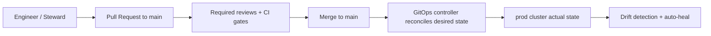

<!--
File: infra/clusters/prod/README.md
Purpose: Operator-facing documentation for the production KFM cluster overlay.
Governance: This is a governed artifact. Changes impact production.
-->


# Production cluster

> [!WARNING]
> This directory is **production infrastructure**.  
> Treat all changes as **high-impact** and **governed**.

## Production metadata

| Field | Value |
|---|---|
| Environment | `prod` |
| Cluster name | *(not confirmed in repo)* |
| Kubernetes distribution | *(not confirmed in repo)* |
| GitOps controller | *(not confirmed in repo — e.g., Argo CD / Flux)* |
| Primary ingress domain | *(not confirmed in repo)* |
| Primary namespaces | *(not confirmed in repo)* |
| Data classification | *(not confirmed in repo — document if any restricted layers exist)* |

## What this folder is

`infra/clusters/prod/` is the **production cluster overlay** for the Kansas Frontier Matrix (KFM) platform.

It holds **only** the *delta* needed to run KFM in production (scaling, policies, endpoints, and “prod-only” integrations). Shared resources should live in a reusable `base/` (or platform module) and be referenced from this overlay.

### Goals

- Keep production desired state **declarative**, **versioned**, and **auditable** via Git.
- Minimize YAML drift by using **Kustomize overlays** (base + patches).
- Enforce the KFM governance model (trust membrane + controlled data access).
- Make the “right way” the easiest way: PR-based change control, automated reconciliation, reproducible rollbacks.

### Non-goals

- No local/manual “snowflake” changes as a primary workflow.
- No plaintext secrets committed to Git.
- No production experimentation or ad-hoc data loads.

## Assumed deployment model

This README assumes a GitOps controller reconciles the contents of this directory into the production cluster.

If you use a different reconciler, the *principles* remain the same—only object kinds and wiring differ.

## Folder map

> [!NOTE]
> The exact filenames may vary by implementation.  
> If this directory already has a different structure, align the names but keep the intent.

```text
infra/
└─ clusters/
   └─ prod/
      ├─ README.md                 # you are here
      ├─ kustomization.yaml        # entrypoint for the prod overlay
      ├─ patches/                  # prod-only Kustomize patches (replicas, limits, nodeSelectors, etc.)
      ├─ platform/                 # cluster services needed in prod (ingress, certs, observability, backups)
      ├─ policies/                 # RBAC, quotas, network policies, admission policies, compliance settings
      ├─ apps/                     # “app of apps” / ApplicationSets / workload wiring into prod
      └─ secrets/                  # NON-secret references (ExternalSecret/SealedSecret templates), never plaintext
```

### What goes where

| Path | What belongs here | What does **not** belong here |
|---|---|---|
| `kustomization.yaml` | Overlay entrypoint; references shared bases + applies prod patches | Hard-coded environment secrets |
| `patches/` | Replica counts, resource limits, anti-affinity, pod disruption budgets | Application source code |
| `platform/` | Ingress/controller config, TLS/certs, monitoring/logging, backups | Tenant app manifests if they can live in `apps/` |
| `policies/` | NetworkPolicy, RBAC, Pod Security rules, policy-as-code constraints | “Nice-to-have” docs with no operational value |
| `apps/` | GitOps Applications / ApplicationSets pointing to KFM services in prod | Shared app base YAML (belongs in an app `base/`) |
| `secrets/` | ExternalSecret objects, SealedSecret outputs, secret-store references | Plain `Secret` with real credentials |

## How changes reach production

### Normal path



### Production change rules

- **All** production changes must land via **pull request**.
- Prefer small, reversible diffs.
- Every change must include a human-readable **intent** in the PR description:
  - what changed
  - why it changed
  - how it was verified
  - rollback plan
- Avoid “big bang” merges; use progressive rollout and feature flags where possible.

> [!IMPORTANT]
> If a manual change is made during an incident (break-glass), the **follow-up** action is to **commit the change back to Git** (or revert it) so reconciliation returns to a known desired state.

## Security and governance

### Trust membrane in production

KFM’s trust membrane rule applies at the cluster boundary:

- **External clients** must reach KFM via the **governed API boundary** (ingress/gateway).
- **Datastores** must be private (no public ingress/route directly to DBs).
- Enforce **network policies** so only approved namespaces/services can talk to core datastores.
- Enforce **RBAC** to separate:
  - platform operators
  - application deployers
  - data stewards
  - read-only auditors

### Data sensitivity

If any production layers or datasets are sensitive (culturally restricted, exact site locations, private individuals):

- **Do not** expose them publicly by default.
- Restrict access via RBAC, namespace boundaries, and API policy checks.
- Avoid logging raw sensitive payloads; redact at the edge when feasible.
- Prefer generalized outputs where appropriate (e.g., coarse geohash or bounding-box) until a governance review approves release.

### Secrets and sensitive configuration

**Never commit plaintext secrets.** Choose one of these patterns:

1. **Encrypted secrets in Git** (sealed secrets / SOPS)  
2. **Secret references in Git** (ExternalSecrets fetching from a backend secret store)

Recommended default for multi-environment clusters: **ExternalSecrets** (store references in Git; fetch actual secrets from the backend).

> [!TIP]
> Keep only the *reference objects* (like `ExternalSecret`) in Git. That preserves GitOps auditability without leaking credentials.

#### Production secret checklist

- [ ] No raw API keys, DB passwords, tokens, or private keys anywhere in `infra/clusters/prod/`
- [ ] Secret values come from a controlled backend (Vault / cloud secret manager / HSM-backed store)
- [ ] Namespaces cannot read each other’s secrets (multi-tenancy)
- [ ] Secrets rotated on a schedule (documented + tested)
- [ ] Break-glass rotation procedure documented

### Compliance and safety rails

- Define resource quotas/limits per namespace.
- Require liveness/readiness probes and resource requests/limits for all deployments.
- Prefer PodDisruptionBudgets and anti-affinity for critical services.
- Pin production images to immutable tags/digests.
- Prefer Ingress or platform routing over NodePort exposure in production.
- For policy enforcement, prefer:
  - Pod Security Admission and baseline policies
  - Kyverno or Gatekeeper constraints for forbidden patterns
  - Image signature verification if available in your supply chain

## KFM data promotion in production

> [!NOTE]
> Recommended KFM pattern: keep data changes as auditable as code.

For data (catalogs, STAC items, graph imports, etc.), treat production as **declarative desired state**:

- Keep a production “data manifest” that points to dataset versions (checksums, URIs, release tags).
- Promote new data by **updating the manifest via PR**.
- A reconciler workflow (GitHub Actions / Argo Workflows / operator) observes the change and executes the controlled load.

This provides:

- an audit trail of data changes in Git
- reproducible rollbacks (revert manifest)
- explicit stewardship review before data reaches end users

## Operations runbook

<details>
<summary><strong>Local render to preview the overlay</strong></summary>

```bash
# Option A: with kustomize installed
kustomize build infra/clusters/prod > /tmp/prod.rendered.yaml

# Option B: with kubectl
kubectl kustomize infra/clusters/prod > /tmp/prod.rendered.yaml
```

</details>

<details>
<summary><strong>How to verify prod drift and health</strong></summary>

- Use the GitOps controller UI or CLI to:
  - confirm `Synced` and `Healthy`
  - inspect diffs for unexpected drift
- Verify:
  - ingress is serving expected hosts
  - core datastores are not exposed publicly
  - required policies are enforced in the namespace

</details>

<details>
<summary><strong>Rollback procedure</strong></summary>

1. Revert the PR that introduced the change (preferred).
2. Merge the revert to `main`.
3. GitOps controller reconciles to the prior known-good desired state.
4. Confirm system health and close incident notes with:
   - what happened
   - exact commit hash reverted
   - follow-up actions

</details>

## Definition of Done for production changes

### Minimum acceptance criteria

- [ ] Change is PR-based and has required approvals
- [ ] CI validation passed (kustomize render, schema checks, policy checks)
- [ ] No plaintext secrets or sensitive endpoints added
- [ ] Rollback plan is included and feasible
- [ ] Observability impact considered (dashboards/alerts updated if needed)

### Recommended CI gates

- [ ] `kustomize build` succeeds
- [ ] YAML or JSON schema validation for Kubernetes objects
- [ ] Policy checks where available
- [ ] Image reference policy check (no `:latest`, prefer digest pinning)
- [ ] Diff summary generated for reviewers

## References

- **The Path to GitOps** (repository and directory patterns, secrets handling)
- **KFM Software Support** (tooling comparisons, GitOps controller notes)
- **Data Pipelines and Kubernetes** (operational considerations for clusters and secrets)
