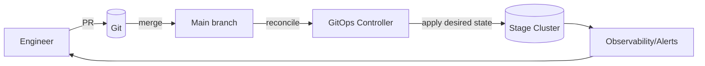

# KFM Stage Cluster — `infra/clusters/stage/`


> [!IMPORTANT]
> This folder represents **the desired state** of the **Stage** cluster environment.
> Treat changes as **environment-impacting** and keep everything **auditable**, **reviewed**, and **reversible**.

---

## What “Stage” is for

Stage is the **pre-production** environment used to validate:
- end-to-end deployability (GitOps sync, policies, ingress/route exposure),
- integration between services,
- release candidates before promotion to prod.

Stage is expected to be **production-like** in:
- policy enforcement (authz, network boundaries),
- deployment topology and controllers,
- observability and alerting signals.

Stage is expected to differ from prod in:
- **data sensitivity** (prefer redacted/synthetic),
- **change cadence** (faster iteration, still governed),
- **capacity/quotas** (often smaller).

> [!NOTE]
> Exact “Stage vs Prod” parity rules are **project-governed** and may evolve.
> If a rule is not documented, treat it as **unknown** and request governance review (outside this README).

---

## Governance & safety (FAIR/CARE minded)

### Data handling policy
- **Do not** deploy datasets, backups, or artifacts that contain **sensitive** or **restricted** information into Stage unless explicitly approved.
- Prefer:
  - synthetic fixtures,
  - redacted samples,
  - “CARE-safe” demo datasets.

### Secrets policy
- **Never commit plaintext secrets** to Git.
- Stage secrets must be represented as **encrypted** or **indirect references** (e.g., external secret references, sealed secrets, SOPS-encrypted manifests). *(Mechanism is project-dependent.)*

### Trust membrane reminder
Stage must preserve KFM’s “trust membrane” principle:
- Frontend/external clients **never** access databases directly.
- All access goes through governed API boundaries and policy gates.
- Core services must not bypass repository interfaces to talk directly to storage.

---

## Ownership boundaries

A GitOps repository structure is often driven by organizational “boundaries” (e.g., SRE, security, release management). [oai_citation:3‡Docker-GitOps-OpenShift.pdf](sediment://file_00000000004c71f8a55fb8ae2e980ace)

| Boundary / Role | Typical responsibilities in Stage | Typical review requirement |
|---|---|---|
| Platform / Cluster SRE | cluster add-ons, ingress, observability, base quotas | required on cluster-wide changes |
| Security | RBAC, policies, secret handling, network policies | required on auth/policy changes |
| Release / App Ops | environment promotions, app rollouts, stage gating | required on deployment/promotion changes |

> [!TIP]
> If CODEOWNERS is configured, ensure this folder is covered by the right owners.

---

## GitOps model

### Source of truth
Git is the source of truth for **Stage desired state**.

### Reconciliation
A GitOps controller (commonly **Argo CD**) continuously reconciles the live cluster to match Git, detects drift, and applies changes from declarative manifests (including manifests rendered from Helm/Kustomize). [oai_citation:4‡Docker-GitOps-OpenShift.pdf](sediment://file_00000000004c71f8a55fb8ae2e980ace) [oai_citation:5‡Docker-GitOps-OpenShift.pdf](sediment://file_00000000004c71f8a55fb8ae2e980ace)

> [!NOTE]
> If your project uses Flux instead of Argo CD, update this README accordingly.

---

## Expected layout and conventions

This repo may use a “base + overlays” pattern where **stage** is an environment overlay (alongside dev/prod). [oai_citation:6‡Docker-GitOps-OpenShift.pdf](sediment://file_00000000004c71f8a55fb8ae2e980ace)

Below is a **recommended** (create-as-needed) structure for this folder:

```text
infra/
└── clusters/
    └── stage/
        ├── README.md                 # this file
        ├── kustomization.yaml        # (optional) Stage entrypoint if using Kustomize
        ├── apps/                     # (optional) GitOps Applications / ApplicationSets targeting Stage
        ├── core/                     # (optional) cluster core services/add-ons required in Stage
        ├── namespaces/               # (optional) namespaces/projects + quotas/limits
        ├── rbac/                     # (optional) RBAC policies (least privilege)
        ├── policies/                 # (optional) admission policies (Kyverno/Gatekeeper/etc.)
        ├── secrets/                  # (optional) encrypted/indirect secret manifests ONLY
        └── observability/            # (optional) alerts, dashboards, log routing configs
```

### What belongs here
**Cluster/environment configuration**:
- namespaces/projects
- quotas/limits
- RBAC and policy enforcement
- ingress/route configuration
- platform add-ons (observability, controllers)

### What does *not* belong here
- application source code
- build pipelines (CI) logic
- plaintext secrets
- unmanaged “clickops” changes

---

## Change workflow



### Promotion mindset
- Stage should receive changes via PR + review.
- Promote to prod by **promoting Git state**, not by manual cluster edits.

> [!IMPORTANT]
> If an emergency manual change is unavoidable, you must backport it to Git immediately to restore the “single source of truth.”

---

## How to operate Stage

### Local validation (recommended)
Run these checks locally or in CI before merging (tooling may vary by repo):

- `kustomize build infra/clusters/stage` *(if using Kustomize)*
- YAML/schema validation (e.g., kubeconform/kubeval)
- policy tests (if using Gatekeeper/Kyverno test harness)
- secrets checks (detect plaintext secrets)

### Manual apply (breakglass only)
If Stage needs emergency recovery and GitOps is unavailable:

```bash
# Breakglass pattern (example only):
kubectl apply -k infra/clusters/stage
```

Then immediately:
1) open a PR capturing the exact change,
2) restore GitOps reconciliation.

---

## OpenShift-specific notes (only if Stage runs on OpenShift)

If Stage is OpenShift:
- Prefer **Routes** over NodePort for exposing services externally (NodePort is discouraged in many OpenShift guidance contexts). [oai_citation:7‡Docker-GitOps-OpenShift.pdf](sediment://file_00000000004c71f8a55fb8ae2e980ace)

Example patterns (commands are illustrative; adjust to your cluster conventions):

```bash
# Login / context
oc login <CLUSTER_API_URL>

# List routes
oc get routes -A
```

> [!NOTE]
> Do not copy training/lab URLs or credentials into Git. Keep environment access info in a secure runbook.

---

## Troubleshooting quick hits

- GitOps shows OutOfSync/Degraded:
  - verify the repo path + revision configured for Stage
  - verify manifests render correctly (Helm/Kustomize)
  - check policy failures / admission rejections
- A service is unreachable externally:
  - check ingress/route resources
  - confirm DNS / wildcard domain configuration (platform-dependent)
- “It works in Dev but not in Stage”:
  - compare Stage overlay inputs (values/patches) vs Dev overlay inputs
  - check stricter Stage policies/quotas (often intentional)

---

## Definition of Done for Stage changes

### Must-have
- [ ] Change is made via PR (no direct commits to protected branches)
- [ ] Reviewers include required owners (SRE/security/release as applicable)
- [ ] No plaintext secrets added
- [ ] GitOps reconciliation succeeds (Stage is healthy)
- [ ] Rollback path is clear (revert commit restores previous state)

### Nice-to-have
- [ ] Change is accompanied by a small runbook note (what changed / why / how to verify)
- [ ] Alerts/dashboards updated if the change affects SLOs/telemetry

---

## TODO placeholders (fill in when known)

| Field | Value |
|---|---|
| Stage cluster name | _(not confirmed in repo)_ |
| GitOps controller | _(Argo CD assumed; confirm)_ |
| On-call / escalation | _(not confirmed in repo)_ |
| Secrets mechanism | _(not confirmed in repo)_ |
| Promotion policy | _(not confirmed in repo)_ |
