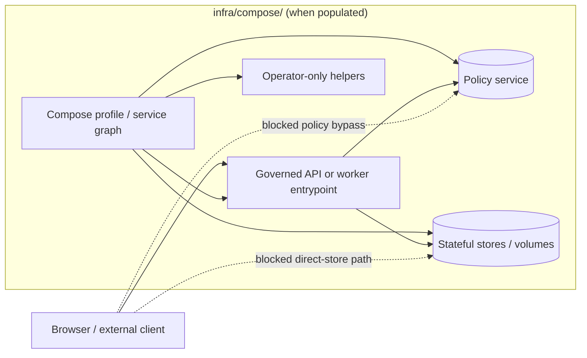

# compose

Directory guide for Docker Compose–style runtime wiring under `infra/`.

> **Status:** experimental  
> **Owners:** NEEDS VERIFICATION  
>     
>
> **Repo fit:** Path: `infra/compose/README.md` · Upstream: [`../README.md`](../README.md) · Sibling lanes: [`../local/`](../local/), [`../systemd/`](../systemd/), [`../systemd-or-compose/`](../systemd-or-compose/), [`../hosted/`](../hosted/), [`../kubernetes/`](../kubernetes/), [`../terraform/`](../terraform/) · Shared boundaries: [`../../contracts/`](../../contracts/), [`../../policy/`](../../policy/), [`../../schemas/`](../../schemas/), [`../../tests/`](../../tests/)
>
> **Quick jump:** [Scope](#scope) · [Repo fit](#repo-fit) · [Inputs](#inputs) · [Exclusions](#exclusions) · [Directory tree](#directory-tree) · [Quickstart](#quickstart) · [Usage](#usage) · [Diagram](#diagram) · [Reference tables](#reference-tables) · [Task list](#task-list) · [FAQ](#faq) · [Appendix](#appendix)

> [!IMPORTANT]
> **CONFIRMED current state:** the inspected live tree exposed `infra/compose/` as a README-only directory.  
> Treat this file as a **directory contract and evidence boundary**, not as proof that an active Compose stack is already committed here.

## Scope

`infra/compose/` is the home for **Compose-specific environment wiring** when KFM needs a multi-service, container-based runtime lane.

That includes service graphs, override manifests, non-secret environment examples, startup notes, bind and volume guidance, and operator-facing instructions that are genuinely about **how the stack runs**.

It does **not** own domain law. In KFM terms, infra should wire delivery mechanics, while contracts, policy, data truth, and release evidence stay authoritative in their own lanes.

This README uses **CONFIRMED**, **INFERRED**, **PROPOSED**, and **NEEDS VERIFICATION** so the directory can be expanded without pretending the implementation is more complete than the evidence supports.

## Repo fit

| Aspect | Guidance |
|---|---|
| Path | `infra/compose/` |
| Upstream | [`../README.md`](../README.md) defines the broader infra posture for runtime and delivery mechanics. |
| Adjacent lanes | Compose is one lane among several. Nearby directories already separate local, systemd, hybrid, hosted, Kubernetes, Terraform, monitoring, and backup concerns. |
| Shared boundaries | Keep contracts, schemas, policy, tests, and general scripts in their own top-level lanes. |
| Trust posture | Compose wiring may start services, but client-facing trust still belongs to governed interfaces rather than direct store access. |

## Inputs

Accepted inputs here are the files and notes that help an operator understand or run a Compose-based slice.

| Belongs here | Typical content | Evidence status |
|---|---|---|
| Base Compose manifest | Root multi-service graph such as `compose.yaml` or `docker-compose.yml` | **PROPOSED** naming; verify the active checkout before standardizing |
| Override/profile manifests | Dev, ops, or feature-specific overrides | **PROPOSED** |
| Non-secret environment examples | `.env.example`, profile variable docs, port maps, local bind notes | **INFERRED** |
| Compose-specific proxy notes | Reverse-proxy or network notes that only exist because Compose is in play | **INFERRED** |
| Startup / teardown guidance | Bring-up order, health dependencies, cleanup steps, seed/reset notes | **INFERRED** |
| Lane-local runbooks | Short operational notes that stay tightly coupled to Compose manifests | **INFERRED** |

## Exclusions

What does **not** belong here matters just as much as what does.

| Do **not** put this here | Put it here instead | Why |
|---|---|---|
| Business logic, service code, adapters | Their authoritative package or service directory | Infra must not become the hidden home of system behavior. |
| Policy law, Rego bundles, exception grammar | [`../../policy/`](../../policy/) | Policy needs independent review and test surfaces. |
| Schemas, OpenAPI, shared fixtures | [`../../contracts/`](../../contracts/), [`../../schemas/`](../../schemas/) | Compose should consume contracts, not redefine them. |
| Published evidence, release proof objects, catalog truth | Their authoritative data / docs / release lanes | A runnable stack is not the same thing as a publishable release. |
| Real credentials, tokens, secret `.env` files | Secret manager or local untracked files | Never treat repo plaintext as secret storage. |
| Large scripts that start owning domain law | [`../../scripts/`](../../scripts/) or a promoted package/worker | Wiring helpers are fine; hidden business rules are not. |

## Directory tree

### CONFIRMED current state

```text
infra/compose/
└── README.md
```

<details>
<summary>PROPOSED expansion sketch (illustrative only)</summary>

```text
infra/compose/
├── README.md
├── compose.yaml
├── compose.dev.yaml
├── compose.ops.yaml
├── env/
│   └── .env.example
└── proxies/
    └── README.md
```

Use this only after re-reading the active checkout and choosing one naming convention. The sketch is here to make review intent visible, not to imply those files already exist.

</details>

## Quickstart

Start with inventory, not assumption.

1. Verify the checkout and inspect the surrounding infra lanes.
2. Confirm whether Compose manifests already exist elsewhere in the repo before creating new ones.
3. Read the parent `infra` guidance before editing this subtree.
4. Only run config validation after a real manifest exists.

```bash
git rev-parse --show-toplevel

find infra -maxdepth 2 -type d | sort
find infra/compose -maxdepth 3 -type f | sort

sed -n '1,220p' infra/README.md
```

If a Compose manifest is present, validate the merged configuration before reviewing runtime behavior:

```bash
# Illustrative example only — replace with the real manifest name in this checkout
docker compose -f infra/compose/compose.yaml config
```

> [!NOTE]
> Validation of a Compose file proves that the manifest parses. It does **not** prove that the resulting environment is policy-safe, promotion-ready, or publishable.

## Usage

### Use this lane when

- You need a **bounded multi-service rehearsal** on one machine.
- You want **explicit service wiring** for local or operator-private bring-up.
- You need to document **networks, volumes, ports, health dependencies, or proxy edges** that are specific to Compose.
- You are testing a runtime slice before deciding whether the steadier home is systemd, hosted infra, or Kubernetes.

### Do not use this lane to

- redefine policy, schema, or release truth;
- expose canonical stores directly to clients;
- smuggle long-lived business rules into YAML or shell glue;
- treat “it starts” as evidence that “it is safe to publish.”

### Practical posture

When this lane is populated, keep it additive rather than authoritative:

1. **Governed interfaces first.** Public or normal UI surfaces should still go through governed API paths.
2. **Private stores stay private.** Compose can wire them; it should not normalize direct client access to them.
3. **Deployment is not promotion.** A running stack is runtime placement, not trust-state advancement.
4. **Examples over secrets.** Commit variable shapes and docs, not live credentials.
5. **Small helpers only.** If a helper script starts defining domain behavior, move that behavior into a better-owned package or worker.

## Diagram



[Back to top](#compose)

## Reference tables

### Lane selection matrix

| Need | Best home | Why |
|---|---|---|
| Quick local multi-service bring-up | `infra/compose/` | Compose makes service relationships, ports, and startup order legible. |
| Single-host long-lived service supervision | [`../systemd/`](../systemd/) or [`../systemd-or-compose/`](../systemd-or-compose/) | Host supervision may be the cleaner steady-state lane. |
| Hosted or clustered reconciliation | [`../kubernetes/`](../kubernetes/), [`../gitops/`](../gitops/), [`../terraform/`](../terraform/) | Those lanes better express remote infrastructure and controlled rollout surfaces. |
| Contracts, schemas, policy truth | [`../../contracts/`](../../contracts/), [`../../schemas/`](../../schemas/), [`../../policy/`](../../policy/) | Infra should consume authoritative law, not own it. |

### Review matrix for new Compose content

| Concern | Minimum expectation | State |
|---|---|---|
| Service inventory | Every service exists for a named reason | **NEEDS VERIFICATION** for this lane |
| Image strategy | Tag or digest posture is documented | **NEEDS VERIFICATION** |
| Environment handling | Repo contains examples and docs, not secrets | **KFM-safe default** |
| Network exposure | Binds are private or explicitly justified | **PROPOSED guardrail** |
| Persistence | Volumes and cleanup or backup expectations are written down | **PROPOSED guardrail** |
| Validation | Manifest lint or `docker compose config` review exists | **PROPOSED gate** |
| Trust membrane | Client path goes through governed interfaces | **REQUIRED** |

## Task list

Use this as a minimum review gate before treating the directory as more than a placeholder.

- [ ] Verify owners for `infra/compose/`.
- [ ] Verify whether Compose manifests already exist elsewhere before adding new ones here.
- [ ] Choose and document one manifest naming convention.
- [ ] Document ports, binds, volumes, and any health or dependency assumptions.
- [ ] Keep secrets out of Git; commit examples only.
- [ ] Show the governed entrypoint and block direct client-to-store patterns.
- [ ] Add teardown or rollback notes if the lane persists state.
- [ ] Add config validation to review or CI if manifests are introduced.
- [ ] Link any lane-specific runbook from this README.

## FAQ

### Is Compose the default production path for KFM?

**NEEDS VERIFICATION.** The adjacent infra guidance clearly treats Compose as one lane inside a wider delivery family, not as a synonym for promotion or publication.

### Can this directory define policy or schema behavior?

No. It can reference those surfaces, mount them, or wire them into a runtime, but their authoritative homes remain elsewhere.

### What if this directory stays README-only for a while?

That is acceptable. A clear directory contract is better than a misleading manifest set that overclaims maturity or hides ownership.

### Should real `.env` files live here?

No. Commit examples, placeholders, and docs. Keep live secrets outside version control.

[Back to top](#compose)

## Appendix

<details>
<summary>Illustrative review prompts for the first real Compose PR</summary>

Ask these before merge:

1. Does the manifest wire runtime mechanics only, or has it quietly taken ownership of policy or domain law?
2. Are all published ports intentional, documented, and bounded?
3. Is the client path still governed, or does the Compose file expose a private store directly?
4. Are volume names, cleanup steps, and persistence expectations explicit?
5. Is there a matching README or runbook note for every operator-relevant behavior?
6. Can another maintainer tell which parts are **CONFIRMED** versus merely **PROPOSED**?

</details>
