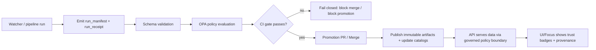

# Infrastructure Contracts (`infra/contracts`)


This directory is the **contract surface for KFM infrastructure governance**: machine-validated **schemas**, **policy packs**, and **test vectors** used to enforce *fail-closed* promotion and runtime access rules.

In KFM terms, these contracts are part of the platform’s **trust membrane**: they define what “allowed / valid / promotable / safe-to-serve” means, and they are enforced in CI and (where applicable) at runtime.

> [!IMPORTANT]
> **Contracts are first-class artifacts.** If an artifact cannot be validated against a contract (schema + policy), it must be treated as *untrusted* and **must not** be promoted, served, or shown as “green”.

---

## What is a “contract” in KFM?

A **contract artifact** is a machine-validated definition of an interface or rule-set that downstream systems depend on.

Common contract artifact types:
- **JSON Schema** (e.g., receipts, manifests, registries)
- **OPA/Rego** policies (deny-by-default gates)
- **CI gates** (the check wiring that enforces contracts in PRs)
- **Golden fixtures** (valid/invalid examples used as regression tests)

> [!NOTE]
> API-level OpenAPI/GraphQL contracts typically live with the server (e.g., `src/server/contracts/…`). This folder is for **infra + governance** contracts that the platform enforces during promotion and serving.

---

## Scope

### ✅ Belongs here
- **Promotion & governance schemas** (run receipts, manifests, allow-lists, promotion inputs)
- **Policy packs** that implement fail-closed gates (OPA/Rego; Conftest-compatible)
- **Fixtures / test vectors** (valid + invalid examples)
- **Tooling glue** to validate contracts locally (scripts, make targets, minimal docs)

### ❌ Does not belong here
- Secrets or secret *values* (never commit)
- Domain ETL code (belongs in `src/pipelines/…`)
- Runtime service code (belongs in `src/server/…`, `src/graph/…`, etc.)
- Data products (belongs in `data/raw|work|processed/…`)

---

## Directory layout

> Adjust names to match what’s already in your repo; the **conceptual split** is what matters.

```text
infra/contracts/
├── README.md                    # this file
├── schemas/                     # JSON Schemas (versioned)
│   ├── run_receipt.v1.schema.json
│   ├── run_manifest.v1.schema.json
│   ├── watcher.v1.schema.json
│   └── (more…)
├── policy/
│   └── opa/                     # Rego policies (deny-by-default)
│       ├── receipt.rego
│       ├── receipts_pr_gate.rego
│       ├── watchers.rego
│       └── gates/
│           ├── artifact.rego
│           └── (domain gates…)
├── fixtures/
│   ├── schemas/                 # valid/invalid JSON examples for schema regression
│   └── policy/                  # policy decision inputs/expected outcomes
└── scripts/                     # optional: local validation wrappers
    └── validate_contracts.(sh|ps1)
```

---

## How these contracts are used



### Core contract set (typical)
| Contract | Type | Purpose | Typical enforcement point |
|---|---|---|---|
| `run_receipt` | JSON Schema | Per-run receipt: inputs/outputs/checks/timestamps | CI + UI viewer validation |
| `run_manifest` | JSON Schema | Deterministic run configuration & environment snapshot | CI promotion gate |
| `watcher registry` | JSON Schema | Allow-list of permitted watchers/providers | CI gate + runtime guardrails |
| Receipt invariants | Rego | Deny promotion if required fields missing / unapproved providers | Conftest PR gate |
| Sensitivity / redaction rules | Rego | Enforce “least privilege” + generalization rules | Runtime policy boundary |

---

## Validation workflow

### In CI (required)
At minimum:
- Validate **all schemas** compile and all fixtures are checked
- Evaluate **OPA policies** in deny-by-default mode
- Run **Conftest** (or equivalent) to block merges on policy denial
- Treat policy + schema failures as **merge-blocking**

> [!IMPORTANT]
> CI policy checks must be configured as **required status checks** on protected branches.

### Local validation (recommended)
These commands are illustrative; use the exact tools/versions pinned by the repo.

```bash
# 1) JSON Schema validation (example using AJV)
ajv validate -s infra/contracts/schemas/run_receipt.v1.schema.json \
  -d infra/contracts/fixtures/schemas/run_receipt.valid.json

# 2) Policy unit tests (OPA)
opa test infra/contracts/policy/opa -v

# 3) Conftest gate (deny-by-default)
conftest test \
  --policy infra/contracts/policy/opa \
  --data infra/contracts/fixtures/policy \
  infra/contracts/fixtures/schemas
```

---

## Versioning rules

Contracts are **versioned** and **stable** by default.

### Rules of thumb
- **Breaking change?** Create a new major schema (e.g., `v2`) and keep `v1` available until deprecation is complete.
- **Additive change?** Prefer additive evolution (new optional fields) + fixtures + policy updates.
- **Policy changes are breaking unless proven otherwise.** Tightening a deny rule may block existing flows; treat it as a governed change.

### Deprecation
When deprecating, provide:
- A migration note in this README
- A “last-supported” date/version target
- Updated fixtures showing the replacement path

---

## Governance and safety expectations

These contracts enforce:
- **Trust membrane**: no direct DB access from clients; all access through a governed API boundary.
- **Fail-closed**: when uncertain, deny (promotion or serving).
- **Promotion gates**: artifacts must have checksums + catalog/provenance records.
- **Focus Mode constraints**: responses must cite evidence or abstain; interactions are auditable.

> [!CAUTION]
> **Sensitivity is an infrastructure concern, not a UI concern.** Redaction/generalization must be enforceable by contracts + policy gates, so unsafe precision never reaches the client by “accident”.

---

## Contributing

### Add a new contract (checklist)
- [ ] Add a **versioned** schema/policy artifact under the correct subfolder
- [ ] Add **fixtures**: at least 1 valid + 2 invalid cases (covering common failure modes)
- [ ] Add or update **OPA tests** for the new rules
- [ ] Wire the contract into CI so failures are **merge-blocking**
- [ ] Document:
  - [ ] the intent (“what this contract protects”)
  - [ ] the invariants (“what must always be true”)
  - [ ] compatibility notes (“what breaks, what doesn’t”)

### Review triggers (treat as governance review)
- Any breaking schema version bump
- Any new deny rule affecting promotion or serving
- Any change touching sensitivity / access control / redaction
- Any contract that changes what can be shown as “trusted/green”

---

## Troubleshooting (common failure modes)

<details>
<summary><strong>Schema passes but policy denies</strong></summary>

- Your JSON shape is valid, but a governance rule is blocking promotion (e.g., unapproved provider, missing license/provenance markers, restricted sensitivity label without required redaction).
- Fix by addressing the policy’s denial reason (CI output must remain human-readable).

</details>

<details>
<summary><strong>Toolchain drift breaks gates</strong></summary>

- If Conftest/OPA/schema tooling versions drift, previously-valid artifacts may start failing.
- Fix by pinning versions and maintaining a small regression suite in `fixtures/`.

</details>

---

## Cross-links (repo-relative)

- `docs/MASTER_GUIDE_v13.md` — canonical governance + documentation standards (contract-first, evidence-first)
- `docs/architecture/` — trust membrane + clean-layer responsibilities
- `.github/workflows/` — CI gates that enforce these contracts
- `src/server/contracts/` — API-level contracts (OpenAPI/GraphQL), if used in this repo

---

## License / attribution
These contracts are governed artifacts. Follow the repo’s contribution and licensing rules for any copied policy logic or schema patterns.
