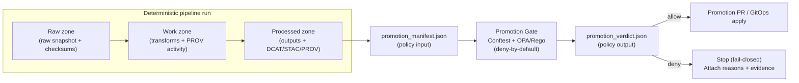

# 🏁 Promotion Contracts (Governed Promotion Gate)


> ⚠️ **Governed / fail-closed:** if policy evaluation cannot be performed, **promotion MUST be denied**.  
> Treat schema + policy changes here as **production changes**.

This directory defines the **contract surface** used to promote KFM artifacts (datasets, Story Nodes, API configs, derived products) from internal build outputs to governed **publication lanes**.

---

## 📘 Overview

### Purpose
- Standardize a **single policy input** (`promotion_manifest`) and a **single policy output** (`promotion_verdict`) so promotion logic stays consistent across pipelines.
- Make promotion **machine-checkable** (schemas + catalogs + provenance + policy labels) and **auditable** (verdict + evidence references).
- Keep KFM’s clean architecture boundaries intact: **contracts live here**, implementations live elsewhere.

### Scope

| In Scope | Out of Scope |
|---|---|
| Contract definitions (schemas) for promotion inputs/outputs | Concrete pipeline implementations |
| Lane definitions (what “public vs partner vs internal” means) | Any direct DB access patterns (disallowed by trust membrane) |
| CI gate expectations + evidence requirements | UI behavior and UX |
| Policy-pack interface expectations (OPA/Rego via Conftest) | Content authoring of Story Nodes |

### Audience
- **Infra/Platform:** CI/CD, GitOps, environments, branch protection, promotion controllers
- **Data Engineering:** pipeline owners emitting catalogs/provenance
- **Governance/Security:** policy authors, reviewers, incident responders

### Definitions
- **Promotion:** Moving an artifact from “built/validated” to “published/served” in a governed lane.
- **Lane:** A named promotion target with **distinct policy requirements** (e.g., `promotion:public`).
- **Fail-closed:** Any missing evidence, schema failure, policy error, or verification gap ⇒ **deny**.
- **Evidence bundle:** Catalogs (DCAT/STAC/PROV), checksums, gate reports, signatures/attestations, and the verdict.

---

## 🗂️ Directory Layout

> **Recommended layout (create as needed; some files may not exist yet).**

```text
infra/
└─ contracts/
   └─ promotion/
      ├─ README.md
      ├─ schemas/                          # (proposed) contract schemas
      │  ├─ promotion_manifest.v1.schema.json
      │  └─ promotion_verdict.v1.schema.json
      ├─ examples/                         # (proposed) inputs for CI tests
      │  ├─ promotion_manifest.public.example.json
      │  ├─ promotion_manifest.internal.example.json
      │  └─ promotion_manifest.tribal_intersection.example.json
      ├─ policy/                           # (proposed) promotion policy packs (OPA/Rego)
      │  ├─ README.md
      │  ├─ care.rego
      │  ├─ licensing.rego
      │  ├─ materiality.rego
      │  └─ sensitivity.rego
      └─ tests/                            # (proposed) policy unit tests
         ├─ care_test.rego
         └─ licensing_test.rego
```

### Key artifacts (contract surface)

| Artifact | Role | Produced by | Consumed by |
|---|---|---|---|
| `promotion_manifest.json` | **Policy input**: what is being promoted + evidence pointers | pipeline / lane controller | policy packs (Conftest/OPA), CI gate |
| `promotion_verdict.json` | **Policy output**: allow/deny + reasons + required actions | policy engine job | CI, GitOps controller, reviewers |
| `policy/` | Deny-by-default promotion rules | governance/security | CI + promotion controller |
| `schemas/` | JSON Schema enforcement (fail if invalid) | platform | CI + local dev |

---

## 🧠 System Context

Promotion is the **governance boundary** between internal processing and external exposure.



---

## 🧩 Contract 1 — Promotion Manifest (Policy Input)

### Contract identity
- **Name:** `promotion_manifest`
- **Version:** `v1` (see `promotion_contract_version` in front-matter)
- **Semantics:** describes *what* is being promoted, *where*, and *what evidence* exists to justify it.

### Required top-level fields (v1)

| Field | Type | Required | Meaning |
|---|---|---:|---|
| `schema_version` | string | ✅ | Contract ID, e.g. `kfm.promotion.manifest.v1` |
| `artifact` | object | ✅ | What is being promoted (IDs, outputs, labels, provenance facets) |
| `run` | object | ✅ | Which lane is requesting promotion + policy version + reproducibility keys |
| `evidence` | object | ➕ | Pointers to checksums, catalogs, gate reports, attestations (recommended) |

### Minimum artifact fields (v1)

| Field | Type | Required | Notes |
|---|---|---:|---|
| `artifact.kind` | string | ✅ | `dataset`, `story_node`, `api_config`, etc. |
| `artifact.id` | string | ✅ | Stable canonical ID (content-addressed if applicable) |
| `artifact.outputs` | object | ✅ | Paths/URIs to DCAT/STAC/PROV and derived products |
| `artifact.labels` | object | ✅ | Policy labels (classification, sensitivity, CARE tags, rights, etc.) |
| `artifact.intended_exposure` | string | ✅ | e.g. `public`, `partner`, `internal` |
| `artifact.spatial` | object | ➕ | Intersection signals (e.g., tribal boundary boolean) |
| `artifact.provenance.facets` | array | ➕ | Consent/rights facets referenced from PROV/DCAT |

### Run fields (v1)

| Field | Type | Required | Notes |
|---|---|---:|---|
| `run.lane` | string | ✅ | Lane requesting promotion (e.g. `promotion:public`) |
| `run.policy_version` | string | ✅ | Policy pack version evaluated |
| `run.spec_hash` | string | ➕ | Determinism/idempotency key (recommended) |
| `run.commit_sha` | string | ➕ | Links decision to repo state (recommended) |
| `run.run_id` | string | ➕ | Unique run identifier (recommended) |

<details>
<summary><strong>Example: minimal <code>promotion_manifest.json</code> (illustrative)</strong></summary>

```json
{
  "schema_version": "kfm.promotion.manifest.v1",
  "artifact": {
    "kind": "dataset",
    "id": "kfm:artifact:example:dataset:v1",
    "outputs": {
      "dcat": "artifacts/dcat/dataset.json",
      "stac": "artifacts/stac/collection.json",
      "prov": "artifacts/prov/bundle.jsonld"
    },
    "labels": {
      "classification": "open",
      "sensitivity": "public",
      "care_label": "Public"
    },
    "intended_exposure": "public",
    "spatial": {
      "intersects_authoritative_tribal_boundary": false
    },
    "provenance": {
      "facets": []
    }
  },
  "run": {
    "lane": "promotion:public",
    "policy_version": "v13",
    "spec_hash": "sha256:…",
    "commit_sha": "…"
  }
}
```

</details>

---

## 🧩 Contract 2 — Promotion Verdict (Policy Output)

### Contract identity
- **Name:** `promotion_verdict`
- **Version:** `v1`
- **Semantics:** a deterministic, auditable decision that CI/GitOps can enforce.

### Required fields (v1)

| Field | Type | Required | Meaning |
|---|---|---:|---|
| `schema_version` | string | ✅ | Contract ID, e.g. `kfm.promotion.verdict.v1` |
| `allow` | boolean | ✅ | `true` only if **all** required evidence is present + verified |
| `deny_reasons` | array[string] | ✅ | Human-readable list of blocking reasons |
| `requires_consent` | boolean | ✅ | Indicates missing/required consent/authority for promotion |
| `policy_version` | string | ✅ | Which policy pack version made the decision |
| `evaluated_at` | string | ➕ | ISO-8601 timestamp (recommended) |
| `input_digest` | string | ➕ | Digest of the evaluated manifest (recommended) |
| `evidence` | object | ➕ | Paths/URIs to gate reports, overlays, verification outputs |

<details>
<summary><strong>Example: <code>promotion_verdict.json</code> (illustrative)</strong></summary>

```json
{
  "schema_version": "kfm.promotion.verdict.v1",
  "allow": false,
  "deny_reasons": [
    "missing authority_to_control label",
    "missing or expired tribal_consent facet"
  ],
  "requires_consent": true,
  "policy_version": "v13",
  "evaluated_at": "2026-02-16T00:00:00Z",
  "input_digest": "sha256:…",
  "evidence": {
    "policy_report": "artifacts/gates/policy_report.json"
  }
}
```

</details>

---

## 🛣️ Promotion Lanes

> Lanes define **exposure intent** and required governance gates. Keep lane names stable.

| Lane | Exposure intent | Typical target | Notes |
|---|---|---|---|
| `promotion:internal` | internal | dev/staging | May allow broader data access but still must respect classification consistency |
| `promotion:partner` | controlled | partner delivery | Contractually limited; typically requires rights/usage facets |
| `promotion:public` | public | production/public | Strictest: CARE/sensitivity/rights checks + sensitive location checks |

---

## ✅ Promotion Gate Checklist (CI-Enforced)

### Minimum required gates
- [ ] **Checksums exist** for raw artifacts and are referenced in a raw manifest
- [ ] **Schema validation passes** and a QA report is stored under a stable ID
- [ ] **Required policy labels are attached** (classification, sensitivity, CARE labels, rights/usage)
- [ ] **Catalog writers succeed** (DCAT/STAC/PROV well-formed; link-check clean)
- [ ] **API contract tests pass** (when promoting API surface changes)

### Strongly recommended gates (security + governance hardening)
- [ ] Secret scanning passes (no tokens/keys in PR)
- [ ] PII/sensitive-content scans pass (or approved waivers recorded)
- [ ] Sensitive-location checks pass (no protected coordinates leak into public outputs)
- [ ] Classification consistency checks pass (no “downgrade” from restricted → public without approved transform)
- [ ] Attestation/signature verification passes (if your supply-chain policy requires it)
- [ ] Rollback tag/digest is recorded (last-known-good pointer)

---

## 🔏 Policy Packs (OPA/Rego + Conftest)

### Policy interface
- **Input:** `promotion_manifest.json`
- **Output:** `promotion_verdict.json`
- **Default:** `allow = false` (deny-by-default)

### Local/CI execution (typical)
```bash
# Verify policy bundle (syntax + structure)
conftest verify -p policy/opa

# Evaluate an example manifest (unit-test style)
conftest test examples/promotion_manifest.public.example.json -p policy/opa
```

### Example policy behaviors (non-exhaustive)
- **CARE gate:** block `promotion:public` if an artifact intersects authoritative Tribal boundaries and lacks:
  - an `authority_to_control` label, and
  - a valid (non-expired, scoped) `tribal_consent` provenance facet
- **Licensing gate:** block if rights/usage is missing or incompatible with lane exposure
- **Materiality gate:** suppress non-material churn (optional; depends on pipeline type)

---

## 🧾 Attestation + Provenance Hooks (Optional but recommended)

If you adopt provenance attestations:
- The pipeline emits a `run_manifest.json`
- It is canonicalized (e.g., RFC8785 / JCS)
- A signed provenance attestation is generated and verified as a required status check

**Fail-closed rule:** any canonicalization mismatch or attestation verification failure blocks promotion.

---

## 🔁 Rollback & Auto-Revert (Promotion Safety)

Promotion should be designed for safe rollback:
- Keep a pointer to the **last-known-good digest**
- If a promoted artifact breaks validation or violates policy post-merge, auto-revert to that digest
- Emit a provenance “revert bundle” and an incident marker for audit trails

---

## 🔄 Change Management (Contract-First)

### Versioning rules
- Treat schema/policy updates as **governed changes**.
- Backward-incompatible changes require:
  1) a new schema version file (e.g., `promotion_manifest.v2.schema.json`), and  
  2) compatibility tests + lane-by-lane migration plan.

### Review requirements (minimum)
- At least one infra/platform reviewer
- At least one governance/security reviewer for policy pack changes impacting public/partner lanes

---

## ✅ Definition of Done

- [ ] Front-matter complete & valid (per KFM Markdown Protocol expectations)
- [ ] Directory layout documented and reflects current repo structure
- [ ] Promotion manifest + verdict schemas exist (or TODOs explicitly tracked)
- [ ] Policy packs are deny-by-default and unit-tested (`conftest verify` + `conftest test`)
- [ ] CI gate list is implemented as required status checks (fail-closed)
- [ ] No broken internal links, and references are resolvable (if links are added)
- [ ] Governance/sensitivity handling is explicit (FAIR+CARE + classification consistency)

---

## 📚 References (internal source docs)
- KFM Comprehensive Data Source Integration Blueprint v1.0 (2026-02-12)
- KFM Integration Idea Pack / “KFM-Bluprint-&-Ideas” (generated 2026-02-15), sections on:
  - Cross-cutting Promotion Manifest contract
  - Fail-closed CARE promotion gate (tribal boundary intersections)
  - Provable CI → attestation → PR gate
  - Policy packs (OPA/Rego + Conftest)
