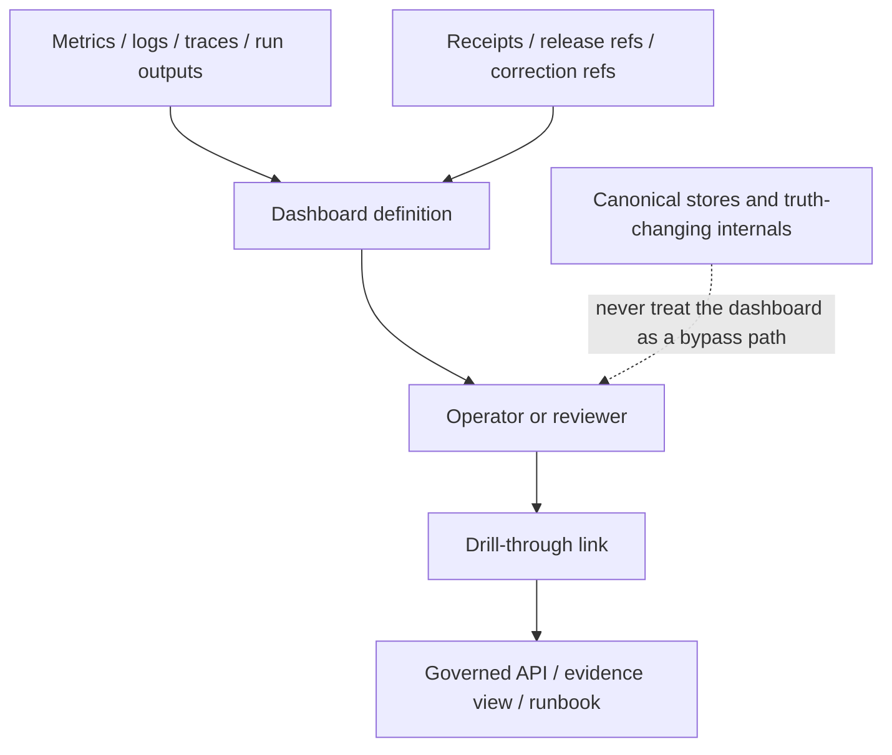

# dashboards

Operator-facing dashboards and drill-through observability definitions for Kansas Frontier Matrix.

> Status: experimental  
> Owners: `@bartytime4life`  
>      
> Path: `infra/dashboards/README.md`  
> Repo fit: dashboard-definition lane under [`../README.md`](../README.md); upstream from repo identity in [`../../README.md`](../../README.md); lateral to infra lanes such as [`../monitoring/`](../monitoring/), [`../local/`](../local/), [`../compose/`](../compose/), [`../hosted/`](../hosted/), and [`../systemd-or-compose/`](../systemd-or-compose/); downstream into review and governance surfaces such as [`../../.github/workflows/README.md`](../../.github/workflows/README.md), [`../../tests/README.md`](../../tests/README.md), [`../../policy/README.md`](../../policy/README.md), [`../../contracts/README.md`](../../contracts/README.md), and [`../../schemas/README.md`](../../schemas/README.md).  
> Quick jump: [Scope](#scope) · [Repo fit](#repo-fit) · [Accepted inputs](#accepted-inputs) · [Exclusions](#exclusions) · [Directory tree](#directory-tree) · [Quickstart](#quickstart) · [Usage](#usage) · [Diagram](#diagram) · [Operating tables](#operating-tables) · [Task list](#task-list--definition-of-done) · [FAQ](#faq) · [Appendix](#appendix)

> [!IMPORTANT]
> Current public `main` shows this directory as a scaffold lane. Treat any starter files below beyond `README.md` as **PROPOSED** until the live checkout, dashboard provisioning path, and active operator workflow are inspected.

## Scope

This directory is for **dashboard definitions and dashboard-local review guidance** for KFM’s infrastructure and operations layer.

In KFM terms, dashboards are **derived operational surfaces**. They help operators, reviewers, and stewards see runtime health, promotion state, drill-through evidence links, and failure signals quickly. They are useful because they compress signal. They are not useful when they become a second source of truth.

### Evidence labels used in this README

| Label | Meaning here |
|---|---|
| **CONFIRMED** | Visible in the current public repo or strongly established by adjacent repo docs |
| **INFERRED** | Careful conclusion drawn from nearby repo structure and documentation pattern |
| **PROPOSED** | Recommended starter shape for this directory, not yet verified as mounted implementation |
| **NEEDS VERIFICATION** | Must be checked in the live checkout, runtime, or deployment environment before being treated as operational fact |

[Back to top](#dashboards)

## Repo fit

### What this directory does

`infra/dashboards/` should hold **reviewable, diffable dashboard assets** that belong with infrastructure and operations concerns:

- operator-facing panel definitions
- dashboard-local notes on signal meaning
- drill-through link conventions
- small supporting docs that explain what a dashboard is for and how to review changes safely

### How it relates to nearby areas

| Area | Relationship | Why it matters |
|---|---|---|
| [`../README.md`](../README.md) | **Parent authority for infra fit** | Defines infra as the lane for environment wiring, delivery mechanics, observability, rollback, and operational surfaces |
| [`../monitoring/`](../monitoring/) | **Lateral / NEEDS VERIFICATION** | Likely close in purpose; confirm the live split between monitoring config and dashboard assets before moving files |
| [`../../policy/README.md`](../../policy/README.md) | **Boundary** | Dashboards may visualize policy outcomes, but policy rules themselves do not belong here |
| [`../../contracts/README.md`](../../contracts/README.md) and [`../../schemas/README.md`](../../schemas/README.md) | **Boundary** | Dashboards may consume contract-shaped data, but contract law and schema authority should stay there |
| [`../../tests/README.md`](../../tests/README.md) | **Review/validation neighbor** | Dashboard changes that affect drill-through, alert semantics, or operator decisions should be testable and reviewable |
| [`../../.github/workflows/README.md`](../../.github/workflows/README.md) | **Operational downstream** | Workflow and promotion outputs often feed the dashboards this lane is expected to describe |

### Working rule

A good dashboard file in KFM should answer three questions quickly:

1. **What is being shown?**
2. **What signal or decision does it support?**
3. **Where does a reviewer go next when the panel is red, stale, or contradictory?**

[Back to top](#dashboards)

## Accepted inputs

The following content belongs here when the mounted repo uses this lane for dashboard assets.

| Accepted input | Belongs here? | Notes |
|---|---|---|
| Hand-authored dashboard JSON definitions | Yes | Preferred when they stay diffable and environment-neutral |
| Exported dashboard definitions suitable for review in Git | Yes | Keep them stable, formatted, and named by purpose |
| Dashboard-local README notes | Yes | Explain panel intent, key joins, and review expectations |
| Query or panel semantics notes | Yes | Especially useful when a panel encodes non-obvious thresholds or drill-through behavior |
| Screenshot or render references used in PR review | Yes, sparingly | Helpful as review aids, but not as the authoritative asset |
| Stable drill-through link conventions | Yes | Example: trace → receipt, run → release, alert → runbook |
| Datasource placeholders / variables | Yes | Keep them non-secret and environment-safe |
| Alert panel annotations | Yes | Good when they clarify operator action without duplicating alertmanager logic |

## Exclusions

This directory should stay narrow.

| Does **not** belong here | Put it here instead |
|---|---|
| Service code, workers, or API handlers | `apps/` or `packages/` |
| Policy rules, exception grammar, Rego bundles | `../../policy/` |
| Contract schemas, vocabularies, OpenAPI authority | `../../contracts/` or `../../schemas/` |
| Canonical receipts, evidence bundles, release manifests | Their designated `data/`, catalog, or release/evidence surfaces |
| Long-form incident or ops runbooks | `../../docs/` or the repo’s verified runbook lane |
| Secret datasource credentials, tokens, or URLs with embedded auth | Secret manager / deployment wiring lane |
| Unexplained one-off screenshots with no asset source | Keep only if paired with the underlying dashboard artifact and review notes |
| Business logic masquerading as panel math | Move logic to governed services or packages; keep the dashboard thin |

> [!NOTE]
> Dashboard files should explain and expose signals. They should not become the place where KFM’s domain law quietly lives.

[Back to top](#dashboards)

## Directory tree

### Current verified snapshot

```text
infra/
└── dashboards/
    └── README.md
```

### Starter growth shape (PROPOSED)

```text
infra/
└── dashboards/
    ├── README.md
    ├── kfm-trace-to-receipt.json   # PROPOSED: drill-through from trace/run to receipt/evidence
    ├── <lane>-overview.json        # PROPOSED: promotion / runtime / correction overview
    └── <service-or-domain>.json    # PROPOSED: focused operator-facing dashboard definition
```

### Naming guidance

Use names that expose **purpose**, not vendor branding:

- `kfm-trace-to-receipt.json`
- `promotion-lane-overview.json`
- `governed-api-runtime.json`

Prefer avoiding vague names like:

- `dashboard-final.json`
- `ops2.json`
- `grafana-export-new.json`

[Back to top](#dashboards)

## Quickstart

Use this sequence before adding or restructuring anything here.

```bash
# 1) confirm repo root
git rev-parse --show-toplevel

# 2) inspect the live dashboards lane
find infra/dashboards -maxdepth 2 -print | sort

# 3) inspect parent infra guidance and nearby review lanes
sed -n '1,240p' infra/README.md
sed -n '1,220p' .github/workflows/README.md
sed -n '1,220p' tests/README.md
sed -n '1,220p' policy/README.md

# 4) list dashboard-like assets if any have appeared since this README was written
git ls-files 'infra/dashboards/*'

# 5) validate JSON shape locally if dashboard files exist
for f in infra/dashboards/*.json; do
  [ -f "$f" ] && jq type "$f"
done
```

### First useful PR for this directory

1. Keep `README.md` authoritative for the lane.
2. Add **one** dashboard definition with a clear name.
3. Include a short note explaining:
   - what question the dashboard answers
   - which join keys or drill-through links it depends on
   - what should happen when the signal goes red
4. Add a rollback note to the PR so reviewers know how to revert safely.

[Back to top](#dashboards)

## Usage

### Treat dashboards as derived surfaces

Dashboards are for **seeing**, **triaging**, and **drilling through**.

They should summarize operational state, but they should still point back to stronger objects:

- governed API outputs
- receipts and release artifacts
- policy decisions
- traces, logs, and metrics
- runbooks and review surfaces

### Prefer drill-through over duplication

The more a panel copies raw operational detail into itself, the faster it drifts.

Prefer this pattern:

- panel shows a compact signal
- click or link opens the next governing object
- reviewer sees the underlying run, receipt, evidence, or runbook

### Keep dashboard assets diffable

Good dashboard changes review well in Git:

- stable filenames
- formatted JSON
- small, comprehensible diffs
- explicit notes on changed thresholds or joins
- no secrets embedded in the artifact

### Use stable identifiers when possible

When the live system supports them, favor stable joins over human guesswork.

Examples of good dashboard-level joins:

- run identifier
- dataset identifier
- release identifier
- correction identifier
- trace identifier
- receipt or evidence reference

If the mounted implementation uses different field names, follow that reality and update this README.

[Back to top](#dashboards)

## Diagram



### Reading the diagram

The dashboard is a **surface**, not a bypass. It can summarize multiple signals, but operator action should still move through governed interfaces and evidence-bearing objects.

[Back to top](#dashboards)

## Operating tables

### Dashboard family matrix

| Family | Primary question | Typical inputs | Trust note | Status |
|---|---|---|---|---|
| Lane overview | Is a release, promotion, or correction lane healthy right now? | workflow outputs, summaries, receipts, runtime indicators | Good for fast triage; poor if it hides provenance | **PROPOSED** |
| Trace ↔ receipt drill-through | Which exact run produced this state? | traces, manifests, receipts, evidence refs | High-value because it connects dashboards to inspectable evidence | **PROPOSED** |
| Runtime health | Is a service or worker degraded, stalled, or noisy? | metrics, logs, health probes, queue/latency views | Keep service logic out of the dashboard asset | **INFERRED** |
| Correction / rollback visibility | What was superseded, corrected, or rolled back? | correction notices, release lineage, incident annotations | Particularly important for trust-visible operations | **PROPOSED** |

### Change review matrix

| Change type | Minimum review payload |
|---|---|
| New dashboard asset | Purpose note, screenshot or preview, rollback note, ownership note |
| Query / panel semantic change | Explain changed thresholds, joins, or filters; include expected operator impact |
| Drill-through link addition | Show target object type and confirm the path remains governed |
| Sensitive or high-impact visibility change | Confirm policy/privacy implications and whether redaction or aggregation is needed |
| Removal / deprecation | Explain replacement path and whether any runbook, alert, or review flow must be updated |

### Heuristics for a healthy dashboard lane

| Signal | Good sign | Warning sign |
|---|---|---|
| Reviewability | Small readable diffs | Large opaque exports with no notes |
| Governance | Links resolve to stronger objects | Panel becomes the only explanation |
| Portability | Datasources are variable-driven | Environment-specific secrets are embedded |
| Trust | Negative states are visible | Green dashboards hide stale or missing evidence |

[Back to top](#dashboards)

## Task list / definition of done

A dashboard change in this directory is ready when:

- [ ] the file name is purposeful and stable
- [ ] the asset is diffable in Git
- [ ] the panel or dashboard purpose is explained in plain language
- [ ] drill-through targets are named
- [ ] no secrets are embedded
- [ ] any threshold or alert-facing semantics are described
- [ ] rollback or removal is straightforward
- [ ] repo-fit is still correct relative to `infra/` and nearby lanes
- [ ] anything not verified in the live checkout is still labeled **PROPOSED** or **NEEDS VERIFICATION**

For this directory itself, “done” means:

- [ ] current live subtree has been inspected
- [ ] relation to `../monitoring/` is explicit
- [ ] at least one real dashboard asset exists, or this README clearly remains a scaffold guide
- [ ] ownership and review expectations are documented
- [ ] the lane does not quietly accumulate policy, contract, or business logic

[Back to top](#dashboards)

## FAQ

### Is this the same thing as `infra/monitoring/`?

**NEEDS VERIFICATION.** The current public tree shows both `dashboards/` and `monitoring/` under `infra/`, but this README does not assume the exact split until the mounted checkout is inspected.

### Are dashboard files authoritative truth?

No. They are **operator-facing derived surfaces**.

### Should every dashboard here be Grafana JSON?

Not necessarily. Use the format the mounted repo actually uses. The important property is reviewability, not the vendor.

### Can dashboard assets contain business or policy logic?

Only in the lightest descriptive sense. If the logic is load-bearing, move it into governed code, policy, or contracts and keep the dashboard thin.

### Can this directory stay small?

Yes. A small, trustworthy dashboard lane is better than a large, stale one.

[Back to top](#dashboards)

## Appendix

<details>
<summary><strong>Current evidence snapshot</strong></summary>

- Current public `main` shows `infra/dashboards/README.md` as the only visible file in this directory.
- The parent `infra/README.md` is materially stronger and should be treated as the current upstream fit document.
- Nearby infra leaf lanes are still placeholder-like, so this README should avoid pretending the subtree is already operationally rich.

</details>

<details>
<summary><strong>Verification backlog</strong></summary>

Before promoting this README from scaffold upgrade to stable operational guide, verify:

1. whether live dashboard assets already exist outside public `main`
2. whether `infra/monitoring/` owns provisioning while `infra/dashboards/` owns definitions
3. whether screenshots, exports, or datasource conventions are already standardized
4. whether any dashboard change should be paired with workflow, test, or runbook updates
5. whether CODEOWNERS should become more specific than the parent `/infra/` rule

</details>

<details>
<summary><strong>Editing rule</strong></summary>

When the mounted repo is available, update this file by **mapping current reality first**. Do not normalize the tree from memory, from doctrine alone, or from aesthetic preference.

</details>
