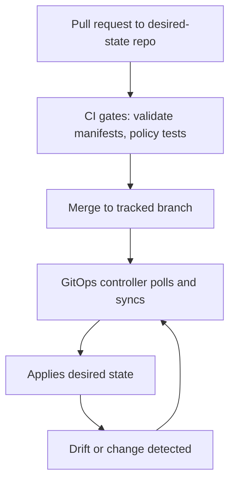

# infra/gitops — GitOps README
Declarative, audited, self-healing delivery of KFM infrastructure + workloads via GitOps controllers (recommended: Argo CD / OpenShift GitOps).

**Status:** DRAFT (repo wiring + cluster bootstrap specifics must be verified in this codebase)  
**Owners:** Infra maintainers (TBD) • Security/Policy maintainers (TBD) • Release managers (TBD)

[](https://argo-cd.readthedocs.io/)
[](https://kustomize.io/)
[](#policy-and-guardrails)

**Quick nav**
- [What lives here](#what-lives-here)
- [Non-negotiable KFM invariants](#non-negotiable-kfm-invariants)
- [GitOps model](#gitops-model)
- [Repository layout](#repository-layout)
- [Environments and promotion](#environments-and-promotion)
- [Bootstrap](#bootstrap)
- [Add or update a workload](#add-or-update-a-workload)
- [Secrets](#secrets)
- [Policy and guardrails](#policy-and-guardrails)
- [CI pre-merge checks](#ci-pre-merge-checks)
- [Rollbacks and incident response](#rollbacks-and-incident-response)
- [Definition of Done](#definition-of-done)
- [Appendix](#appendix)

---

## What lives here

This directory holds the **desired state** for Kubernetes/OpenShift clusters that run Kansas Frontier Matrix (KFM):

- **Cluster bootstrap** (install/configure the GitOps controller and its base permissions)
- **Platform components** (“core” cluster/workload plumbing)
- **KFM workloads** (API/UI/indexers/pipeline runners), by environment

> Goal: No manual “kubectl apply” on long-lived environments. The cluster state is **reconciled from Git**, and changes are made via PR + review + gates.

---

## Non-negotiable KFM invariants

These are *system invariants* KFM expects the infrastructure to enforce (or at least not violate):

1) **Trust membrane**
- Frontend/external clients must not directly access databases/object storage.
- Backend logic must not bypass repository interfaces to talk directly to storage.
- All access flows through governed APIs that apply policy decisions, redactions, and logging.

2) **Promotion discipline**
- Published runtime surfaces should only serve **promoted** versions that passed validation, provenance, and policy gates.

3) **Canonical vs rebuildable**
- Object storage + catalogs + audit/provenance are canonical.
- DB/search/graph/tiles are projections that can be rebuilt.

This README translates those invariants into GitOps-friendly controls: RBAC, network policy, ingress/route rules, strict sync scopes, and “fail-closed” CI gates.

---

## GitOps model

GitOps is an **asynchronous reconciliation** loop: the controller continuously compares live state to the desired state stored in Git and reconciles drift.



### What GitOps is *not*
- “Deploy on webhook” pipelines that push changes directly to clusters.
- Storing plaintext secrets in Git.

---

## Repository layout

This repo uses (or is intended to use) an **Argo CD-friendly layout** that stays DRY and scales across clusters/environments:

```text
infra/gitops/
├── bootstrap/                  # install/configure GitOps controller and bootstrap apps
│   ├── base/
│   └── overlays/
│       └── default/            # or per-cluster overlays (recommended)
├── components/                 # reusable GitOps building blocks
│   ├── applicationsets/        # app-of-apps, cluster generators, tenant appsets
│   └── argocdproj/             # Argo CD AppProjects (RBAC/scopes)
├── core/                       # cluster “core functionality” workloads (platform-owned)
│   ├── gitops-controller/      # the controller manages itself (self-hosting)
│   └── ...                     # ingress/cert-manager/policy/observability/etc.
└── apps/                       # app workloads (developer/release-owned)
    ├── kfm-api/
    │   ├── base/
    │   └── overlays/
    │       ├── dev/
    │       ├── stage/
    │       └── prod/
    └── kfm-ui/
        ├── base/
        └── overlays/
            ├── dev/
            ├── stage/
            └── prod/
```

### Boundary expectations
- `core/` changes are typically owned by **platform/infra** maintainers.
- `apps/` changes are typically owned by **app teams** and release managers.
- `components/` is shared glue (AppProjects, ApplicationSets, reusable policies).

---

## Environments and promotion

### Key mindset shift: promote manifests
When moving “dev → stage → prod”, the promoted unit is the **desired state manifest** (and image digests it references), not “whatever is running.” Promotion is a Git operation.

**Recommended approach**
- Keep a shared `base/` for each workload.
- Maintain `overlays/{env}/` that patch:
  - image digest/tag
  - resource requests/limits
  - external exposure (routes/ingress)
  - feature flags and config maps
  - autoscaling

**Promotion flow**
1. CI builds a container image, publishes it, and records its digest.
2. A PR updates the relevant overlay to reference the new digest.
3. After approval + gates, merge triggers reconciliation.

> If you run multi-cluster, prefer per-cluster overlays under `bootstrap/overlays/<cluster>/` that select environments and namespaces via ApplicationSets.

---

## Bootstrap

> **PROPOSED baseline:** OpenShift GitOps (Argo CD) manages itself and installs the initial “app-of-apps” / ApplicationSets.

### Bootstrap steps (template)
1. Ensure you have cluster admin access:
   - OpenShift: `oc login ...` as appropriate for your environment.
2. Install the GitOps controller (operator or manifests), then apply bootstrap:
   ```bash
   # Example (kustomize):
   oc apply -k infra/gitops/bootstrap/overlays/default
   ```
3. Verify Argo CD / GitOps controller sees the repo and begins creating Applications/ApplicationSets.
4. Confirm that:
   - `components/applicationsets/*` instantiate `core/*` and `apps/*`
   - AppProjects constrain destinations (namespaces/clusters) and sources (repos)

### What must be true before declaring bootstrap “done”
- Controller is running HA as required by environment.
- Controller can only deploy to approved namespaces/clusters (AppProject restrictions).
- Controller audit logs/notifications are enabled (where supported).
- Secrets are not stored in plaintext Git.

---

## Add or update a workload

### Add a new app (Kustomize example)
1. Create:
   - `apps/<app>/base/kustomization.yaml`
   - `apps/<app>/overlays/dev/kustomization.yaml`
   - `apps/<app>/overlays/stage/kustomization.yaml`
   - `apps/<app>/overlays/prod/kustomization.yaml`
2. Pin container images by digest in overlays (recommended).
3. Register the app with the appropriate ApplicationSet generator (often `components/applicationsets/tenants-*.yaml`).

### Update an existing app
1. Change only the relevant overlay (usually `overlays/dev` first).
2. Run pre-merge checks (see [CI pre-merge checks](#ci-pre-merge-checks)).
3. Promote via PR from dev → stage → prod by updating the overlay(s).

---

## Secrets

**Hard rule:** Do not store Kubernetes `Secret` objects in clear text in Git.

Choose one of these patterns:
- **Encrypted secrets in Git** (e.g., Sealed Secrets or SOPS)
- **External secrets store** (e.g., Vault/External Secrets Operator), store only references in Git

**Minimum guardrails**
- PR checks should fail if a file matches common secret patterns (e.g., `kind: Secret` with base64 payloads).
- Keys for decrypting secrets must be environment-scoped and access-controlled.
- “Break-glass” secret changes must be audited and backported into the governed approach.

---

## Policy and guardrails

GitOps makes it easy to apply guardrails consistently. For KFM, guardrails should enforce:

### Trust membrane controls
- No public routes/ingress to internal stores (DB/object storage) except via governed APIs.
- NetworkPolicies that prevent lateral movement between namespaces unless explicitly allowed.
- RBAC that prevents app namespaces from creating cluster-scoped resources.

### Promotion and audit controls
- Require CI validation before merge (schema/lint/policy tests).
- Prefer immutable references (image digests, content-addressed artifacts).
- Require “policy fixtures” tests where policy is expressed (OPA/Kyverno/etc.).

> If permissions/sensitivity are unclear: default-deny and route through governance review.

---

## CI pre-merge checks

**Recommended minimum checks (fail-closed)**
- `kustomize build` for every overlay
- Kubernetes schema conformance (`kubeconform`/`kubeval`)
- Policy checks (OPA Conftest / Kyverno tests / Gatekeeper constraint tests)
- Secret scanning (detect plaintext secrets)
- Drift-sensitive validations (namespaces, cluster scopes, forbidden kinds)

Example (local):
```bash
# Build each overlay to ensure it renders.
kustomize build infra/gitops/apps/kfm-api/overlays/dev >/tmp/kfm-api-dev.yaml
kustomize build infra/gitops/apps/kfm-api/overlays/prod >/tmp/kfm-api-prod.yaml
```

---

## Rollbacks and incident response

### Standard rollback
- Revert the Git commit/merge that introduced the bad desired state.
- Let the controller reconcile back.

### When manual intervention is required
Use “break-glass” only when:
- The cluster is unhealthy and GitOps cannot reconcile, or
- Immediate safety/security response is needed.

**Break-glass rules**
- Record *who/what/when/why* in an incident log.
- Apply the minimum manual change needed to restore safety.
- Follow up with a PR that codifies the change (so drift is eliminated).

---

## Definition of Done

A GitOps change is “done” when:

- [ ] Desired state renders cleanly (`kustomize build`/`helm template`)
- [ ] Schema validation passes
- [ ] Policy checks pass (including trust membrane constraints)
- [ ] No plaintext secrets are introduced
- [ ] Argo CD / GitOps controller syncs successfully
- [ ] Drift is eliminated (controller reports `Synced` and `Healthy`)
- [ ] Rollback path is documented (revert commit is sufficient)
- [ ] Any governance-relevant behavior change has an audit note/ADR

---

## Appendix

### Glossary
- **Desired state:** Kubernetes manifests representing what should run.
- **Reconciliation:** Controller loop that makes live state match desired state.
- **Overlay:** Environment-specific patch set (dev/stage/prod).
- **AppProject:** Argo CD scoping boundary (repos, destinations, RBAC).

### References
- Argo CD docs: https://argo-cd.readthedocs.io/
- OpenShift GitOps overview (official docs may vary by OCP version): https://docs.openshift.com/
- Kustomize docs: https://kustomize.io/

---

<details>
<summary>Appendix: Minimal “app-of-apps” idea (pseudocode)</summary>

```yaml
# This is a conceptual sketch, not a drop-in manifest.
apiVersion: argoproj.io/v1alpha1
kind: Application
metadata:
  name: kfm-apps
spec:
  source:
    repoURL: https://example.com/your/repo.git
    path: infra/gitops/apps
  destination:
    server: https://kubernetes.default.svc
    namespace: argocd
  syncPolicy:
    automated: {}  # consider disabling for prod
```

</details>

---

**Back to top:** [↑](#infragitops--gitops-readme)
