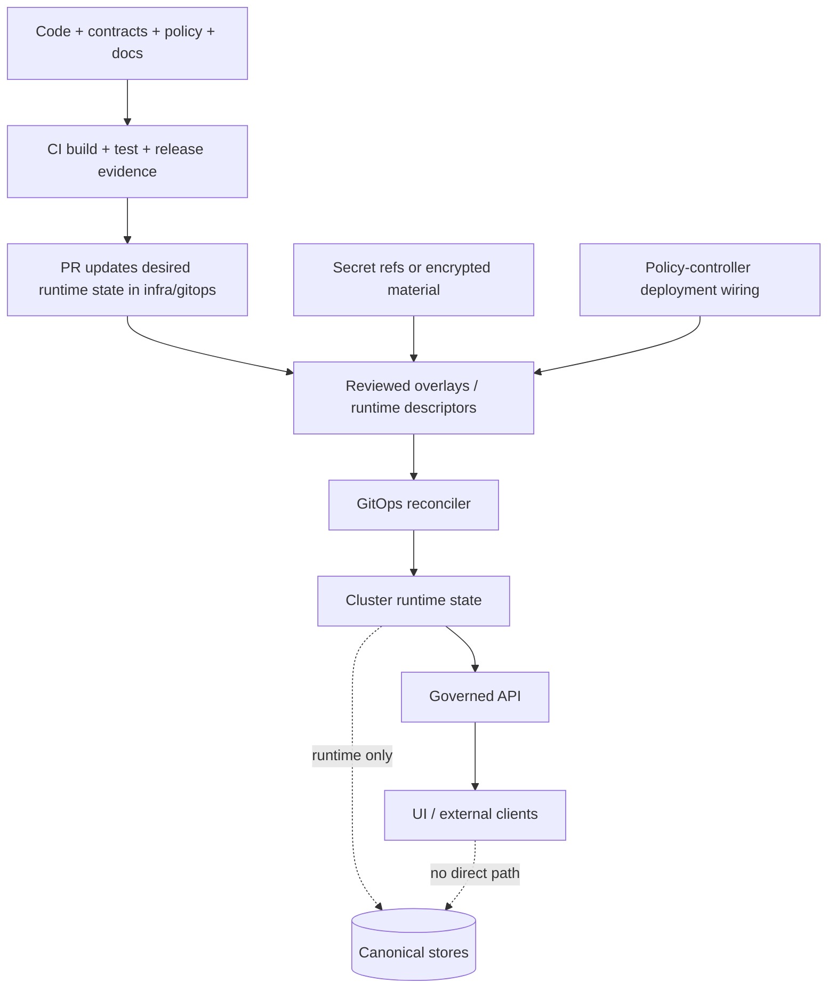

# gitops

Declarative desired-state and reconciliation surface for KFM runtime promotion, drift control, and cluster-safe change review.

> **Status:** experimental  
> **Owners:** NEEDS VERIFICATION  
>        
> **Repo fit:** `infra/gitops/README.md` *(directory guide for controller-driven desired state if GitOps is adopted; no reconciler choice is assumed here)*  
> **Quick jump:** [Scope](#scope) · [Repo fit](#repo-fit) · [Accepted inputs](#accepted-inputs) · [Exclusions](#exclusions) · [Directory tree](#directory-tree) · [Quickstart](#quickstart) · [Usage](#usage) · [Diagram](#diagram) · [Operating tables](#operating-tables) · [Task list and definition of done](#task-list-and-definition-of-done) · [FAQ](#faq) · [Appendix](#appendix)

> [!IMPORTANT]
> Current live repo signal: on `main`, `infra/gitops/` exists but currently contains only `README.md`. Treat any subtree, controller objects, or manifest families described below as **PROPOSED** until they exist in the live checkout.

> [!NOTE]
> KFM’s smallest credible runtime remains the phase-one, systemd-first lane described in the parent infrastructure docs. GitOps becomes useful here when desired runtime state is ready to be kept **declarative, reviewed, pull-based, and continuously reconciled**.

> [!WARNING]
> GitOps must harden the trust membrane, not bypass it. Public clients, public routes, and UI surfaces still go through the **governed API + policy boundary**. Nothing committed here should create a quiet back door to databases, object stores, or model runtimes.

| At a glance | Working rule |
|---|---|
| Current live state | `infra/gitops/` is present, but only `README.md` is confirmed today |
| Primary job | Keep desired runtime state reviewed, declarative, and reconcilable |
| Delivery split | CI proves artifact quality; GitOps carries approved runtime intent |
| Promotion rule | Promote reviewed state descriptors, not environment branches |
| Trust rule | No UI or public-client bypass of the governed API |
| Secret rule | Reference or encrypt; never commit plaintext secrets |

## Scope

`infra/gitops/` is the directory for controller-managed desired state **if and when** KFM adopts GitOps as part of runtime delivery.

That makes this directory narrower than generic “Kubernetes YAML” and broader than a one-time deployment script. Its job is to explain how reviewed runtime intent becomes pull-based, continuously reconciled state without confusing:

- deployment with publication
- runtime placement with trust-state promotion
- cluster configuration with canonical truth
- controller convenience with policy authority

### Current live signal

| Signal | Meaning |
|---|---|
| `infra/gitops/` exists on `main` | the GitOps lane is reserved in the repo |
| current contents are `README.md` only | no live GitOps manifest tree is confirmed yet |
| parent `infra/` already carries sibling lanes such as `kubernetes/`, `terraform/`, `systemd/`, `systemd-or-compose/`, `local/`, `hosted/`, `compose/`, `monitoring/`, `dashboards/`, and `backup/` | GitOps should complement those lanes, not flatten or duplicate them |

### Evidence labels used in this README

| Label | Meaning here |
|---|---|
| **CONFIRMED** | supported by live repo inspection or by the March 2026 KFM doctrine/manual layer |
| **INFERRED** | strongly suggested by adjacent repo structure and project doctrine, but not proven by a live manifest tree here |
| **PROPOSED** | a working directory shape or practice that fits KFM’s doctrine but is not current repo fact |
| **NEEDS VERIFICATION** | exact owners, controller choice, secret mechanism, and platform settings still need a live checkout or settings audit |

## Repo fit

Path: `infra/gitops/README.md`  
Role: explain the GitOps lane without pretending the lane is already implemented.

| Direction | Path | Why it matters |
|---|---|---|
| Upstream | [`../README.md`](../README.md) | parent `infra/` doctrine, subtree expectations, and operational boundaries |
| Upstream | [`../../README.md`](../../README.md) | root repo identity, top-level posture, and trust language |
| Upstream | [`../../.github/README.md`](../../.github/README.md) | review, CI/CD, and merge-gate posture |
| Upstream | [`../../docs/`](../../docs/) | architecture, ADRs, runbooks, and longer-form design references |
| Adjacent | [`../kubernetes/`](../kubernetes/), [`../terraform/`](../terraform/), [`../systemd/`](../systemd/), [`../systemd-or-compose/`](../systemd-or-compose/) | neighboring runtime and delivery lanes GitOps must coordinate with |
| Adjacent | [`../local/`](../local/), [`../hosted/`](../hosted/), [`../compose/`](../compose/), [`../monitoring/`](../monitoring/), [`../dashboards/`](../dashboards/), [`../backup/`](../backup/) | current parent-tree lanes that already absorb environment, observability, and recovery concerns |
| Boundary surfaces | [`../../contracts/`](../../contracts/), [`../../policy/`](../../policy/), [`../../tests/`](../../tests/), [`../../apps/`](../../apps/) | GitOps must preserve these boundaries instead of absorbing them |
| Downstream | none confirmed yet inside `infra/gitops/` | any substructure here is still **PROPOSED** |

### Repo-fit rule

Use `infra/gitops/` for **reviewed desired runtime state**. Do not let it become the accidental home of:

- service logic
- canonical policy law
- schema authority
- dataset truth
- incident-only manual repair

## Accepted inputs

Content that belongs here should be declarative, reviewable, and runtime-facing.

| Category | Typical contents | Why it belongs here |
|---|---|---|
| Bootstrap and reconciler bring-up | minimal cluster seed manifests, controller namespace/setup, self-management seed | GitOps starts by bringing a target under controller management |
| Cluster or environment descriptors | overlays, cluster-specific values, sync windows, rollout guardrails | environment truth is easier to compare in directories/overlays than in long-lived branches |
| Shared control-plane state | project boundaries, RBAC, repo access references, shared controller config | shared “GitOps plumbing” belongs near the reconciler surface |
| App desired state | app bases/overlays, artifact refs or digests, service exposure intent | runtime intent belongs here **after** CI has produced a promotable artifact |
| Deployment-facing policy-controller wiring | controller deployment/config, policy attachment to namespaces or apps | this is runtime enforcement wiring, not policy source-of-truth law |
| Secret references or encrypted material | external-secret references, sealed/encrypted artifacts, repo credential references | GitOps needs a secret strategy without resorting to plaintext |
| Promotion-safe runtime descriptors | approved state changes that move runtime between environments | KFM separates runtime placement from publication, so descriptors here must stay explicit about what they do and do not promote |

## Exclusions

The following do **not** belong here as their authoritative home.

| Keep out of `infra/gitops/` | Put it here instead |
|---|---|
| application/service code, UI code, worker business logic | [`../../apps/`](../../apps/) and reusable package surfaces |
| canonical API contracts, schemas, vocabularies, fixtures | [`../../contracts/`](../../contracts/) |
| policy source bundles, rule law, and policy-test truth | [`../../policy/`](../../policy/) |
| canonical datasets, catalog objects, EvidenceBundles, or release content themselves | the repo’s data/catalog/evidence/release surfaces |
| CI workflow logic, build steps, and release automation scripts | [`../../.github/README.md`](../../.github/README.md), `../../scripts/`, `../../configs/` |
| plaintext secrets, private keys, or ambient credentials | external secret systems or encrypted artifacts only |
| break-glass data repair and incident-only manual operations | runbooks, backup/recovery lanes, or explicit operator procedures outside the steady-state reconciliation loop |
| branch-only environment truth | directories, overlays, or explicit release/state descriptors |

## Directory tree

### Confirmed parent context on `main`

```text
infra/
├── backup/
├── compose/
├── dashboards/
├── gitops/
├── hosted/
├── kubernetes/
├── local/
├── monitoring/
├── systemd/
├── systemd-or-compose/
├── terraform/
└── README.md
```

### Confirmed current contents of `infra/gitops/`

```text
infra/gitops/
└── README.md
```

### Working expansion shape (PROPOSED)

```text
infra/gitops/
├── bootstrap/              # minimal bring-up that hands a target to reconciliation
├── controllers/            # shared controller-side state
│   ├── projects/
│   ├── rbac/
│   └── repo-credentials/
├── clusters/               # env or cluster descriptors
│   ├── dev/
│   ├── stage/
│   └── prod/
├── apps/
│   └── <service>/
│       ├── base/
│       └── overlays/
│           ├── dev/
│           ├── stage/
│           └── prod/
├── policies/               # deployment-facing policy-controller manifests
├── secrets/                # encrypted material or external-secret refs only
└── releases/               # approved desired-state descriptors, if adopted
```

### How to read the proposed tree

| Proposed lane | Purpose | Boundary reminder |
|---|---|---|
| `bootstrap/` | get a target cluster or environment under reviewed reconciliation | keep it minimal; bootstrap blast radius should stay understandable |
| `controllers/` | shared controller-side state such as projects, RBAC, and repo wiring | controller choice is still **NEEDS VERIFICATION** |
| `clusters/` | per-env or per-cluster differences | prefer overlays/directories, not environment branches |
| `apps/` | app runtime intent by service | do not mix in build logic or app source code |
| `policies/` | runtime-facing policy-controller deployment/config | policy law still lives elsewhere |
| `secrets/` | encrypted or reference-only secret material | never plaintext |
| `releases/` | reviewed desired-state promotion descriptors | do not confuse these with proof packs or publication law |

> [!TIP]
> Keep this directory controller-neutral until the project records a real decision. `Argo CD`, `Flux`, or another reconciler may fit, but the repo should not accumulate controller-shaped sprawl before that choice is explicitly reviewed.

[Back to top](#gitops)

## Quickstart

Start with inspection, not manifest sprawl.

```bash
# 1) Confirm you are in the real repo checkout
git rev-parse --show-toplevel

# 2) Inspect the current parent infra tree
test -d infra && find infra -maxdepth 2 -print | sort

# 3) Inspect the live GitOps lane before making claims about it
test -d infra/gitops && find infra/gitops -maxdepth 3 -print | sort

# 4) Read the parent infrastructure guide first
sed -n '1,220p' infra/README.md

# 5) Check whether controller-specific manifests already exist
git grep -nE 'ApplicationSet|AppProject|HelmRelease|Kustomization|Flux|Argo' infra || true

# 6) Check secret posture before adding desired-state files
git grep -nE 'Secret|SealedSecret|ExternalSecret|ClusterSecretStore|Vault|SOPS' infra policy configs || true

# 7) Sanity-check branch usage before introducing environment truth
git branch -a
```

### Minimum pre-edit questions

1. Is this change really **desired runtime state**, or is it CI, app code, policy law, or a runbook?
2. Is the controller choice already settled, or would this file silently force one?
3. Does the change alter runtime placement only, or does it also trigger publication/promotion consequences elsewhere?
4. If this manifest drifted or failed to reconcile, how would rollback remain legible?

## Usage

### Use this directory when

- the repo is ready to keep runtime intent **declarative and continuously reconciled**
- environment differences are better expressed as overlays/directories than as imperative commands
- app deployment should follow reviewed desired state after CI has produced an artifact
- drift detection and reconciliation are now part of the operating model
- controller-managed runtime state needs a documented home that does not pretend to own contracts, policy law, or service logic

### Typical change flow

1. CI builds, tests, signs, and assembles release evidence **outside** `infra/gitops/`.
2. A PR updates desired-state files here: bootstrap, shared controller state, app overlays, or promotion-safe runtime descriptors.
3. Review covers blast radius, secret handling, policy-controller consequences, health/readiness, and rollback.
4. After merge, the reconciler pulls the approved state and converges runtime.
5. Verification checks drift, health, governed API reachability, and any downstream release/correction consequences.
6. If public meaning changes, follow the release/promotion/correction path; do not pretend a runtime apply is the whole story.

> [!NOTE]
> This README intentionally separates **build artifacts** from **runtime intent**. KFM’s delivery doctrine treats build, deploy, promote, rollback, and correction as distinct acts. GitOps belongs to the “reviewed desired runtime state” portion of that chain.

### Working rules

- Prefer overlays, directories, or explicit descriptors over environment branches.
- Keep blast radius visible: separate bootstrap, shared controller state, and app state.
- Treat repo truth as the normal state path; treat manual cluster edits as exceptions that need an explanation.
- Keep break-glass operations explicit, reviewed, and rare.

[Back to top](#gitops)

## Diagram


```mermaid
flowchart TB
    A[Code + contracts + policy + docs] --> B[CI build + test + release evidence]
    B --> C[PR updates desired runtime state in infra/gitops]
    C --> D[Reviewed overlays / runtime descriptors]
    D --> E[GitOps reconciler]
    E --> F[Cluster runtime state]
    F --> G[Governed API]
    G --> H[UI / external clients]

    P[Secret refs or encrypted material] --> D
    Q[Policy-controller deployment wiring] --> D

    F -. runtime only .-> X[(Canonical stores)]
    H -. no direct path .-> X
```

## Operating tables

### Control-surface split

| Concern | Owned here? | Working rule |
|---|---|---|
| Build, test, sign, and assemble release evidence | No | keep under CI/CD and release surfaces, not reconciler manifests |
| Desired runtime state | Yes | this is the core job of `infra/gitops/` |
| Publication and truth-state promotion | Not as sole authority | GitOps may carry reviewed runtime descriptors, but publication still needs proof, policy, and review |
| Policy law and fixtures | No | deploy policy controllers here if needed, but keep policy source-of-truth elsewhere |
| Drift reconciliation | Yes | pull-based reconciliation is the distinguishing control-loop behavior |
| Rollback and correction lineage | Shared | manifests may help placement rollback, but lineage and correction still need runbooks/evidence |
| Incident-only break-glass steps | No | keep them explicit and outside the steady-state loop |

### Secret posture

| Pattern | Status in this README | Working rule |
|---|---|---|
| Plaintext secret manifests | Forbidden | do not commit them here |
| Encrypted / sealed secret material | Allowed with discipline | only with documented rotation/recovery posture |
| External-secret references | Strong default when supported | keep references in Git and values elsewhere |
| Repo credential references without secret values | Allowed | references are fine; secret bytes are not |
| Manual secret creation with no repo trail | Avoid as steady state | that hides configuration truth and invites drift |

### Review payload minimums

| Change class | Minimum review payload |
|---|---|
| Bootstrap / controller change | manifest diff, blast-radius note, rollback path, named owner |
| App desired-state change | artifact ref or digest, overlay diff, health/readiness note, rollback consequence |
| Secret mechanism change | rotation or recovery note, no-plaintext guarantee, reviewer note |
| Stage or prod promotion change | reviewed desired-state diff, related release/proof reference, post-merge verification plan |
| Policy-controller deployment change | scope note, namespace/app impact, failure mode, rollback consequence |
| Escape-hatch documentation change | rarity rationale, audit expectation, re-entry path back to steady-state GitOps |

[Back to top](#gitops)

## Task list and definition of done

An `infra/gitops/` change is not done until:

- [ ] the live `infra/gitops/` tree was inspected before new structure or claims were added
- [ ] the change clearly belongs to **desired runtime state** and not to app code, contracts, policy law, or CI scripting
- [ ] controller choice is explicit, or the content remains controller-neutral and clearly labeled
- [ ] environment truth lives in directories, overlays, or release descriptors rather than in long-lived environment branches
- [ ] no direct UI/public-client bypass of the governed API was introduced
- [ ] secret handling is reference-based or encrypted; no plaintext secret material was committed
- [ ] bootstrap state, shared controller state, and app state are separated enough to keep blast radius understandable
- [ ] rollout, reconcile, and rollback consequences were documented
- [ ] any break-glass or incident-only behavior remains outside the steady-state reconciliation loop
- [ ] if the change affects public meaning, linked release/correction surfaces were updated elsewhere
- [ ] anything still target-state rather than live repo fact remains visibly labeled **PROPOSED** or **NEEDS VERIFICATION**

## FAQ

### Is GitOps the first runtime KFM must prove?

No. The current infrastructure doctrine still supports a smaller, systemd-first governed slice. GitOps is valuable when continuous reconciliation, drift control, and multienvironment desired state are worth the operational cost.

### Does GitOps replace CI/CD?

No. CI proves something about the artifact and its evidence; GitOps proves and enforces something about the desired runtime state that should exist after review.

### Does everything in `infra/` belong under `infra/gitops/`?

No. The parent `infra/` tree already has sibling lanes for Kubernetes, Terraform, systemd, local/hosted wiring, monitoring, dashboards, backup, and compose-style bring-up. `gitops/` should coordinate with them, not absorb them blindly.

### Where do secrets go?

Not as plaintext. Keep actual secret values outside the repo or in encrypted/cluster-decryptable form only when the project has a reviewed secret strategy.

### Can GitOps “promote data” by itself?

Not in the KFM sense. GitOps can carry reviewed runtime or release descriptors, but publication and trust-state promotion still require policy gates, proof objects, and steward review.

### What if this lane remains mostly empty for now?

That is better than cargo-cult YAML. A clear README and a reserved directory are healthier than a pile of copied manifests with no reconciler owner, no rollback story, and no agreed scope boundary.

[Back to top](#gitops)

## Appendix

<details>
<summary>Terminology and adoption triggers</summary>

### Terminology

| Term | Meaning in this repo |
|---|---|
| desired state | reviewed declaration of what runtime should converge toward |
| reconciler | the pull-based software agent that applies and re-applies desired state |
| drift | difference between declared state and running state |
| overlay | an environment- or cluster-specific variation layer |
| bootstrap | the minimum state needed to hand a target to reconciliation |
| escape hatch | a reviewed, exceptional path outside steady-state reconciliation |

### Adopt this directory for real when

- the project is ready to keep runtime intent declarative and continuously reconciled
- a secrets approach is approved
- rollback ownership is named
- cluster or environment overlays are now part of the real operating model
- manifest review is preferable to ad hoc operator edits

### Do not force GitOps when

- the first governed slice is still being proven locally
- the repo has no agreed controller choice or owner
- release evidence and rollback remain mostly manual
- the result would just be copied YAML with no blast-radius discipline

### Illustrative starter files (PROPOSED only)

```text
infra/gitops/
├── bootstrap/
│   └── kustomization.yaml
├── controllers/
│   ├── projects/
│   └── rbac/
├── clusters/
│   └── dev/
│       └── kustomization.yaml
└── apps/
    └── <service>/
        ├── base/
        └── overlays/
```

Controller-specific object kinds and filenames above are illustrative only. Capture the real controller decision in an ADR before tightening this sketch into implementation guidance.

</details>
