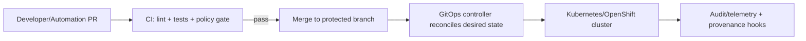

<!--
File: infra/gitops/applications/README.md
Purpose: Governed GitOps layout + contribution guide for KFM application workloads
-->

# 🚀 GitOps Applications (KFM)


> [!IMPORTANT]
> **Governed infrastructure.** This directory defines *cluster-applied desired state* for KFM workloads.
> Treat changes here like production changes: PR-first, policy-gated, auditable.

---

## What lives here

This folder holds **application workloads** deployed by our GitOps controller (default: Argo CD / OpenShift GitOps) to one or more clusters.

Examples of “applications” in this sense:

- KFM API gateway + policy boundary services
- KFM UI deployments (web)
- Data pipeline runtimes (ingest/normalize/index jobs) *as Kubernetes resources*
- Supporting services that are deployed **as workloads** (not cluster bootstrap components)

> [!NOTE]
> Cluster bootstrap and shared platform components (RBAC, GitOps controller config, global policies, etc.)
> typically live **outside** this folder (commonly under something like `infra/gitops/bootstrap/` or
> `infra/gitops/components/`). This directory is intentionally scoped to **workload apps**.

---

## Non-negotiable invariants

| Invariant | What it means *in this folder* | How we enforce it |
|---|---|---|
| **PR-first publishing** | No direct pushes to protected branches for deployable manifests | Branch protection + CODEOWNERS |
| **Fail-closed gates** | If policy/tests fail, the change must not merge | CI policy gate (Conftest/OPA) |
| **No secret leakage** | No plaintext credentials, tokens, private keys, or sensitive endpoints committed | CI scanning + secret patterns below |
| **Trust membrane is preserved** | Deployments must not bypass governed API/policy boundary | Design review + policy checks |
| **Deterministic + reviewable** | Same inputs produce the same manifests; changes are diffable | Kustomize discipline + PR review |

---

## Directory conventions

### ✅ One app per directory

Each application gets its own folder under `applications/`.

Recommended naming:

- `kfm-api`
- `kfm-ui`
- `kfm-policy`
- `kfm-pipelines`
- `kfm-search`
- `kfm-graph`

Use lowercase, hyphenated names.

### ✅ Kustomize base + overlays

Use Kustomize to keep a single shared base with environment-specific overlays.

```text
infra/
└─ gitops/
   └─ applications/
      ├─ <app-name>/
      │  ├─ base/
      │  │  ├─ kustomization.yaml
      │  │  └─ (manifests...)
      │  └─ overlays/
      │     ├─ dev/
      │     │  └─ kustomization.yaml
      │     ├─ stage/
      │     │  └─ kustomization.yaml
      │     └─ prod/
      │        └─ kustomization.yaml
      └─ README.md  👈 you are here
```

> [!TIP]
> Keep the `base/` environment-agnostic. Put **namespace**, **replica counts**, **resource limits**,
> **ingress/route**, and **external integrations** into overlays.

### ✅ Minimal required files

Each app should include:

- `base/kustomization.yaml`
- `overlays/<env>/kustomization.yaml` for every environment we deploy
- Kubernetes resources appropriate to the app:
  - `Deployment` / `StatefulSet`
  - `Service`
  - `ConfigMap` (non-secret config)
  - `NetworkPolicy` (strongly recommended)
  - `ServiceAccount` + least-privilege RBAC (if needed)

---

## How these apps get deployed

This directory is designed to be **discovered and deployed automatically** by the GitOps controller.

A common approach (recommended) is:

- An **ApplicationSet** watches `infra/gitops/applications/**/overlays/<env>` paths
- It generates an Argo CD `Application` per app (+ per env and/or per cluster)
- The controller continuously reconciles the cluster to match Git

### Deployment flow



> [!NOTE]
> Argo CD supports ordered rollouts via sync phases/waves. If your app has dependencies
> (e.g., CRDs before CR instances), use sync waves or split into separate apps.

---

## Adding a new application

### 1) Create the skeleton

Create:

- `infra/gitops/applications/<app-name>/base/`
- `infra/gitops/applications/<app-name>/overlays/dev/`
- `infra/gitops/applications/<app-name>/overlays/stage/`
- `infra/gitops/applications/<app-name>/overlays/prod/`

### 2) Add `base/kustomization.yaml`

Example:

```yaml
apiVersion: kustomize.config.k8s.io/v1beta1
kind: Kustomization

resources:
  - deployment.yaml
  - service.yaml
  - networkpolicy.yaml

commonLabels:
  app.kubernetes.io/name: <app-name>
  app.kubernetes.io/part-of: kfm
```

### 3) Add environment overlays

Example overlay:

```yaml
apiVersion: kustomize.config.k8s.io/v1beta1
kind: Kustomization

namespace: kfm-dev

resources:
  - ../../base

patches:
  - path: patch-replicas.yaml
  - path: patch-env.yaml
```

### 4) Open a PR

PR requirements:

- Must pass policy gates (OPA/Rego via Conftest)
- Must not include plaintext secrets
- Must include reviewer(s) from infra owners (via CODEOWNERS)

---

## Secrets policy (do this, not that)

> [!WARNING]
> **Never commit plaintext Secrets** (tokens, passwords, API keys, cert private keys). Treat this as a
> “stop-the-line” violation.

Allowed patterns (pick one per environment/team standard):

1) **Store encrypted secrets** in Git (e.g., Sealed Secrets)
2) **Store secret references** in Git while a secrets platform manages the real secret (e.g., External Secrets + Vault/Cloud KMS)

Recommended conventions:

- Put secret *references* in overlays (env-specific), not in base.
- Prefer short-lived credentials + rotation.
- Prefer namespacing secrets per environment (`kfm-dev`, `kfm-stage`, `kfm-prod`).

---

## Governance and trust membrane reminders

Even though this is “infra”, these deployments must respect KFM’s governance model:

- **Frontend and external clients must never access databases directly**
- All access must go through the **governed API gateway + policy boundary**
- Workloads should emit enough metadata for audit/provenance and operational forensics

> [!IMPORTANT]
> If you add a workload that changes how data crosses the trust membrane, treat it as a
> governed architecture change (policy updates, audit hooks, and review required).

---

## Promotion and rollout rules

Suggested defaults (adjust if your environment differs):

- **Dev → Stage → Prod** promotion happens via PRs (not ad-hoc manual edits)
- Prod changes require explicit approval (GitHub environment rules / CODEOWNERS)
- Rollback strategy:
  - Revert PR (preferred)
  - Or pin to previous image tag / manifest revision

---

## Definition of Done for changes in this folder

- [ ] App follows `base/ + overlays/<env>/` pattern
- [ ] No plaintext secrets committed
- [ ] Policy gate(s) pass (Conftest/OPA)
- [ ] Resource requests/limits set (or explicitly justified)
- [ ] NetworkPolicy present (or explicitly justified)
- [ ] Clear ownership (CODEOWNERS or documented reviewers)
- [ ] Change is reversible (revert PR restores previous state)

---

## FAQ

<details>
  <summary><strong>Why is my app not appearing in Argo CD?</strong></summary>

Common causes:

- The ApplicationSet generator path doesn’t match your new directory layout.
- Missing `kustomization.yaml` in an overlay.
- Invalid YAML or Kustomize build errors.

Start by running a local build:

```bash
kustomize build infra/gitops/applications/<app-name>/overlays/dev
```

</details>

<details>
  <summary><strong>Where do cluster-wide policies and GitOps controller configs go?</strong></summary>

Typically in a sibling area (often named `bootstrap/`, `components/`, or `core/`),
separate from workload applications.

This folder stays focused on **application workloads** to keep boundaries clean.
</details>

---

## Suggested next improvements (optional, but high leverage)

- Add `CODEOWNERS` rules for `infra/gitops/**`
- Add a CI job that runs `kustomize build` for every overlay
- Add Conftest rules to enforce:
  - required labels
  - required NetworkPolicies
  - image tag rules (no `:latest` in stage/prod)
  - supply-chain attestation requirements (if adopted)

---
