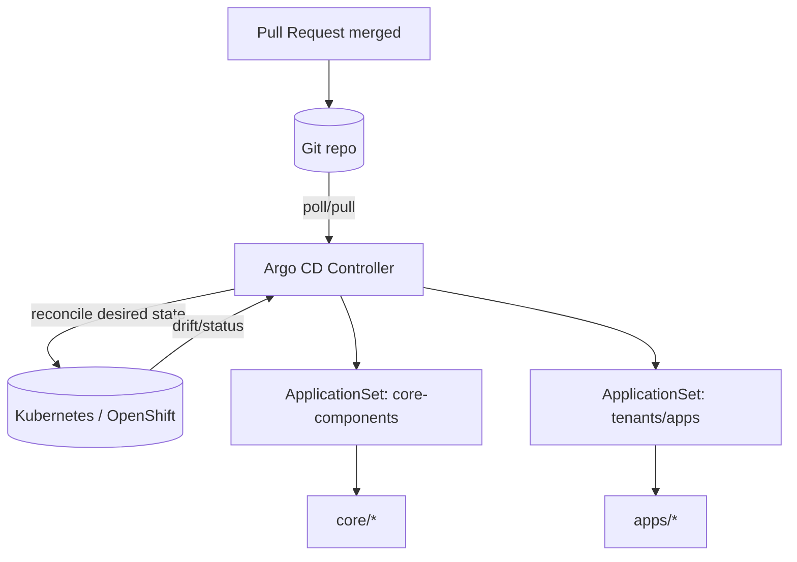

# 🧩 Argo CD GitOps — Kansas Frontier Matrix (KFM)


This directory is the **GitOps state store** for KFM’s Kubernetes/OpenShift deployments, reconciled by **Argo CD**.

> [!IMPORTANT]
> Anything merged here can change **live cluster state**.
> Treat changes as **governed** (PR review + policy gates + provenance + licensing + CARE/sensitivity checks).

---

## What lives here

**Argo CD GitOps** means:
- Desired state is declared in Git (Kubernetes manifests / Kustomize / Helm).
- Argo CD **pulls** from Git and **reconciles continuously** (drift detection + auto-heal).
- Promotions happen by **merging PRs**, not by clicking around in clusters.

**KFM intent:** infra changes are reproducible, auditable, and safe to roll forward/back.

---

## Trust membrane & governance (KFM non‑negotiables)

> [!NOTE]
> KFM’s “trust membrane” rule applies to *everything* deployed from here:
> **Frontend/external clients never access databases/object stores directly; all access goes through the governed API boundary.**

### Governance expectations for this folder
- ✅ PR-only changes (no “hotfix in cluster” as a normal practice)
- ✅ Merge-blocking policy gates (OPA/Conftest or equivalent)
- ✅ No plaintext secrets in Git
- ✅ Supply-chain verification where applicable (SBOM / attestations) *(if enabled in KFM CI lanes)*
- ✅ Licensing signals (SPDX where relevant) for deployable artifacts & catalogs *(if applicable)*

---

## Directory layout

This repo structure follows a common Argo CD GitOps pattern: `bootstrap/`, `components/`, `core/`, `apps/`.

```text
infra/
└── gitops/
    └── argocd/
        ├── README.md
        ├── bootstrap/
        │   ├── base/
        │   └── overlays/
        │       └── default/
        ├── components/
        │   ├── applicationsets/
        │   └── argocdproj/
        ├── core/
        │   ├── gitops-controller/
        │   └── <cluster-core-workloads>/
        └── apps/
            └── <app-name>/
                ├── base/
                └── overlays/
                    ├── dev/
                    ├── stage/
                    └── prod/
```

### Ownership boundaries (recommended)

| Area | Typical Owner | Purpose | Examples |
|---|---|---|---|
| `bootstrap/` | Platform/SRE | Day‑0 entrypoint (“app-of-apps”) | Argo CD bootstrap Application / initial wiring |
| `components/` | Platform/SRE + Security | Shared Argo CD config and multi-tenant controls | AppProjects, ApplicationSets, repo credentials (as refs), RBAC |
| `core/` | Platform/SRE | Cluster baseline capabilities | Ingress, cert-manager, operators, namespaces, policy controllers |
| `apps/` | App teams + Release engineers | KFM application workloads | API, UI, workers, schedulers (examples) |

> [!TIP]
> Avoid per-environment **branches**. Prefer **Kustomize overlays** (`base/` + `overlays/dev|stage|prod`) so environments differ by patches, not by Git history divergence.

---

## How it works (app-of-apps pattern)

Argo CD is typically “bootstrapped” once, then it manages everything else—including itself.



---

## Bootstrap (Day‑0) runbook

> [!WARNING]
> Commands below are **examples**. Namespaces, RBAC, and cluster-specific settings must match your target environment.

### 1) Install Argo CD / OpenShift GitOps (out of scope for this repo)
Use your org’s standard installation method (Operator, Helm, manifests).

### 2) Apply the bootstrap overlay
Example (Kustomize):

```bash
kubectl apply -k infra/gitops/argocd/bootstrap/overlays/default
# or (OpenShift)
oc apply -k infra/gitops/argocd/bootstrap/overlays/default
```

### 3) Validate that Argo CD begins managing:
- itself (GitOps controller),
- shared components (AppProjects / ApplicationSets),
- core workloads,
- apps.

---

## Adding or changing deployments

### Add a new **core** workload (platform-owned)

1. Create a new folder under:
   - `infra/gitops/argocd/core/<workload-name>/`
2. Provide a `kustomization.yaml` and manifests (or Helm/Kustomize wrapper).
3. Ensure your **core ApplicationSet** includes it (many setups auto-discover directories).
4. Open PR → pass gates → merge.

> [!NOTE]
> In the common pattern, `core/` is loaded by an ApplicationSet (e.g., `components/applicationsets/core-components-appset.yaml`).

### Add a new **app** (developer/release-owned)

1. Create:
   - `infra/gitops/argocd/apps/<app-name>/base/`
   - `infra/gitops/argocd/apps/<app-name>/overlays/dev/`
   - `infra/gitops/argocd/apps/<app-name>/overlays/stage/`
   - `infra/gitops/argocd/apps/<app-name>/overlays/prod/`
2. Put shared resources in `base/` (Deployment/Service/ConfigMaps, etc.).
3. Put env-specific differences in overlays (replicas, image tags, ingress hostnames, resource limits).
4. Open PR → pass gates → merge.

> [!NOTE]
> In the common pattern, `apps/` is loaded by an ApplicationSet (e.g., `components/applicationsets/tenants-appset.yaml`) so “commit a folder” becomes “create an Argo CD Application”.

---

## Kustomize conventions

### Base vs overlays
- `base/`: everything shared across environments
- `overlays/<env>/`: patches/deltas for that environment

Example `overlays/dev/kustomization.yaml` pattern:

```yaml
apiVersion: kustomize.config.k8s.io/v1beta1
kind: Kustomization

resources:
  - ../../base

patches:
  - path: patch-image.yaml
  - path: patch-replicas.yaml
```

> [!TIP]
> Keep overlays small and explicit: “don’t repeat YAML”—patch it.

---

## Ordering & dependencies (sync waves)

Some resources must be applied before others (e.g., CRDs before CRs, namespaces before namespaced objects).
Argo CD supports ordering via **sync phases / waves**.

Example annotation:

```yaml
metadata:
  annotations:
    argocd.argoproj.io/sync-wave: "10"
```

Suggested wave conventions (example):
- `-10`: namespaces, CRDs
- `0`: controllers/operators
- `10`: core services
- `20`: app workloads
- `30`: post-deploy jobs/hooks

---

## Secrets policy

> [!IMPORTANT]
> **Never** commit plaintext `Secret` values to Git in this repo.

Recommended approaches (choose one, document it, enforce it):
1. **External Secret references** (preferred): commit only references; store values in a secret manager.
2. **Encrypted secrets** (e.g., sealed-secrets / SOPS): encrypted material in Git; decryption handled in-cluster.

At minimum:
- Gate PRs for secret leaks (regex scanners).
- Keep secret scopes namespaced (avoid cross-namespace reads).

---

## Policy-as-code & CI gates

This folder should be protected by merge-blocking gates such as:
- YAML/Kustomize build validity
- Kubernetes schema validation (kubeconform/kubeval)
- OPA/Conftest rules for:
  - required labels/annotations
  - no-plaintext-secret policy
  - approved registries/images
  - KFM governance-required metadata where applicable

<details>
<summary><strong>Example: local validation commands</strong></summary>

```bash
# Render one overlay
kustomize build infra/gitops/argocd/apps/<app>/overlays/dev > /tmp/rendered.yaml

# Validate against policies (if policy bundle exists in repo)
conftest test /tmp/rendered.yaml -p policy/rego

# Optional: schema validation (if installed)
kubeconform -strict /tmp/rendered.yaml
```

</details>

---

## Definition of Done (DoD) ✅

Before merging any change in `infra/gitops/argocd/`:

- [ ] PR includes a clear intent: what changes, where, and why
- [ ] `kustomize build` succeeds for changed overlays
- [ ] Policy-as-code gates pass (Conftest/OPA or equivalent)
- [ ] No plaintext secrets added (scanners clean)
- [ ] Dependency ordering reviewed (sync waves/phases) if new CRDs/controllers introduced
- [ ] Rollback plan is documented (what commit to revert; any data migrations?)
- [ ] Governance review complete if change affects:
  - data promotion/catalog flows
  - licensing/attribution
  - CARE/sensitivity constraints
  - public narrative outputs

---

## Troubleshooting quick hits

- **OutOfSync**:
  - Check rendered manifests vs live.
  - Verify the overlay path and kustomization references.
- **Health Degraded**:
  - Check the failing resource (events/logs).
  - Confirm ordering (CRDs, namespaces, RBAC first).
- **Drift keeps coming back**:
  - Look for manual changes in cluster.
  - Ensure the intended state is fully declared in Git.

---

## References (external)

- Argo CD docs: https://argo-cd.readthedocs.io/
- Kustomize: https://kustomize.io/
- OpenGitOps principles: https://opengitops.dev/
