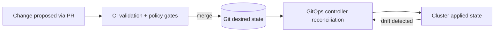

# GitOps Projects


This directory defines **project boundaries** for Kansas Frontier Matrix (KFM) GitOps: **who can deploy what, where, and under which governance rules**.

In practice, a “project” is the smallest unit that:
- has a clear **owner** (review + approval responsibility),
- has a defined **blast radius** (namespaces, clusters, resources),
- can be governed with **deny-by-default** policy,
- can be **rolled back** by reverting Git.

> [!IMPORTANT]
> If a change cannot be expressed declaratively, reviewed, policy-checked, and reconciled from Git, it does **not** belong in this directory.

---

## What lives here

A project directory typically contains:

- **Argo CD AppProject** manifests (or equivalent boundary objects) that define:
  - allowed source repos
  - allowed destination clusters and namespaces
  - allowed resource kinds
  - project-level RBAC roles

- **Namespace or OpenShift Project** definitions and per-project guardrails:
  - RBAC bindings
  - NetworkPolicy
  - ResourceQuota / LimitRange
  - Pod security settings and baseline constraints

- Optional **Application** or **ApplicationSet** “entrypoints” for the project’s workloads.

> [!NOTE]
> The exact objects depend on your GitOps controller (Argo CD vs Flux) and platform (OpenShift vs upstream Kubernetes). This README is written to be Argo CD / OpenShift GitOps friendly, but the governance intent is controller-agnostic.

---

## Operating model

GitOps is asynchronous: the cluster converges to the desired state stored in Git.



---

## Non-negotiables

These are KFM invariants that **projects must not violate**:

- ✅ **Trust membrane**: UI/external clients do not bypass governance by accessing databases/object storage directly.
- ✅ **Fail-closed**: when policy cannot prove allow, it must deny.
- ✅ **Evidence-first**: user-visible outputs must be traceable to artifacts, catalogs, and receipts.
- ✅ **Sensitivity and sovereignty**: redaction/masking and access constraints must be machine-checkable.
- ✅ **Human review**: high-risk changes route to humans with diffs and evidence.

---

## Directory layout

Suggested structure:

```text
infra/
└── gitops/
    └── projects/
        ├── README.md
        ├── _templates/
        │   ├── project.app-project.yaml
        │   ├── namespace.yaml
        │   ├── networkpolicy.default-deny.yaml
        │   └── quota.yaml
        ├── kfm-platform/                     # shared cluster/platform services
        │   ├── project.yaml                  # AppProject boundary
        │   ├── namespaces/
        │   │   ├── dev.yaml
        │   │   ├── stage.yaml
        │   │   └── prod.yaml
        │   ├── policies/
        │   │   ├── networkpolicy.yaml
        │   │   ├── quota.yaml
        │   │   └── limitrange.yaml
        │   ├── rbac/
        │   │   ├── roles.yaml
        │   │   └── rolebindings.yaml
        │   └── apps/
        │       └── applicationset.yaml       # optional app-of-apps entrypoint
        └── kfm-data-pipelines/               # ingestion/orchestration workloads
            ├── project.yaml
            ├── namespaces/
            ├── policies/
            ├── rbac/
            └── apps/
```

> [!TIP]
> Treat a project directory as a **self-contained contract**: a new engineer should be able to answer “what is deployed, where, by whom, and under what constraints” by reading the folder.

---

## Naming and ownership

### Project ID

Use a stable, deterministic identifier:

- `kfm-<domain>` for shared logical domains  
  Example: `kfm-platform`, `kfm-api`, `kfm-data-pipelines`

- Namespaces are typically environment-scoped:
  - `kfm-<domain>-dev`
  - `kfm-<domain>-stage`
  - `kfm-<domain>-prod`

### Ownership

- Enforce ownership via repository `CODEOWNERS` (recommended).
- Require PR review by the project owner.
- Security/governance owners must review changes to:
  - policy objects
  - secrets handling
  - cross-namespace access
  - cluster-scoped resources

---

## Creating a new project

### Checklist

- [ ] Create `infra/gitops/projects/<project-id>/`
- [ ] Add `project.yaml` defining the GitOps controller boundary
- [ ] Add namespace definitions for each environment (if managed here)
- [ ] Add baseline guardrails:
  - [ ] default-deny `NetworkPolicy` plus explicit allows
  - [ ] `ResourceQuota` and `LimitRange`
  - [ ] RBAC roles + bindings
- [ ] Add an app entrypoint (Application or ApplicationSet) if this project owns workloads
- [ ] Ensure CI gates pass and policy is deny-by-default

### Minimal AppProject template

```yaml
apiVersion: argoproj.io/v1alpha1
kind: AppProject
metadata:
  name: <project-id>
  namespace: <argocd-namespace>
spec:
  description: <one line>
  sourceRepos:
    - '<repo-url-or-allowlist>'
  destinations:
    - namespace: 'kfm-<domain>-*'
      server: 'https://kubernetes.default.svc'
  # Keep these restrictive until you have a reason to widen them.
  clusterResourceWhitelist:
    - group: ''
      kind: 'Namespace'
  namespaceResourceWhitelist:
    - group: '*'
      kind: '*'
```

> [!IMPORTANT]
> Do **not** start with “allow everything everywhere.” Start strict and widen only with a documented justification.

---

## Promotion and rollback

### Promotion

Promotion is a Git operation:

1. Update the desired state for the target env (image digest, Helm values, Kustomize patch, etc.)
2. Open PR → CI gates → approvals
3. Merge PR → controller reconciles
4. Verify health signals and governance checks

### Rollback

Rollback is also a Git operation:

- revert the merge commit (or restore the previous version pins)
- controller reconciles back to the last known-good state

---

## Secrets handling

Secrets must **never** be committed in plaintext.

Common patterns:
- Store encrypted secrets in Git (sealed secrets pattern)
- Store only references in Git, with secrets managed by an external system

> [!WARNING]
> If secrets are required for a project to run, the project must document:
> - where the secret is sourced
> - how rotation works
> - what breaks if the secret is missing
> - how to validate that the GitOps deployment never exposes secret material in logs or receipts

---

## CI gates and policy gates

Recommended minimum checks for PRs that touch this directory:

- `kustomize build` or Helm template render
- schema validation (Kubernetes API compatibility)
- deny-by-default policy checks (OPA/Conftest or equivalent)
- “no plaintext secrets” scanning
- drift-safe changes (no imperative steps required)

> [!TIP]
> Prefer **small, reversible** changes: “one project, one intent, one PR.”

---

## Troubleshooting

<details>
  <summary><strong>Project shows OutOfSync</strong></summary>

- Confirm the generated manifests match cluster state (render locally and compare).
- Check whether the controller is blocked by policy (admission, OPA, etc.).
- Verify the destination namespace exists and matches AppProject allowlist.

</details>

<details>
  <summary><strong>Project cannot deploy cluster-scoped resources</strong></summary>

- Confirm AppProject `clusterResourceWhitelist` includes required kinds.
- Confirm service account permissions and Argo CD RBAC.

</details>

---

## Definition of Done

A project is “ready” when:

- [ ] Ownership is defined and enforced (reviews required)
- [ ] Project boundary is restrictive by default (explicit allowlists)
- [ ] Guardrails exist (network/RBAC/quota)
- [ ] Secrets are handled safely (no plaintext, rotation plan documented)
- [ ] Promotion and rollback are reproducible through Git history
- [ ] CI and policy gates are required checks for merge
