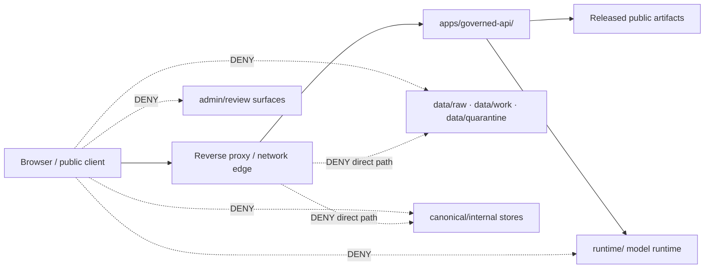

<!-- [KFM_META_BLOCK_V2]
doc_id: kfm://doc/infra-hardening-readme
title: infra/hardening/ — Host Hardening, Exposure Controls, and Operational Guardrails
type: per-directory-readme
version: v1
status: draft
owners:
  - <infra-steward>
  - <security-owner>
  - <ops-steward>
created: 2026-07-03
updated: 2026-07-03
policy_label: public
related:
  - infra/README.md
  - infra/docker/
  - infra/compose/
  - infra/reverse_proxy/
  - infra/vpn/
  - infra/firewall/
  - infra/systemd/
  - docs/doctrine/directory-rules.md
  - docs/security/README.md
  - docs/security/EXPOSURE_PLAN.md
  - docs/security/INCIDENT_RESPONSE.md
  - docs/security/KEY_ROTATION.md
  - docs/architecture/deployment-topology.md
  - docs/architecture/governed-api.md
  - docs/runbooks/
  - policy/
  - configs/
  - runtime/
  - apps/governed-api/
tags:
  - kfm
  - infra
  - hardening
  - security
  - exposure
  - deny-by-default
  - least-privilege
  - auditability
notes:
  - "This README orients the hardening lane under infra/. It is not a policy bundle, not a secret store, and not runtime code."
  - "Host, network, and exposure controls must preserve the KFM trust membrane: public clients use governed APIs and released artifacts only."
  - "Concrete deployment manifests, firewall rules, VPN profiles, reverse-proxy configs, and systemd units belong in their neighboring infra lanes, with this folder carrying hardening baselines, checklists, and validation notes."
[/KFM_META_BLOCK_V2] -->

<a id="top"></a>

# `infra/hardening/` — Host Hardening, Exposure Controls, and Operational Guardrails

> **One-line purpose.** Keep KFM deployment surfaces deny-by-default, least-privilege, auditable, reversible, and subordinate to the governed API trust membrane.


---

## Quick jump

[Purpose](#purpose) · [Status & authority](#status--authority) · [Repo fit](#repo-fit) · [What belongs here](#what-belongs-here) · [What does not belong here](#what-does-not-belong-here) · [Hardening baseline](#hardening-baseline) · [Trust membrane controls](#trust-membrane-controls) · [Validation](#validation) · [Review burden](#review-burden) · [Open verification](#open-verification)

---

## Purpose

`infra/hardening/` is the operational hardening lane for KFM deployment environments. It documents and organizes host, network, service, exposure, audit, and local-administration guardrails that keep infrastructure from bypassing KFM governance.

This folder exists because KFM can only publish trustworthy public surfaces when the surrounding infrastructure also preserves the same boundary:

```text
RAW -> WORK / QUARANTINE -> PROCESSED -> CATALOG / TRIPLET -> PUBLISHED
```

Public clients and normal UI surfaces must not reach RAW, WORK, QUARANTINE, internal/canonical stores, source credentials, unpublished candidates, direct model endpoints, or operator-only admin paths. Infrastructure must enforce that rule before application code ever gets a chance to fail.

`infra/hardening/` **does not replace** `docs/security/`, `policy/`, `apps/governed-api/`, or `runtime/`. It turns their security posture into deployable operating constraints and review checklists.

[Back to top](#top)

---

## Status & authority

| Field | Value |
|---|---|
| **Document type** | Per-directory README |
| **Owning responsibility root** | `infra/` |
| **Subpath role** | `hardening/` — deployment hardening baselines, exposure guardrails, host/network control checklists, and validation notes |
| **Authority level** | **Draft operational guidance.** Doctrine and policy outrank this README. Concrete infrastructure files must still be reviewed. |
| **Lifecycle phase** | n/a — infrastructure guidance, not lifecycle data |
| **Default posture** | **DENY** unless explicitly permitted by policy, release state, and governed API routing |
| **Owners** | `<infra-steward>`, `<security-owner>`, `<ops-steward>` — fill from CODEOWNERS when assigned |
| **Reviewers required** | Infrastructure steward + security owner for any public exposure, firewall, reverse proxy, VPN, systemd, secret-boundary, model-runtime, or raw-data-adjacent change |
| **Directory Rules basis** | `infra/` owns deployment, host, network, and exposure posture; `hardening/` is named under the expected `infra/` tree. |

[Back to top](#top)

---

## Repo fit

```text
Kansas-Frontier-Matrix/
└── infra/
    ├── README.md
    ├── docker/
    ├── compose/
    ├── reverse_proxy/
    ├── vpn/
    ├── firewall/
    ├── systemd/
    ├── kubernetes/
    ├── terraform/
    └── hardening/        ◀── you are here
        └── README.md
```

### Responsibility split

| Location | Owns | Does not own |
|---|---|---|
| `infra/hardening/` | Hardening baselines, exposure checklists, host/network guardrails, validation notes | Policy decisions, secrets, app code, runtime adapters, release manifests |
| `infra/firewall/` | Firewall configuration and deployable firewall artifacts | Policy semantics or source sensitivity rules |
| `infra/reverse_proxy/` | Reverse proxy configuration, TLS termination notes, header policy wiring | Governed API business logic |
| `infra/vpn/` | Steward-only private access patterns | Public access paths |
| `infra/systemd/` | Service unit hardening and local service boundaries | Application source code |
| `docs/security/` | Human-facing security doctrine, threat model, exposure plan, incident response | Executable infrastructure configuration |
| `policy/` | Allow / deny / restrict / abstain rules | Deployment mechanics |
| `runtime/` | Local model/runtime adapters behind governed APIs | Public endpoint exposure |
| `apps/governed-api/` | Trust membrane implementation | Host hardening |

[Back to top](#top)

---

## What belongs here

Use `infra/hardening/` for operational security material that governs how KFM is deployed or exposed:

- **Host hardening baselines** for local machines, servers, containers, and deployment hosts.
- **Network exposure checklists** for public, semi-public, VPN-only, and steward-only surfaces.
- **Reverse-proxy hardening guidance** that confirms only governed public routes are exposed.
- **Model-runtime isolation guidance** proving that local AI runtimes stay behind `apps/governed-api/` and never receive direct browser traffic.
- **Raw-data denial guidance** proving public services cannot read `data/raw/`, `data/work/`, `data/quarantine/`, unpublished candidates, or internal canonical stores.
- **Admin-surface constraints** for `apps/admin/`, `apps/review-console/`, operator CLIs, and emergency-only operations.
- **Audit logging expectations** that record security-relevant actions without leaking secrets, raw payloads, private geometry, living-person data, prompt text, or restricted source material.
- **Secret-boundary checklists** that reference environment-specific secret stores by name only.
- **Validation checklists** for firewall posture, service exposure, TLS/proxy headers, CORS, VPN scope, systemd service restrictions, and release-readiness gates.
- **Rollback and recovery hardening notes** that link infrastructure changes to runbooks and rollback cards.

Accepted file types are Markdown checklists, diagrams, sanitized example snippets, validation notes, and non-secret templates. Executable deployment artifacts may live in neighboring `infra/` lanes when that lane owns the artifact.

[Back to top](#top)

---

## What does not belong here

`infra/hardening/` must not become a parallel policy, secrets, runtime, or release authority.

Do **not** place any of the following here:

- Real secrets, tokens, private keys, certificates, password files, `.env` files, API keys, SSH private keys, or production credentials.
- Full vulnerability working data, exploit payloads, or unredacted scanner output for unfixed issues.
- Raw source data, work data, quarantine data, published artifacts, catalog records, triplets, proofs, receipts, or release manifests.
- Policy bundles or allow/deny rules that belong in `policy/`.
- Runtime model adapters or service implementation code that belongs in `runtime/`, `packages/`, or `apps/`.
- Application route handlers, UI components, or governed API implementation details.
- Live incident notes containing private data, internal IPs, credentials, or sensitive operational details.
- Admin shortcuts that bypass normal review, policy, evidence resolution, release checks, or audit logging.
- Convenience copies of `docs/security/` doctrine. Link to doctrine instead of duplicating it.

If a secret or sensitive operational artifact lands here, treat it as a security incident: rotate the credential, audit access, remove the file, and record the response through the incident and runbook process.

[Back to top](#top)

---

## Hardening baseline

Every deployment surface should be reviewed against this baseline before it is treated as public, semi-public, or steward-accessible.

| Control | Required posture | Evidence expected |
|---|---|---|
| Default ingress | Deny-by-default | Firewall / reverse proxy / cloud rule review |
| Public route exposure | Governed API and released public assets only | Route inventory and exposure plan link |
| Model endpoint | No direct public or browser access | Proxy deny rule, network segmentation, service binding review |
| Raw data path | No public or UI read path | Mount review, service account scope, integration test |
| Admin surface | Private, authenticated, audited, not normal public path | VPN/auth configuration and audit-log check |
| Secrets | Secret store reference only; no repo secrets | Secret scan and rotation runbook link |
| Logging | Audit security events; redact sensitive payloads | Log sample review and retention note |
| CORS / headers | Explicit origin and header policy | Reverse proxy / app config review |
| TLS | Terminated and renewed through approved infra lane | Certificate management note, not private key material |
| Release access | Published artifacts only, tied to manifest | Release manifest and rollback reference |
| Backups | Protected, access-controlled, restore-tested | Runbook and restore drill evidence |
| Change rollback | Reversible or documented forward-fix only | Rollback note or ADR / runbook link |

[Back to top](#top)

---

## Trust membrane controls

Infrastructure must enforce the same trust membrane that KFM application doctrine requires.



### Required negative guarantees

A hardening review is incomplete until it proves the negative states:

1. **Browser → model runtime:** denied.
2. **Browser → RAW / WORK / QUARANTINE:** denied.
3. **Browser → unpublished release candidate:** denied.
4. **Browser → internal canonical store:** denied.
5. **Public UI → source credentials:** denied.
6. **Admin shortcut → public path:** denied.
7. **Unreviewed artifact → published route:** denied.
8. **Missing policy decision → public exposure:** denied.
9. **Missing EvidenceBundle closure → public answer:** abstain or deny, never silently answer.
10. **Sensitive geometry / living-person / DNA / archaeology / rare-species exact location / critical infrastructure uncertainty:** fail closed.

[Back to top](#top)

---

## Proposed file map

The following subfiles are useful future additions. They are **PROPOSED** until created and reviewed.

```text
infra/hardening/
├── README.md
├── baseline.md                    # shared hardening checklist
├── exposure-checklist.md          # public/semi-public/steward-only exposure gates
├── governed-api-edge.md           # reverse proxy / edge expectations for apps/governed-api/
├── model-runtime-isolation.md     # no direct runtime/Ollama/model endpoint exposure
├── raw-data-denial.md             # public path denial for RAW/WORK/QUARANTINE/internal stores
├── admin-surface.md               # admin/review-console/CLI restrictions
├── audit-logging.md               # audit events, redaction, retention questions
├── secrets-boundary.md            # what references are allowed; no secret material
├── local-host-hardening.md        # local-machine/server posture
├── systemd-hardening.md           # companion to infra/systemd/
├── reverse-proxy-hardening.md     # companion to infra/reverse_proxy/
├── firewall-hardening.md          # companion to infra/firewall/
├── vpn-hardening.md               # companion to infra/vpn/
└── validation.md                  # checks, evidence, open verification items
```

Do not create these all at once unless the PR has review capacity. Prefer small, reversible additions tied to a concrete deployment or validation need.

[Back to top](#top)

---

## Validation

Hardening validation should be repeatable and evidence-producing. At minimum, changes touching this folder should pass these review checks:

| Check | Expected result | Owner |
|---|---|---|
| Path placement | File belongs under `infra/hardening/` and does not duplicate `docs/security/`, `policy/`, `runtime/`, or `release/` | Infra steward |
| Secret scan | No secrets, credentials, private keys, tokens, or private endpoint details | Security owner |
| Exposure review | Public paths route through governed API or released artifacts only | Infra + governed API reviewers |
| Raw-data denial | No direct public read path to RAW/WORK/QUARANTINE/internal stores | Data + security reviewers |
| Model isolation | No direct public model endpoint, no browser-to-runtime path | Runtime + security reviewers |
| Admin isolation | Admin/review surfaces are private, authenticated, audited, and not the normal public path | Ops + security reviewers |
| Audit hygiene | Logs are useful for review but do not leak restricted data or secrets | Ops steward |
| Rollback note | Infrastructure change has rollback or forward-fix note | Release / ops steward |
| Drift register | Any conflict with Directory Rules or repo convention is recorded | Docs steward |

### Suggested validation commands

This README intentionally does not prescribe one universal command because deployment environments differ. A future `infra/hardening/validation.md` should name the exact no-secret, no-network or controlled-network checks once the deployment topology is verified.

Until then, reviewers should require evidence from the relevant lane: firewall review from `infra/firewall/`, proxy review from `infra/reverse_proxy/`, service-boundary review from `infra/systemd/`, secret scan evidence from the security toolchain, and public-route tests from `tests/` or `tools/validators/`.

[Back to top](#top)

---

## Review burden

Changes under `infra/hardening/` are security-significant when they touch exposure, credentials, raw-data access, model-runtime access, admin access, or audit trails.

| Change type | Required review |
|---|---|
| Documentation-only wording with no posture change | Infra steward or docs steward |
| Public exposure posture | Infra steward + security owner + governed API owner |
| Reverse proxy, firewall, VPN, systemd, Kubernetes, Terraform hardening | Infra steward + security owner |
| Model-runtime isolation | Runtime owner + security owner |
| RAW/internal-store access boundary | Data steward + security owner |
| Admin/review surface access | Ops steward + security owner |
| Secret-handling language | Security owner |
| Any exception to deny-by-default | ADR or documented risk acceptance + rollback path |

[Back to top](#top)

---

## Related folders

| Folder | Relationship |
|---|---|
| `infra/README.md` | Parent infrastructure root contract. |
| `infra/firewall/` | Concrete firewall artifacts and firewall-specific README material. |
| `infra/reverse_proxy/` | Concrete reverse-proxy artifacts and edge-routing configuration. |
| `infra/vpn/` | Steward-only private access pattern. |
| `infra/systemd/` | Service units and service-level hardening. |
| `configs/` | Non-secret defaults and templates only. Never real secrets. |
| `docs/security/` | Human-facing security doctrine, threat model, exposure plan, incident response. |
| `policy/` | Enforceable allow / deny / restrict / abstain rules. |
| `apps/governed-api/` | Public trust membrane implementation. |
| `runtime/` | Local runtime/model adapters that must remain behind governed APIs. |
| `release/` | Release decisions, manifests, rollback cards, correction notices. |
| `data/published/` | Published downstream artifacts that may be served only after release gates. |
| `data/raw/`, `data/work/`, `data/quarantine/` | Non-public lifecycle stores. Public/direct infra exposure is denied. |

[Back to top](#top)

---

## Open verification

- [ ] Confirm CODEOWNERS for `infra/`, `infra/hardening/`, `docs/security/`, and `apps/governed-api/`.
- [ ] Confirm current deployment topology and whether KFM is local-only, VPN-only, public-facing, or mixed.
- [ ] Confirm reverse-proxy product and exact place for public-route allowlists.
- [ ] Confirm firewall baseline and whether it is host-based, network-based, cloud-based, or mixed.
- [ ] Confirm log-retention, redaction, and access-review requirements.
- [ ] Confirm where secret references are named and where real secrets are stored.
- [ ] Confirm whether model runtimes are present and how they are bound to the network.
- [ ] Confirm raw-data and internal-store mount boundaries for every public-serving process.
- [ ] Confirm rollback procedure for infrastructure changes.
- [ ] Add validation evidence or links once hardening checks are executable.

[Back to top](#top)

---

## Last reviewed

| Field | Value |
|---|---|
| Last reviewed | 2026-07-03 |
| Review status | Draft README replacing greenfield stub |
| Next review trigger | First concrete firewall, reverse proxy, VPN, systemd, model-runtime, public-route, or deployment-topology hardening PR |
