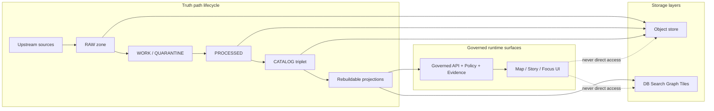

<a id="top"></a>

# infra/helm
Deploy Kansas Frontier Matrix (KFM) to Kubernetes/OpenShift using Helm charts + GitOps-friendly values.

**Status:** Draft (vNext) • **Owners:** Platform Ops + Governance Stewards • **Scope:** cluster manifests only (no app code)


---

## Navigation

- [What lives here](#what-lives-here)
- [Architecture and trust boundaries](#architecture-and-trust-boundaries)
- [Directory layout](#directory-layout)
- [Quick start](#quick-start)
- [GitOps usage](#gitops-usage)
- [Values and environments](#values-and-environments)
- [Secrets](#secrets)
- [Governance requirements](#governance-requirements)
- [Upgrade and rollback](#upgrade-and-rollback)
- [Troubleshooting](#troubleshooting)
- [Contributing](#contributing)
- [Definition of Done](#definition-of-done)
- [Appendix](#appendix)

---

## What lives here

This directory is the **Helm packaging layer** for KFM:

- Charts that deploy KFM runtime components (API, UI, policy enforcement, index/projection services, etc.)
- Environment-specific values overlays (dev/stage/prod patterns)
- GitOps-compatible rendering conventions (deterministic outputs, minimal imperative steps)

This directory is **not**:

- A place to store secrets in plaintext
- A replacement for governance/policy enforcement
- The place where datasets “become public” (publishing is a governance + promotion process; Helm should only deploy the runtime surfaces that can serve **already-promoted** dataset versions)

[Back to top](#top)

---

## Architecture and trust boundaries

KFM’s runtime must behave like a governed system: clients never reach storage directly; policy and evidence enforcement happens at the API boundary.



### Infra implications for charts

**Charts SHOULD:**

- expose *only* the **governed API** to clients
- enforce network segmentation so “internal” services are not publicly reachable
- model policy components as first-class dependencies (e.g., OPA sidecar / PDP service + versioned bundles)
- keep “canonical stores” (object store + catalogs + provenance) separate from rebuildable projections (DB/search/graph/tiles)

**Charts SHOULD NOT:**

- let the UI (or external clients) talk directly to Postgres/S3/tiles buckets
- deploy public endpoints that bypass policy enforcement (e.g., a “public” object-store endpoint for restricted artifacts)

[Back to top](#top)

---

## Directory layout

> This is the *intended* layout. If your repo differs, update this README to match reality.

```text
infra/helm/
  README.md

  charts/                     # Helm charts (one directory per chart)
    kfm/                      # (optional) umbrella chart wiring subcharts together
    kfm-api/                  # governed API service
    kfm-ui/                   # Map / Story / Focus UI
    kfm-policy/               # policy bundle delivery + OPA/PDP wiring
    kfm-projections/          # rebuildable projections (search/tiles/graph builders)
    kfm-observability/        # (optional) metrics/logging/tracing add-ons

  values/                     # values overlays (never store plaintext secrets)
    values.yaml               # baseline defaults (safe-by-default)
    dev.yaml
    stage.yaml
    prod.yaml

  scripts/                    # local helpers (optional)
    lint.sh
    render.sh
    diff.sh
```

[Back to top](#top)

---

## Quick start

### Prereqs

- Helm v3+
- kubectl (or oc for OpenShift)
- Access to a cluster + a default `StorageClass`
- An Ingress controller (or OpenShift Routes)
- A secrets solution (External Secrets / sealed secrets / secret manager integration)

### Render (recommended first step)

Render manifests before applying them:

```sh
# Pick the chart you actually have (umbrella or a single chart)
CHART=./charts/kfm

# Render to a file for review
helm template kfm "$CHART" \
  --namespace kfm \
  --create-namespace \
  -f ./values/values.yaml \
  -f ./values/dev.yaml \
  > /tmp/kfm.rendered.yaml
```

### Install / upgrade (manual workflow)

```sh
# Install or upgrade in place
helm upgrade --install kfm ./charts/kfm \
  --namespace kfm \
  --create-namespace \
  -f ./values/values.yaml \
  -f ./values/dev.yaml

kubectl -n kfm get pods
```

> For stage/prod, prefer GitOps (next section) so Git remains the source of truth for cluster state.

[Back to top](#top)

---

## GitOps usage

Helm works best for KFM when used through a GitOps controller (e.g., Argo CD or Flux). The controller:

- renders charts with tracked values
- applies manifests continuously
- detects drift (cluster state ≠ desired state in Git)

### Example: Argo CD `Application` (illustrative)

```yaml
apiVersion: argoproj.io/v1alpha1
kind: Application
metadata:
  name: kfm
  namespace: argocd
spec:
  project: default
  source:
    repoURL: https://example.com/your-org/your-repo.git
    targetRevision: main
    path: infra/helm/charts/kfm
    helm:
      valueFiles:
        - ../../values/values.yaml
        - ../../values/prod.yaml
  destination:
    server: https://kubernetes.default.svc
    namespace: kfm
  syncPolicy:
    automated:
      prune: true
      selfHeal: true
```

### Example: Flux `HelmRelease` (illustrative)

```yaml
apiVersion: helm.toolkit.fluxcd.io/v2beta2
kind: HelmRelease
metadata:
  name: kfm
  namespace: kfm
spec:
  interval: 5m
  chart:
    spec:
      chart: ./infra/helm/charts/kfm
      sourceRef:
        kind: GitRepository
        name: kfm-repo
        namespace: flux-system
  valuesFrom:
    - kind: ConfigMap
      name: kfm-values-prod
      valuesKey: values.yaml
```

[Back to top](#top)

---

## Values and environments

### Layering strategy

Use a layered values approach:

1. `values/values.yaml` (baseline; safe-by-default)
2. `values/<env>.yaml` (environment overrides)

Install example:

```sh
helm upgrade --install kfm ./charts/kfm \
  -n kfm --create-namespace \
  -f ./values/values.yaml \
  -f ./values/stage.yaml
```

### What belongs in values vs. secrets

**OK in values:**

- image repositories + tags
- resource requests/limits
- replica counts
- hostnames (Ingress/Route)
- storage class names
- feature flags that are not sensitive

**NOT OK in values:**

- API keys
- database passwords
- private signing keys
- OIDC client secrets

[Back to top](#top)

---

## Secrets

KFM is policy-governed and may handle restricted data. **Secrets hygiene is part of governance.**

Recommended patterns (choose one; document the chosen standard):

1. **External Secrets Operator** (preferred): sync from Vault/AWS/GCP/Azure secret manager into K8s Secrets
2. **Sealed Secrets**: commit encrypted secrets, decrypt only in cluster
3. **SOPS + KMS**: encrypt values files and decrypt in CI/GitOps controller

### Chart interface contract (recommended)

Charts should accept:

- `existingSecret` names (created by External Secrets / Sealed Secrets)
- `secretKeyRef` keys for each credential

Example (illustrative):

```yaml
database:
  host: postgres.example.internal
  port: 5432
  name: kfm
  user: kfm_app
  existingSecret: kfm-db-credentials
  passwordKey: password

oidc:
  issuerUrl: https://idp.example.com
  clientId: kfm-ui
  existingSecret: kfm-oidc
  clientSecretKey: clientSecret
```

[Back to top](#top)

---

## Governance requirements

This directory is infrastructure, but **infrastructure controls behavior**. Treat changes here as governed work.

### 1) Trust membrane is enforced by configuration

- UI and external clients must only reach the governed API.
- Datastores and projections must be internal-only (NetworkPolicy / security groups).
- Caches must vary by auth/policy where applicable.

### 2) Promotion contract: runtime serves only promoted dataset versions

Helm values/config should **not** point the runtime to RAW/WORK artifacts for public serving.

Recommended approach:

- runtime uses **PUBLISHED** pointers/manifests (produced by the promotion process)
- promoted catalogs + checksums + run receipts exist before the runtime can serve them

### 3) Policy-as-code is deployed and tested like code

Charts should make it easy to:

- pin the policy bundle version (git SHA or OCI artifact digest)
- run policy fixture tests in CI (block merges on policy regressions)
- share the same policy semantics between CI and runtime

### 4) Sensitive location protection is a runtime feature, not a guideline

- enforce policy at tile serving and exports
- prevent coordinate leakage in public outputs
- prefer public generalized derivatives for any sensitive geometry

### 5) Audit and observability are required

Charts should enable:

- append-only audit logs for governed operations (access, evidence resolution, Focus Mode requests)
- log redaction controls and retention policies
- metrics and tracing where feasible

[Back to top](#top)

---

## Upgrade and rollback

### Upgrade

```sh
helm upgrade kfm ./charts/kfm -n kfm \
  -f ./values/values.yaml \
  -f ./values/prod.yaml
```

**Avoid surprise upgrades**:

- pin image tags (no `latest`)
- pin chart dependencies (`Chart.lock`)
- prefer GitOps-controlled upgrades via PRs

### Rollback

```sh
helm history kfm -n kfm
helm rollback kfm <REVISION> -n kfm
```

[Back to top](#top)

---

## Troubleshooting

### 1) Lint and render locally

```sh
helm lint ./charts/kfm
helm template kfm ./charts/kfm -n kfm -f ./values/values.yaml -f ./values/dev.yaml > /tmp/render.yaml
```

### 2) Debug a failed install

```sh
kubectl -n kfm get events --sort-by=.lastTimestamp | tail -n 50
kubectl -n kfm describe pod <pod-name>
kubectl -n kfm logs <pod-name> --all-containers=true
```

### 3) Common failure modes

- **Missing required values** (good!): charts should fail fast if prod-required settings are absent
- **Ingress/Route issues**: hostnames, TLS secrets, controller class mismatch
- **Storage issues**: no default StorageClass; PVC stuck Pending
- **Policy bundle mismatch**: runtime policy does not match CI fixtures; treat as a blocking release issue

[Back to top](#top)

---

## Contributing

### Chart conventions (recommended)

- keep templates deterministic (`helm template` output should be stable for the same inputs)
- avoid embedding secrets; prefer `existingSecret` interfaces
- use `values.schema.json` to validate required fields per environment
- use `required` in templates for prod-only fields where schema is not enough
- document every non-obvious value in the chart’s `values.yaml`

### CI checks to add (or keep)

- `helm lint` for all charts
- `helm template` render checks
- YAML validation (kubeconform/kubeval)
- policy fixture tests (OPA) when policy changes
- chart unit tests (optional) via `helm unittest`

[Back to top](#top)

---

## Definition of Done

A change in `infra/helm/` is “done” when:

- [ ] `helm lint` passes
- [ ] `helm template` succeeds for at least `dev` and `prod` overlays
- [ ] no plaintext secrets are introduced
- [ ] network exposure changes are reviewed (ingress/routes/services)
- [ ] policy bundle versioning is explicit (or unchanged and justified)
- [ ] rollback plan is viable (`helm history` + `helm rollback`)
- [ ] README updates include any new values/required fields

[Back to top](#top)

---

## Appendix

<details>
<summary><strong>Appendix A — Suggested values structure (illustrative)</strong></summary>

```yaml
global:
  environment: dev
  imagePullSecrets: []

api:
  replicaCount: 2
  image:
    repository: ghcr.io/your-org/kfm-api
    tag: "0.1.0"
  service:
    type: ClusterIP
    port: 8080
  ingress:
    enabled: true
    host: api.dev.example.com
    tls: true

ui:
  replicaCount: 2
  image:
    repository: ghcr.io/your-org/kfm-ui
    tag: "0.1.0"
  ingress:
    enabled: true
    host: kfm.dev.example.com
    tls: true

policy:
  bundle:
    ref: "sha256:REPLACE_WITH_DIGEST"
```

</details>

<details>
<summary><strong>Appendix B — Safe defaults checklist</strong></summary>

- internal services are not exposed via `LoadBalancer`
- Ingress/Route is only for UI and governed API
- NetworkPolicy denies cross-namespace by default (or OpenShift equivalents)
- prod requires OIDC + policy bundle pinning + audit log sink
- caching layers consider user role/policy label boundaries

</details>
