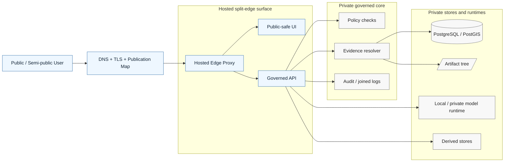

# hosted

Hosted split-edge overlays for public or semi-public KFM deployment surfaces.

> [!NOTE]
> **Status:** experimental directory · README upgraded from scaffold  
> **Owners:** **NEEDS VERIFICATION**  
>       
> **Repo fit:** `infra/hosted/README.md` is the directory guide for KFM deployment overlays that place a **public or semi-public edge** in front of the system while keeping canonical truth, unpublished artifacts, policy internals, and private model runtimes off the direct client path.  
> **Quick jump:** [Scope](#scope) · [Repo fit](#repo-fit) · [Inputs](#accepted-inputs) · [Exclusions](#exclusions) · [Directory tree](#directory-tree) · [Quickstart](#quickstart) · [Usage](#usage) · [Diagram](#diagram) · [Exposure matrix](#exposure-matrix) · [Task list / definition of done](#task-list--definition-of-done) · [FAQ](#faq) · [Appendix](#appendix)

> [!IMPORTANT]
> **Current evidence boundary:** this directory is **CONFIRMED** in the repo, but the current visible repo state only confirms a placeholder `README.md` here. Treat any future hosted layout, ingress stack, DNS/TLS automation, or environment naming in this file as **PROPOSED** unless separately verified in mounted repo artifacts, manifests, or workflows.

> [!WARNING]
> In KFM, `hosted/` is **not** a shortcut around the trust membrane. A hosted deployment may publish an edge, a UI, and/or a governed API, but it must **not** create direct client access to PostgreSQL/PostGIS, artifact roots, RAW / WORK / QUARANTINE zones, policy bundles, review internals, or local/private inference runtimes.

---

## Scope

This directory is for the **hosted deployment lane** of KFM infrastructure.

That means the files here should explain or configure how KFM is exposed **after** the project has moved beyond a purely local or VPN-only phase and now needs a clearer edge boundary, a public-safe runtime entrypoint, or a semi-public reviewable surface.

In practice, `infra/hosted/` is the place for things like:

- externally reachable edge overlays
- publication maps
- reverse-proxy and ingress wiring
- hosted environment notes
- TLS / DNS / certificate coordination
- edge-specific health checks and rollback notes
- operator runbooks that are specific to hosted exposure

It is **not** the place where canonical business law, policy authority, contract authority, or hidden runtime logic should quietly accumulate.

[Back to top](#hosted)

## Repo fit

| Kind | Path | Relationship |
|---|---|---|
| Current file | `infra/hosted/README.md` | This directory guide |
| Parent infra guide | [`../README.md`](../README.md) | Defines what belongs in `infra/` overall |
| Local-first lane | [`../local/README.md`](../local/README.md) | Earlier deployment phase |
| Single-host runtime lane | [`../systemd-or-compose/README.md`](../systemd-or-compose/README.md) | Systemd/Compose-first operational lane |
| Broader overlays | [`../terraform/`](../terraform/) · [`../kubernetes/`](../kubernetes/) | Possible later hosted/orchestrated surfaces |
| Observability wiring | [`../dashboards/`](../dashboards/) · [`../monitoring/`](../monitoring/) | Hosted runtime visibility |
| Shared contracts | [`../../contracts/`](../../contracts/) | Hosted surfaces must honor, not redefine, contracts |
| Shared policy | [`../../policy/`](../../policy/) | Hosted surfaces enforce policy; they do not own policy truth |
| Shared tests | [`../../tests/`](../../tests/) | Hosted changes should be verified through contract/policy/e2e lanes |
| Repo root doctrine | [`../../README.md`](../../README.md) | Root posture and evidence boundary |

### Upstream/downstream logic

**Upstream into `hosted/`**

- doctrine and deployment rules from [`../../README.md`](../../README.md) and [`../README.md`](../README.md)
- contract and policy constraints from [`../../contracts/`](../../contracts/) and [`../../policy/`](../../policy/)
- runtime surfaces from apps and workers elsewhere in the repo

**Downstream from `hosted/`**

- public or semi-public entrypoints
- reverse-proxy or edge behavior
- hosted observability and rollback handling
- publication-safe exposure of UI and governed API surfaces

[Back to top](#hosted)

## Accepted inputs

| What belongs here | Why it belongs here |
|---|---|
| Edge publication maps | Hosted KFM needs one explicit map of what is public, private, loopback, or VPN-only |
| Reverse-proxy / ingress overlays | These are the boundary objects for hosted exposure |
| DNS / TLS / certificate notes | Public or semi-public surfaces need documented publication mechanics |
| Hosted environment overlays | This directory should hold hosted-specific wiring, not generic repo-wide law |
| Health, readiness, and rollback instructions | Hosted lanes need trustworthy recovery behavior |
| Firewall / VPN / network exposure notes | Hosted operation changes the network boundary and should document it visibly |
| Hosted observability hooks | Request correlation, edge logs, and availability checks belong with hosted runtime wiring |
| Change and cutover runbooks | Operators need a reviewable path for introducing or reverting a hosted surface |

## Exclusions

| Does **not** belong here | Put it here instead |
|---|---|
| Canonical schema authority | [`../../contracts/`](../../contracts/) |
| Policy bundle authority | [`../../policy/`](../../policy/) |
| Hidden domain/business logic | packages / services, not infra docs |
| Direct database client access patterns | nowhere on the normal public path |
| Direct Ollama / private model runtime exposure | private runtime lane, never normal hosted edge |
| Canonical source bytes or release-bearing data | `data/` and governed storage paths |
| Unreviewed convenience scripts that redefine truth rules | promote to packages/workers or document as runbooks with clear scope |
| “Everything infra-like” | keep `hosted/` focused on externally reachable or split-edge concerns |

[Back to top](#hosted)

## Directory tree

### Current repo state (**CONFIRMED**)

```text
infra/
└── hosted/
    └── README.md
```

### Illustrative future expansion (**PROPOSED**)

<details>
<summary>Show a possible hosted subtree shape</summary>

```text
infra/
└── hosted/
    ├── README.md
    ├── edge/
    │   ├── publication-map.<env>.md
    │   ├── reverse-proxy/
    │   └── tls/
    ├── deploy/
    │   ├── overlays/
    │   ├── env/
    │   └── cutover/
    ├── checks/
    │   ├── health/
    │   ├── readiness/
    │   └── smoke/
    ├── ops/
    │   ├── rollback/
    │   ├── correction/
    │   └── incident/
    └── notes/
        ├── exposure-model.md
        └── hosted-constraints.md
```

This is intentionally **illustrative only**. Exact file names, stack choices, and environment layouts remain **NEEDS VERIFICATION**.
```

</details>

[Back to top](#hosted)

## Quickstart

1. Start with the parent infra guidance in [`../README.md`](../README.md), not with edge config first.
2. Confirm that the hosted move is justified by a real publication need, reviewer access need, or split-edge requirement.
3. Keep the public path narrow: edge proxy and intended UI/API only.
4. Keep canonical stores, unpublished artifact zones, policy internals, and private model runtimes private.
5. Add hosted docs, checks, and rollback instructions in the same change that adds hosted exposure.
6. Refuse “docs say it exists” drift: if the hosted lane is not real yet, keep it explicitly **PROPOSED**.

### Minimal hosted review checklist

```text
[ ] Why is a hosted edge needed now?
[ ] Which surface becomes reachable: UI, governed API, or both?
[ ] What remains private: DB, artifacts, policy, review, model runtime?
[ ] Where is the publication map?
[ ] Where are the health/readiness checks?
[ ] Where is the rollback path?
[ ] Which tests prove no direct bypass exists?
[ ] Which docs were updated so hosted reality and hosted prose still match?
```

[Back to top](#hosted)

## Usage

### When to use `infra/hosted/`

Use this directory when KFM is moving from:

- **local-only** toward **private remote**
- **private remote** toward **small hosted split-edge**
- **small hosted split-edge** toward a more mature public edge

Use it when the problem is about **publication**, **edge exposure**, **hosted runtime boundaries**, or **operator-facing cutover discipline**.

### When **not** to use `infra/hosted/`

Do **not** use this directory when the change is really about:

- schema evolution
- policy logic
- evidence resolution semantics
- application business rules
- data modeling
- hidden worker behavior
- “just put it in infra” convenience dumping

### Hosted in the KFM deployment ladder

| Phase | What is reachable | What stays private | Main concern | `hosted/` relevance |
|---|---|---|---|---|
| Local-only | Nothing public | Everything except host-local surfaces | Prove governed slice first | Low |
| Private remote | VPN/overlay access to intended surfaces | DB, artifacts, model runtime, policy internals | Controlled remote access | Medium |
| Small hosted split-edge | Public or semi-public UI and/or governed API | Canonical data, private runtimes, review internals, policy stores | Safe publication boundary | **Primary** |
| Production-grade separation | Edge, API, workers, stores split by role | Sensitive and internal lanes stay tightly bounded | Scale, blast radius, rollback, ops maturity | High |

### Hosted operating rule

A hosted KFM surface should still feel like **KFM**, not like a detached convenience app.

That means:

- geography, time, and trust cues remain visible
- evidence drill-through remains possible
- stale / denied / abstaining / error states remain explicit
- the governed API remains the only normal client-visible truth boundary

[Back to top](#hosted)

## Diagram



The design intent is simple: **host the edge, not the whole trust system**.

[Back to top](#hosted)

## Exposure matrix

| Surface / component | Public bind allowed? | Hosted responsibility | Must not happen |
|---|---|---|---|
| Reverse proxy / edge gateway | Yes, when intentionally publishing | TLS termination, routing, request IDs, public-safe exposure | Becoming a hidden truth system |
| Public-safe UI | Yes, if it still routes through governed APIs | Presentation of governed surfaces | Reading local files, DBs, or model runtimes directly |
| Governed API | Sometimes, behind intended edge and policy boundary | Only normal client-visible truth entrypoint | Acting as a convenience pass-through to raw stores |
| PostgreSQL / PostGIS | No | Keep private, loopback, socket, or private subnet only | Direct client exposure |
| Artifact roots (`RAW`, `WORK`, `QUARANTINE`, etc.) | No | Keep off the public path | File sharing or direct browsing |
| Policy bundles / contract registries | No | Internal enforcement dependency | Public read/write exposure |
| Ollama / private inference runtime | No | Internal runtime dependency only | Direct internet or normal LAN exposure |
| Review / stewardship internals | Usually no | Separate and strongly gated if exposed at all | Quietly sharing the public edge |
| Derived store admin surfaces | No | Internal operations only | Becoming public truth by accident |

## Hosted change artifacts

| Artifact | Why it matters |
|---|---|
| Publication map | Makes exposure explicit and reviewable |
| Edge config diff | Shows what changed at the public boundary |
| Upstream service map | Prevents “mystery hops” |
| Health/readiness checks | Prevents cosmetic success over broken governance |
| Rollback runbook | Hosted rollout without rollback is fragile theater |
| Correction link or procedure | Public meaning changes need correction continuity |
| Monitoring updates | Edge changes must be observable |
| Ownership note | Hosted changes need clear review paths |

[Back to top](#hosted)

## Task list / definition of done

A hosted change is not done when the proxy starts. It is done when the hosted surface is still **governed**.

- [ ] The change explains **why** hosted exposure is needed.
- [ ] The hosted surface is tied to one explicit publication map.
- [ ] Only intended public-safe surfaces are reachable.
- [ ] PostgreSQL/PostGIS, artifact roots, policy bundles, and private model runtimes remain non-public.
- [ ] Hosted logs preserve stable request or audit join identifiers.
- [ ] Health/readiness checks prove more than “process is up.”
- [ ] Rollback instructions exist and are linked from the same change.
- [ ] Correction behavior is documented if public meaning can change.
- [ ] Docs do not imply a stronger hosted reality than the repo currently proves.
- [ ] The change points to the contract/policy/tests lanes that verify the boundary.
- [ ] Any Kubernetes / Terraform / Compose / systemd choice is documented as an implementation choice, not as doctrine.
- [ ] Owners and reviewers are explicit or marked **NEEDS VERIFICATION**.

[Back to top](#hosted)

## FAQ

### Does `hosted/` mean Kubernetes?

No. In KFM, **hosted** is a deployment responsibility lane, not proof of a specific orchestrator. A hosted lane can remain modest and split-edge without forcing a full orchestration stack.

### Can Ollama live behind a hosted deployment?

Yes, **behind** it and **not directly on** the public path. The normal client path must still cross the governed API boundary, not the model runtime itself.

### Can we publish directly from a home network?

This directory should not normalize that. KFM doctrine favors a progression from local-only to private remote to hosted split-edge. Public edge from a home router is a higher-risk move and should not be treated as the default path.

### What is the minimum credible hosted shape?

A narrow edge, a governed API, explicit publication mapping, private canonical stores, private model/runtime dependencies, visible failure states, and rollback/correction discipline.

### Why is this README so strict when the directory is still sparse?

Because `hosted/` is exactly where a repo can drift into **implied production posture** without proving it. This README is meant to reduce that drift.

[Back to top](#hosted)

## Appendix

### Evidence labels used here

| Label | Meaning in this README |
|---|---|
| **CONFIRMED** | Verified from the current repo or attached doctrine |
| **INFERRED** | Strong synthesis from repo + doctrine, but not directly proven as implementation |
| **PROPOSED** | Recommended structure, workflow, or file family |
| **NEEDS VERIFICATION** | A value or choice that should be filled in after repo/runtime inspection |
| **UNKNOWN** | Not confirmed from current visible evidence |

<details>
<summary>Illustrative hosted publication map template (<strong>PROPOSED</strong>)</summary>

```yaml
surface_id: hosted-split-edge
status: proposed
public_hosts:
  - app.example.org
public_paths:
  - /
  - /api/
edge_owner: NEEDS_VERIFICATION
ui_upstream: NEEDS_VERIFICATION
api_upstream: NEEDS_VERIFICATION
private_dependencies:
  - postgres
  - artifact-tree
  - policy-runtime
  - private-model-runtime
must_not_expose:
  - raw
  - work
  - quarantine
  - contract-registry
  - policy-bundles
checks:
  - health
  - readiness
  - rollback
  - citation-smoke
notes: >
  Illustrative template only. Replace with verified runtime facts before use.
```

</details>

<details>
<summary>Hosted review prompts for maintainers</summary>

```text
- What exactly becomes hosted?
- Which trust boundary is visible to the user?
- Which systems remain private and why?
- What fails closed if the edge is healthy but evidence resolution is not?
- How is stale state surfaced instead of hidden?
- Which rollback path preserves lineage rather than pretending nothing happened?
```

</details>

[Back to top](#hosted)
