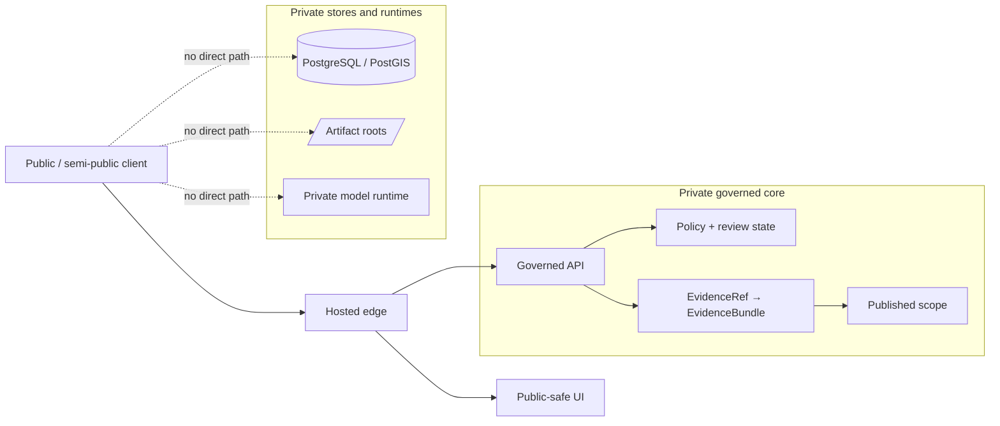

<!-- [KFM_META_BLOCK_V2]
doc_id: kfm://doc/UUID_NEEDS_VERIFICATION
title: hosted
type: standard
version: v1
status: draft
owners: NEEDS_VERIFICATION
created: NEEDS_VERIFICATION
updated: NEEDS_VERIFICATION
policy_label: NEEDS_VERIFICATION
related: [../../README.md, ../../contracts/README.md, ../../schemas/README.md, ../../policy/README.md, ../../tests/README.md, ../../.github/workflows/README.md]
tags: [kfm, infra, hosted, edge, deployment]
notes: [target path supplied in task; surrounding infra tree and ownership metadata were not reverified from a mounted repo tree in the current session]
[/KFM_META_BLOCK_V2] -->

# hosted

Hosted split-edge overlays for public or semi-public KFM deployment surfaces.

> [!NOTE]
> **Status:** experimental deployment lane  
> **Owners:** **NEEDS VERIFICATION**  
>       
> **Repo fit:** `infra/hosted/README.md` is the target directory guide for hosted KFM edge overlays that expose a public or semi-public entrypoint while keeping canonical truth, unpublished artifacts, policy internals, and private model runtimes off the direct client path.  
> **Quick jump:** [Scope](#scope) · [Repo fit](#repo-fit) · [Accepted inputs](#accepted-inputs) · [Exclusions](#exclusions) · [Directory tree](#directory-tree) · [Quickstart](#quickstart) · [Usage](#usage) · [Diagram](#diagram) · [Exposure matrix](#exposure-matrix) · [Task list / definition of done](#task-list--definition-of-done) · [FAQ](#faq) · [Appendix](#appendix)

> [!IMPORTANT]
> **Current evidence boundary:** the target path is explicit in this task, but the surrounding `infra/` subtree was **not** directly reverified from a mounted repo tree in the current session. This README therefore treats exact neighboring infra paths, concrete ingress stacks, environment names, and deployment manifests as **NEEDS VERIFICATION** unless separately surfaced by repo files.

> [!WARNING]
> In KFM, hosted exposure is **not** a shortcut around the trust membrane. A hosted edge may publish a UI and/or governed API, but it must **not** create direct client paths to PostgreSQL/PostGIS, RAW / WORK / QUARANTINE roots, policy bundles, review internals, or private model runtimes.

---

## Scope

This directory is the repo-facing lane for the hosted posture that KFM doctrine describes more formally as **public edge + private governed core**.

In other words, `hosted/` is where KFM should explain or configure **how exposure happens**, not where it should quietly relocate truth, policy, or hidden runtime shortcuts.

Typical material for this lane includes:

- publication maps that make public, private, and steward-only boundaries explicit
- reverse-proxy / ingress overlays and hosted routing notes
- DNS, TLS, and certificate coordination for public-safe surfaces
- health, readiness, stale-state, rollback, and correction runbooks specific to hosted exposure
- observability notes tied to the edge boundary rather than to generic internal runtime behavior

What it should **not** become is an all-purpose dumping ground for “anything infra-like.”

[Back to top](#hosted)

## Repo fit

### Confirmed and task-scoped links

| Kind | Path | Evidence status | Relationship |
|---|---|---:|---|
| Target doc | `infra/hosted/README.md` | task-scoped | This file |
| Root posture | [`../../README.md`](../../README.md) | CONFIRMED | Repo-level project posture and trust framing |
| Contracts surface | [`../../contracts/README.md`](../../contracts/README.md) | CONFIRMED | Hosted surfaces must honor contracts, not redefine them |
| Schemas surface | [`../../schemas/README.md`](../../schemas/README.md) | CONFIRMED | Schema and validation posture for machine-checkable objects |
| Policy surface | [`../../policy/README.md`](../../policy/README.md) | CONFIRMED | Deny-by-default policy and decision grammar surface |
| Tests surface | [`../../tests/README.md`](../../tests/README.md) | CONFIRMED | Hosted exposure should be proven, not only described |
| Workflow intent | [`../../.github/workflows/README.md`](../../.github/workflows/README.md) | CONFIRMED | CI/workflow scaffolding context |

### Adjacent infra paths still needing repo verification

| Candidate neighbor | Status | Why it is handled cautiously here |
|---|---:|---|
| `../README.md` | NEEDS VERIFICATION | Parent `infra/` guide was not directly surfaced in current-session repo evidence |
| `../local/` | NEEDS VERIFICATION | Plausible adjacent lane, but not reverified |
| `../systemd-or-compose/` | NEEDS VERIFICATION | Plausible adjacent lane, but not reverified |
| `../terraform/` | NEEDS VERIFICATION | Plausible adjacent lane, but not reverified |
| `../kubernetes/` | NEEDS VERIFICATION | Plausible adjacent lane, but not reverified |

### Upstream / downstream logic

**Upstream into `hosted/`**

- root project posture and trust doctrine
- contract and schema obligations
- policy and review rules
- test and workflow expectations

**Downstream from `hosted/`**

- public or semi-public entrypoints
- public-safe UI/API exposure rules
- rollback and correction handling at the edge
- hosted observability and operator runbooks

[Back to top](#hosted)

## Accepted inputs

| What belongs here | Why it belongs here |
|---|---|
| Publication maps | Hosted exposure must be explicit and reviewable |
| Reverse-proxy / ingress overlays | These define the real edge boundary |
| DNS / TLS / certificate notes | Hosted surfaces need clear publication mechanics |
| Hosted environment notes | Exposure-specific runtime assumptions belong here |
| Edge health / readiness / smoke checks | Hosted lanes need more than “process is up” |
| Rollback and correction runbooks | Hosted rollout without reversal discipline is weak governance |
| Edge observability notes | Request IDs, audit joins, logs, and stale-state signals matter at the boundary |
| Firewall / VPN / exposure notes | Hosted changes alter network posture and should be documented visibly |

[Back to top](#hosted)

## Exclusions

| Does **not** belong here | Put it here instead |
|---|---|
| Canonical schema authority | [`../../contracts/README.md`](../../contracts/README.md) and [`../../schemas/README.md`](../../schemas/README.md) |
| Policy bundle authority | [`../../policy/README.md`](../../policy/README.md) |
| Verification strategy as doctrine | [`../../tests/README.md`](../../tests/README.md) plus policy / contract surfaces |
| Generic CI/workflow scaffolding | [`../../.github/workflows/README.md`](../../.github/workflows/README.md) |
| Direct database client patterns | Nowhere on the normal public path |
| Direct private model-runtime exposure | Never on the normal hosted edge |
| RAW / WORK / QUARANTINE browsing or file sharing | Governed internal runtime/storage paths, not hosted edge docs |
| Hidden convenience exceptions to the trust membrane | They do not belong in the normal hosted lane at all |

[Back to top](#hosted)

## Directory tree

### Target path under revision (**task-scoped**)

```text
infra/
└── hosted/
    └── README.md
```

This path is the task target. The broader mounted `infra/` tree remains **NEEDS VERIFICATION** in the current session.

### Illustrative future expansion (**PROPOSED**)

<details>
<summary>Show a possible hosted subtree shape</summary>

```text
infra/
└── hosted/
    ├── README.md
    ├── edge/
    │   ├── publication-map.<env>.md
    │   ├── ingress/
    │   └── tls/
    ├── checks/
    │   ├── health/
    │   ├── readiness/
    │   └── smoke/
    ├── runbooks/
    │   ├── cutover.md
    │   ├── rollback.md
    │   └── correction.md
    └── notes/
        ├── exposure-model.md
        └── hosted-constraints.md
```

This subtree is intentionally illustrative. Exact file names, stack choices, and environment labels remain **NEEDS VERIFICATION** until direct repo/runtime evidence surfaces them.
</details>

[Back to top](#hosted)

## Quickstart

1. Confirm that hosted exposure is actually needed.  
   KFM does not gain trust merely by becoming internet-reachable.

2. Define the boundary before the stack.  
   Decide what becomes reachable: public-safe UI, governed API, or both.

3. Write one explicit publication map.  
   Public, semi-public, VPN-only, loopback-only, and steward-only surfaces should be named before rollout.

4. Keep the normal public path narrow.  
   Edge → public-safe UI and/or governed API only.

5. Pair any hosted change with edge checks and rollback notes.  
   No hosted lane is credible if it only describes the happy path.

6. Refuse implied maturity.  
   If manifests, ingress rules, or DNS/TLS automation are not real yet, keep them marked **PROPOSED** or **NEEDS VERIFICATION**.

### Minimal hosted review checklist

```text
[ ] Why is a hosted edge needed now?
[ ] Which surfaces become reachable: UI, governed API, or both?
[ ] What remains private: DB, artifact roots, policy internals, review internals, model runtime?
[ ] Where is the publication map?
[ ] Where are the health/readiness checks?
[ ] Where is the rollback path?
[ ] Which tests or checks prove no direct bypass exists?
[ ] Which docs changed so hosted prose still matches hosted reality?
```

[Back to top](#hosted)

## Usage

### When to use `infra/hosted/`

Use this directory when the change is about **edge exposure** rather than about domain truth.

Typical examples:

- moving from local-only or VPN-only access toward a public-safe edge
- introducing hosted UI and/or governed API exposure
- documenting split-edge routing, certificates, DNS, or ingress behavior
- adding hosted rollback, stale-state, or correction handling

### When **not** to use `infra/hosted/`

Do **not** use this directory when the work is primarily about:

- source admission or canonical ingest law
- schema or contract evolution
- policy grammar or review semantics
- evidence resolution logic
- application/domain behavior that is not specifically about hosted exposure

### Hosted in the KFM deployment ladder

| Phase | What is reachable | What stays private | Main concern | `hosted/` relevance |
|---|---|---|---|---|
| Local-only | Nothing public | Everything except host-local surfaces | Prove the governed slice first | Low |
| Private remote | VPN / overlay access to intended surfaces | Canonical stores, artifact roots, private runtimes | Controlled remote access | Medium |
| Public edge + private governed core | Public-safe UI and/or governed API | Canonical truth, unpublished artifacts, policy/review internals, private model runtime | Safe publication boundary | **Primary** |
| Production-grade separation | Dedicated edge, API, workers, stores, policy, and ops surfaces | Sensitive/internal lanes stay tightly bounded | Blast radius, rollback, ops maturity | High |

### Hosted operating rule

A hosted KFM surface should still feel like **KFM**, not like a detached convenience app.

That means the edge still preserves:

- map-first, time-aware operation
- visible freshness / scope / correction cues
- drill-through to evidence for consequential claims
- first-class negative outcomes such as **abstain**, **deny**, **error**, and **stale-visible**
- the governed API as the only normal client-visible truth boundary

[Back to top](#hosted)

## Diagram



The operational point is simple: **host the edge, not the whole trust system**.

[Back to top](#hosted)

## Exposure matrix

| Surface / component | Public bind allowed? | Hosted responsibility | Must not happen |
|---|---:|---|---|
| Edge gateway / reverse proxy | Yes, when intentionally publishing | TLS, routing, request IDs, public-safe exposure | Becoming a hidden truth system |
| Public-safe UI | Yes | Presentation of governed surfaces | Direct reads from DB, artifact roots, or model runtime |
| Governed API | Sometimes, behind the intended edge | Client-visible truth boundary | Convenience pass-through to raw stores |
| PostgreSQL / PostGIS | No | Stay private: loopback, socket, or private subnet | Direct client exposure |
| Artifact roots (`RAW`, `WORK`, `QUARANTINE`, etc.) | No | Stay off the normal public path | File browsing or direct download shortcuts |
| Policy bundles / review internals | No | Internal enforcement dependency | Public read/write exposure |
| Private model runtime | No | Internal runtime dependency only | Direct internet or normal-LAN exposure |
| Ops / status endpoints | Rarely | Public-safe health only, if intentionally pared down | Becoming a second truth surface |

### Hosted change artifacts

| Artifact | Why it matters |
|---|---|
| Publication map | Makes exposure explicit and reviewable |
| Edge config diff | Shows what changed at the boundary |
| Health / readiness checks | Proves more than “the process booted” |
| Rollback runbook | Hosted rollout without rollback is fragile theater |
| Correction note / stale-state behavior | Public meaning can change and must stay visible |
| Observability update | Edge changes should be traceable in logs, metrics, and audit joins |
| Ownership / review note | Hosted changes need clear stewardship paths |

[Back to top](#hosted)

## Task list / definition of done

A hosted change is not done when the proxy starts. It is done when the hosted surface is still **governed**.

- [ ] The change explains **why** hosted exposure is needed.
- [ ] The hosted surface is tied to one explicit publication map.
- [ ] Only intended public-safe surfaces are reachable.
- [ ] PostgreSQL/PostGIS, artifact roots, policy/review internals, and private model runtimes remain non-public.
- [ ] Hosted logs preserve stable request or audit join identifiers.
- [ ] Health/readiness checks prove more than “process is up.”
- [ ] Rollback instructions exist in the same reviewable change set.
- [ ] Correction or stale-state behavior is documented if outward meaning can change.
- [ ] Documentation does not imply a stronger hosted reality than the repo currently proves.
- [ ] Any concrete ingress/orchestration choice is documented as an implementation choice, not as KFM doctrine.
- [ ] Owners and reviewers are explicit or still marked **NEEDS VERIFICATION**.

[Back to top](#hosted)

## FAQ

### Does `hosted/` mean Kubernetes?

No. In KFM, **hosted** is a deployment responsibility lane, not proof of a specific orchestrator.

### Can a private model runtime live behind a hosted deployment?

Yes — **behind** it and **not directly on** the public path. The normal client path still crosses the governed API boundary, not the model runtime itself.

### Can we publish directly from a home network?

This README does not normalize that as the default path. KFM doctrine prefers a progression from local-only to private remote to a hosted public edge with a private governed core.

### What is the minimum credible hosted shape?

A narrow edge, a public-safe UI and/or governed API, explicit publication mapping, private canonical stores, private runtime dependencies, visible stale/failure states, and rollback/correction discipline.

### Why is this README strict when the surrounding subtree is still only partially verified?

Because hosted exposure is exactly where implied maturity becomes dangerous. This doc is meant to keep the exposure boundary inspectable even while surrounding repo details are still being verified.

[Back to top](#hosted)

## Appendix

### Evidence labels used here

| Label | Meaning in this README |
|---|---|
| **CONFIRMED** | Supported by attached doctrine or repo-grounded evidence surfaced in the current session |
| **INFERRED** | Strong synthesis from doctrine + task path, but not directly proven as mounted repo implementation |
| **PROPOSED** | Recommended structure, workflow, or file family |
| **NEEDS VERIFICATION** | Should be checked against the mounted repo tree, manifests, or runtime evidence |
| **UNKNOWN** | Not supported strongly enough to present as settled current reality |

<details>
<summary>Illustrative publication map template (<strong>PROPOSED</strong>)</summary>

```yaml
surface_id: hosted-edge
status: proposed
public_hosts:
  - app.example.org
reachable_surfaces:
  - ui
  - governed-api
private_dependencies:
  - postgres
  - artifact-tree
  - policy-runtime
  - private-model-runtime
must_not_expose:
  - raw
  - work
  - quarantine
  - policy-bundles
  - review-internals
checks:
  - health
  - readiness
  - rollback
  - correction
owners: NEEDS_VERIFICATION
notes: >
  Illustrative only. Replace with mounted repo/runtime facts before use.
```
</details>

<details>
<summary>Hosted review prompts for maintainers</summary>

```text
- What exactly becomes hosted?
- Which boundary object proves that exposure?
- Which systems remain private and why?
- What fails closed if the edge is up but evidence resolution is not?
- How is stale or generalized state made visible instead of hidden?
- Which rollback path preserves lineage rather than pretending nothing changed?
```
</details>

[Back to top](#hosted)
