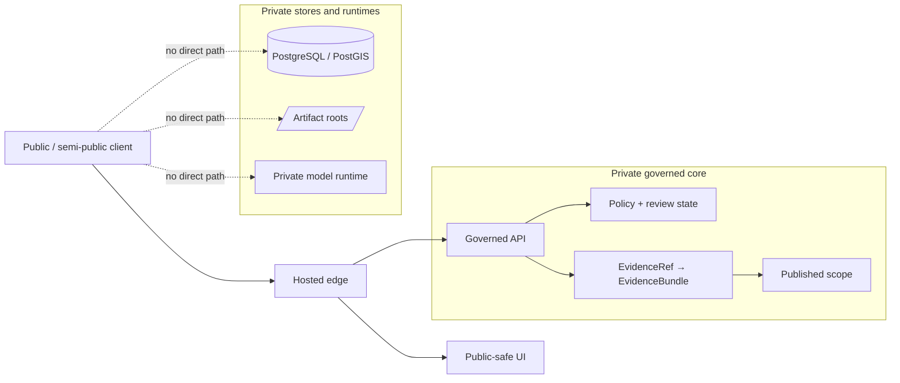

<!-- [KFM_META_BLOCK_V2]
doc_id: kfm://doc/UUID_NEEDS_VERIFICATION
title: hosted
type: standard
version: v1
status: draft
owners: @bartytime4life
created: NEEDS_VERIFICATION
updated: NEEDS_VERIFICATION
policy_label: NEEDS_VERIFICATION
related: [../README.md, ../local/README.md, ../systemd-or-compose/README.md, ../kubernetes/README.md, ../terraform/README.md, ../../README.md, ../../contracts/README.md, ../../schemas/README.md, ../../policy/README.md, ../../tests/README.md, ../../.github/workflows/README.md]
tags: [kfm, infra, hosted, edge, deployment]
notes: [owner is grounded from current public CODEOWNERS coverage for /infra/; doc_id, created, updated, and policy_label still need repo-record verification]
[/KFM_META_BLOCK_V2] -->

# hosted

Hosted split-edge overlays for public or semi-public KFM deployment surfaces.

> [!NOTE]
> **Status:** experimental deployment lane  
> **Owners:** `@bartytime4life` *(current public `CODEOWNERS` covers `/infra/`; no narrower `/infra/hosted/` rule was directly reverified)*  
>        
> **Repo fit:** `infra/hosted/README.md` is the directory guide for hosted KFM edge overlays that expose a public or semi-public entrypoint while keeping canonical truth, unpublished artifacts, policy internals, and private model runtimes off the direct client path.  
> **Quick jump:** [Scope](#scope) · [Repo fit](#repo-fit) · [Current public snapshot](#current-public-snapshot) · [Accepted inputs](#accepted-inputs) · [Exclusions](#exclusions) · [Directory tree](#directory-tree) · [Quickstart](#quickstart) · [Usage](#usage) · [Diagram](#diagram) · [Exposure matrix](#exposure-matrix) · [Task list / definition of done](#task-list--definition-of-done) · [FAQ](#faq) · [Appendix](#appendix)

> [!IMPORTANT]
> **Current evidence boundary:** this revision is grounded in the current public `main` tree **and** the March–April 2026 KFM doctrine corpus. `infra/`, `infra/hosted/`, sibling infra lanes, and current public `CODEOWNERS` coverage for `/infra/` are treated as **CONFIRMED checked-in repo surfaces**. Active deployment manifests, ingress rules, DNS/TLS automation, environment names, workflow gates, and runtime topology remain **UNKNOWN / NEEDS VERIFICATION** until a mounted checkout or runtime inventory is inspected.

> [!WARNING]
> Hosted exposure is a boundary decision, not a convenience shortcut. A hosted edge may publish a public-safe UI and/or governed API, but it must **not** create direct client paths to PostgreSQL/PostGIS, RAW / WORK / QUARANTINE roots, policy bundles, review internals, or private model runtimes.

| At a glance | Current working reading |
|---|---|
| Path | `infra/hosted/README.md` |
| Current public tree state | `infra/hosted/` is present and currently `README.md` only |
| Parent surface | `infra/` already exposes multiple sibling runtime lanes |
| Core rule | **Host the edge, not the whole trust system** |
| Boundary posture | Public-safe UI and/or governed API in front; canonical stores and sensitive internals stay private |

---

## Scope

`infra/hosted/` is the repo-facing lane for the hosted posture that KFM doctrine describes more formally as **public edge + private governed core**.

That makes this directory the place where KFM explains or configures **how exposure happens**. It is **not** the place to quietly relocate truth, policy, or hidden runtime shortcuts.

Typical material for this lane includes:

- publication maps that make public, semi-public, VPN-only, and steward-only boundaries explicit
- reverse-proxy / ingress overlays and hosted routing notes
- DNS, TLS, and certificate coordination for public-safe surfaces
- health, readiness, stale-state, rollback, and correction runbooks specific to hosted exposure
- observability notes tied to the edge boundary rather than to generic internal runtime behavior

What it should **not** become is an all-purpose dumping ground for “anything infra-like.”

[Back to top](#hosted)

## Repo fit

### Path and surrounding surfaces

| Kind | Path | Evidence status | Relationship |
|---|---|---:|---|
| Target doc | `infra/hosted/README.md` | **CONFIRMED** path | This file |
| Parent infra guide | [`../README.md`](../README.md) | **CONFIRMED** | Defines the wider runtime and operational-control lane |
| Root posture | [`../../README.md`](../../README.md) | **CONFIRMED** | Repo-level identity, truth posture, and navigation |
| Contracts surface | [`../../contracts/README.md`](../../contracts/README.md) | **CONFIRMED** | Hosted surfaces must honor machine contracts rather than redefine them |
| Schemas surface | [`../../schemas/README.md`](../../schemas/README.md) | **CONFIRMED** | Schema and validation posture for machine-checkable objects |
| Policy surface | [`../../policy/README.md`](../../policy/README.md) | **CONFIRMED** | Deny-by-default policy and decision grammar surface |
| Tests surface | [`../../tests/README.md`](../../tests/README.md) | **CONFIRMED** | Hosted exposure should be proven, not merely described |
| Workflow lane | [`../../.github/workflows/README.md`](../../.github/workflows/README.md) | **CONFIRMED** | Control-plane workflow intent and current public README-only workflow state |

### Current public snapshot

| Signal | Status | Why it matters here |
|---|---:|---|
| `infra/hosted/` exists on public `main` | **CONFIRMED** | Hosted is a real checked-in lane, not just a PDF concept |
| `infra/hosted/` contents on public `main` | **CONFIRMED** | The public tree currently shows `README.md` only, so this doc must not imply checked-in manifests that the tree does not prove |
| `infra/` parent surface is non-trivial | **CONFIRMED** | Hosted sits among multiple sibling lanes and should stay narrow rather than absorbing their roles |
| `/infra/` owner signal on current public `CODEOWNERS` | **CONFIRMED** | Public owner coverage currently resolves to `@bartytime4life` for `/infra/` |

### Current public infra neighbors

| Neighbor | Current public signal | Hosted relation |
|---|---|---|
| [`../local/README.md`](../local/README.md) | **CONFIRMED** path + README | Local-only bring-up lane; earlier phase than hosted exposure |
| [`../compose/README.md`](../compose/README.md) | **CONFIRMED** path + README-only directory | Compose runtime wiring lane, not the public edge itself |
| [`../systemd-or-compose/README.md`](../systemd-or-compose/README.md) | **CONFIRMED** path + README-only scaffold | Local orchestration decision lane that should not be confused with hosted publication |
| [`../kubernetes/README.md`](../kubernetes/README.md) | **CONFIRMED** path + README | Cluster-orchestration lane when service count or reconciliation burden justifies it |
| [`../terraform/README.md`](../terraform/README.md) | **CONFIRMED** path + README | Provisioning and hosted-environment wiring lane |
| [`../gitops/README.md`](../gitops/README.md) | **CONFIRMED** path + README-only directory | Desired-state / reconciliation lane if GitOps is adopted |
| [`../monitoring/README.md`](../monitoring/README.md), [`../dashboards/README.md`](../dashboards/README.md), [`../backup/README.md`](../backup/README.md) | **CONFIRMED** paths + READMEs | Observability, operator views, restore, and rollback neighbors that hosted changes should coordinate with |

### Upstream / downstream logic

**Upstream into `hosted/`**

- root project posture and trust doctrine
- contract and schema obligations
- policy and review rules
- test and workflow expectations
- the broader infra lane under [`../README.md`](../README.md)

**Downstream from `hosted/`**

- public or semi-public entrypoints
- public-safe UI/API exposure rules
- rollback and correction handling at the edge
- hosted observability and operator runbooks

[Back to top](#hosted)

## Current public snapshot

### Current public `infra/` excerpt (**CONFIRMED**)

```text
infra/
├── backup/
├── compose/
├── dashboards/
├── gitops/
├── hosted/
│   └── README.md
├── kubernetes/
├── local/
├── monitoring/
├── systemd/
├── systemd-or-compose/
├── terraform/
└── README.md
```

### Current public `hosted/` reading

The hosted lane is currently **docs-first** on public `main`.

That is useful in one direction and dangerous in another:

- useful, because the lane already exists and can define exposure discipline explicitly
- dangerous, because a docs-only lane can tempt readers to assume ingress rules, TLS automation, or deployment overlays that the public tree does **not** yet prove

This README should therefore keep checked-in reality and proposed future structure clearly separated.

[Back to top](#hosted)

## Accepted inputs

| What belongs here | Why it belongs here |
|---|---|
| Publication maps | Hosted exposure must be explicit and reviewable |
| Reverse-proxy / ingress overlays | These define the real edge boundary |
| DNS / TLS / certificate notes | Hosted surfaces need clear publication mechanics |
| Hosted environment notes | Exposure-specific runtime assumptions belong here |
| Edge health / readiness / smoke checks | Hosted lanes need more than “process is up” |
| Rollback and correction runbooks | Hosted rollout without reversal discipline is weak governance |
| Edge observability notes | Request IDs, audit joins, logs, and stale-state signals matter at the boundary |
| Firewall / VPN / exposure notes | Hosted changes alter network posture and should be documented visibly |
| Cross-links to provisioning or orchestration lanes | Hosted changes often depend on `terraform/`, `kubernetes/`, `compose/`, or `systemd/`, but should link outward instead of swallowing those lanes whole |

[Back to top](#hosted)

## Exclusions

| Does **not** belong here | Put it here instead |
|---|---|
| Canonical schema authority | [`../../contracts/README.md`](../../contracts/README.md) and [`../../schemas/README.md`](../../schemas/README.md) |
| Policy bundle authority | [`../../policy/README.md`](../../policy/README.md) |
| Verification strategy as doctrine | [`../../tests/README.md`](../../tests/README.md) plus policy / contract surfaces |
| Generic CI/workflow scaffolding | [`../../.github/workflows/README.md`](../../.github/workflows/README.md) |
| Local-only bootstrap mechanics | [`../local/README.md`](../local/README.md), [`../compose/README.md`](../compose/README.md), [`../systemd/README.md`](../systemd/README.md), or [`../systemd-or-compose/README.md`](../systemd-or-compose/README.md) |
| Cluster reconciliation mechanics | [`../kubernetes/README.md`](../kubernetes/README.md) or [`../gitops/README.md`](../gitops/README.md) |
| Provisioning state and IaC details | [`../terraform/README.md`](../terraform/README.md) |
| Monitoring, dashboards, and restore policy | [`../monitoring/README.md`](../monitoring/README.md), [`../dashboards/README.md`](../dashboards/README.md), or [`../backup/README.md`](../backup/README.md) |
| Direct database client patterns | Nowhere on the normal public path |
| Direct private model-runtime exposure | Never on the normal hosted edge |
| RAW / WORK / QUARANTINE browsing or file sharing | Governed internal runtime/storage paths, not hosted edge docs |
| Hidden convenience exceptions to the trust membrane | They do not belong in the normal hosted lane at all |

[Back to top](#hosted)

## Directory tree

### Current public hosted tree (**CONFIRMED**)

```text
infra/
└── hosted/
    └── README.md
```

### Illustrative future expansion (**PROPOSED**)

<details>
<summary>Show a possible hosted subtree shape</summary>

```text
infra/
└── hosted/
    ├── README.md
    ├── edge/
    │   ├── publication-map.<env>.md
    │   ├── ingress/
    │   └── tls/
    ├── checks/
    │   ├── health/
    │   ├── readiness/
    │   └── smoke/
    ├── runbooks/
    │   ├── cutover.md
    │   ├── rollback.md
    │   └── correction.md
    └── notes/
        ├── exposure-model.md
        └── hosted-constraints.md
```

This subtree is intentionally illustrative. Exact file names, stack choices, and environment labels remain **PROPOSED** or **NEEDS VERIFICATION** until direct repo and runtime evidence surface them.
</details>

[Back to top](#hosted)

## Quickstart

1. Confirm that hosted exposure is actually needed.  
   KFM does not gain trust merely by becoming internet-reachable.

2. Start at the parent infra guide.  
   Read [`../README.md`](../README.md) first so you do not mistake hosted exposure for the whole infra lane.

3. Define the boundary before the stack.  
   Decide what becomes reachable: public-safe UI, governed API, or both.

4. Write one explicit publication map.  
   Public, semi-public, VPN-only, loopback-only, and steward-only surfaces should be named before rollout.

5. Keep the normal public path narrow.  
   Edge → public-safe UI and/or governed API only.

6. Pair any hosted change with edge checks and rollback notes.  
   No hosted lane is credible if it only describes the happy path.

7. Refuse implied maturity.  
   If manifests, ingress rules, DNS/TLS automation, or environment maps are not real yet, keep them marked **PROPOSED** or **NEEDS VERIFICATION**.

### Minimal hosted review checklist

```text
[ ] Why is a hosted edge needed now?
[ ] Which surfaces become reachable: UI, governed API, or both?
[ ] What remains private: DB, artifact roots, policy internals, review internals, model runtime?
[ ] Where is the publication map?
[ ] Where are the health/readiness checks?
[ ] Where is the rollback path?
[ ] Which tests or checks prove no direct bypass exists?
[ ] Which sibling infra lanes also changed?
[ ] Which docs changed so hosted prose still matches hosted reality?
```

[Back to top](#hosted)

## Usage

### When to use `infra/hosted/`

Use this directory when the change is primarily about **edge exposure** rather than domain truth or local bootstrap.

Typical examples:

- moving from local-only or VPN-only access toward a public-safe edge
- introducing hosted UI and/or governed API exposure
- documenting split-edge routing, certificates, DNS, or ingress behavior
- adding hosted rollback, stale-state, or correction handling
- clarifying how public-safe entrypoints stay separate from canonical stores and private runtimes

### When **not** to use `infra/hosted/`

Do **not** use this directory when the work is primarily about:

- source admission or canonical ingest law
- schema or contract evolution
- policy grammar or review semantics
- evidence resolution logic
- local-only bootstrap or single-machine runtime mechanics
- provisioning, cluster orchestration, or controller-driven reconciliation that already belongs to a sibling infra lane

### Lane chooser

| If the change is mainly about… | Prefer this lane |
|---|---|
| Public-safe exposure, ingress, DNS/TLS, split-edge publication, edge rollback | `infra/hosted/` |
| Local-only bootstrap and contributor bring-up | `infra/local/` |
| Compose runtime wiring | `infra/compose/` |
| Host-native service supervision | `infra/systemd/` |
| Choosing between local `systemd` and Compose patterns | `infra/systemd-or-compose/` |
| Cluster orchestration | `infra/kubernetes/` |
| Declarative provisioning / hosted environment wiring | `infra/terraform/` |
| Desired-state reconciliation | `infra/gitops/` |
| Monitoring, dashboards, backup / restore | `infra/monitoring/`, `infra/dashboards/`, `infra/backup/` |

### Hosted in the KFM deployment ladder

| Phase | What is reachable | What stays private | Main concern | `hosted/` relevance |
|---|---|---|---|---|
| Local-only | Nothing public | Everything except host-local surfaces | Prove the governed slice first | Low |
| Private remote | VPN / overlay access to intended surfaces | Canonical stores, artifact roots, private runtimes | Controlled remote access | Medium |
| Public edge + private governed core | Public-safe UI and/or governed API | Canonical truth, unpublished artifacts, policy/review internals, private model runtime | Safe publication boundary | **Primary** |
| Production-grade separation | Dedicated edge, identity, API, workers, stores, policy, and ops surfaces | Sensitive/internal lanes stay tightly bounded | Blast radius, rollback, ops maturity | High |

### Hosted operating rule

A hosted KFM surface should still feel like **KFM**, not like a detached convenience app.

That means the edge still preserves:

- map-first, time-aware operation
- visible freshness / scope / correction cues
- drill-through to evidence for consequential claims
- first-class negative outcomes such as **abstain**, **deny**, **error**, and **stale-visible**
- the governed API as the only normal client-visible truth boundary

[Back to top](#hosted)

## Diagram



The operational point is simple: **host the edge, not the whole trust system**.

[Back to top](#hosted)

## Exposure matrix

| Surface / component | Public bind allowed? | Hosted responsibility | Must not happen |
|---|---:|---|---|
| Edge gateway / reverse proxy | Yes, when intentionally publishing | TLS, routing, request IDs, public-safe exposure | Becoming a hidden truth system |
| Public-safe UI | Yes | Presentation of governed surfaces | Direct reads from DB, artifact roots, or model runtime |
| Governed API | Sometimes, behind the intended edge | Client-visible truth boundary | Convenience pass-through to raw stores |
| PostgreSQL / PostGIS | No | Stay private: loopback, socket, or private subnet | Direct client exposure |
| Artifact roots (`RAW`, `WORK`, `QUARANTINE`, etc.) | No | Stay off the normal public path | File browsing or direct download shortcuts |
| Policy bundles / review internals | No | Internal enforcement dependency | Public read/write exposure |
| Private model runtime | No | Internal runtime dependency only | Direct internet or normal-LAN exposure |
| Ops / status endpoints | Rarely | Public-safe health only, if intentionally pared down | Becoming a second truth surface |

### Hosted change artifacts

| Artifact | Why it matters |
|---|---|
| Publication map | Makes exposure explicit and reviewable |
| Edge config diff | Shows what changed at the boundary |
| Health / readiness checks | Proves more than “the process booted” |
| Rollback runbook | Hosted rollout without rollback is fragile theater |
| Correction note / stale-state behavior | Public meaning can change and must stay visible |
| Observability update | Edge changes should be traceable in logs, metrics, and audit joins |
| Ownership / review note | Hosted changes need clear stewardship paths |

[Back to top](#hosted)

## Task list / definition of done

A hosted change is not done when the proxy starts. It is done when the hosted surface is still **governed**.

- [ ] The change explains **why** hosted exposure is needed.
- [ ] The hosted surface is tied to one explicit publication map.
- [ ] Only intended public-safe surfaces are reachable.
- [ ] PostgreSQL/PostGIS, artifact roots, policy/review internals, and private model runtimes remain non-public.
- [ ] Hosted logs preserve stable request or audit join identifiers.
- [ ] Health/readiness checks prove more than “process is up.”
- [ ] Rollback instructions exist in the same reviewable change set.
- [ ] Correction or stale-state behavior is documented if outward meaning can change.
- [ ] Documentation does not imply a stronger hosted reality than the repo currently proves.
- [ ] Any concrete ingress/orchestration choice is documented as an implementation choice, not as KFM doctrine.
- [ ] Owners and reviewers are explicit or intentionally inherited from a verified owner surface such as `CODEOWNERS`.
- [ ] If the change also touches `terraform/`, `kubernetes/`, `compose/`, `systemd/`, `monitoring/`, `dashboards/`, `backup/`, or `gitops/`, the cross-lane doc links are updated too.

[Back to top](#hosted)

## FAQ

### Does `hosted/` mean Kubernetes?

No. In KFM, **hosted** is a deployment responsibility lane, not proof of a specific orchestrator.

### Can a private model runtime live behind a hosted deployment?

Yes — **behind** it and **not directly on** the public path. The normal client path still crosses the governed API boundary, not the model runtime itself.

### Can we publish directly from a home network?

This directory should not normalize that as the default path. KFM doctrine prefers a progression from local-only to private remote to a small hosted split, then to stronger separation only when the operational burden justifies it.

### What is the minimum credible hosted shape?

A narrow edge, a public-safe UI and/or governed API, explicit publication mapping, private canonical stores, private runtime dependencies, visible stale/failure states, and rollback/correction discipline.

### Why is this README strict even though more of `infra/` is now visible on public `main`?

Because hosted exposure is the lane where implied maturity becomes dangerous fastest. The public tree now proves the lane exists; it does **not** yet prove active manifests, ingress rules, TLS automation, or live runtime behavior.

[Back to top](#hosted)

## Appendix

### Evidence labels used here

| Label | Meaning in this README |
|---|---|
| **CONFIRMED** | Supported by attached doctrine and/or directly inspected current public repo surfaces |
| **INFERRED** | Conservative structural reading drawn from confirmed doctrine or checked-in path names / README roles |
| **PROPOSED** | Recommended structure, workflow, or file family not yet proven as checked-in implementation |
| **NEEDS VERIFICATION** | Should be checked against the mounted repo tree, manifests, or runtime evidence before merge |
| **UNKNOWN** | Not verified strongly enough in the current session to present as settled reality |

<details>
<summary>Illustrative publication map template (<strong>PROPOSED</strong>)</summary>

```yaml
surface_id: hosted-edge
status: proposed
public_hosts:
  - app.example.org
reachable_surfaces:
  - ui
  - governed-api
private_dependencies:
  - postgres
  - artifact-tree
  - policy-runtime
  - private-model-runtime
must_not_expose:
  - raw
  - work
  - quarantine
  - policy-bundles
  - review-internals
checks:
  - health
  - readiness
  - rollback
  - correction
owners: NEEDS_VERIFICATION
notes: >
  Illustrative only. Replace with mounted repo/runtime facts before use.
```
</details>

<details>
<summary>Hosted review prompts for maintainers</summary>

```text
- What exactly becomes hosted?
- Which boundary object proves that exposure?
- Which systems remain private and why?
- What fails closed if the edge is up but evidence resolution is not?
- How is stale or generalized state made visible instead of hidden?
- Which rollback path preserves lineage rather than pretending nothing changed?
- Which sibling infra lanes also need coordinated documentation updates?
```
</details>

[Back to top](#hosted)
