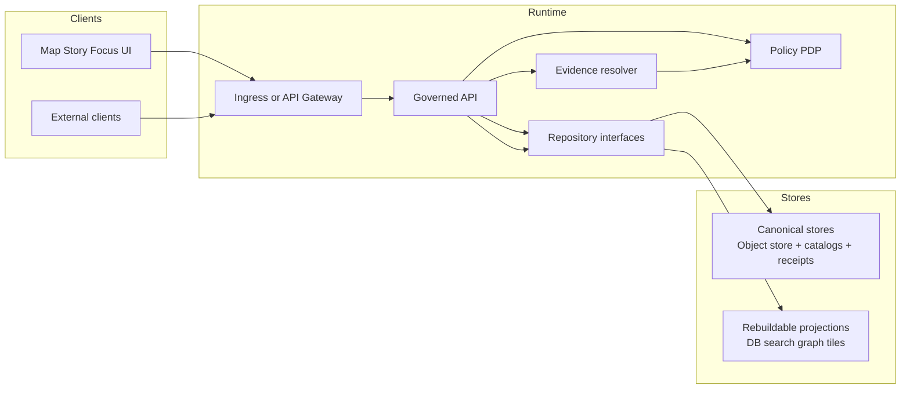
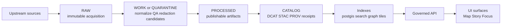

<a id="top"></a>

# infra/k8s
_GitOps-managed Kubernetes infrastructure for Kansas Frontier Matrix (KFM)._

**Status:** Draft (template — verify repo reality before applying)  
**Owners:** Platform/SRE (TBD) • Governance (TBD)  
**Scope:** cluster bootstrap • platform add‑ons • KFM runtime • pipeline runners • observability  
**Posture:** fail‑closed • policy‑enforced • auditable • reversible

✅ GitOps • 🔒 Default‑deny • 🧾 Run receipts • ♻️ Rebuildable projections

**Quick links:** [Quickstart](#quickstart) • [Repo layout](#repo-layout-proposed) • [Architecture](#architecture) • [GitOps workflow](#gitops-workflow) • [Security and governance](#security-and-governance) • [Definition of Done](#definition-of-done)

---

> [!IMPORTANT]
> This folder sits on KFM’s **trust membrane** boundary: **clients must never access storage/DB directly**.  
> Expose data only through the governed API + policy + evidence enforcement paths.

---

## Quickstart

This directory is intended to be **GitOps-reconciled** (Argo CD, Flux, OpenShift GitOps, etc.). Tool choice is implementation-specific; the invariants are not.

### Render + server-dry-run (recommended before any apply)

```bash
# Example: validate an environment overlay renders and is accepted by the API server
kubectl apply --dry-run=server -k infra/k8s/<PATH-TO-OVERLAY>

# Optional: preview diffs without changing the cluster
kubectl diff -k infra/k8s/<PATH-TO-OVERLAY>
```

### Apply (only after CI + policy gates pass)

```bash
kubectl apply -k infra/k8s/<PATH-TO-OVERLAY>
```

> [!NOTE]
> If this repo uses Helm instead of Kustomize, replace `-k` with your Helm workflow. The governance gates still apply.

([↑ Back to top](#top))

---

## What lives here

This folder is for **Kubernetes-only** infrastructure concerns:

- Cluster bootstrap (GitOps controller install, CRDs, baseline namespaces)
- Platform components (ingress/gateway, certs, external secrets, observability, policy PDP if deployed as a service/sidecar)
- KFM runtime workloads (API, evidence resolver, policy adapter, UI, etc.) _as Kubernetes manifests_
- Pipeline runners / job infrastructure (workloads that execute ingestion/indexing) _as Kubernetes manifests_
- Environment overlays (dev/stage/prod) and drift-safe configuration deltas

### What does **not** live here

- Business logic source code (services, UI app code)
- Private keys, long‑lived credentials, or plaintext secrets
- “Shortcut” endpoints that bypass policy/evidence enforcement to read from object storage or databases

([↑ Back to top](#top))

---

## Non-negotiable invariants

KFM’s infrastructure must enforce these invariants at runtime and through CI gates.

| Invariant | Meaning in practice | Kubernetes implications |
|---|---|---|
| Truth path lifecycle | Upstream → RAW → WORK/QUARANTINE → PROCESSED → CATALOG (DCAT+STAC+PROV+run receipts) → projections → governed API → UI | Separate canonical storage concerns from projections; deploy pipelines/indexers so they write receipts and catalogs; do not “serve” data that is not promoted |
| Trust membrane | Clients never access storage/DB directly; all access goes through governed APIs applying policy + redaction + logging | Ingress/gateway only exposes governed surfaces; no public routes to object store/DB; network policies restrict east-west traffic |
| Evidence-first UX | Every layer/claim opens into evidence: dataset version, rights, policy label, provenance chain, checksums | Ensure evidence resolver + catalog endpoints are deployed and reachable; UI routes exist to show badges/metadata |
| Cite-or-abstain (Focus Mode) | Answers cite resolvable evidence bundles or abstain; citation verification is a hard gate | Focus services must call evidence resolver; logs/receipts emitted; runtime policy check blocks leakage |
| Canonical vs rebuildable stores | Object store + catalogs + provenance are canonical; DB/search/graph/tiles are rebuildable projections | Treat projection datastores as disposable; back up canonical stores first; plan rebuild jobs |
| Deterministic identity/hashing | Stable dataset/version IDs and spec hashes | Enable immutable artifact addressing (digests) and reproducible builds; promote by digest, not mutable tags |

> [!TIP]
> If you are introducing a new component, explicitly call out which invariant(s) it touches and how it is policy‑gated.

([↑ Back to top](#top))

---

## Architecture

### Trust membrane (policy + evidence boundary)



### Truth path lifecycle (data to governed surfaces)



([↑ Back to top](#top))

---

## Repo layout (proposed)

> [!WARNING]
> This is a **proposed** layout derived from GitOps patterns. If the repo already has a structure, **make this section match reality**.

<details>
<summary><strong>Proposed directory tree</strong></summary>

```text
infra/k8s/
  README.md                   ← you are here

  bootstrap/                  ← GitOps controller + baseline CRDs/namespaces
    base/
    overlays/
      dev/
      stage/
      prod/

  components/                 ← cluster/platform add-ons (shared)
    ingress/
    cert-manager/
    external-secrets/
    policy-pdp/
    observability/

  apps/                       ← KFM workloads grouped by concern
    kfm-runtime/
      base/
      overlays/
        dev/
        stage/
        prod/
    kfm-pipelines/
      base/
      overlays/
        dev/
        stage/
        prod/

  policies/                   ← k8s admission / config policies (NOT data OPA rego)
  scripts/                    ← validate/diff helpers for contributors
```

</details>

### Naming conventions (recommended)

- Namespaces: `kfm-system`, `kfm-runtime`, `kfm-pipelines`, `kfm-observability` (adapt to org standards)
- Labels (minimum):
  - `app.kubernetes.io/name`
  - `app.kubernetes.io/part-of: kfm`
  - `app.kubernetes.io/component`
  - `app.kubernetes.io/managed-by: gitops`
  - `kfm.io/policy-surface: governed-api|evidence|pipeline|ui|projection`

([↑ Back to top](#top))

---

## Environments

Recommended stance: **configuration deltas are overlays**, not ad-hoc edits. Prefer Kustomize overlays or Helm values-per-env, and keep base manifests environment-agnostic.

| Environment | Overlay path | Purpose | Expected guardrails |
|---|---|---|---|
| local | `infra/k8s/.../overlays/local` (optional) | Developer loop | No production secrets; disposable storage |
| dev | `.../overlays/dev` | Integration testing | CI required; policy gates on |
| stage | `.../overlays/stage` | Release candidate | Drift detection; backup/restore rehearsals |
| prod | `.../overlays/prod` | Governed runtime | Strict RBAC; default-deny networking; audited changes |

([↑ Back to top](#top))

---

## GitOps workflow

**Goal:** reconcile desired state from Git; keep changes reviewable and reversible.

1. **Change manifests via PR** (no direct kubectl edits in shared clusters).
2. **CI gates run** (render, schema validate, policy checks, security checks).
3. **Merge to main** only when gates pass (fail-closed posture).
4. GitOps controller **syncs** cluster state to match Git.
5. Rollback = **git revert** (plus any required data rollback procedure handled by the data promotion system).

### Local validation checklist (run before opening PR)

```bash
# Render
kustomize build infra/k8s/<PATH-TO-OVERLAY> >/tmp/rendered.yaml

# Server-side dry-run (catches API schema errors)
kubectl apply --dry-run=server -f /tmp/rendered.yaml

# Optional: diff
kubectl diff -f /tmp/rendered.yaml
```

([↑ Back to top](#top))

---

## Security and governance

### Policy parity (CI ↔ runtime)

KFM requires **the same policy semantics** in CI and runtime (or at minimum the same fixtures and outcomes). Otherwise, CI guarantees are meaningless.

Implementation patterns (choose one):

- Policy PDP as a sidecar container next to the governed API
- Policy PDP as an internal service called by the governed API / evidence resolver
- Embedded policy evaluation (OPA/WASM or equivalent) inside the API service

> [!IMPORTANT]
> UI may display policy badges/notices, but **UI must never make policy decisions**.

### Default-deny + safe errors

- Default deny for sensitive-location and restricted datasets
- Never leak restricted metadata through error behavior (403/404 must be policy-safe)
- Do not embed precise coordinates in Story Nodes / Focus outputs unless policy explicitly allows
- Treat redaction/generalization as a first-class transform recorded in provenance

### Trust membrane enforcement (k8s controls)

Minimum technical controls you should expect to see (and add if missing):

- **NetworkPolicy**: default deny per namespace; explicitly allow required flows
- **RBAC**: least privilege service accounts; no cluster-admin for app workloads
- **Ingress/Gateway**:
  - only exposes UI + governed APIs
  - does not expose object store / DBs
- **Pod Security**: restricted posture where possible; drop capabilities; read-only FS when feasible
- **Secrets**: sourced from an external secret manager; no plaintext in Git

([↑ Back to top](#top))

---

## Operations

### Rollbacks

- Preferred rollback is **git revert** of the offending manifest change.
- For stateful systems, ensure you have an explicit rollback plan (migrations, schema changes).
- Projection stores should be rebuildable; canonical stores require backup and governance review before destructive actions.

### Disaster recovery (minimum expectations)

- Back up **canonical stores** first (object store + catalogs + receipts/audit ledger).
- Document rebuild procedures for **projections** (tiles/search/graph/DB indexes).

([↑ Back to top](#top))

---

## Definition of Done

For any PR that changes `infra/k8s/**`, the PR is “done” only when:

- [ ] Manifests render for every targeted environment (`kustomize build` or Helm template)
- [ ] Server-side dry-run succeeds (`kubectl apply --dry-run=server ...`)
- [ ] Drift-safe: change can be reconciled by GitOps controller without manual mutation
- [ ] No new direct storage/DB exposures; trust membrane preserved
- [ ] RBAC is least-privilege; service accounts scoped
- [ ] NetworkPolicy reviewed/updated (default deny remains true)
- [ ] Secrets are not added to Git; secret references documented
- [ ] Observability updated (metrics/logs/traces, dashboards or runbooks)
- [ ] Rollback steps documented (git revert + any stateful recovery steps)

([↑ Back to top](#top))

---

## Appendix

<details>
<summary><strong>Example: default-deny NetworkPolicy (namespace scope)</strong></summary>

```yaml
apiVersion: networking.k8s.io/v1
kind: NetworkPolicy
metadata:
  name: default-deny
  namespace: kfm-runtime
spec:
  podSelector: {}
  policyTypes:
    - Ingress
    - Egress
```

</details>

<details>
<summary><strong>Example: allow API → policy PDP</strong></summary>

```yaml
apiVersion: networking.k8s.io/v1
kind: NetworkPolicy
metadata:
  name: allow-api-to-policy
  namespace: kfm-runtime
spec:
  podSelector:
    matchLabels:
      app.kubernetes.io/component: policy-pdp
  policyTypes: [Ingress]
  ingress:
    - from:
        - podSelector:
            matchLabels:
              app.kubernetes.io/component: governed-api
      ports:
        - protocol: TCP
          port: 8181
```

</details>
