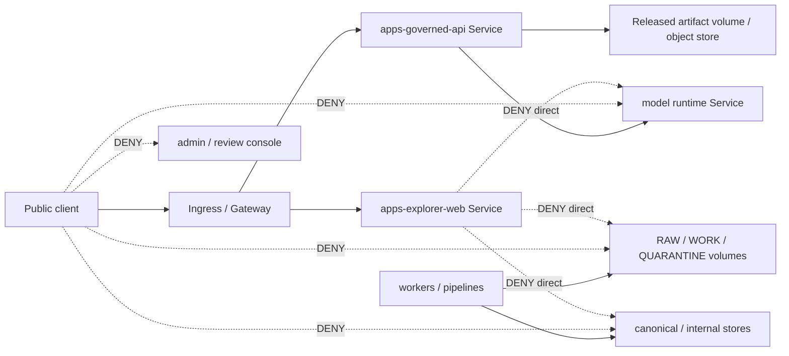

<!-- [KFM_META_BLOCK_V2]
doc_id: kfm://doc/infra-kubernetes-readme
title: infra/kubernetes/ — Kubernetes Deployment Manifests and Cluster Boundary Guidance
type: per-directory-readme
version: v1
status: draft
owners:
  - <infra-steward>
  - <security-owner>
  - <ops-steward>
created: 2026-07-03
updated: 2026-07-03
policy_label: public
related:
  - infra/README.md
  - infra/hardening/README.md
  - infra/hardening/CHECKLIST.md
  - infra/docker/
  - infra/compose/
  - infra/reverse_proxy/
  - infra/firewall/
  - infra/vpn/
  - infra/systemd/
  - infra/terraform/
  - configs/
  - runtime/
  - apps/governed-api/
  - apps/explorer-web/
  - docs/doctrine/directory-rules.md
  - docs/security/README.md
  - docs/security/EXPOSURE_PLAN.md
  - docs/architecture/deployment-topology.md
  - docs/runbooks/
  - policy/
  - release/
  - data/published/
tags:
  - kfm
  - infra
  - kubernetes
  - deployment
  - hardening
  - trust-membrane
  - governed-api
  - deny-by-default
  - least-privilege
  - rollback
notes:
  - "Kubernetes manifests are deployment mechanics. They must not become policy authority, secret storage, schema authority, release authority, or a public bypass around governed APIs."
  - "Public ingress must route only to governed public surfaces and released artifact hosting. RAW, WORK, QUARANTINE, internal stores, direct model endpoints, and steward/admin routes are denied by default."
[/KFM_META_BLOCK_V2] -->

<a id="top"></a>

# `infra/kubernetes/` — Kubernetes Deployment Manifests and Cluster Boundary Guidance

> **One-line purpose.** Hold Kubernetes deployment materials for KFM while preserving deny-by-default exposure, least privilege, governed API routing, raw-data denial, model-runtime isolation, auditability, and rollback.


---

## Quick jump

[Purpose](#purpose) · [Status & authority](#status--authority) · [Repo fit](#repo-fit) · [What belongs here](#what-belongs-here) · [What does not belong here](#what-does-not-belong-here) · [Cluster trust membrane](#cluster-trust-membrane) · [Manifest expectations](#manifest-expectations) · [Validation](#validation) · [Review burden](#review-burden) · [Open verification](#open-verification)

---

## Purpose

`infra/kubernetes/` is the Kubernetes deployment lane for Kansas Frontier Matrix. It may hold Kubernetes manifests, overlays, environment templates, admission notes, namespace plans, network policy guidance, workload hardening notes, and cluster-facing deployment documentation.

This folder exists to keep Kubernetes deployment mechanics aligned with KFM's core operating law:

```text
RAW -> WORK / QUARANTINE -> PROCESSED -> CATALOG / TRIPLET -> PUBLISHED
```

Kubernetes must not flatten that lifecycle into “anything mounted in the cluster is available.” Pods, services, ingresses, volumes, service accounts, and network policies must preserve the trust membrane.

Public traffic should reach KFM through governed public surfaces only:

```text
public client -> ingress / edge -> apps/governed-api/ or released static artifacts
```

Public traffic must not reach RAW stores, WORK stores, QUARANTINE stores, unpublished candidates, source credentials, direct model runtimes, internal/canonical stores, or steward-only admin paths.

[Back to top](#top)

---

## Status & authority

| Field | Value |
|---|---|
| **Document type** | Per-directory README |
| **Owning responsibility root** | `infra/` |
| **Subpath role** | `kubernetes/` — Kubernetes manifests, overlays, namespace/network/service-account guidance, and deployment notes |
| **Authority level** | Draft deployment guidance. KFM doctrine, accepted ADRs, `policy/`, and release gates outrank this README. |
| **Lifecycle phase** | n/a — deployment mechanics, not lifecycle data |
| **Default posture** | DENY unless an exposure is explicitly governed, reviewed, released, and rollback-safe |
| **Owners** | `<infra-steward>`, `<security-owner>`, `<ops-steward>` — fill from CODEOWNERS when assigned |
| **Reviewers required** | Infra steward + security owner for cluster access, ingress, network policy, volume mounts, service accounts, secrets, model runtime, admin surface, or public exposure changes |
| **Directory Rules basis** | `infra/` owns deployment, host, network, and exposure posture; `kubernetes/` is a named lane under the expected `infra/` tree. |

[Back to top](#top)

---

## Repo fit

```text
Kansas-Frontier-Matrix/
└── infra/
    ├── README.md
    ├── docker/
    ├── compose/
    ├── reverse_proxy/
    ├── vpn/
    ├── firewall/
    ├── systemd/
    ├── kubernetes/       ◀── you are here
    │   └── README.md
    ├── terraform/
    └── hardening/
```

### Responsibility split

| Location | Owns | Does not own |
|---|---|---|
| `infra/kubernetes/` | Kubernetes deployment mechanics, manifests, overlays, namespace/service/network policy guidance | KFM policy semantics, schemas, source descriptors, release decisions, app source code |
| `infra/hardening/` | Cross-infra hardening baselines and checklists | Concrete cluster manifests unless this README delegates them here |
| `infra/reverse_proxy/` | Reverse proxy / edge details outside the cluster or shared with cluster ingress | Kubernetes-native ingress manifests unless placed here by convention |
| `infra/firewall/` | Host/network firewall boundaries outside or around the cluster | Kubernetes NetworkPolicy object meaning unless implemented here |
| `configs/` | Non-secret configuration templates and examples | Real secrets or cluster credentials |
| `policy/` | Enforceable allow / deny / restrict / abstain rules | Kubernetes deployment mechanics |
| `runtime/` | Runtime/model adapters behind governed APIs | Public Kubernetes ingress exposure |
| `apps/governed-api/` | Trust membrane application behavior | Cluster-level host/network hardening |
| `release/` | Release decisions, manifests, rollback cards, corrections | Deployment manifests |

[Back to top](#top)

---

## What belongs here

Use `infra/kubernetes/` for Kubernetes-specific deployment materials such as:

- Namespace plans and namespace-level isolation notes.
- Deployment, StatefulSet, DaemonSet, Job, CronJob, Service, Ingress, Gateway, NetworkPolicy, ServiceAccount, Role, RoleBinding, ConfigMap template, and storage template files.
- Kustomize overlays, Helm chart wrappers, or plain manifest bundles when KFM chooses one convention.
- Kubernetes-specific hardening notes for workloads, pod security, resource limits, probes, service accounts, and network policy.
- Ingress routing rules that prove public traffic reaches only governed public surfaces or released static artifacts.
- Internal service routing notes for `apps/governed-api/`, `apps/explorer-web/`, workers, review console, runtime adapters, and model runtimes.
- Model-runtime isolation manifests that keep direct model endpoints private.
- Read-only mount patterns for released artifacts and strict denial patterns for RAW / WORK / QUARANTINE.
- Redacted examples showing how to reference secret stores without committing real secret values.
- Cluster validation notes and sanitized dry-run output.
- Rollback notes for manifest or overlay changes.

Accepted file types are Markdown, YAML manifests, Kustomize files, Helm values templates, sanitized examples, policy-adjacent validation notes, and generated-but-reviewable manifests when their canonical source is declared.

[Back to top](#top)

---

## What does not belong here

Do **not** use `infra/kubernetes/` as a hidden authority root.

The following must not live here:

- Real Kubernetes Secrets containing live credentials, tokens, certificates, private keys, database passwords, API keys, or source credentials.
- Raw source data, work data, quarantine data, published data artifacts, catalog records, triplets, proofs, receipts, or release manifests.
- Policy bundles or Rego rules that belong in `policy/`.
- JSON Schemas or machine contracts that belong under `schemas/contracts/v1/...`.
- Application source code for `apps/`, reusable library code for `packages/`, or runtime adapters for `runtime/`.
- Root-truth statements that claim a Kubernetes object can publish, approve, certify, or release KFM data.
- Direct public ingress to model runtimes, source stores, raw data stores, internal/canonical stores, or admin surfaces.
- Debug-only routes, wildcard ingress rules, broad service-account permissions, or unrestricted cluster-admin shortcuts.
- Unredacted incident data, exploit payloads, private hostnames, internal IP lists, or vulnerability working notes for unfixed issues.

If real secrets or sensitive deployment details are committed here, treat that as a security incident: rotate, audit, remove, and record the response through the incident/runbook path.

[Back to top](#top)

---

## Cluster trust membrane

Kubernetes routing must make the KFM trust membrane visible and enforceable.



### Required cluster-level guarantees

A Kubernetes deployment is not acceptable until it can show these negative states:

1. Public ingress to direct model-runtime services is denied.
2. Public ingress to RAW / WORK / QUARANTINE storage is denied.
3. Public ingress to internal/canonical stores is denied.
4. Public ingress to admin/review surfaces is denied unless explicitly steward-only and authenticated.
5. Browser-facing UI cannot route directly to model runtime, raw storage, source credentials, or internal stores.
6. Worker/pipeline pods do not publish by themselves; they emit receipts, candidates, reports, or artifacts for governed review.
7. Released artifact hosting serves only reviewed, released, rollback-addressable artifacts.
8. Missing policy, release, or evidence closure leads to DENY or ABSTAIN at the governed API boundary, not a Kubernetes bypass.

[Back to top](#top)

---

## Proposed structure

The exact convention is **PROPOSED** until the repository settles on Kustomize, Helm, plain manifests, or a hybrid. Do not create every folder unless needed by a concrete deployment slice.

```text
infra/kubernetes/
├── README.md
├── base/
│   ├── namespace.yaml
│   ├── serviceaccounts.yaml
│   ├── networkpolicies.yaml
│   ├── apps-governed-api.yaml
│   ├── apps-explorer-web.yaml
│   ├── workers.yaml
│   ├── runtime-model-private.yaml
│   └── published-artifacts-readonly.yaml
├── overlays/
│   ├── local/
│   ├── staging/
│   └── production/
├── ingress/
│   ├── README.md
│   └── governed-public-routes.yaml
├── networkpolicy/
│   ├── README.md
│   ├── deny-by-default.yaml
│   ├── governed-api-egress.yaml
│   └── model-runtime-private.yaml
├── rbac/
│   ├── README.md
│   ├── serviceaccounts.yaml
│   └── least-privilege-roles.yaml
├── storage/
│   ├── README.md
│   ├── published-readonly.yaml
│   └── nonpublic-deny-notes.md
├── jobs/
│   ├── README.md
│   └── validation-dry-run.yaml
└── validation/
    ├── README.md
    └── checklist.md
```

### Naming conventions

- Use lowercase kebab-case for manifest filenames.
- Name public routes by exposure intent, not convenience.
- Name private services with `private` where direct public access must be impossible.
- Keep environment overlays small and reviewable.
- Avoid duplicating values that belong in non-secret `configs/` templates.

[Back to top](#top)

---

## Manifest expectations

### Namespace and isolation

- Default namespace should not be used for KFM workloads.
- Public, internal, runtime, and admin/review workloads should be isolated by namespace or strong labels plus NetworkPolicy.
- Label workload purpose and exposure posture explicitly.

### NetworkPolicy

- Start with deny-by-default ingress and egress where practical.
- Permit public ingress only to approved ingress/gateway targets.
- Permit browser-facing services to reach only the governed API and required static assets.
- Keep model runtimes private to governed API adapters.
- Keep RAW / WORK / QUARANTINE storage private to approved workers and internal validation jobs.

### RBAC and service accounts

- Use dedicated service accounts per workload family.
- Do not use broad cluster-admin roles for application workloads.
- Keep review/admin permissions separate from public-serving workloads.
- Scope read/write access by actual need.

### Volumes and data access

- Public-serving pods should not mount RAW, WORK, QUARANTINE, unpublished candidates, source credentials, or internal stores.
- Released artifact mounts should be read-only where possible.
- Worker mounts should be narrow and phase-specific.
- StorageClass, PVC, and object-store references must be reviewed for sensitivity and release state.

### Secrets and configuration

- Do not commit real Kubernetes Secret values.
- Use external secret references, sealed/encrypted secret tooling, or environment-specific secret managers when adopted.
- ConfigMaps may hold non-secret configuration only.
- Secret names and environment variable names may be documented, but live values must not appear in the repo.

### Ingress and public routes

- Public ingress must be explicit.
- No wildcard public route should expose internal service names.
- Ingress should route public API calls to governed API only.
- Static artifact routes must serve released artifacts only.
- Admin/review routes must be private, authenticated, and audited.

### Probes and diagnostics

- Health endpoints must not leak secrets, raw paths, internal routes, EvidenceBundle bodies, prompt text, or restricted source data.
- Readiness should fail closed if required policy/release/evidence dependencies are unavailable.
- Debug endpoints must not be publicly exposed.

### Resource controls

- Set resource requests and limits for public-facing workloads.
- Keep model-runtime resource use isolated from public API availability where practical.
- Avoid one noisy workload taking down the governed API boundary.

[Back to top](#top)

---

## Validation

Every Kubernetes change should include evidence for these checks, or explicitly mark them `NEEDS VERIFICATION` with a follow-up issue.

| Check | Expected result | Evidence |
|---|---|---|
| YAML parse / dry run | Manifests parse and apply in dry-run mode | `kubectl apply --dry-run=server` or equivalent |
| Kustomize / Helm render | Rendered output is reviewable and deterministic | Rendered manifest summary |
| Secret scan | No real secret material committed | Secret scan result |
| Ingress review | Public routes are explicit and governed | Route table / manifest diff |
| NetworkPolicy review | Deny-by-default and least-privilege paths are visible | NetworkPolicy summary |
| RBAC review | No unnecessary cluster-admin or broad wildcard permissions | Role/RoleBinding summary |
| Volume review | Public pods do not mount non-public lifecycle stores | Pod spec / PVC review |
| Model isolation | Runtime service is private to governed API path | Service/NetworkPolicy check |
| Raw-data denial | RAW/WORK/QUARANTINE public access denied | Negative test or manifest proof |
| Admin isolation | Admin/review routes are private and audited | Ingress/auth/audit note |
| Rollback | Rollback or forward-fix path exists | Runbook / rollback note |

### Suggested local checks

Use the project’s chosen tooling once verified. Until then, reviewers may request the appropriate subset of:

```bash
# Examples only; adapt to the chosen cluster and manifest convention.
kubectl apply --dry-run=client -f infra/kubernetes/<path>
kubectl kustomize infra/kubernetes/overlays/<env>
kubectl auth can-i --as=system:serviceaccount:<namespace>:<serviceaccount> <verb> <resource>
```

Do not paste kubeconfigs, tokens, private cluster endpoints, or unredacted dry-run output containing sensitive details into public PR discussion.

[Back to top](#top)

---

## Review burden

| Change type | Required review |
|---|---|
| README-only wording with no posture change | Infra steward or docs steward |
| Namespace, ingress, gateway, service, or public route change | Infra steward + security owner + governed API owner |
| NetworkPolicy, firewall-adjacent, or service-mesh behavior | Infra steward + security owner |
| RBAC, ServiceAccount, Role, RoleBinding, cluster permissions | Infra steward + security owner |
| Model-runtime deployment, service, or network path | Runtime owner + security owner |
| Storage, PVC, object-store mount, or lifecycle data access | Data steward + infra steward + security owner |
| Admin/review-console deployment or access | Ops steward + security owner |
| Secret integration or external secret tooling | Security owner + infra steward |
| Production overlay or rollback-impacting change | Release steward + infra steward + security owner |
| Exception to deny-by-default | ADR or documented risk acceptance with rollback path |

[Back to top](#top)

---

## Open verification

- [ ] Confirm whether KFM will use Kustomize, Helm, plain manifests, Terraform-managed Kubernetes resources, or another convention.
- [ ] Confirm Kubernetes target: local cluster, k3s, kind, managed cloud cluster, homelab cluster, or production cluster.
- [ ] Confirm namespace strategy and whether public/internal/runtime/admin workloads are namespace-separated.
- [ ] Confirm ingress controller, Gateway API usage, or reverse-proxy handoff.
- [ ] Confirm NetworkPolicy provider and whether deny-by-default policy is enforced.
- [ ] Confirm external secret manager or sealed/encrypted secret workflow.
- [ ] Confirm RBAC baseline and service-account naming convention.
- [ ] Confirm model runtime deployment pattern and network binding.
- [ ] Confirm released artifact hosting pattern and whether Kubernetes serves it directly or delegates to object storage/CDN.
- [ ] Confirm validation commands in CI.
- [ ] Confirm rollback process for Kubernetes manifests and overlays.
- [ ] Confirm CODEOWNERS for `infra/kubernetes/`.

[Back to top](#top)

---

## Last reviewed

| Field | Value |
|---|---|
| Last reviewed | 2026-07-03 |
| Review status | Draft README replacing greenfield stub |
| Next review trigger | First concrete Kubernetes manifest, overlay, ingress, NetworkPolicy, RBAC, storage, model-runtime, or production deployment PR |
