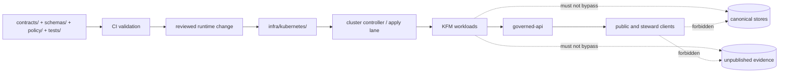

<!-- [KFM_META_BLOCK_V2]
doc_id: kfm://doc/NEEDS_VERIFICATION
title: Kubernetes
type: standard
version: v1
status: draft
owners: @bartytime4life
created: NEEDS_VERIFICATION
updated: NEEDS_VERIFICATION
policy_label: public
related: [../README.md, ../backup/README.md, ../compose/README.md, ../dashboards/README.md, ../gitops/README.md, ../hosted/README.md, ../local/README.md, ../monitoring/README.md, ../systemd/README.md, ../systemd-or-compose/README.md, ../terraform/README.md, ../../.github/CODEOWNERS, ../../.github/workflows/README.md, ../../contracts/, ../../schemas/, ../../policy/, ../../tests/, ../../docs/]
tags: [kfm, infra, kubernetes]
notes: [Current public main confirms `infra/kubernetes/` exists as a README-only scaffold lane; broad `/infra/` CODEOWNERS coverage currently resolves to `@bartytime4life`; `schemas/` is a separate upstream verification surface; live manifests, controller choice, cluster topology, and active workflow gates remain NEEDS VERIFICATION.]
[/KFM_META_BLOCK_V2] -->

# Kubernetes

Governed container-orchestrated runtime lane for KFM when declarative cluster operations are justified by service count, operational burden, or reconciliation needs.

> [!IMPORTANT]
> This revision is intentionally **repo-aware and implementation-bounded**.
> It preserves the doctrinal role of `infra/kubernetes/`, tightens a few repo-fit edges to match the current public tree, and keeps live manifests, controller choice, cluster topology, and active workflow gates explicitly **UNKNOWN / NEEDS VERIFICATION** until a mounted checkout or runtime inventory is inspected.

## Impact block

**Status:** experimental  
**Owners:** `@bartytime4life` *(current public broad `/infra/` CODEOWNERS coverage)*  
**Current public tree:** `README.md` only  
**Truth posture:** CONFIRMED current public path + README-only lane + doctrinal boundary / PROPOSED structure + practices / UNKNOWN live cluster reality  
**Repo fit:** `infra/kubernetes/` under [`infra/`](../README.md)


**Quick jump:** [Scope](#scope) · [Repo fit](#repo-fit) · [Current public signal](#current-public-signal) · [Inputs](#inputs) · [Exclusions](#exclusions) · [Directory tree](#directory-tree) · [Quickstart](#quickstart) · [Usage](#usage) · [Diagram](#diagram) · [Verification matrix](#verification-matrix) · [What belongs where](#what-belongs-where) · [Delivery decision guide](#delivery-decision-guide) · [Definition of done](#definition-of-done) · [FAQ](#faq)

---

## Scope

This directory is the **cluster-facing runtime wiring lane** for Kansas Frontier Matrix.

It exists to hold Kubernetes-specific delivery material such as manifests, overlays, reconciliation inputs, ingress and network exposure rules, storage/runtime wiring, and operations-facing cluster declarations.

It does **not** exist to redefine KFM doctrine, public contract law, shared schema truth, source admission rules, policy semantics, or canonical truth handling. Those remain upstream responsibilities that Kubernetes must consume, not invent.

### What this directory is for

- Declarative workload wiring for KFM services
- Environment overlays for cluster deployment
- Ingress, service, network-policy, and secret-reference configuration
- ServiceAccount / RBAC bindings when they are cluster-scoped and workload-specific
- Kubernetes-specific observability, backup, scaling, and disruption controls
- GitOps-compatible runtime declarations, when adopted
- Cluster-only delivery notes that should not live in app code

### What this directory is not for

- Canonical data transforms
- Source onboarding logic
- Public API contract definitions
- Shared schema authority
- Evidence resolution semantics
- Business rules hidden inside manifests
- Cleartext secrets
- One-off emergency shell commands treated as the source of truth

[Back to top](#kubernetes)

## Repo fit

**Path:** `infra/kubernetes/`  
**Document:** `infra/kubernetes/README.md`

**Upstream context**

- [`../README.md`](../README.md) — infra-wide doctrine and directory positioning
- [`../../contracts/`](../../contracts/) — shared API contracts, fixtures, and controlled vocabularies
- [`../../schemas/`](../../schemas/) — shared schema surface that runtime wiring must not silently replace
- [`../../policy/`](../../policy/) — policy bundles, fixtures, and policy tests
- [`../../tests/`](../../tests/) — contract, policy, integration, and end-to-end validation
- [`../../docs/`](../../docs/) — long-form doctrine, runbooks, and architecture references
- [`../../.github/CODEOWNERS`](../../.github/CODEOWNERS) — current public broad owner routing for `/infra/`
- [`../../.github/workflows/README.md`](../../.github/workflows/README.md) — public workflow-lane inventory and historical workflow signal

**Primary adjacent lanes**

- [`../gitops/README.md`](../gitops/README.md) — reconciliation/controller-facing delivery lane
- [`../terraform/README.md`](../terraform/README.md) — infrastructure provisioning lane
- [`../local/README.md`](../local/README.md) — local-development or smallest credible stack
- [`../systemd/README.md`](../systemd/README.md) — single-host governed runtime lane
- [`../systemd-or-compose/README.md`](../systemd-or-compose/README.md) — one-host choice surface between native units and Compose
- [`../compose/README.md`](../compose/README.md) — Compose/system composition lane
- [`../hosted/README.md`](../hosted/README.md) — hosted edge overlays and externally reachable deployment profiles

**Operational sibling lanes**

- [`../monitoring/README.md`](../monitoring/README.md) — monitoring-specific assets
- [`../dashboards/README.md`](../dashboards/README.md) — dashboard surfaces and rendered ops views
- [`../backup/README.md`](../backup/README.md) — backup, restore, retention, and recovery planning

**Downstream effect**

Changes here can alter how KFM services are placed, exposed, reconciled, observed, restarted, throttled, or recovered. They must therefore preserve the trust membrane and must never create a bypass from public clients to canonical stores or unpublished runtime scope.

> [!NOTE]
> `infra/kubernetes/` is only one lane in the public `infra/` subtree. On current public `main`, the sibling set also includes `backup/`, `compose/`, `dashboards/`, `gitops/`, `hosted/`, `local/`, `monitoring/`, `systemd/`, `systemd-or-compose/`, and `terraform/`; this README should stay narrow enough that Kubernetes does not silently absorb responsibilities those lanes already reserve elsewhere.

[Back to top](#kubernetes)

## Current public signal

The current public repo tells us more than a purely doctrinal rewrite, but still much less than a mounted runtime inspection.

| Public signal | Current visible state | Why it matters |
|---|---|---|
| `infra/kubernetes/` lane | Present on public `main` and currently contains `README.md` only | The lane is real, but checked-in manifests are not yet public-main-proven |
| Parent `infra/` subtree | Sibling lanes visible on public `main`, including `backup/`, `compose/`, `dashboards/`, `gitops/`, `hosted/`, `local/`, `monitoring/`, `systemd/`, `systemd-or-compose/`, and `terraform/` | Kubernetes should be documented as one lane among several, not as the whole infra story |
| Owner routing | Public `CODEOWNERS` assigns broad `/infra/` coverage to `@bartytime4life` | The owner field can be upgraded from placeholder to current public coverage |
| Workflow evidence | Public `main` shows `.github/workflows/README.md` only; Actions history shows prior workflow activity and deleted workflow filenames | Historical workflow behavior is visible, but current checked-in workflow YAML gates remain **NEEDS VERIFICATION** |
| Shared schema surface | The current public root exposes `schemas/` as its own top-level surface | Cluster wiring should not absorb schema authority that the repo already separates upstream |

### Reading rule for this section

- **CONFIRMED** here means *public repo tree evidence on `main`*
- **PROPOSED** still covers starter subtrees, file families, and operational practices not yet checked in under `infra/kubernetes/`
- **UNKNOWN / NEEDS VERIFICATION** still covers live cluster topology, controller choice, Helm/Kustomize adoption, actual manifests, secrets strategy, required checks, and runtime behavior

[Back to top](#kubernetes)

## Inputs

Accepted inputs for this directory include:

- Kubernetes manifests or manifest fragments
- Helm/Kustomize overlays **only when actually adopted and verified**
- Namespace, Service, Ingress, Route-equivalent, and NetworkPolicy declarations
- ServiceAccount / RBAC bindings that are cluster-scoped and workload-specific
- Secret references, config references, and volume wiring
- Probe, disruption-budget, scaling, and rollout settings
- ServiceMonitor, alerting, and metrics scrape wiring that is Kubernetes-specific
- Backup, restore, and scheduled job declarations that are cluster-scoped
- Cluster-specific README/runbook material that explains runtime behavior

### Typical artifact families

| Artifact family | Belongs here | Notes |
|---|---:|---|
| Workload manifests | Yes | Deployments, StatefulSets, Jobs, CronJobs, DaemonSets, etc. |
| Service exposure rules | Yes | Services, Ingress, gateway bindings, TLS references |
| Network policies | Yes | Especially where trust membrane enforcement is runtime-visible |
| RBAC / service accounts | Yes | Least-privilege runtime identity and access wiring |
| Secret references | Yes | References only; not secret values in cleartext |
| Helm/Kustomize overlays | Maybe | Only if the repo truly adopts them |
| GitOps app definitions | Maybe | Often better in `../gitops/` unless tightly coupled here |
| Terraform | No | Keep infra provisioning in `../terraform/` |
| OpenAPI / JSON Schema | No | Keep canonical contract and schema ownership in `../../contracts/` and `../../schemas/` |
| Business policy semantics | No | Keep in `../../policy/` and shared policy-runtime packages |
| Canonical source/data logic | No | Keep in packages/workers, not cluster wiring |

[Back to top](#kubernetes)

## Exclusions

The following do **not** belong here:

- Public contract law that should be versioned in `contracts/`
- Shared schema truth that should be versioned in `schemas/`
- Governance semantics that should be versioned in `policy/`
- Domain truth hidden in ConfigMaps, annotations, or image entrypoints
- Manual-only operational knowledge with no reviewed declarative counterpart
- Direct database credentials committed in plaintext
- Cluster changes that silently weaken citation, publication, or scope boundaries
- Renderer/style meaning encoded as runtime-only infrastructure behavior
- Review-only or release-only actions hidden behind untracked admin scripts

> [!WARNING]
> Kubernetes convenience must not become KFM authority. If a manifest starts deciding publication truth, evidence legality, policy meaning, public contract shape, or shared schema behavior, the design has crossed the wrong boundary.

[Back to top](#kubernetes)

## Directory tree

### Current verified snapshot

```text
infra/kubernetes/
└── README.md
```

### Starter expansion shape (PROPOSED)

The following is a **recommended next shape**, not a claim of mounted contents.

```text
infra/kubernetes/
├── README.md
├── base/                        # PROPOSED: shared core manifests
├── overlays/                    # PROPOSED: env / trust-shape overlays
│   ├── private/
│   ├── steward/
│   ├── review/
│   └── public/
├── ingress/                     # PROPOSED: exposure/TLS/gateway bindings
├── network-policies/            # PROPOSED: trust-membrane runtime enforcement
├── rbac/                        # PROPOSED: least-privilege service accounts and role bindings
├── storage/                     # PROPOSED: PVC/class/snapshot bindings
├── observability/               # PROPOSED: ServiceMonitor / scrape / alert wiring
├── backups/                     # PROPOSED: backup/restore schedules and notes
├── jobs/                        # PROPOSED: scheduled rebuild / validation / correction jobs
├── policies/                    # PROPOSED: cluster admission helpers only, not business law
└── runbooks/                    # PROPOSED: k8s-specific rollback / restore / incident notes
```

### Naming guidance

Prefer names that explain runtime responsibility, not internal team folklore.

- Good: `governed-api`, `evidence-resolver`, `review-console`, `catalog-worker`
- Weak: `core`, `main`, `service-a`, `misc`, `ops2`

[Back to top](#kubernetes)

## Quickstart

Because live cluster/controller reality is **UNKNOWN**, the first useful quickstart is an **inventory-first** one.

1. Read [`../README.md`](../README.md) to confirm infra-wide expectations.
2. Verify whether Kubernetes is actually an adopted runtime lane for the target environment.
3. Export the current live contents of `infra/kubernetes/` before adding structure. Current public `main` confirms the README, but not a checked-in manifest inventory.
4. Identify whether delivery is:
   - plain manifests,
   - Helm,
   - Kustomize,
   - Argo CD / Flux / another GitOps controller,
   - or not yet cluster-managed.
5. Confirm that no public surface can bypass the governed API.
6. Confirm how secrets are referenced, rotated, and withheld from repo history.
7. Confirm least-privilege runtime identity decisions if ServiceAccounts, Roles, or RoleBindings are in scope.
8. Confirm rollback, restore, and correction paths before broadening the workload set.
9. Only then decide whether the change belongs here, in [`../gitops/`](../gitops/README.md), in [`../terraform/`](../terraform/README.md), or in a one-host / hosted lane such as [`../systemd/`](../systemd/README.md), [`../systemd-or-compose/`](../systemd-or-compose/README.md), or [`../hosted/`](../hosted/README.md).

### Minimum review snippet

```bash
# Inventory first; do not assume live shape from doctrine alone.
find infra/kubernetes -maxdepth 3 -type f | sort

# Then compare with adjacent infra lanes.
find infra/gitops -maxdepth 3 -type f | sort
find infra/terraform -maxdepth 3 -type f | sort
find infra/systemd -maxdepth 3 -type f | sort
find infra/systemd-or-compose -maxdepth 3 -type f | sort
```

> [!NOTE]
> The commands above are an operator convenience example, not proof that those files or subtrees already exist in the live repo beyond what has been verified.

[Back to top](#kubernetes)

## Usage

### Use this lane when

- multiple KFM services need coordinated cluster placement
- reconciliation, rollout control, and drift management matter
- ingress/TLS/network policy must be reviewed declaratively
- ServiceAccount / RBAC decisions need to remain close to the workloads they constrain
- probe, disruption, backup, or scaling posture must be tracked as code
- the runtime has grown past a simple single-host or Compose-only setup

### Prefer another lane when

- the work is provisioning cloud/network/storage foundations rather than deploying workloads  
  → use [`../terraform/`](../terraform/README.md)

- the work is controller/reconciliation topology rather than raw cluster objects  
  → use [`../gitops/`](../gitops/README.md)

- the runtime is a single-host Linux service envelope rather than cluster orchestration  
  → use [`../systemd/`](../systemd/README.md) or [`../systemd-or-compose/`](../systemd-or-compose/README.md)

- the work is hosted edge wiring or externally reachable non-cluster overlays  
  → use [`../hosted/`](../hosted/README.md)

- the work is local-first development or one-host container composition  
  → use [`../local/`](../local/README.md), [`../compose/`](../compose/README.md), or [`../systemd-or-compose/`](../systemd-or-compose/README.md)

### KFM-specific operating rule

Deployment changes **runtime placement**. Promotion changes **trust state**.

Kubernetes belongs on the deployment side of that line. It must not silently become the system that decides whether something is admissible, promoted, or authoritative.

[Back to top](#kubernetes)

## Diagram



### Reading the diagram

- `contracts/ + schemas/ + policy/ + tests/` stay upstream of runtime wiring.
- `infra/kubernetes/` carries reviewed cluster intent.
- workloads serve clients through the governed API boundary.
- direct client-to-store or client-to-unpublished-scope access is out of bounds.

[Back to top](#kubernetes)

## Verification matrix

| Question | Expected answer | Current status |
|---|---|---|
| Is `infra/kubernetes/` present on current public `main`? | Yes | CONFIRMED |
| Does current public `main` show checked-in manifests below this path? | No; `README.md` only | CONFIRMED |
| Is Kubernetes confirmed as the default KFM runtime? | No assumption without live verification | UNKNOWN |
| Is this directory cluster-facing only? | Yes | PROPOSED documentation target |
| Can public clients reach canonical stores directly? | No | CONFIRMED doctrine |
| Is a separate shared-schema surface visible upstream of this lane? | Yes | CONFIRMED |
| Are Helm/Kustomize/Argo/Flux verified in this repo lane? | Only if directly inspected | UNKNOWN |
| Should secrets live in git history here? | No | CONFIRMED engineering rule |
| Can manifests define business policy meaning? | No | CONFIRMED design boundary |
| Should rollback and correction be documented here when runtime changes are introduced? | Yes | CONFIRMED doctrine / PROPOSED file practice |
| Is the live manifest inventory known from current evidence? | No | UNKNOWN |
| Is a checked-in public workflow YAML gate for this lane proven on current `main`? | No; public workflows lane is README-only | CONFIRMED current snapshot / active gate still UNKNOWN |

## What belongs where

| Concern | Should live in | Must not live in |
|---|---|---|
| Public API contract truth | `../../contracts/` + governed-api implementation | ad hoc manifest annotations |
| Shared schema truth | `../../schemas/` | manifest-local schema copies |
| Business policy semantics | `../../policy/` | cluster-only hacks |
| Runtime exposure | `infra/kubernetes/` | browser code |
| Cluster-scoped runtime identity | `infra/kubernetes/` | ad hoc cluster-admin mutations |
| Canonical data transforms | workers / packages | init containers as hidden law |
| Evidence resolution | governed API + resolver packages | ingress/controller rules |
| Secret material | secret store or external refs | committed plaintext |
| Rollback notes | runbooks + release docs + cluster notes | operator memory only |

## Delivery decision guide

| Situation | Best fit |
|---|---|
| One-host thin slice, early exploration | `infra/local/` or `infra/systemd-or-compose/` |
| Single-host governed runtime on Linux | `infra/systemd/` or `infra/systemd-or-compose/` |
| Hosted public edge without cluster adoption | `infra/hosted/` |
| Provisioning cloud/network/storage primitives | `infra/terraform/` |
| Declarative workload placement on a cluster | `infra/kubernetes/` |
| Reconciler/controller-owned promotion of desired runtime state | `infra/gitops/` |
| Monitoring stack assets independent of orchestration shape | `infra/monitoring/` + `infra/dashboards/` |

[Back to top](#kubernetes)

## Definition of done

A Kubernetes-facing change in this directory is not ready until:

- [ ] the live runtime/controller model has been identified
- [ ] the change is clearly cluster-facing and not misplaced business law
- [ ] exposure paths preserve the governed API boundary
- [ ] cleartext secrets are absent from the change
- [ ] least-privilege ServiceAccount / RBAC choices are deliberate when introduced
- [ ] probe, startup, shutdown, and disruption settings are deliberate
- [ ] rollback steps are written and reviewed
- [ ] correction implications are stated if public meaning could change
- [ ] ownership/reviewer path is clear
- [ ] CI or equivalent validation path is documented
- [ ] the change does not silently redefine publication, evidence, policy, or shared schema semantics

### Merge gate expectations

| Gate | Why it matters |
|---|---|
| YAML / template validity | Prevent malformed runtime declarations |
| Dependency / path checks | Prevent misplaced infra logic |
| Secret scanning | Prevent repo-history leakage |
| RBAC / privilege review | Prevent privilege creep and quiet back doors |
| Policy / boundary review | Preserve trust membrane |
| Docs update | Keep ops and review state legible |
| Rollback check | Ensure reversibility under incident pressure |

[Back to top](#kubernetes)

## FAQ

### Is Kubernetes the default KFM runtime?

Not as a repo-proven fact. Treat Kubernetes here as a supported **infrastructure lane**, not as an automatically verified current deployment standard.

### Does current public `main` prove an active Kubernetes manifest inventory?

No. What is publicly confirmed today is the lane and its README. Manifest families, controller objects, overlays, and cluster-specific files remain **NEEDS VERIFICATION** until they appear in the live checkout.

### Are Helm or Kustomize required?

No repo-wide requirement is asserted here. Use them only if the live repo and deployment model actually adopt them.

### Should GitOps files live here or in `infra/gitops/`?

Use this directory for cluster-facing runtime declarations. Put controller/reconciliation-specific material in `infra/gitops/` unless a file is inseparable from the workload declaration it reconciles.

### Should ServiceAccounts or RBAC live here?

Yes, when they are cluster-specific, workload-facing, and part of the reviewed runtime declaration. They should stay narrowly scoped and should not become a hiding place for business policy or ambient admin power.

### Can I put policy decisions in admission rules or manifest values?

Only cluster-admission mechanics belong here. Business policy meaning, rights logic, evidence legality, publication law, and shared schema authority belong upstream in shared policy / contract / schema surfaces.

### Can a workload in this lane expose canonical stores directly?

No. KFM’s trust membrane prohibits normal clients from bypassing governed interfaces.

### What about quick emergency fixes with `kubectl`?

Break-glass actions can exist operationally, but they must be exceptional, reviewable, auditable, and reconciled back into reviewed repository truth.

[Back to top](#kubernetes)

## Appendix

<details>
<summary><strong>Suggested starter file families (PROPOSED)</strong></summary>

### Base workload set

- `base/governed-api.yaml`
- `base/evidence-resolver.yaml`
- `base/review-console.yaml`
- `base/workers.yaml`

### Exposure and policy-facing runtime controls

- `ingress/public.yaml`
- `ingress/steward.yaml`
- `network-policies/default-deny.yaml`
- `network-policies/api-only-store-access.yaml`

### Identity and least-privilege controls

- `rbac/governed-api.yaml`
- `rbac/workers.yaml`

### Runtime resilience

- `jobs/projection-rebuild.yaml`
- `jobs/correction-propagation.yaml`
- `backups/catalog-backup.yaml`
- `backups/release-proof-retention.yaml`

### Cluster-facing runbooks

- `runbooks/rollback.md`
- `runbooks/restore.md`
- `runbooks/probe-tuning.md`
- `runbooks/controller-drift.md`

</details>

<details>
<summary><strong>Review checklist for stewards and platform engineers</strong></summary>

- Does this change alter only runtime wiring, or is it smuggling in business meaning?
- Can the same behavior be understood from reviewed files without operator folklore?
- Does the exposure model still preserve public-read vs steward-read vs review-action separation?
- Are least-privilege RBAC choices visible and justified?
- Are trust cues, rollback path, and correction handling still legible after deployment?
- Would a new contributor know where to update the adjacent contract, policy, schema, or runbook material?

</details>

---

Built to keep KFM’s trust seams visible even when orchestration grows more sophisticated.
