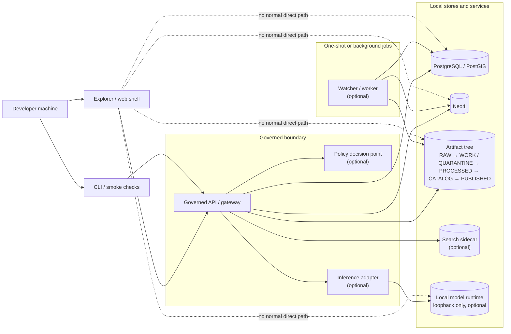

<!-- [KFM_META_BLOCK_V2]
doc_id: kfm://doc/TODO-REVIEW-UUID
title: Local infrastructure (infra/local)
type: standard
version: v1
status: draft
owners: TODO-REVIEW-OWNERS
created: YYYY-MM-DD
updated: YYYY-MM-DD
policy_label: TODO-REVIEW-POLICY-LABEL
related: [../../apps/, ../../contracts/, ../../policy/, ../../data/, ../../docs/, ../]
tags: [kfm, infra, local, development, compose]
notes: [PDF-bounded revision; current-session filesystem inspection did not expose a mounted repo checkout; repo-relative links, exact filenames, owners, and local defaults must be verified before commit]
[/KFM_META_BLOCK_V2] -->

<a id="top"></a>

# Local infrastructure (`infra/local`)
Single-machine development and integration wiring for Kansas Frontier Matrix, meant to boot governed developer surfaces without bypassing KFM’s trust membrane.

> [!IMPORTANT]
> **Status:** experimental  
> **Owners:** `TODO-REVIEW-OWNERS`  
>       
> **Quick jump:** [Scope](#scope) · [Repo fit](#repo-fit) · [Directory tree](#directory-tree) · [Quickstart](#quickstart) · [Usage](#usage) · [Diagram](#diagram) · [Service matrix](#service-matrix) · [Task list](#task-list) · [FAQ](#faq)

> [!NOTE]
> **Truth legend used in this file**  
> **CONFIRMED** = directly supported by current-session evidence  
> **INFERRED** = strong consequence of multiple project sources  
> **PROPOSED** = documented starter pattern not reverified in the mounted repo  
> **UNKNOWN / NEEDS VERIFICATION** = not confirmed in this session

> [!NOTE]
> The March 2026 corpus describes two local patterns at once: a **single-host governed runtime envelope** and a **Compose-based contributor stack**. This README uses the first as doctrine and the second as the most concrete developer workflow currently visible in the project documents. Exact repo filenames, service defaults, and neighboring docs still need live-tree verification.

---

## Scope

`infra/local/` is the contributor-facing surface for **environment mechanics**: local service wiring, bootstrap helpers, dev-only persistence, smoke checks, and start/stop guidance for a smallest credible KFM stack.

In KFM terms, this directory should help one machine prove the architecture without weakening it. A local stack is successful only if it preserves the same load-bearing boundaries the hosted system will need later:

- browser and client traffic should hit a **governed API surface** first
- canonical stores should stay behind the trust membrane
- local artifacts should still respect the truth path  
  `RAW → WORK / QUARANTINE → PROCESSED → CATALOG → PUBLISHED`
- any optional local model runtime should remain **behind an adapter**, not exposed as a direct client endpoint

What this directory should **not** become is a hiding place for domain rules, policy meaning, or canonical data semantics. Infra wiring may mount or route those things; it should not redefine them.

[Back to top](#top)

---

## Repo fit

> [!NOTE]
> Repo-relative paths below were supplied by the task brief or inferred from the attached corpus. Treat them as **review placeholders** until the mounted repo tree is verified.

| Aspect | Fit |
|---|---|
| **Path** | `infra/local/` |
| **Primary audience** | Contributors, reviewers, and operators running the smallest useful KFM stack on one machine |
| **Role** | Local container/service wiring, runtime envelopes, env templates, local persistence, bootstrap helpers, and smoke-test instructions |
| **Upstream dependencies** | [`../../apps/`](../../apps/), [`../../contracts/`](../../contracts/), [`../../policy/`](../../policy/), [`../../data/`](../../data/) |
| **Downstream handoff** | [`../`](../) broader infra surface, [`../../docs/`](../../docs/) runbooks and verification notes |
| **Trust posture** | Local browser and UI surfaces should interact with the governed API first, not treat PostGIS, Neo4j, the artifact tree, or any local model runtime as normal entry points |
| **Current confidence** | KFM doctrine is stronger than current mounted repo evidence. The live directory contents of `infra/local/` are **UNKNOWN** in this session |

[Back to top](#top)

---

## Inputs

Accepted inputs for this directory include:

- local Compose files and local-only overrides
- systemd or wrapper scripts for a single-host runtime, where the repo actually uses them
- `.env` templates, sample env files, and documented environment-variable expectations
- safe persistence mounts, named volumes, and destructive reset guidance
- seed/bootstrap helpers, smoke-test scripts, and contributor convenience wrappers
- local reverse-proxy or dev-cert material when browser-safe HTTPS is needed
- optional sidecar wiring for policy, search, watchers, or bounded local inference

---

## Exclusions

| This does **not** belong here | Put it here instead |
|---|---|
| Domain and business rules | [`../../apps/`](../../apps/) or the repo’s actual runtime package/module surface |
| Canonical contracts and schema definitions | [`../../contracts/`](../../contracts/) |
| Policy meaning, bundles, and decision grammar | [`../../policy/`](../../policy/) |
| Canonical datasets, release objects, and proof artifacts | [`../../data/`](../../data/) |
| Hosted deployment policy and edge/runtime separation docs | `../` or the repo’s verified hosted/deployment overlays |
| CI gates, attestation logic, and workflow orchestration | `.github/workflows/`, `tools/`, or dedicated runbooks |
| Long-lived secrets committed to Git | Local `.env`, external secret stores, or platform secret injection |

> [!WARNING]
> If a local helper starts deciding policy, shaping evidence, or redefining domain meaning, it has already escaped this directory’s remit.

[Back to top](#top)

---

## Directory tree

> [!CAUTION]
> **CONFIRMED current-session workspace observation:** a mounted repo checkout was not visible during drafting.  
> The tree below is therefore a **starter shape**, not a claim that these files already exist.

```text
infra/
└── local/
    ├── README.md
    ├── docker-compose.yaml          # PROPOSED local compose entrypoint
    ├── compose.override.yaml        # OPTIONAL / NEEDS VERIFICATION
    ├── .env.example                 # NEEDS VERIFICATION
    ├── init/                        # OPTIONAL seed/bootstrap helpers
    ├── scripts/                     # OPTIONAL wrappers and smoke checks
    └── volumes/                     # OPTIONAL local persistence helpers
```

Some project materials also show a **root-level dev compose** pattern such as `docker-compose.dev.yml`. If that is the live repo reality, keep it visible and use `infra/local/` as the documentation and wrapper surface rather than forcing a second, drifting source of truth.

[Back to top](#top)

---

## Quickstart

### 1) Install container prerequisites

Example Ubuntu path:

```bash
sudo apt install docker.io docker-compose-plugin
sudo usermod -aG docker "${USER}"
newgrp docker
docker run hello-world
```

Mac and Windows contributors may instead use Docker Desktop.

### 2) Pick the documented local stack variant

The current corpus shows **two** local entrypoint styles.

| Variant | Where it appears in the corpus | How to treat it |
|---|---|---|
| `infra/local/docker-compose.yaml` | March 2026 build-oriented/local-infra materials | **PROPOSED** until the mounted repo confirms this path |
| `docker-compose.dev.yml` | February 2026 starter-stack material | **Documented variant**; use only if the live repo keeps dev compose at the repo root |

> [!TIP]
> The corpus uses both `docker compose` and legacy `docker-compose` spellings. Prefer the invocation style supported by the verified compose file in the live repo.

### 3) Create or review the local environment file

Illustrative starter pattern:

```bash
# verify the actual template filename first
cp .env.example .env
$EDITOR .env
```

Useful variable groups visible in the current corpus include:

- database connection/bootstrap settings
- graph connection and auth
- API mode and commit/reference metadata
- web-shell API base URL
- optional policy/search/watcher toggles
- image selection for locally built or pulled services

### 4) Start the stack

First, see which documented compose file actually exists:

```bash
ls infra/local/docker-compose.yaml docker-compose.dev.yml 2>/dev/null
```

Then run the matching variant.

```bash
# Variant A — directory-local compose (PROPOSED until repo-verified)
docker compose -f infra/local/docker-compose.yaml up --build
```

```bash
# Variant B — root-level dev compose (documented starter variant)
docker compose -f docker-compose.dev.yml up --build
```

### 5) Verify the core surfaces

| Surface | Typical local address | What “good” looks like | Status |
|---|---|---|---|
| Governed API | `http://localhost:8000/docs` | API docs load and at least one simple route responds | INFERRED |
| Explorer / web shell | `http://localhost:3000` | Base application loads and reaches the API | INFERRED |
| Neo4j browser | `http://localhost:7474` | Browser UI loads if Neo4j is part of the chosen profile | INFERRED |
| Policy engine | `http://localhost:8181` | Only if OPA is wired into the local profile | PROPOSED |
| PostGIS | host port varies; commonly `5432` | container health/logs show database ready | INFERRED |
| Watcher / worker | no public URL expected | emits logs or a typed receipt if the repo ships this path | PROPOSED |

### 6) Stop or reset the stack

```bash
export COMPOSE_FILE=infra/local/docker-compose.yaml   # or docker-compose.dev.yml
docker compose -f "$COMPOSE_FILE" down
```

> [!CAUTION]
> This removes local volumes and should be used only for an intentional clean-room reset:
>
> ```bash
> export COMPOSE_FILE=infra/local/docker-compose.yaml   # or docker-compose.dev.yml
> docker compose -f "$COMPOSE_FILE" down -v
> ```

[Back to top](#top)

---

## Usage

### Daily development loop

Keep the stack running while you work. Use a second terminal for logs, shells, tests, and one-off tasks.

| Activity | Example command | Status |
|---|---|---|
| Boot stack | `docker compose -f "$COMPOSE_FILE" up --build` | PROPOSED until compose file is verified |
| Inspect services | `docker compose -f "$COMPOSE_FILE" ps` | INFERRED |
| Stream API logs | `docker compose -f "$COMPOSE_FILE" logs -f api` | INFERRED |
| Stream web logs | `docker compose -f "$COMPOSE_FILE" logs -f web` | INFERRED |
| Enter API container | `docker compose -f "$COMPOSE_FILE" exec api bash` | INFERRED |
| Run backend tests | `docker compose -f "$COMPOSE_FILE" exec api pytest` | INFERRED |
| Run frontend tests | `docker compose -f "$COMPOSE_FILE" exec web npm test` | INFERRED |
| Inspect API docs | open `http://localhost:8000/docs` | INFERRED |
| Try local receipt emission | `docker compose -f docker-compose.dev.yml run --rm watcher > receipts/0001.json` | PROPOSED / documented variant only |

> [!NOTE]
> Service names such as `api`, `web`, `postgis`, `neo4j`, and `watcher` are visible in the attached local-stack materials, but they are **not** mounted-repo facts yet.

### Local operating rules

1. Treat the **web shell** as a client surface, not an admin bypass.
2. Treat the **governed API** as the place where trust-bearing access decisions happen.
3. Treat direct PostGIS or Neo4j access as **debug/operator activity**, not the product’s normal path.
4. Keep configuration externalized; do not hardcode local secrets into Compose or app code.
5. Keep the local artifact tree legible to the truth path; avoid “mystery temp folders” that bypass lifecycle meaning.
6. If a local model runtime exists, keep it **loopback-only and adapter-mediated**.
7. Promote valuable shell experiments into scripts or docs before they turn into tribal knowledge.

### Common command patterns

```bash
# pick the verified compose file once
export COMPOSE_FILE=infra/local/docker-compose.yaml   # or docker-compose.dev.yml

# inspect services
docker compose -f "$COMPOSE_FILE" ps

# API shell
docker compose -f "$COMPOSE_FILE" exec api bash

# backend tests
docker compose -f "$COMPOSE_FILE" exec api pytest

# frontend tests
docker compose -f "$COMPOSE_FILE" exec web npm test

# logs
docker compose -f "$COMPOSE_FILE" logs -f api web
```

If the live repo exposes seed/bootstrap or smoke-test wrappers, document the exact entrypoints here only after verifying their filenames and idempotency behavior.

[Back to top](#top)

---

## Diagram



The goal of local infra is not to reproduce every hosted service. It is to reproduce the **shape of the trust model** clearly enough that local success still means architectural success.

[Back to top](#top)

---

## Tables

### Service matrix

| Service | Local role | Typical binding | Evidence status | Notes |
|---|---|---:|---|---|
| Governed API / gateway | Primary programmatic surface for browser and operator traffic | `8000` | CONFIRMED doctrine / INFERRED binding | API docs at `/docs` are part of the documented dev flow |
| Explorer / web shell | Contributor-facing map/UI shell | `3000` | INFERRED | Expected to proxy or call the governed API |
| PostgreSQL / PostGIS | Canonical relational + spatial store | `5432` | CONFIRMED runtime component / INFERRED binding | Described as part of the phase-one local runtime and compose dev stack |
| Neo4j | Graph store | `7474`, `7687` | INFERRED | Documented in the compose-style dev workflow |
| Policy engine (OPA) | Optional local PDP sidecar | `8181` | PROPOSED | Visible as an optional service, not a confirmed default |
| Watcher / worker | One-shot or background job lane | n/a | PROPOSED | February starter materials show a minimal `watcher` emitting a typed receipt |
| Search sidecar | Local search/testing acceleration | `9200` or similar | PROPOSED | Mentioned as optional only |
| Artifact tree / local volumes | Lifecycle-aware local artifact storage | n/a | CONFIRMED doctrine / NEEDS VERIFICATION for actual pathing | Must stay legible to the truth path |
| Local model runtime | Bounded synthesis/embedding runtime behind an adapter | loopback only | CONFIRMED doctrine / UNKNOWN as mounted service | No direct browser or public-client traffic |

### Environment matrix

| Key or group | Example name seen in corpus | Purpose | Status |
|---|---|---|---|
| Database URL / bootstrap | `KFM_DATABASE_URL`, `POSTGRES_*` | API boot and PostGIS connectivity | INFERRED |
| Graph URL / auth | `KFM_NEO4J_URL`, `NEO4J_AUTH` | Neo4j connection and auth | INFERRED |
| Runtime provenance / mode | `KFM_COMMIT_SHA`, `KFM_MODE` | Build/run identity and local mode selection | INFERRED |
| Frontend API base URL | `REACT_APP_API_URL` or equivalent | Browser → governed API routing | INFERRED |
| Image selection | `API_IMAGE` | Compose image selection for local services | PROPOSED |
| Optional policy/search/watcher toggles | repo-specific | Enable or disable sidecars and helper lanes | PROPOSED |

### Documented compose-path variants

| Compose path | Evidence posture | Recommended use |
|---|---|---|
| `infra/local/docker-compose.yaml` | PROPOSED starter path | Use if the live repo actually places local compose under `infra/local/` |
| `docker-compose.dev.yml` | Documented variant | Use if the verified repo keeps the dev stack at the root |
| `docker-compose.yml` or `docker-compose.yaml` at root | UNKNOWN in this session | Only use if the mounted repo confirms it |

[Back to top](#top)

---

## Task list

### Before treating this directory as settled

- [ ] Confirm that `infra/local/` exists in the mounted repo and reconcile this README with neighboring files.
- [ ] Confirm the canonical compose filename and whether the repo uses `infra/local/docker-compose.yaml`, `docker-compose.dev.yml`, or another path.
- [ ] Confirm the real env-template filename, location, and secret-handling guidance.
- [ ] Confirm the actual default local services versus optional services.
- [ ] Confirm exact service names used by Compose or other local runners.
- [ ] Confirm bootstrap/seed behavior, if any.
- [ ] Confirm health checks, smoke-test commands, and expected first-run logs.
- [ ] Confirm whether policy evaluation happens in-container, on-host, or only in CI for local runs.
- [ ] Confirm whether a local model runtime exists and, if so, how it is kept behind the governed boundary.
- [ ] Confirm broader infra/doc links once the repo tree is visible.

### Definition of done for this README

A reviewer should be able to:

- identify the verified compose entrypoint
- create the local env file without guessing
- start the stack and check the right surfaces
- understand which services are core, optional, or absent
- avoid architectural bypasses during development
- see which claims are still provisional and require repo-side confirmation

[Back to top](#top)

---

## FAQ

### Why does this README keep saying `CONFIRMED`, `INFERRED`, and `PROPOSED`?

Because KFM doctrine rejects paper certainty. A useful local README should help contributors start the stack **without pretending** that unverified filenames, defaults, or commands are already settled.

### Why are there two local patterns here?

Because the current corpus shows both a **single-host governed runtime envelope** and a **Compose-based developer stack**. This README preserves both, but refuses to blur them into one false certainty.

### Does local infrastructure need every hosted-plane service?

No. The local stack should be large enough to prove governed flows and small enough to stay usable on one machine.

### Where should policy meaning live?

Not here. `infra/local/` may route or mount a policy service, but the policy bundle, decision grammar, and tests belong under [`../../policy/`](../../policy/).

### Is direct PostGIS or Neo4j access allowed?

For debugging, maybe. For the product’s normal path, no. Client-facing flows should still traverse the governed API boundary.

### Can the browser call a local model runtime directly?

No. If a local model runtime exists, it should stay behind an inference adapter and behind the same trust membrane as other governed services.

### Which compose filename wins?

The mounted repo wins. This README documents multiple variants because the attached corpus does, but the live tree decides the actual path.

[Back to top](#top)

---

## Appendix

<details>
<summary><strong>Documented local patterns in the current corpus</strong></summary>

Different March 2026 documents contribute different layers of confidence. This README deliberately keeps them separated.

| Source strand | What it contributes | How this README uses it |
|---|---|---|
| Canonical March 2026 runtime doctrine | Trust membrane, fail-closed posture, single-host governed stack, local model runtime behind the membrane | Used as the doctrinal anchor for scope, boundaries, and non-bypass rules |
| Comprehensive dev-stack blueprint | `.env` configuration, Compose startup, API/web/PostGIS/Neo4j pattern, `/docs`, hot-reload and log habits | Used for contributor workflow and common dev commands |
| February starter-stack material | Root-level `docker-compose.dev.yml`, concrete env names, example `watcher`, typed receipt emission | Used only as a documented variant, not as confirmed repo reality |
| Current-session workspace observation | Mounted repo tree not directly visible | Used to keep filenames, links, and defaults reviewable instead of overstated |

### Practical consolidation rule

When this file is reviewed against the live repo, use this order:

1. **Mounted repo reality**
2. **March 2026 KFM doctrine**
3. **Concrete local-stack workflow docs**
4. **Starter or idea-pack variants**

That keeps local documentation useful without letting implementation guesses outrank project law.

</details>

[Back to top](#top)
