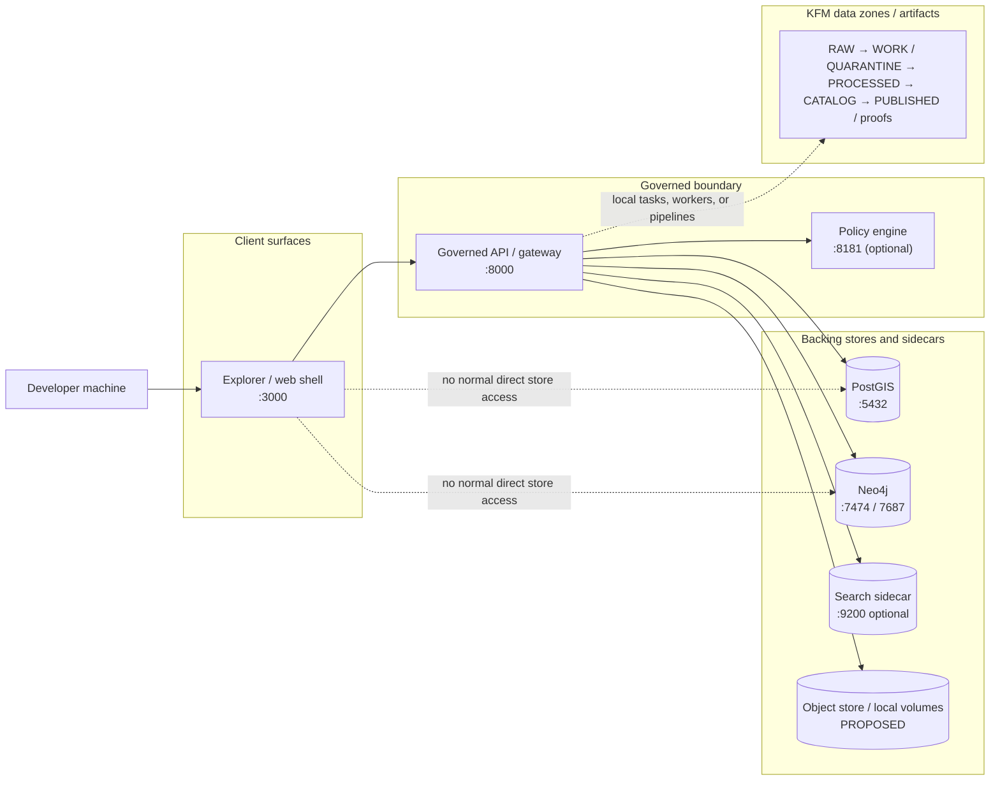

<!-- [KFM_META_BLOCK_V2]
doc_id: kfm://doc/TODO-REVIEW-UUID
title: Local infrastructure (infra/local)
type: standard
version: v1
status: draft
owners: TODO-REVIEW-OWNERS
created: YYYY-MM-DD
updated: YYYY-MM-DD
policy_label: TODO-REVIEW-POLICY-LABEL
related: [../../apps/, ../../contracts/, ../../policy/, ../../data/, ../../docs/, ../]
tags: [kfm, infra, local, development, compose]
notes: [PDF-bounded draft; mounted repo tree was not directly visible in this session; repo-relative links and exact filenames must be verified before commit]
[/KFM_META_BLOCK_V2] -->

<a id="top"></a>

# Local infrastructure (`infra/local`)
Single-machine development and integration wiring for Kansas Frontier Matrix, designed to boot governed surfaces without bypassing KFM’s trust membrane.

> [!IMPORTANT]
> **Status:** experimental  
> **Owners:** `TODO-REVIEW-OWNERS`  
>      
> **Quick jump:** [Scope](#scope) · [Repo fit](#repo-fit) · [Quickstart](#quickstart) · [Usage](#usage) · [Service matrix](#service-matrix) · [Diagram](#diagram) · [Task list](#task-list) · [FAQ](#faq)

---

## Scope

This directory is the contributor-facing landing zone for **local KFM environment wiring**: the pieces that let one machine boot a governed API surface, a map/UI surface, and the backing services needed to exercise trust-bearing flows during development, smoke testing, and operator review.

In KFM terms, `infra/local/` is about **environment mechanics**, not project law. It should help a developer start the stack, inspect the right endpoints, run one-off tasks safely, and tear the stack down cleanly. It should **not** become the place where domain rules, policy meaning, or canonical data semantics quietly hide.

> [!NOTE]
> The strongest current source posture is still: **do not treat mounted implementation as settled unless the live repo tree has been inspected.** This README is therefore written to be commit-ready in style, but intentionally cautious in claims.

[Back to top](#top)

---

## Repo fit

| Aspect | Fit |
|---|---|
| **Path** | `infra/local/` |
| **Role** | Local bootstrapping, container/service wiring, local persistence, seed/bootstrap helpers, and day-to-day contributor run instructions. |
| **Upstream dependencies** | [`../../apps/`](../../apps/), [`../../contracts/`](../../contracts/), [`../../policy/`](../../policy/), [`../../data/`](../../data/), root-level config such as `.env` templates (**exact files need verification**). |
| **Downstream handoff** | [`../`](../) broader infra patterns, [`../../docs/`](../../docs/) runbooks and verification notes, CI/local smoke checks, and later hosted overlays (**some subpaths remain needs-verification**). |
| **Trust posture** | Local infra mirrors the KFM trust membrane: browsers and clients should interact with governed surfaces first, not treat stores as the normal entry path. |
| **Current confidence** | Top-level repo categories are stronger than exact neighboring files under `infra/local/`; reconcile against the mounted repo tree before merge. |

---

## Inputs

Accepted inputs for this directory include:

- Container orchestration files for local development, such as Compose entrypoints and local-only overrides.
- Local environment templates and documented environment-variable expectations.
- Volume definitions, local persistence mounts, and safe reset instructions.
- Seed/bootstrap helpers, smoke-test wrappers, and one-off developer convenience scripts.
- Local reverse-proxy or local-cert material when the stack needs browser-safe HTTPS in development.
- Service wiring for the governed API, web shell, and backing services such as spatial, graph, policy, search, or artifact storage layers.

---

## Exclusions

What does **not** belong here, and where it belongs instead:

| Does not belong here | Put it here instead |
|---|---|
| Domain/business rules | `packages/` or app/runtime code |
| Canonical contracts and schema definitions | `contracts/` |
| Policy meaning and reviewable policy bundles | `policy/` |
| Canonical datasets, published artifacts, or release proofs | `data/` |
| Production or hosted environment manifests | `infra/hosted/` or other deployment-specific overlays |
| Unexplained CI gates and provenance logic | `.github/workflows/`, `tools/`, or dedicated runbooks |
| Long-lived secrets committed to git | External secret stores, local `.env`, or platform secret injection |

> [!WARNING]
> `infra/local/` should not accumulate “just for now” business logic. If a local helper starts deciding policy, shaping evidence, or redefining domain meaning, it has already escaped the directory’s remit.

[Back to top](#top)

---

## Directory tree

The exact mounted tree still needs verification. The following is the **smallest useful, KFM-aligned starter shape** for this directory:

```text
infra/
└── local/
    ├── README.md                    # this file
    ├── docker-compose.yaml          # PROPOSED starter entrypoint
    ├── .env.example                 # INFERRED template name; verify in repo
    ├── compose.override.yaml        # OPTIONAL / needs verification
    ├── init/                        # OPTIONAL seed/bootstrap helpers
    ├── volumes/                     # OPTIONAL local persistence helpers
    └── scripts/                     # OPTIONAL wrapper commands
```

If the live repo currently prefers `docker-compose.yml` at the repo root, keep that reality visible and use this directory as the **documentation and wrapper** surface rather than forcing duplication.

---

## Quickstart

### 1) Install container prerequisites

Example Ubuntu path:

```bash
sudo apt install docker.io docker-compose-plugin
sudo usermod -aG docker "${USER}"
newgrp docker
docker run hello-world
```

Mac and Windows contributors may instead use Docker Desktop.

### 2) Create or review the local environment file

```bash
cp .env.example .env
$EDITOR .env
```

Minimum variable categories this README expects:

- database bootstrap settings
- graph store auth
- web/API port bindings
- frontend API base URL
- AI backend selection
- optional policy/search toggles

### 3) Start the stack

Preferred explicit invocation from the repo root:

```bash
docker compose -f infra/local/docker-compose.yaml up --build
```

If mounted repo reality still uses a root-level Compose file, prefer that reality over this proposed path.

### 4) Verify the core surfaces

| Surface | Expected local URL | What “good” looks like |
|---|---|---|
| Governed API | `http://localhost:8000/docs` | Docs/UI loads and at least one simple endpoint responds |
| Explorer / web shell | `http://localhost:3000` | Base application loads and can reach the API |
| Neo4j browser | `http://localhost:7474` | Browser UI loads if Neo4j is part of the default stack |
| Policy engine | `http://localhost:8181` | Only if OPA is present in the local stack |
| Search sidecar | `http://localhost:9200` | Only if search is part of the chosen local profile |

### 5) Stop the stack

```bash
docker compose -f infra/local/docker-compose.yaml down
```

> [!CAUTION]
> The destructive reset below removes local volumes and should be used only when you intentionally want a clean-room restart:
>
> ```bash
> docker compose -f infra/local/docker-compose.yaml down -v
> ```

[Back to top](#top)

---

## Usage

### Daily development loop

Keep the stack running while you develop. Use a second terminal for one-off commands, tests, or container shells.

| Activity | Starter pattern | Confidence |
|---|---|---|
| Boot the stack | `docker compose -f infra/local/docker-compose.yaml up --build` | **PROPOSED path** |
| Enter API shell | `docker compose exec api bash` | **INFERRED** |
| Run backend tests | `docker compose exec api pytest` | **INFERRED** |
| Run frontend tests | `docker compose exec web npm test` | **INFERRED** |
| Inspect API docs | open `http://localhost:8000/docs` | **INFERRED** |
| Inspect GraphQL surface | open `http://localhost:8000/graphql` | **OPTIONAL / needs verification** |
| Run one-off task | execute the repo’s actual CLI or pipeline entrypoint from inside `api` | **NEEDS VERIFICATION** |
| Watch backend reload | edit backend code; expect Uvicorn reload only if bind mounts and `--reload` are configured | **INFERRED** |
| Watch frontend reload | edit `web/src`; expect hot reload only if dev server and mounts are configured | **INFERRED** |

### Local operating rules

1. Treat the **web shell** as a client surface, not a privileged admin path by default.
2. Treat the **API/gateway** as the place where trust-bearing access decisions happen.
3. Treat direct database access as **debug/operator activity**, not the product’s normal path.
4. Keep config externalized; do not hardcode local secrets into Compose or app source.
5. Convert valuable ad hoc notebooks or shell experiments into scripts, pipelines, or docs once they matter.

> [!NOTE]
> A local stack that “works” by letting the browser bypass the governed API is not a successful KFM local stack. It is a shortcut that weakens the architecture you are trying to test.

### Common command patterns

```bash
# API container shell
docker compose exec api bash

# Backend test run
docker compose exec api pytest

# Frontend test run
docker compose exec web npm test

# Inspect running services
docker compose ps
docker compose logs api
docker compose logs web
```

If the repo exposes local seed/bootstrap commands, document them here only after confirming the exact entrypoint and idempotency behavior.

---

## Diagram



Local infra should reproduce the **shape** of KFM’s trust model, even when the stack is smaller than a hosted deployment.

[Back to top](#top)

---

## Tables

### Service matrix

| Service | Responsibility in local dev | Typical port(s) | Status in current evidence | Notes |
|---|---|---:|---|---|
| Governed API / gateway | Primary programmatic surface; should be the browser’s normal backend path | `8000` | INFERRED | Swagger/OpenAPI-style docs are expected at `/docs` |
| Explorer / web shell | Map/UI surface for contributor testing | `3000` | INFERRED | Hot reload expected only if mounts/dev server are configured |
| PostGIS | Spatial relational backing store | `5432` | INFERRED / PROPOSED | Common local default |
| Neo4j | Graph backing store | `7474`, `7687` | INFERRED / PROPOSED | Browser UI at `7474` if included |
| OPA | Optional local policy sidecar / PDP | `8181` | PROPOSED | Some source variants include it by default |
| OpenSearch / search | Optional search sidecar | `9200` | PROPOSED | Not stable enough to hard-claim as default |
| Object store / local artifact volume | Local stand-in for artifact/published storage | varies | PROPOSED | Mention only after confirming the implementation choice |
| Worker processes | One-off or background jobs | n/a | PROPOSED | Could be separate service or run inside API container |
| Jupyter | Exploratory notebook surface | custom | OPTIONAL / NEEDS VERIFICATION | Useful, but should not become the source of truth |

### Environment key matrix

| Key or group | Purpose | Confidence |
|---|---|---|
| `POSTGRES_USER`, `POSTGRES_PASSWORD`, `POSTGRES_DB` | PostGIS bootstrap and connection | INFERRED |
| `NEO4J_AUTH` | Neo4j bootstrap auth | INFERRED |
| `FASTAPI_PORT` or equivalent | API host binding | INFERRED |
| `WEB_PORT` or equivalent | Web shell host binding | INFERRED |
| `REACT_APP_API_URL` or equivalent | Frontend → API base URL | INFERRED |
| `OLLAMA_MODEL` or `OPENAI_API_KEY` | Local/external AI backend selection | INFERRED |
| `ENABLE_OPA` or equivalent | Optional policy-sidecar toggle | PROPOSED |
| Search/object-store settings | Optional sidecars or local storage wiring | PROPOSED |

### Local rules of engagement

| Rule | Why it exists |
|---|---|
| Keep config externalized | Prevent drift between machines and avoid committing secrets |
| Keep browser traffic on governed surfaces | Preserve the trust membrane in development |
| Keep infra wiring separate from business rules | Prevent “ops glue” from silently becoming domain law |
| Keep data-zone language visible | Developers need a mental model of lifecycle and artifact movement |
| Keep optional services explicitly optional | Avoid turning every contributor laptop into a production clone |

---

## Task list

### Before treating this directory as settled

- [ ] Confirm that `infra/local/` actually exists in the mounted repo and reconcile this README with neighboring files.
- [ ] Confirm the canonical Compose filename and invocation path.
- [ ] Confirm the real `.env` template filename, location, and secret-handling guidance.
- [ ] Confirm which services are **default** versus **optional** in the local stack.
- [ ] Confirm health checks, smoke-test commands, and expected first-run logs.
- [ ] Confirm volume names and destructive reset behavior.
- [ ] Confirm whether local seed/bootstrap is automatic, manual, or absent.
- [ ] Confirm whether policy checks run in-container, on-host, or only in CI.
- [ ] Confirm whether direct DB debug access is documented and bounded as operator-only.
- [ ] Confirm links to broader infra and runbook docs.

### Definition of done for this README

A reviewer should be able to clone the repo, create a local env file, start the stack, verify the right endpoints, understand which services are optional, avoid architectural bypasses, and know exactly which claims in this document still need repo-side verification.

[Back to top](#top)

---

## FAQ

### Why is this README so explicit about `PROPOSED`, `INFERRED`, and `NEEDS VERIFICATION`?

Because the strongest KFM manuals repeatedly reject “paper certainty.” This README should help a contributor boot the stack **without pretending repo state was verified when it was not**.

### Should local development include every production-side service?

No. The local stack should be big enough to test governed flows and small enough to stay usable. Keep optional services explicit.

### Where should policy meaning live?

Not here. `infra/local/` can mount, route, or call a policy service, but the policy bundle and its tests belong under `policy/`.

### Is direct PostGIS or Neo4j access allowed?

For debugging, maybe. For the product’s normal path, no. The local stack should still reinforce that client-facing flows traverse the governed API boundary.

### Which filename wins: `docker-compose.yml` or `docker-compose.yaml`?

The mounted repo wins. This README uses `infra/local/docker-compose.yaml` because that is the clearest proposed starter path in the March 2026 build-oriented design material, but it should be reconciled against the live tree before merge.

---

## Appendix

<details>
<summary><strong>Evidence reconciliation for the starter local stack</strong></summary>

Different KFM documents describe the local stack at different levels of maturity. This README resolves that by separating **core**, **optional**, and **needs-verification** elements instead of flattening the variants into one false certainty.

| Source strand | What it contributes | How this README resolves it |
|---|---|---|
| Replacement-grade master design manual | `infra/local/` belongs in the proposed repo skeleton; `infra/` is for environment wiring, not unexplained business rules | Used as the doctrinal anchor for directory purpose and exclusions |
| Architecture-grade redesign batch | Names `infra/local/docker-compose.yaml` and a local stack centered on API/gateway, OPA, Postgres/PostGIS, object storage, and workers | Used to justify the explicit compose path and the “starter local stack” framing |
| Comprehensive technical blueprint | Describes local Docker Compose workflow, env categories, common ports, hot reload, one-off `exec` patterns, and first-run behavior | Used for contributor workflow and day-to-day usage patterns |
| Support file / baseline compose notes | Shows a plausible compose baseline with `api`, `web`, `postgis`, `neo4j`, `opensearch`, and `opa`, plus externalized env vars | Used to classify some services as optional rather than guaranteed |
| Repo and compendium docs | Keep live repo-state claims bounded and require verification before promotion to “confirmed” | Used to keep all exact filenames, neighbors, and defaults visibly provisional |

### Practical consolidation rule

Use this priority order when editing `infra/local/`:

1. **Mounted repo reality**  
2. **Recent KFM doctrine and build-oriented manuals**  
3. **Implementation consequence sources**  
4. **Generic Docker or platform guidance**

That keeps local documentation useful without letting it drift into invented certainty.

</details>

[Back to top](#top)
