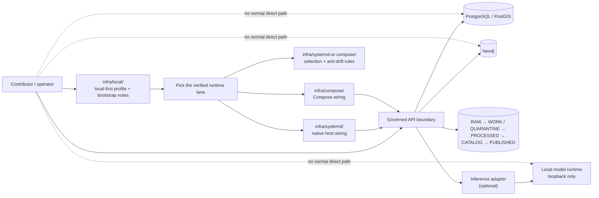

<!-- [KFM_META_BLOCK_V2]
doc_id: kfm://doc/TODO-REVIEW-UUID
title: Local infrastructure (infra/local)
type: standard
version: v1
status: review
owners: TODO-REVIEW-OWNERS
created: YYYY-MM-DD
updated: 2026-04-05
policy_label: TODO-REVIEW-POLICY-LABEL
related: [../README.md, ../compose/README.md, ../systemd/README.md, ../systemd-or-compose/README.md, ../../README.md, ../../apps/, ../../contracts/, ../../policy/, ../../schemas/, ../../tests/, ../../docs/]
tags: [kfm, infra, local, runtime, bootstrap, development]
notes: [Public main confirms infra/local exists and is currently README-only; concrete local runtime artifacts remain lane-specific or unverified at this path; owners, created date, and policy label still need review]
[/KFM_META_BLOCK_V2] -->

<a id="top"></a>

# Local infrastructure (`infra/local`)
Local-first runtime orientation and bootstrap guidance for Kansas Frontier Matrix, written to stay faithful to the checked-in repo and the March 2026 doctrine corpus.

> [!IMPORTANT]
> **Status:** experimental  
> **Owners:** `TODO-REVIEW-OWNERS`  
>       
> **Repo fit:** `infra/local/README.md` · Upstream: [`../README.md`](../README.md), [`../../README.md`](../../README.md) · Adjacent lanes: [`../compose/README.md`](../compose/README.md), [`../systemd/README.md`](../systemd/README.md), [`../systemd-or-compose/README.md`](../systemd-or-compose/README.md)  
> **Quick jump:** [Scope](#scope) · [Repo fit](#repo-fit) · [Inputs](#inputs) · [Exclusions](#exclusions) · [Directory tree](#directory-tree) · [Quickstart](#quickstart) · [Usage](#usage) · [Diagram](#diagram) · [Operating tables](#operating-tables) · [Task list](#task-list) · [FAQ](#faq)

> [!NOTE]
> **Current public-main reality**  
> `infra/local/` is a real checked-in repo surface, but it is currently a **README-only** directory. Treat this file as the local-first orientation layer, not as proof that local manifests, unit files, env templates, or helper scripts already exist here.

> [!NOTE]
> **Truth legend used in this file**  
> **CONFIRMED** = directly supported by current public repo evidence or attached doctrine  
> **INFERRED** = conservative synthesis from multiple project sources  
> **PROPOSED** = doctrine-consistent guidance not yet proven as current checked-in runtime material  
> **UNKNOWN / NEEDS VERIFICATION** = not verified strongly enough to present as current reality

> [!TIP]
> KFM’s phase-one doctrine is still **systemd-first** for the thinnest single-host runtime. The current public repo, however, already gives [`../compose/README.md`](../compose/README.md) and [`../systemd-or-compose/README.md`](../systemd-or-compose/README.md) more concrete coordination roles than `infra/local/` currently owns. This README should therefore explain the **local-first shape**, point to the correct sibling lane, and avoid inventing a second runtime truth.

---

## Scope

`infra/local/` is the local-first orientation surface for KFM’s runtime family.

Its job is to help contributors and reviewers answer the practical one-machine questions without blurring lane ownership:

- What must remain true on one machine even before the hosted split exists?
- Which runtime lane owns the concrete artifacts?
- Which local shortcuts would violate the trust membrane?
- What should be verified before anyone claims “local is working”?

Local success in KFM is not merely “containers are up” or “a UI loaded.” It means the same architectural burdens are still visible:

- browser and operator flows enter through a **governed API boundary**
- canonical stores remain **behind** that boundary
- the artifact tree still maps to the truth path  
  `RAW → WORK / QUARANTINE → PROCESSED → CATALOG → PUBLISHED`
- any local model runtime stays **loopback-only** and **adapter-mediated**
- local convenience does not become a quiet bypass for policy, evidence, or release discipline

`infra/local/` should therefore stay small, legible, and honest. It is the place for local-first orientation, bootstrap notes, and handoff rules — not for silently accreting a second home for Compose manifests, `systemd` units, or policy law.

[Back to top](#top)

---

## Repo fit

| Aspect | Guidance |
|---|---|
| **Path** | `infra/local/README.md` |
| **Primary audience** | Contributors, reviewers, and operators trying to understand or bring up the smallest credible local KFM slice |
| **Primary role** | Local-first runtime orientation, bootstrap posture, one-machine invariants, and handoff to concrete runtime lanes |
| **Upstream** | [`../README.md`](../README.md) defines the broader infra posture; [`../../README.md`](../../README.md) defines repo-wide orientation and trust posture |
| **Adjacent runtime docs** | [`../compose/README.md`](../compose/README.md), [`../systemd/README.md`](../systemd/README.md), [`../systemd-or-compose/README.md`](../systemd-or-compose/README.md) |
| **Related trust surfaces** | [`../../contracts/`](../../contracts/), [`../../policy/`](../../policy/), [`../../schemas/`](../../schemas/), [`../../tests/`](../../tests/) |
| **What this file should not own** | Compose manifests, `systemd` unit files, policy bundles, canonical contracts, live secrets, or release proof packs |
| **Current public state** | `infra/local/` exists and is **README-only** on public `main` |

### Repo fit notes

- `infra/local/` is useful only if it stays distinct from the sibling lanes that own concrete runtime artifacts.
- In the current public tree, the runtime family already has four visible surfaces: `infra/local/`, `infra/compose/`, `infra/systemd/`, and `infra/systemd-or-compose/`.
- That split only helps if contributors can tell which directory owns **orientation**, which owns **lane selection**, and which owns **runtime artifacts**.

[Back to top](#top)

---

## Inputs

Accepted inputs for this directory are the things that help a contributor reason about the local-first runtime **without stealing ownership from more specific lanes**.

| Belongs here | Typical content | Evidence posture |
|---|---|---|
| Local-first bootstrap notes | One-machine preflight guidance, workstation assumptions, and “start with inventory” instructions | CONFIRMED role |
| Handoff rules | Explicit links to `compose/`, `systemd/`, and `systemd-or-compose/` | CONFIRMED role |
| Shared runtime invariants | Governed API entry, no direct model/database exposure, truth-path legibility, secret externalization | CONFIRMED doctrine |
| Redacted env guidance | Variable group categories, naming conventions, and placement guidance without committing live secrets | INFERRED |
| Local smoke-check guidance | Brief preflight checks that apply regardless of orchestration lane | INFERRED |
| Review placeholders | Clearly marked `NEEDS VERIFICATION` items for owners, active lane choice, manifests, unit names, and health checks | CONFIRMED need |
| Minimal lane-neutral snippets | Inventory commands and illustrative placeholders that do not imply missing files already exist | INFERRED |

[Back to top](#top)

---

## Exclusions

| Do **not** make this the source of truth for… | Put it here instead | Why |
|---|---|---|
| Compose manifests and overrides | [`../compose/`](../compose/) | Keep Compose artifacts in the Compose lane that owns them |
| Native `systemd` units, timers, and host overrides | [`../systemd/`](../systemd/) | Keep native host wiring with the native host lane |
| Lane-choice and anti-drift doctrine | [`../systemd-or-compose/`](../systemd-or-compose/) | One place should explain when to pick which lane |
| Canonical contracts and schema law | [`../../contracts/`](../../contracts/), [`../../schemas/`](../../schemas/) | Runtime docs should consume contracts, not redefine them |
| Policy rule bodies, bundles, and decision grammar | [`../../policy/`](../../policy/) | Policy must keep its own review and test surfaces |
| App or worker behavior | [`../../apps/`](../../apps/), [`../../packages/`](../../packages/) | Infra guidance is not application authority |
| Live secrets or committed `.env` files | External secret handling or local untracked files | Repo plaintext is not secret storage |
| Release proof packs, correction notices, or publish-state truth | Release/runbook/doc surfaces | Promotion is governed state transition, not local convenience |

> [!WARNING]
> If `infra/local/` starts carrying concrete Compose files, host units, policy logic, and bootstrap prose all at once, it will stop being a useful orientation layer and become a drift generator.

[Back to top](#top)

---

## Directory tree

### Current confirmed state

```text
infra/
└── local/
    └── README.md
```

### Current public runtime family slice

```text
infra/
├── compose/
│   └── README.md
├── local/
│   └── README.md
├── systemd/
│   └── README.md
└── systemd-or-compose/
    └── README.md
```

### Working interpretation

- `infra/local/` is the **local-first profile/orientation** surface.
- `infra/systemd-or-compose/` is the **lane-selection + anti-drift** surface.
- `infra/compose/` is the **Compose-specific** coordination surface.
- `infra/systemd/` is the **native host wiring** surface.

<details>
<summary><strong>Illustrative future expansion sketch (PROPOSED, not current repo fact)</strong></summary>

```text
infra/
└── local/
    ├── README.md
    ├── bootstrap/
    │   └── README.md
    ├── smoke/
    │   └── README.md
    └── env/
        └── README.md
```

Use a shape like this only if the live repo intentionally chooses `infra/local/` as the home for shared local-first notes that do **not** duplicate artifacts owned by `compose/` or `systemd/`.

</details>

[Back to top](#top)

---

## Quickstart

### 1) Start with inventory, not assumption

```bash
git rev-parse --show-toplevel

find infra -maxdepth 2 -type d | sort

find infra \
  \( -name '*.service' -o -name '*.timer' -o -name 'compose*.yml' -o -name 'docker-compose*.yml' -o -name '*.env.example' \) \
  -print | sort
```

This gives you the live local-runtime family before you decide which commands, docs, or examples are actually relevant.

### 2) Read the runtime family in dependency order

```bash
for p in \
  infra/README.md \
  infra/local/README.md \
  infra/systemd-or-compose/README.md \
  infra/compose/README.md \
  infra/systemd/README.md
do
  [ -f "$p" ] && printf '\n### %s ###\n' "$p" && sed -n '1,220p' "$p"
done
```

Read the **parent** first, then the **local-first orientation**, then the **lane-choice doc**, and only then the concrete lane docs.

### 3) Choose the lane instead of inventing one

| Need | Start here | Current public state |
|---|---|---|
| Understand one-machine KFM posture | `infra/local/README.md` | substantive orientation doc in a README-only directory |
| Decide whether to stay native or use Compose | `infra/systemd-or-compose/README.md` | substantive shared-choice doc in a README-only directory |
| Review Compose-specific wiring | `infra/compose/README.md` | substantive coordination doc in a README-only directory |
| Review native host wiring | `infra/systemd/README.md` | placeholder/seed surface in a README-only directory |

### 4) Run commands only against verified artifacts

Use placeholders until the real files are visible in the checkout.

```bash
# Compose lane — replace with a real checked-in manifest path
docker compose -f <verified-compose-file> config
```

```bash
# systemd lane — replace with a real checked-in unit name
systemctl cat <verified-unit>.service
```

> [!CAUTION]
> Do not standardize a filename in this README merely because it appears in an older planning packet or a nearby example. The checkout wins.

### 5) Smoke-check the boundary, not just the process list

Before calling a local slice “good,” check the architectural shape:

- client traffic still enters through a governed API surface
- there is no normal direct client path to PostgreSQL/PostGIS, Neo4j, or any local model runtime
- local files still map cleanly to the truth path
- secrets are externalized rather than committed
- lane ownership is still clear after your edits

[Back to top](#top)

---

## Usage

### What this file is for day to day

Use `infra/local/README.md` when you need to answer questions like:

- “What does KFM require on one machine even before hosted separation?”
- “Which local lane owns the concrete runtime files?”
- “Is this shortcut a harmless dev convenience or a trust-membrane bypass?”
- “Which claims about local bring-up are actually confirmed in the repo?”

Use a sibling runtime doc when you need to answer questions like:

- “Which Compose manifest should I validate?”
- “Which `systemd` unit owns this host process?”
- “Which lane is preferred for this phase?”

### Local operating rules

1. Treat the **web shell** as a client surface, not an admin bypass.
2. Treat the **governed API** as the place where trust-bearing access decisions happen.
3. Treat direct PostGIS or Neo4j access as **debug/operator activity**, not the product’s normal path.
4. Keep configuration externalized; do not hardcode local secrets into runtime artifacts or documentation.
5. Keep the local artifact tree legible to the truth path; avoid “mystery temp folders” that bypass lifecycle meaning.
6. If a local model runtime exists, keep it **loopback-only** and **adapter-mediated**.
7. Promote useful shell experiments into docs, scripts, or runbooks before they turn into folklore.

### Handoff rules

| Change you are making | Authoritative home |
|---|---|
| Add or edit Compose manifests | [`../compose/`](../compose/) |
| Add or edit `systemd` units / timers | [`../systemd/`](../systemd/) |
| Explain when to choose Compose vs native host wiring | [`../systemd-or-compose/`](../systemd-or-compose/) |
| Clarify local-first runtime posture or bootstrap expectations across lanes | `infra/local/README.md` |
| Change contracts, schemas, or policy | [`../../contracts/`](../../contracts/), [`../../schemas/`](../../schemas/), [`../../policy/`](../../policy/) |
| Change app or worker behavior | [`../../apps/`](../../apps/), [`../../packages/`](../../packages/) |

### Documented corpus examples worth keeping review-visible

The March 2026 corpus repeatedly uses a local slice shaped around:

- a governed API
- an explorer or web shell
- PostgreSQL / PostGIS
- Neo4j
- an artifact tree
- optional policy / search / watcher sidecars
- optional local inference behind an adapter

Those examples are useful review anchors, but they are **not the same thing** as current checked-in runtime artifacts under `infra/local/`.

[Back to top](#top)

---

## Diagram



The aim of `infra/local/` is not to make every local detail concrete by itself. The aim is to keep the **shape of the local-first trust model** clear while the concrete lane artifacts live where they belong.

[Back to top](#top)

---

## Operating tables

### Current public runtime family

| Path | Current public state | Role in the runtime family |
|---|---|---|
| `infra/local/README.md` | substantive README in a README-only directory | local-first orientation and bootstrap posture |
| `infra/systemd-or-compose/README.md` | substantive README in a README-only directory | lane selection and anti-drift guidance |
| `infra/compose/README.md` | substantive README in a README-only directory | Compose-specific coordination |
| `infra/systemd/README.md` | placeholder/seed README in a README-only directory | native host wiring surface |

### Documented local component map

| Component | KFM role | Corpus example address | Evidence posture here |
|---|---|---|---|
| Governed API | Normal programmatic entry for browser and operator traffic | `http://localhost:8000/docs` | Documented corpus example; not a checked-in local bind at this path |
| Explorer / web shell | Contributor-facing UI surface | `http://localhost:3000` | Documented corpus example; not a checked-in local bind at this path |
| PostgreSQL / PostGIS | Canonical relational + spatial store | `5432` | Doctrine-confirmed component; local bind still needs runtime proof |
| Neo4j | Graph store | `7474`, `7687` | Doctrine/corpus-confirmed component; local bind still needs runtime proof |
| Policy engine | Optional PDP sidecar | `8181` | Optional in corpus; not a current checked-in local artifact here |
| Watcher / worker | One-shot or background helper lane | no public URL expected | Mentioned in corpus; not a current checked-in local artifact here |
| Artifact tree | Lifecycle-aware local file surface | path varies | Doctrine-confirmed; exact local pathing still needs verification |
| Local model runtime | Bounded inference behind adapter | loopback only | Doctrine-confirmed posture; no checked-in local artifact proven here |

### Corpus env groups to review — not current file proof

| Group | Example names mentioned in corpus | Why they matter | Status |
|---|---|---|---|
| Database/bootstrap | `KFM_DATABASE_URL`, `POSTGRES_*` | API boot and PostGIS connectivity | INFERRED corpus example |
| Graph/auth | `KFM_NEO4J_URL`, `NEO4J_AUTH` | Neo4j connection and auth | INFERRED corpus example |
| Runtime identity | `KFM_COMMIT_SHA`, `KFM_MODE` | Build/run identity and local mode selection | INFERRED corpus example |
| Frontend API routing | `REACT_APP_API_URL` or equivalent | Browser → governed API routing | INFERRED corpus example |
| Optional runtime toggles | repo-specific | Policy/search/watcher sidecar enablement | PROPOSED / NEEDS VERIFICATION |
| Image selection | `API_IMAGE` | Pulled or built service selection | PROPOSED / NEEDS VERIFICATION |

> [!NOTE]
> These names are useful review anchors when an `.env.example` or lane manifest becomes concrete. They are **not** proof that such a file already exists under `infra/local/`.

[Back to top](#top)

---

## Task list

### Before treating this directory as settled

- [ ] Verify `doc_id`, owners, created date, and policy label.
- [ ] Decide whether `infra/local/` remains an orientation-only surface or intentionally gains concrete shared bootstrap material.
- [ ] If concrete local artifacts are added, remove placeholder language and point to exact filenames.
- [ ] Reconcile this README with [`../compose/README.md`](../compose/README.md), [`../systemd/README.md`](../systemd/README.md), and [`../systemd-or-compose/README.md`](../systemd-or-compose/README.md) so the runtime family does not drift.
- [ ] Confirm which runtime lane is actually authoritative for active local bring-up on the working branch.
- [ ] Confirm actual env-template filenames and where they belong.
- [ ] Confirm current health checks, smoke checks, and reset procedures against checked-in artifacts rather than older corpus examples.
- [ ] Confirm whether any local model runtime is actually present and how it is kept behind the governed boundary.

### Definition of done

A reviewer should be able to:

- tell what `infra/local/` currently is on public `main`
- tell which sibling lane owns concrete runtime artifacts
- inventory candidate local runtime files before making claims
- understand which one-machine invariants are non-negotiable
- avoid bypassing the governed API boundary during development
- see exactly which points still need verification

[Back to top](#top)

---

## FAQ

### Why keep `infra/local/` if `infra/compose/` and `infra/systemd/` already exist?

Because the runtime family still needs a place that speaks in **local-first** terms rather than lane-specific implementation detail. This README is that place.

### Why not keep direct Compose startup commands here?

Because Compose is already a sibling lane with its own coordination surface. Repeating unverified manifest names here would create a second, drifting truth source.

### Does local-first mean “safe to expose from a home network”?

No. KFM’s posture is localhost/private-first, then private remote, then more explicit hosted separation as the trust burden increases.

### Can `infra/local/` own the real `.env.example` later?

Yes, but only if the repo intentionally decides this directory is the authoritative shared home for lane-neutral local env guidance. Until then, do not imply that file exists here.

### What wins if these docs disagree?

The order should stay: live checkout reality, then attached doctrine, then adjacent runtime docs, then older examples or idea packets.

[Back to top](#top)

---

## Appendix

<details>
<summary><strong>Evidence ladder for local-runtime claims</strong></summary>

| Evidence tier | What it can safely prove |
|---|---|
| Live checked-in repo tree | Which paths and files exist right now |
| Attached KFM doctrine | Which boundaries, invariants, and runtime laws must remain true |
| Adjacent runtime docs | Which sibling lane owns which kind of material |
| Older examples / idea packets | Useful patterns and review anchors, but not current checked-in runtime truth |

</details>

<details>
<summary><strong>Review recipe before concretizing this directory</strong></summary>

```bash
# 1) Inventory the runtime family.
find infra -maxdepth 2 -type d | sort

# 2) Inventory candidate runtime artifacts.
find infra \
  \( -name '*.service' -o -name '*.timer' -o -name 'compose*.yml' -o -name 'docker-compose*.yml' -o -name '*.env.example' \) \
  -print | sort

# 3) Read the runtime docs in dependency order.
for p in \
  infra/README.md \
  infra/local/README.md \
  infra/systemd-or-compose/README.md \
  infra/compose/README.md \
  infra/systemd/README.md
do
  [ -f "$p" ] && printf '\n### %s ###\n' "$p" && sed -n '1,260p' "$p"
done
```

Only after that review should this directory gain concrete bootstrap or smoke-check material.

</details>

[Back to top](#top)
