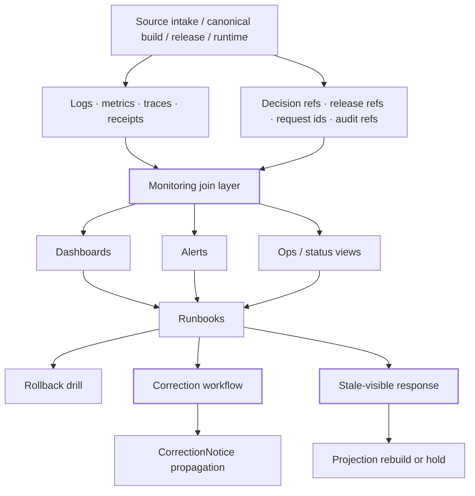

<!-- [KFM_META_BLOCK_V2]
doc_id: kfm://doc/<uuid-NEEDS-VERIFICATION>
title: Monitoring
type: standard
version: v1
status: draft
owners: <owners-NEEDS-VERIFICATION>
created: <YYYY-MM-DD-NEEDS-VERIFICATION>
updated: <YYYY-MM-DD-NEEDS-VERIFICATION>
policy_label: <policy_label-NEEDS-VERIFICATION>
related: [../, ./dashboards/, ./otel/, ../../docs/runbooks/]
tags: [kfm, monitoring, observability]
notes: [Mounted repo tree was not directly visible in this session; target path is user-requested, while adjacent monitoring/observability paths remain NEEDS VERIFICATION.]
[/KFM_META_BLOCK_V2] -->

# Monitoring

Operational monitoring for KFM’s trust-bearing runtime, release, rollback, and correction paths.

| Impact | Value |
| --- | --- |
| **Status** | `experimental` *(repo verification pending)* |
| **Owners** | `<ops/platform/security-NEEDS-VERIFICATION>` |
| **Badges** |      |
| **Quick jumps** | [Scope](#scope) · [Repo fit](#repo-fit) · [Inputs](#inputs) · [Exclusions](#exclusions) · [Directory tree](#directory-tree) · [Quickstart](#quickstart) · [Usage](#usage) · [Diagram](#diagram) · [Tables](#tables) · [Task list](#task-list) · [FAQ](#faq) · [Appendix](#appendix) |

## Truth legend

- **CONFIRMED** — grounded in attached KFM doctrine visible in this session.
- **INFERRED** — strongly implied by repeated KFM doctrine, but not directly verified as mounted implementation.
- **PROPOSED** — recommended repo shape or operating pattern consistent with the doctrine.
- **UNKNOWN** — not directly established from a mounted repo tree, workflows, dashboards, manifests, or runtime traces in this session.
- **NEEDS VERIFICATION** — path, owner, implementation, or runtime detail should be checked against the actual repository or live stack before merge.

---

## Scope

This directory is where KFM should make runtime behavior inspectable **without** letting monitoring become a second truth system.

In KFM, monitoring is not only about uptime, saturation, or error counts. It is about whether operators and reviewers can reconstruct:

- what ran
- on what released scope
- with which policy posture
- under which release and projection state
- with which audit and request joins
- whether rollback, correction, or stale-visible behavior was required

That makes monitoring a **trust-bearing operational surface**, not a generic ops folder.

> [!IMPORTANT]
> Dashboards, alerts, logs, and traces are diagnostic and explanatory surfaces. They help operators reconstruct behavior, but they do **not** replace canonical data, release artifacts, policy decisions, review records, or correction notices.

### What this README is for

Use this file to define the monitoring contract for KFM’s operating environment:

- what signals must be joinable
- what “healthy” must actually prove
- what should alert
- what should stay internal-only
- what runbooks must exist before operators are asked to respond

---

## Repo fit

| Field | Value |
| --- | --- |
| **Path** | `infra/monitoring/README.md` |
| **Role in repo** | README-like directory contract for monitoring / observability concerns |
| **Upstream** | [`../`](../) *(parent `infra/` directory; actual contents NEED VERIFICATION)* |
| **Downstream** | [`./dashboards/`](./dashboards/) *(PROPOSED / NEEDS VERIFICATION)* · [`./otel/`](./otel/) *(PROPOSED / NEEDS VERIFICATION)* · [`../../docs/runbooks/`](../../docs/runbooks/) *(PROPOSED / NEEDS VERIFICATION)* |
| **Doctrine echoes** | `observability/join_keys.md` · `observability/audit_ref_contract.md` · `docs/runbooks/publication.md` · `docs/runbooks/correction.md` · `docs/runbooks/stale_projection.md` · `docs/runbooks/rollback.md` *(all corpus-proposed, not mounted repo fact)* |
| **Adjacent trust seams** | contracts, policy, release assembly, projection workers, governed API, Evidence Drawer / Focus runtime, rollback and correction flows |

Monitoring sits across multiple KFM planes:

- **closure and release** — release state, manifests, proof packs, correction lineage
- **delivery** — projection freshness, stale states, rebuild triggers
- **runtime** — evidence resolution, citation checks, answer/abstain/deny/error outcomes
- **cross-plane ops** — joined logs, metrics, traces, decision refs, release refs, request ids, and audit refs

---

## Inputs

What belongs here.

| Input class | Examples | Status | Why it belongs |
| --- | --- | --- | --- |
| Signal join contracts | `request_id`, `audit_ref`, `release_id`, `decision_ref`, `bundle_id`, correction refs | **CONFIRMED doctrine / repo NEEDS VERIFICATION** | KFM monitoring must help reconstruct behavior across planes |
| Release-linked ops artifacts | release freshness notes, projection stale checks, release assembly traces | **INFERRED / PROPOSED** | Monitoring must explain *which release* a symptom belongs to |
| Runtime accountability surfaces | `RuntimeResponseEnvelope` examples, negative-path checks, citation-failure signals | **CONFIRMED doctrine / mounted files UNKNOWN** | Runtime failure is part of trust behavior, not just app health |
| Evidence-resolution signals | evidence lookup success/failure, bundle resolution latency, partial-scope signals | **CONFIRMED doctrine / implementation UNKNOWN** | Operators need to distinguish missing evidence from slow evidence |
| Policy and review joins | decision results, reason codes, obligation codes, review-state references | **CONFIRMED doctrine / implementation UNKNOWN** | Denials and holds are valid operating outcomes |
| Projection freshness signals | stale-after checks, rebuild-required markers, release/projection linkage | **CONFIRMED doctrine / implementation UNKNOWN** | Derived delivery must not silently look current when stale |
| Dashboard and alert assets | panel definitions, alert rules, routing notes, screenshots, operator notes | **PROPOSED** | Human-readable inspection and response surfaces |
| Collector / export config | telemetry pipelines, semantic naming, field mapping, retention notes | **PROPOSED** | Monitoring only helps if signals arrive consistently |
| Runbook links | publication, correction, stale projection, rollback, incident investigation | **PROPOSED** | Every meaningful alert should route toward governed action |

### Accepted inputs

This directory should accept materials that help answer operational trust questions such as:

- Can an operator tell which release or projection build is implicated?
- Can a reviewer reconstruct why a request answered, abstained, denied, or errored?
- Can stale, corrected, withdrawn, or generalized states be detected at the operational layer?
- Can logs, traces, metrics, policy decisions, and release artifacts be joined by stable identifiers?

---

## Exclusions

What does **not** belong here, and where it should go instead.

| Exclusion | Why it does not belong here | Goes instead |
| --- | --- | --- |
| Canonical truth data | Monitoring is not the authoritative substrate | canonical data / evidence / release zones |
| Policy source of truth | Monitoring may observe policy outcomes, but should not own rule logic | `policy/` |
| Release proof packs themselves | Monitoring should point to them, not replace them | release / proof-pack family |
| Review decisions as only screenshots or notes | Policy-significant decisions need typed artifacts | review / decision / release artifact families |
| Raw user-facing explanations | Monitoring supports reconstruction, not outward truth publication | governed API / runtime surfaces |
| Silent “green” health definitions | KFM-grade health must prove trust-bearing dependencies, not only process liveness | define in health contracts and runbooks |
| Ops endpoints that expose raw canonical data | Monitoring must not become a second truth surface | internal guarded ops/status surfaces only |
| Ad hoc scratch debugging | One-off notes should not become invisible doctrine | issue / PR / dated runbook addendum |

> [!WARNING]
> A monitoring stack that looks polished but cannot answer **which release**, **which evidence basis**, **which policy decision**, or **which correction chain** is involved is operationally weak in KFM terms.

---

## Directory tree

The mounted repository tree was **not** directly visible in this session, so the shape below is a **PROPOSED adapter** for the requested `infra/monitoring/` home.

```text
infra/
└── monitoring/
    ├── README.md
    ├── dashboards/                 # PROPOSED: dashboard definitions, provisioning, screenshots
    ├── otel/                       # PROPOSED: collector/export config, field mapping
    ├── alerts/                     # PROPOSED: alert rules, routing, escalation notes
    ├── health/                     # PROPOSED: liveness/readiness/trust-bearing health checks
    ├── retention/                  # PROPOSED: retention posture for logs/metrics/traces
    ├── examples/                   # PROPOSED: sample envelopes, joins, and local review assets
    └── contracts/                  # PROPOSED: monitoring-specific join and field contracts
```

### Doctrine-adjacent starter paths surfaced by the corpus

These are **not** asserted mounted repo facts, but they appear as plausible companion artifacts in the doctrine layer:

```text
observability/
├── join_keys.md
└── audit_ref_contract.md

docs/
└── runbooks/
    ├── publication.md
    ├── correction.md
    ├── stale_projection.md
    └── rollback.md
```

If the actual repo already has a different layout, keep the **role** and adjust the paths to match the mounted tree instead of forcing this shape mechanically.

---

## Quickstart

Start with inspection, not assumption.

```bash
# Inventory candidate monitoring and observability files
find infra/monitoring observability docs/runbooks -maxdepth 3 -type f 2>/dev/null | sort

# Look for cross-plane join keys and accountability fields
grep -RInE 'request_id|audit_ref|release_id|decision_ref|bundle_id|RuntimeResponseEnvelope|EvidenceBundle|CorrectionNotice' .

# Look for stale, correction, rollback, or negative-path handling
grep -RInE 'stale|rollback|correction|withdrawn|abstain|deny|error|citation_failed|evidence_missing' .

# Look for monitoring or telemetry configuration
grep -RInE 'observability|monitoring|otel|OpenTelemetry|trace|metric|log|alert|health' .
```

### Minimum first-pass review

1. Confirm what actually exists under `infra/monitoring/` and whether `observability/` also exists.
2. Confirm whether request, audit, release, and policy identifiers are already emitted anywhere.
3. Verify whether readiness checks prove **trust-bearing dependencies**, not just process liveness.
4. Verify whether stale projection and correction states are visible to operators.
5. Verify whether each meaningful alertable condition has a linked runbook or explicit response note.
6. Verify whether ops/status surfaces are internal-only and do not expose canonical truth directly.

### Suggested first mounted outputs to capture

- an actual file inventory
- one joined request trace
- one release-linked projection freshness example
- one runtime negative-path example
- one correction or rollback drill artifact

---

## Usage

Use this directory to make KFM explainable under pressure.

### Operating rules

1. **Monitor by trust question first.**  
   Start from the operator question, not the tool category:
   - Which release is implicated?
   - Is the issue source-side, release-side, projection-side, or runtime-side?
   - Is evidence missing, stale, partial, denied, generalized, or simply slow?
   - Did correction or rollback propagate everywhere it should have?

2. **Preserve joinability across planes.**  
   Logs, metrics, traces, policy decisions, release refs, request ids, and audit refs should be joinable enough to reconstruct one event end to end.

3. **Keep “healthy” honest.**  
   A KFM-grade readiness check proves the dependencies needed for trust-bearing behavior:
   - canonical read path readiness
   - release scope availability
   - evidence resolution viability
   - policy availability
   - projection freshness or stale-state correctness
   - audit linkage continuity

4. **Treat negative outcomes as first-class signals.**  
   `ABSTAIN`, `DENY`, `ERROR`, stale-visible, generalized, withdrawn, and corrected states are not embarrassing edge cases. They are expected operating states when the system fails closed.

5. **Make monitoring correction-aware.**  
   Operators should be able to detect when a release is superseded, a projection is stale, or a correction notice should be visible but is not.

6. **Do not let ops become a second truth surface.**  
   Monitoring should explain and correlate. It should not silently become the place where users or operators trust data that lacks release and evidence context.

### Contribution expectations

| Change type | Minimum monitoring work |
| --- | --- |
| New source intake or canonical build path | add joins for source/admission/validation outcomes and one operator-visible failure case |
| New release or delivery path | add release linkage, projection freshness checks, and stale/correction visibility |
| New public runtime surface | surface request/audit joins and negative-path observability |
| New policy-significant workflow | add decision/result joins and one deny/hold trace |
| New correction/rollback mechanism | add drill evidence, alert path, and runbook linkage |
| Monitoring refactor | preserve or improve audit reconstruction; do not reduce joinability |

> [!NOTE]
> In KFM, “more telemetry” is not automatically “better monitoring.” The useful test is whether a human can move from symptom -> joined identifiers -> release/policy/evidence context -> governed action.

---

## Diagram



---

## Tables

### Trust-bearing signal matrix

| Signal family | What it should answer | Typical consumer | Failure if missing |
| --- | --- | --- | --- |
| Logs | What happened, where, and with which joins? | operators, stewards, incident review | symptom without context |
| Metrics | Is the system outside expected operating bounds? | dashboards, alerts, SLO review | no early warning |
| Traces | Which path failed, slowed, abstained, or denied? | runtime debugging, operator review | no path-level causality |
| Receipts / release joins | Which release, projection, or correction state was involved? | stewards, reviewers, rollback decisions | no reconstructable release context |
| Policy joins | Which decision or obligation shaped behavior? | reviewers, operators, audit review | deny/hold behavior becomes opaque |
| Runtime envelopes | Did the runtime answer, abstain, deny, or error—and why? | Focus/runtime review, audits | outward behavior cannot be explained |
| Dashboards | Can humans inspect trust state quickly? | operators, reviewers | evidence remains fragmented |
| Alerts | Has a meaningful trust or freshness threshold been crossed? | on-call / responders | silent failure |

### Cross-plane join key starter set

| Join key | Why it matters |
| --- | --- |
| `request_id` | correlates one outward request across runtime signals |
| `audit_ref` | ties runtime behavior to auditable operational evidence |
| `release_id` | identifies the published scope involved |
| `decision_ref` | links policy outcome to behavior |
| `bundle_id` | links visible claims to evidence bundles |
| `projection_build_id` | isolates stale or broken derived delivery artifacts |
| `correction_ref` or correction notice id | lets operators follow supersession or withdrawal forward |

### KFM-grade health matrix

| Health question | Minimum proof |
| --- | --- |
| Is the process alive? | service responds |
| Is the service ready? | required dependencies for trust-bearing behavior are reachable |
| Is release scope usable? | promoted scope resolves cleanly |
| Does evidence resolution work? | bundle/evidence lookup succeeds |
| Do runtime outcomes stay accountable? | request/audit joins and result states are emitted |
| Can stale delivery be detected? | freshness basis and stale-visible path are testable |
| Can correction propagate? | superseded / corrected state is observable at relevant surfaces |
| Can operators reconstruct a disputed answer? | logs, traces, metrics, decision refs, release refs, and audit refs join cleanly |

### Proposed minimum telemetry starter set

These are **PROPOSED** starters for a first useful monitoring baseline.

| Category | Starter metrics / signals |
| --- | --- |
| Runtime | API latency, error rate, saturation, negative outcome counts |
| Freshness | dataset freshness, projection staleness, stale-visible counts |
| Pipelines | job success/failure, queue depth, retry counts |
| Evidence | evidence-resolution success rate, evidence-resolution latency |
| Focus / governed assistance | citation verification pass/fail, abstain/deny/error counts |
| Delivery | cache hit rate, projection rebuild counts |
| Policy | deny counts by rule family, review-required counts |

---

## Task list

Definition of done for monitoring work in this directory.

- [ ] Actual `infra/monitoring/` tree inventoried and this README updated against mounted paths
- [ ] Any `observability/` sibling docs reconciled with this directory’s real location
- [ ] Join-key contract confirmed for at least `request_id`, `audit_ref`, and release linkage
- [ ] One trust-bearing readiness definition documented beyond process liveness
- [ ] One positive runtime path traceable end to end
- [ ] One negative runtime path (`ABSTAIN`, `DENY`, or `ERROR`) traceable end to end
- [ ] One stale projection or freshness-path example documented
- [ ] One correction or rollback drill linked to a runbook or proof artifact
- [ ] Alertable trust-bearing conditions mapped to runbooks
- [ ] Ops/status surfaces reviewed to ensure they do not expose raw canonical truth
- [ ] Retention expectations documented for logs, traces, metrics, and receipts
- [ ] README rechecked after repo mount so placeholders can be retired or narrowed

---

## FAQ

### Is monitoring authoritative truth in KFM?

No. Monitoring is operational evidence and diagnostic context. Canonical truth, policy decisions, release artifacts, and correction notices remain stronger trust objects.

### What makes monitoring “KFM-grade”?

It must help answer trust questions, not only resource questions. A green process with broken evidence resolution, missing audit joins, stale projections, or hidden correction state is not sufficient.

### Are dashboards authoritative?

No. Dashboards are inspection tools. They should point back to release linkage, evidence objects, policy outcomes, and audit joins rather than replacing them.

### What should definitely be joinable?

At minimum: request path, audit linkage, release context, policy/result context, and correction or projection freshness context.

### What if the real repo already uses `observability/` instead of `infra/monitoring/`?

Update this README to match the mounted structure. Keep the doctrine, change the paths.

### Why is so much marked PROPOSED or NEEDS VERIFICATION?

Because the repository tree and runtime artifacts were not directly mounted in this session. This draft is repo-ready **only as a doctrine-grounded starter**, not as a claim that the current implementation already contains every named file.

---

## Appendix

<details>
<summary><strong>PROPOSED starter artifact pack</strong></summary>

These names are doctrine-aligned starters, not asserted mounted repo facts.

- `infra/monitoring/dashboards/`
- `infra/monitoring/otel/`
- `infra/monitoring/alerts/`
- `infra/monitoring/health/`
- `docs/runbooks/publication.md`
- `docs/runbooks/correction.md`
- `docs/runbooks/stale_projection.md`
- `docs/runbooks/rollback.md`
- `observability/join_keys.md`
- `observability/audit_ref_contract.md`

Suggested first additions:

1. a short join-key contract naming the minimum correlation fields
2. one readiness contract that proves more than liveness
3. one dashboard answering “Can released scope still resolve?”
4. one stale-projection or evidence-resolution alert path
5. one rollback/correction runbook with drill evidence

</details>

<details>
<summary><strong>Review checklist for maintainers</strong></summary>

Before approving changes under this directory, verify:

- the change improves reconstructability, not just telemetry volume
- identifiers stay stable across affected paths
- health checks do not confuse process liveness with trust-bearing readiness
- dashboards make stale, denied, abstained, and corrected states visible where relevant
- release, correction, and rollback context stay queryable
- runbooks, alerts, and docs move together

</details>

<details>
<summary><strong>Questions to settle once the repo is mounted</strong></summary>

- Is this directory actually `infra/monitoring/`, `observability/`, or both?
- What labels / teams / owners does the repo already use here?
- Are dashboards provisioned from code, generated, or externalized?
- What request/audit/release identifiers already exist in code and tests?
- Do any current workflows already emit stale-projection, correction, or runtime-envelope artifacts?
- What retention and access rules are already documented elsewhere in the repo?

</details>

[Back to top](#monitoring)
