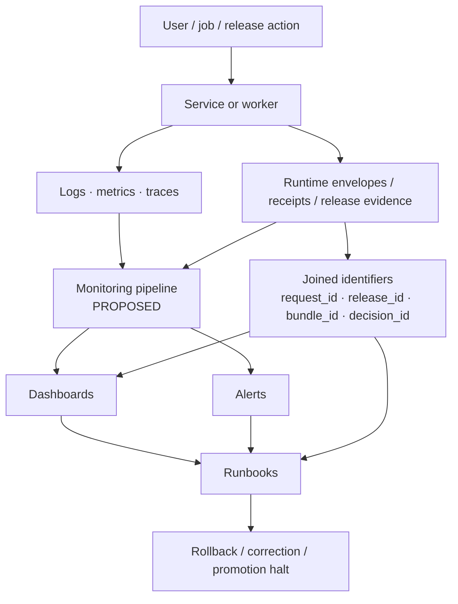

<!-- [KFM_META_BLOCK_V2]
doc_id: kfm://doc/<uuid-NEEDS-VERIFICATION>
title: Monitoring
type: standard
version: v1
status: draft
owners: <owners-NEEDS-VERIFICATION>
created: <YYYY-MM-DD>
updated: <YYYY-MM-DD>
policy_label: <policy_label-NEEDS-VERIFICATION>
related: [../, ./dashboards/, ./otel/, ../../docs/runbooks/]
tags: [kfm, monitoring, observability]
notes: [Repo tree was not directly mounted in this session; concrete subpaths and owners remain NEEDS VERIFICATION.]
[/KFM_META_BLOCK_V2] -->

# Monitoring

Operational monitoring for KFM’s trust-bearing runtime, release, rollback, and correction paths.

> [!IMPORTANT]
> This README is **repo-ready as a draft**, but the mounted repository tree was **not directly visible** in the current session. Any concrete subpaths below `infra/monitoring/` that were not directly verified are marked **PROPOSED** or **NEEDS VERIFICATION** instead of being presented as settled repo fact.

| Impact | Value |
| --- | --- |
| **Status** | `experimental` *(workspace verification pending)* |
| **Owners** | `<ops/platform/security-NEEDS-VERIFICATION>` |
| **Badges** |      |
| **Quick jumps** | [Scope](#scope) · [Repo fit](#repo-fit) · [Inputs](#inputs) · [Exclusions](#exclusions) · [Directory tree](#directory-tree) · [Quickstart](#quickstart) · [Usage](#usage) · [Diagram](#diagram) · [Tables](#tables) · [Task list](#task-list) · [FAQ](#faq) · [Appendix](#appendix) |

**Legend**

- **CONFIRMED** — grounded in attached KFM doctrine visible in this session.
- **PROPOSED** — recommended repo shape or operational pattern consistent with that doctrine.
- **UNKNOWN / NEEDS VERIFICATION** — not directly proven from a mounted repo tree, workflow inventory, dashboards, or runtime traces.

## Scope

This directory is where KFM should make its runtime behavior inspectable.

In KFM, monitoring is not only about uptime and latency. It is also about being able to reconstruct **what ran, on what evidence basis, with which policy context, under which release**, and whether rollback or correction is required. That makes monitoring part of the project’s trust system rather than a sidecar ops folder.

This directory should therefore hold **operational evidence surfaces** and the configuration that supports them: health contracts, telemetry conventions, dashboards, alert rules, and the runbook links that let operators move from symptom to governed action.

> [!NOTE]
> Dashboards, alerts, and traces are **diagnostic surfaces**. They help explain system behavior, but they do **not** replace canonical evidence, release artifacts, policy decisions, or correction records.

## Repo fit

| Field | Value |
| --- | --- |
| **Path** | `infra/monitoring/README.md` |
| **Upstream** | [`../`](../) *(parent `infra/` directory; target implied by requested path, contents still NEEDS VERIFICATION)* |
| **Downstream** | [`./dashboards/`](./dashboards/) *(PROPOSED)* · [`./otel/`](./otel/) *(PROPOSED)* · [`../../docs/runbooks/`](../../docs/runbooks/) *(PROPOSED / NEEDS VERIFICATION)* |
| **Adjacent trust seams** | `contracts/`, `policy/`, `apps/`, `workers/`, `docs/runbooks/`, `infra/backup/` *(all relevant by doctrine; mounted presence still NEEDS VERIFICATION)* |

Monitoring sits downstream of runtime execution and release activity, but upstream of incident handling, rollback, correction review, and operator dashboards. In practice, it should bridge:

- runtime services and workers
- policy decisions and deny paths
- release / rollback / correction events
- dashboard and alert surfaces
- runbooks used during investigation and recovery

## Inputs

What belongs here.

| Input class | Examples | Status | Why it belongs |
| --- | --- | --- | --- |
| Telemetry pipeline config | collector config, exporters, sampling, semantic conventions | **PROPOSED** | Carries logs, traces, and metrics across trust-bearing flows |
| Dashboard assets | dashboard JSON, provisioning, panel docs, screenshots | **PROPOSED** | Makes operational state inspectable by trust question |
| Alert definitions | thresholds, routing, silences, escalation notes | **PROPOSED** | Turns monitoring signals into operator action |
| Health / readiness specs | service checks, dependency checks, trust-bearing readiness expectations | **PROPOSED** | Keeps “healthy” from meaning only “process is alive” |
| Join-key docs | `request_id`, `release_id`, `bundle_id`, `decision_id`, `dataset_version_id`, `projection_build_id`, `audit_ref` | **CONFIRMED doctrine / NEEDS VERIFICATION in repo** | Enables audit reconstruction across runtime and release paths |
| Retention notes | sink expectations, retention windows, audit retention rules | **PROPOSED** | Monitoring is only useful if the needed evidence still exists |
| Runbook references | incident steps, rollback paths, correction propagation checks | **PROPOSED** | Connects symptom observation to governed response |

## Exclusions

What does **not** belong here, and where it should go instead.

| Exclusion | Why it does not belong here | Goes instead |
| --- | --- | --- |
| Canonical source data or publishable artifacts | Monitoring is operational memory, not canonical truth storage | `data/`, `catalog/`, published storage zones |
| Policy source of truth | Monitoring may observe policy load and outcomes, but should not own rule logic | `policy/` |
| Shared API / schema contracts | Health and telemetry may reference them, but contract ownership belongs elsewhere | `contracts/`, `schemas/` |
| Product UI implementation | Dashboards may exist here, but end-user application code does not | `apps/` |
| Ad hoc debugging notes | Ephemeral scratch work should not become silent operational doctrine | issue/PR discussion or a dated runbook note |
| Release manifests and correction notices | Monitoring should link to them, not replace them | release / evidence / correction artifact families |

## Directory tree

Mounted contents were **not** directly visible, so the tree below is a **PROPOSED** starter shape aligned to the March 2026 KFM doctrine.

```text
infra/
└── monitoring/
    ├── README.md
    ├── dashboards/              # PROPOSED: dashboard definitions and provisioning
    ├── otel/                    # PROPOSED: collector/exporter/sampling config
    ├── alerts/                  # PROPOSED: alert rules, routing, silences
    ├── health/                  # PROPOSED: readiness/liveness/trust checks
    ├── retention/               # PROPOSED: sink and retention notes
    └── examples/                # PROPOSED: minimal sample assets for local review
```

If the mounted repo already uses a different layout, keep the **directory’s role** and update the shape rather than forcing this tree mechanically.

## Quickstart

Start with inspection, not assumption.

```bash
# Inventory what currently exists
find infra/monitoring -maxdepth 3 -type f | sort

# Look for joined identifiers needed for audit reconstruction
grep -RInE 'request_id|release_id|bundle_id|decision_id|dataset_version_id|projection_build_id|audit_ref' .

# Inspect likely adjacent monitoring assets
find . -type f | grep -E '/(dashboards|otel|runbooks)/|observability|health|alert'

# Review whether positive and negative runtime paths are observable
# (replace paths/endpoints after repo verification)
grep -RInE 'RuntimeResponseEnvelope|CorrectionNotice|deny|abstain|stale|rollback' .
```

### Minimum first-pass review

1. Confirm what files actually exist under `infra/monitoring/`.
2. Check whether stable joined identifiers are already emitted anywhere.
3. Verify whether service health means more than “process is running.”
4. Confirm whether dashboards answer trust questions, not just resource questions.
5. Link each alertable condition to a runbook or explicit operator note.

## Usage

Use this directory to make KFM explainable under pressure.

### Operating rules

1. **Instrument by trust question first.**  
   Ask what an operator or reviewer must be able to answer:
   - Can released scope still be resolved?
   - Are policy bundles loaded and current?
   - Did evidence resolution fail or merely slow down?
   - Which release, bundle, or projection build is implicated?
   - Did rollback or correction propagate?

2. **Preserve joined identifiers across signals.**  
   A trace without release context, or a log without a request identifier, is often operationally weak.

3. **Keep readiness honest.**  
   “Healthy” should prove dependencies that matter to trust-bearing behavior, not only process liveness.

4. **Update monitoring when runtime behavior changes.**  
   Infra and runtime changes should carry monitoring updates, rollback notes, and docs updates.

5. **Prefer visible partial truth over silent false completeness.**  
   If observability cannot reconstruct a trust-bearing event, fail the change or mark the gap clearly.

> [!WARNING]
> A polished dashboard can still be misleading. Monitoring here must help detect stale success, broken evidence resolution, missing audit sinks, and correction failures — not merely paint green boxes.

### Contribution expectations

| Change type | Minimum monitoring work |
| --- | --- |
| New service or worker | Add joined IDs, health semantics, at least one dashboard view, and a linked runbook note |
| Policy path change | Surface policy load status, deny/allow counters, and one inspection path for decision context |
| New public surface | Capture request-path telemetry and any stale / denied / abstained states visible to the UI |
| Release or projection path change | Preserve release-linked observability and rollback visibility |
| Infra change | Include monitoring updates, rollback plan, and docs updates |

## Diagram



## Tables

### Signal family matrix

| Signal family | What it should answer | Typical consumers | Failure if missing |
| --- | --- | --- | --- |
| Logs | What happened, where, and with which identifiers? | operators, incident review, audit reconstruction | symptom without context |
| Metrics | Is the system outside normal operating bounds? | dashboards, alerts, capacity review | no early warning |
| Traces | Which path failed, slowed down, or denied? | operators, performance review, runtime debugging | no end-to-end causality |
| Release / runtime evidence | Which release, artifact, or correction state was involved? | stewards, reviewers, rollback decisions | trust-bearing events cannot be reconstructed |
| Dashboards | Can humans inspect system state quickly by trust question? | operators, reviewers, on-call staff | evidence remains fragmented |
| Alerts | Has a meaningful threshold or trust condition been crossed? | on-call staff, incident leads | silent failure |

### Trust-bearing health matrix

| Health question | Minimum proof |
| --- | --- |
| Is the process alive? | service responds |
| Is the service actually ready? | required stores reachable |
| Is policy load usable? | policy bundles loaded and current |
| Is published scope readable? | release-backed published scope resolves |
| Does evidence resolution work? | bundle / evidence lookups succeed |
| Is audit capture durable? | audit sink writable and retained |
| Can operators reconstruct a decision? | joined identifiers are present across signals |

### Joined identifier starter set

| Identifier | Why it matters |
| --- | --- |
| `request_id` | primary request-level correlation |
| `release_id` | ties runtime behavior to governed publication state |
| `bundle_id` | links visible claims to evidence bundles |
| `decision_id` | connects policy decisions and deny paths |
| `dataset_version_id` | ties data-specific incidents to a stable version |
| `projection_build_id` | isolates map/build/regeneration issues |
| `audit_ref` | supports reconstruction across stores and reports |

## Task list

Definition of done for monitoring changes.

- [ ] Actual `infra/monitoring/` contents inventoried and this README updated
- [ ] Joined identifier set confirmed or narrowed
- [ ] Health semantics documented beyond process liveness
- [ ] One positive runtime path observable end to end
- [ ] One denied / abstained / failed path observable end to end
- [ ] Dashboard coverage includes trust questions, not just host metrics
- [ ] Alert thresholds or routing documented
- [ ] Runbook link added for each alertable trust-bearing condition
- [ ] Retention expectations documented for logs, traces, and metrics
- [ ] Any new runtime or infra change includes rollback notes

## FAQ

### Is this directory the source of truth for system behavior?

No. It is a diagnostic and operational layer. KFM’s canonical truth remains in governed evidence, release, and correction artifacts.

### Are dashboards authoritative?

No. Dashboards are inspection tools. They should point back to release, evidence, policy, and runtime identifiers rather than replacing them.

### What makes a health check “KFM-grade”?

A KFM-grade health check proves the dependencies needed for trust-bearing behavior — not only that a process is listening.

### What if the real repo layout is different?

Update this README to match the mounted structure, but preserve the doctrine: joined identifiers, trust-bearing readiness, rollback/correction visibility, and dashboard-by-trust-question design.

## Appendix

<details>
<summary><strong>PROPOSED starter artifact pack</strong></summary>

These names come from the doctrine layer and should be verified against the mounted repo before adoption as-is.

- `docs/observability-profile.md`
- `telemetry/join-keys.md`
- `ops/health-checks.md`
- `dashboards/`
- `docs/runbooks/audit-reconstruction.md`

Suggested first additions:

1. a short observability profile defining mandatory joined identifiers
2. one dashboard answering “Can released scope still resolve?”
3. one alert for policy-load failure or evidence-resolution failure
4. one runbook for rollback/correction investigation
5. one fixture or example showing a denied path and how to trace it

</details>

<details>
<summary><strong>Review checklist for maintainers</strong></summary>

Before approving changes under `infra/monitoring/`, verify:

- the change improves inspectability rather than just adding more telemetry
- identifiers remain stable across the affected path
- dashboards do not hide stale or denied states behind generic “healthy” labels
- rollback and correction events stay queryable
- docs, alerts, and runbooks move together

</details>

[Back to top](#monitoring)
