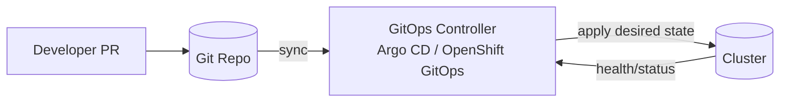

# infra/platform — KFM Platform & GitOps 🧭🛡️


This directory contains **platform / cluster infrastructure** for Kansas Frontier Matrix (KFM): the GitOps controller bootstrap, shared platform components, and environment overlays that enforce KFM’s governance model.

> [!IMPORTANT]
> **This folder is part of the platform security boundary.**  
> Changes here can affect access control, provenance/audit guarantees, and “trust membrane” enforcement. Treat PRs as *production changes*.

---

## What lives here ✅ / What does not ❌

### In scope ✅
- **GitOps bootstrap** (install/seed the GitOps controller and initial app-of-apps).
- **Platform controllers & shared services** needed for KFM runtime guarantees (examples: policy enforcement, ingress/gateway, certs, observability plumbing).
- **Cluster fundamentals**: namespaces, RBAC, network policies, quota/limits, storage classes, and guardrails needed to keep the trust membrane intact.
- **Environment overlays** (dev/stage/prod) using **Kustomize** overlays (preferred) instead of long-lived environment branches.

### Out of scope ❌
- Application source code (belongs in `src/`, `web/`, etc.).
- Dataset catalogs / STAC/DCAT/PROV artifacts (belongs in data + docs surfaces).
- Story Nodes, Focus Mode narrative content, or evidence bundles.
- Ad-hoc `kubectl apply` one-offs (platform is GitOps-managed; manual drift is a bug).

---

## KFM governance invariants (non-negotiable)

These invariants are enforced **by construction** across the KFM system and should be reflected in platform policies, network boundaries, and CI gates:

- **Fail-closed gates**: publishing/promotion is blocked unless required metadata, provenance, and policy checks pass.  
- **Sovereignty & sensitivity**: authority-to-control and consent are first-class policy inputs.  
- **Trust membrane**: UI/clients never touch storage directly; all access routes through governed APIs and policy checks.  

> [!NOTE]
> Treat these as “platform invariants”: platform config should **prevent bypass** (e.g., network segmentation, RBAC boundaries, admission policies, and audit logging).

---

## GitOps model used here (recommended default)

This folder follows a **boundary-driven GitOps repo layout** optimized for reuse across clusters and clear separation of responsibilities:

- **bootstrap**: seed the GitOps controller and the initial reconciliation entrypoint.
- **components**: reusable GitOps controller objects (ApplicationSets, Argo CD Projects, RBAC, repo creds).
- **core**: cluster “core functionality” (platform services and controls).
- **apps**: tenant workloads (KFM applications) with base + env overlays.

This structure is aligned with a common Argo CD GitOps layout where:
- `core` is typically owned by platform administrators, and
- `apps` is where developers/release engineers add workloads that are automatically picked up via an ApplicationSet.  

---

## Proposed directory layout (default scaffold)

> [!TIP]
> If your repo already has a different structure, keep the **meaning** (bootstrap/components/core/apps + overlays) even if names differ.

```text
infra/
└── platform/
    ├── README.md
    ├── bootstrap/
    │   ├── base/
    │   └── overlays/
    │       └── default/                 # first cluster overlay (rename per cluster)
    ├── components/
    │   ├── applicationsets/             # app-of-apps (core + apps)
    │   └── argocdproj/                  # Argo CD Projects, RBAC boundaries
    ├── core/
    │   ├── gitops-controller/           # Argo CD manages itself (“self-managed”)
    │   ├── policy/                      # platform policy enforcement (admission/runtime)
    │   ├── networking/                  # ingress/gateway, dns, certs, networkpolicy
    │   ├── observability/               # metrics/logs/tracing plumbing (platform-level)
    │   └── storage/                     # storageclasses, operators, backups (platform)
    └── apps/
        ├── kfm-api/
        │   ├── base/
        │   └── overlays/
        │       ├── dev/
        │       ├── stage/
        │       └── prod/
        └── kfm-web/
            ├── base/
            └── overlays/
                ├── dev/
                ├── stage/
                └── prod/
```

### Ownership boundaries (who changes what)

| Area | Typical owner(s) | What changes look like | Review expectation |
|---|---|---|---|
| `bootstrap/` | Platform SRE / cluster admins | initial Argo CD/OpenShift GitOps + seed apps | **Strict** (small, audited PRs) |
| `components/` | Platform SRE / security | ApplicationSets, Projects, controller RBAC | **Strict** (policy + security review) |
| `core/` | Platform SRE / security | shared services, platform guardrails | **Strict** (platform regression risk) |
| `apps/` | App teams + release eng | app manifests + overlays | Standard app review + platform constraints |

---

## How reconciliation works



**Key property:** the cluster continuously converges to what’s in `infra/platform/` (drift is detected and corrected).

---

## Bootstrap a cluster

> [!WARNING]
> Bootstrap is the only time a *limited* manual apply is acceptable. After bootstrap, the controller owns reconciliation.

### Example (Kustomize overlay)
```bash
# Kubernetes:
kubectl apply -k infra/platform/bootstrap/overlays/default

# OpenShift:
oc apply -k infra/platform/bootstrap/overlays/default
```

### Expected bootstrap outcome
- GitOps controller installed/available.
- Argo CD Projects + ApplicationSets created from `components/`.
- “Core” and “Apps” reconciliation begins automatically.

---

## Add a new core platform component

1) Create a new directory under `core/` (e.g., `core/observability/loki/`).
2) Provide a `kustomization.yaml` and manifests (or reference an Operator/Helm template output).
3) Ensure it is included by the **core components ApplicationSet** (commonly something like `components/applicationsets/core-components-appset.yaml`).
4) Add/update policy/guardrails if the component affects:
   - ingress exposure
   - authn/authz
   - storage persistence
   - audit/provenance logging
   - data sensitivity controls

**Design rule:** core components must not create bypass paths around the trust membrane.

---

## Add / update a KFM application workload

1) Add a new app directory under `apps/<app-name>/`.
2) Put shared manifests in `apps/<app-name>/base/`.
3) Put environment-specific differences in `apps/<app-name>/overlays/{dev,stage,prod}/`.

### Promotion model
- Promote by PRs that adjust overlays (images by digest, config changes, replica sizing, etc.).
- Keep branches minimal; use directories/overlays for environments.

<details>
<summary><strong>Why we use overlays (not environment branches)</strong></summary>

Using Kustomize overlays avoids environment drift and cherry-pick complexity as systems scale. GitOps workflows typically favor a trunk-based model where “branches are for short-lived work” and environment differences live in overlays/directories.

</details>

---

## Trust membrane alignment (platform responsibilities)

KFM’s architecture requires a **governed boundary** where *all reads and writes crossing the trust membrane* pass through:
- authentication,
- policy evaluation,
- query shaping/redaction, and
- audit/provenance logging.

Platform configuration should actively support this by:
- limiting network reachability of data stores (only governed APIs can reach them),
- constraining service exposure (no “accidental public” services),
- enforcing namespace/RBAC segmentation,
- ensuring policy decision points are reachable by the API layer, and
- ensuring audit/provenance sinks are durable.

---

## CI / validation gates for `infra/platform`

> [!IMPORTANT]
> Platform changes must be **linted, built, and policy-checked** the same way KFM treats data/catalog changes: fail-closed.

Recommended minimum checks:
- `kustomize build` succeeds for each overlay
- YAML lint
- Kubernetes schema validation (e.g., kubeconform/kubeval)
- Policy-as-code checks where applicable (Conftest/OPA)
- Secret scanning (no plaintext credentials committed)
- Image pinning policy (prefer digests for production)

### Definition of Done ✅
- [ ] `kustomize build` works for all overlays touched
- [ ] No cluster-admin RBAC added without explicit justification
- [ ] No new public ingress/route without platform review
- [ ] NetworkPolicy updated to prevent trust membrane bypass (if applicable)
- [ ] Audit/provenance impact evaluated (logs/receipts remain durable)
- [ ] CI required checks pass (fail-closed)

---

## Secrets & configuration

- **Never commit secrets.**
- Use external secret management patterns (e.g., ExternalSecrets/SealedSecrets) depending on your target cluster.
- Keep environment-specific configuration in overlays.
- Prefer immutable references (digests, content-addressed artifacts) for anything that impacts governance guarantees.

---

## Runbooks (suggested)

Create and link runbooks as you operationalize platform slices:

- `docs/runbooks/platform/bootstrap.md`
- `docs/runbooks/platform/argocd.md`
- `docs/runbooks/platform/storage.md`
- `docs/runbooks/platform/networking.md`
- `docs/runbooks/platform/policy.md`
- `docs/runbooks/platform/observability.md`

---

## References (governed sources)

- KFM Data Source Integration Blueprint (v1.0, 2026-02-12): clean layers + trust membrane + policy boundary + audit/provenance.
- KFM Integration Ideas Pack (2026-02-15): fail-closed gates, policy-as-code expectations, CI/GitOps baseline patterns.
- GitOps directory structure guidance for Argo CD / OpenShift GitOps.

---

## Glossary

- **GitOps**: desired-state operations driven from git; the cluster reconciles continuously.
- **Argo CD / OpenShift GitOps**: GitOps controller that syncs manifests from the repo.
- **ApplicationSet**: a generator/controller that creates many Argo CD Applications from a pattern.
- **Kustomize base/overlays**: keep common manifests in base; encode env deltas in overlays.
- **Trust membrane**: governed API/policy boundary—clients do not access storage directly.
