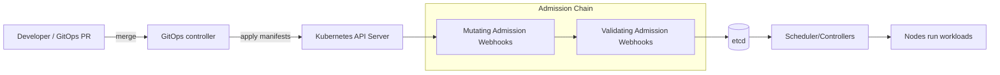

<!--
File: infra/platform/admission/README.md
Purpose: Cluster-side admission controls (Kubernetes/OpenShift) for KFM platform governance + security.
-->

# 🛡️ Platform Admission Controls (Kubernetes/OpenShift)


Cluster-side guardrails that turn Kubernetes API-server admission into a **reliable enforcement choke point** for KFM.

> [!IMPORTANT]
> **Trust membrane rule:** external clients (including the frontend) never access data stores directly.
> Admission controls do **not** replace the governed API boundary; they complement it by hardening *how platform workloads are deployed*.

---

## 🎯 What this directory is for

Admission controls here enforce **deployment-time** invariants such as:

- baseline workload security (Pod Security Admission / Pod Security Standards)
- policy-as-code validation on Kubernetes resources (validating admission)
- standardized labels/annotations needed for governance + observability
- limited, governed exceptions (“break-glass”) with auditability

This directory is designed to be applied via **GitOps reconciliation** (preferred) rather than manual `kubectl apply`.

---

## ✅ Non-negotiables

These are platform invariants; admission policy is one place we enforce them.

- **Fail closed**: if a required field/label/policy prerequisite is missing, the request is denied by default.
- **Policy-as-code**: rules are versioned, reviewable, testable, and reproducible.
- **Auditability**: exceptions must be time-bounded and attributable to a ticket/PR.
- **Thin-slice rollout**: start in audit/dry-run modes where available; then promote to enforce.

> [!NOTE]
> Admission is also where we can enforce “verify artifacts, not just people” by requiring signed images / attestations (future slice).

---

## 🧱 Planned folder layout

> This is the *intended* structure for the admission “module.” Create folders as you implement slices.

```text
infra/platform/admission/
├─ README.md
├─ base/
│  ├─ psa/                     # Pod Security Admission labels and namespace profiles
│  ├─ gatekeeper/              # (optional) Gatekeeper install + config
│  └─ policies/                # ConstraintTemplates/Constraints or Kyverno Policies
├─ overlays/
│  ├─ dev/
│  ├─ stage/
│  └─ prod/
├─ test/
│  ├─ conftest/                # mirror policies (Rego) for CI preflight
│  └─ fixtures/                # “allow” + “deny” examples
└─ docs/
   ├─ decisions/               # ADRs for policy choices + exceptions
   └─ runbooks/                # operational guides
```

---

## 🔁 How admission fits into the request flow



> [!WARNING]
> Webhooks are part of the control plane critical path. Treat them like production dependencies:
> **HA, sane timeouts, no side effects**, and clear failure modes.

---

## 🧩 Policy layers we expect to use

| Layer | Mechanism | What it should cover | Rollout mode |
|---:|---|---|---|
| L0 | **Pod Security Admission (PSA)** | baseline/restricted profiles at namespace level | warn → audit → enforce |
| L1 | **Validating policies** (Gatekeeper *or* Kyverno) | org rules: labels, resource limits, privileged caps, hostPath bans, etc. | dry-run/audit → deny |
| L2 | **Supply-chain controls** *(future slice)* | image signature verification, approved registries, SBOM/provenance requirements | audit → enforce |
| L3 | **KFM governance hooks** *(future slice)* | enforce metadata needed for policy boundary alignment (e.g., workload “lane”, data-class tags) | staged |

---

## 🧰 Engine choice: Gatekeeper vs Kyverno

We support either approach, but **pick one** as the platform default to avoid policy drift.

### Option A — Gatekeeper (OPA/Rego)
- Best if you want one policy language across:
  - CI (Conftest)
  - in-cluster admission (Gatekeeper)

### Option B — Kyverno (YAML policies)
- Best if you want fast iteration with Kubernetes-native syntax
- Strong reporting (PolicyReports) and simpler onboarding

> [!TIP]
> If the repo already standardizes on **Conftest + Rego**, Gatekeeper is the lowest-friction choice because policy logic can be shared.

---

## 🧪 Workflow: add or change a policy

### 1) Create / update policy
- add constraint/policy file under `base/policies/`
- if changing enforcement behavior, update overlay(s) under `overlays/*`

### 2) Add test fixtures
- at least one **allow** fixture
- at least one **deny** fixture that demonstrates the intended failure reason

### 3) Run preflight checks (local)
```bash
# Render final YAML for an environment
kustomize build infra/platform/admission/overlays/dev > /tmp/admission-dev.yaml

# Server-side dry run (requires cluster access)
kubectl apply --dry-run=server -f /tmp/admission-dev.yaml
```

### 4) PR requirements (suggested)
- `kustomize build` succeeds for all overlays
- policy unit tests pass (Rego tests or Kyverno CLI tests)
- fixtures are updated when behavior changes
- docs updated if user-facing behavior changes (deny messages, exception rules, etc.)

**Definition of Done**
- [ ] Policy has tests and fixtures
- [ ] Rollout plan is stated (audit → enforce)
- [ ] Break-glass story exists (what if this blocks production?)
- [ ] Monitoring signal defined (how will we know it’s working?)

---

## 🚨 Exceptions and break-glass

Policy exceptions are allowed only when they are:

- **time-bounded** (expiration date/time or a “remove-by” ticket)
- **scoped** (namespace/app specific, not cluster-wide)
- **reviewed** (CODEOWNERS / platform owners)
- **auditable** (linked to an issue/ticket and a PR)

> [!CAUTION]
> Prefer “audit/dry-run” modes for rollouts. If you must exempt, exempt the smallest surface area possible.

Recommended patterns (choose one, document it in an ADR):
- namespace exemption list (platform-owned)
- policy `enforcementAction: dryrun` for a limited window
- required annotation like `kfm.io/exception-ticket: XYZ-1234` plus expiration field

---

## 📈 Observability & post-deployment verification

Even with admission enforcement, we want **continuous verification** because:
- policies evolve
- emergency bypasses happen
- enforcement may temporarily fail open during outages

Suggested signals:
- admission deny counts per policy (rate + top offenders)
- audit/dry-run violations (leading indicators)
- time-to-fix for violations after rollout
- exception count and age

---

## 🧯 Troubleshooting quick guide

<details>
<summary><strong>Common symptoms</strong></summary>

- **Create/Update denied**: check `kubectl describe` output for the webhook or policy name.
- **Timeouts on apply**: webhook is unhealthy or too slow; check control-plane logs and webhook service endpoints.
- **Policy unexpectedly denies**: compare rendered YAML from GitOps overlay vs what you think you applied.

</details>

<details>
<summary><strong>Command snippets</strong></summary>

```bash
# See admission-related events in a namespace
kubectl get events -n <ns> --sort-by=.lastTimestamp

# Confirm PSA labels on a namespace
kubectl get ns <ns> -o jsonpath='{.metadata.labels}'

# If using Gatekeeper:
kubectl get constrainttemplates
kubectl get constraints -A

# If using Kyverno:
kubectl get policyreports -A
kubectl get clusterpolicies
```

</details>

---

## 📚 References

- Kubernetes concepts: admission controllers, Pod Security Admission / Standards
- Policy engines: Gatekeeper (OPA/Rego) and/or Kyverno
- GitOps operations (Argo CD / Flux) for drift detection + reconciliation

> [!NOTE]
> Keep external reference links out of policy YAML comments when possible; put them here in README/ADRs for link-check hygiene.

---
