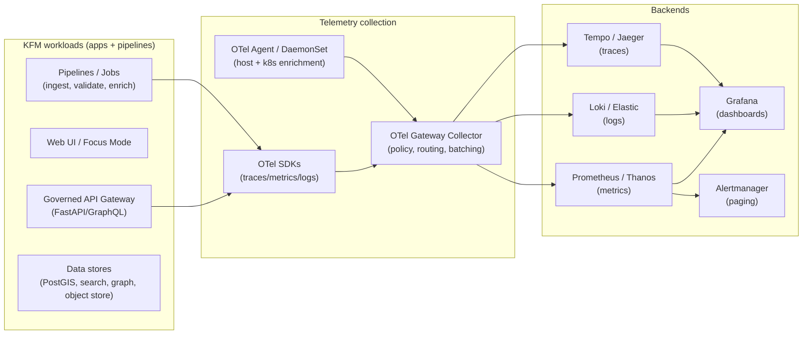

# KFM Platform Observability (infra/platform/observability)


> [!IMPORTANT]
> **Telemetry is governed data.** Logs/metrics/traces can leak **restricted fields**, **sensitive locations**, and **small-count aggregates** if we don’t treat observability as part of the trust membrane.

---

## Quick links

- 📁 **Repo layout:** [Directory layout](#directory-layout)
- 🚀 **Deploy:** [GitOps deployment model](#gitops-deployment-model)
- 🧭 **Standards:** [Instrumentation + correlation](#instrumentation--correlation-standards)
- 🧱 **Governance:** [Sensitivity + redaction](#governance--sensitivity-in-telemetry)
- 📉 **SLOs/alerts:** [Signals, SLOs, and alerting](#signals-slos-and-alerting)
- 🧯 **Ops:** [Runbooks + incident response](#runbooks--incident-response)
- ✅ **DoD:** [Definition of Done](#definition-of-done)

---

## What this folder is

This directory defines the **platform-level observability** for Kansas Frontier Matrix (KFM):

- **Metrics** (cluster + app + pipelines)
- **Logs** (application, pipeline, audit, platform)
- **Traces** (distributed request + pipeline tracing)
- **Alerting** (SLO burn-rate + freshness + safety regressions)
- **Dashboards** (operator + investigator + exec)
- **Runbooks** (how to respond safely, with evidence-first discipline)

### What this folder is not

- Not a replacement for debugging or system understanding.
- Not a place to dump unbounded logs “just in case”.
- Not a backdoor around the KFM trust membrane.

---

## Design principles

1. **Evidence-first investigations**
   - Every incident should be explainable with a traceable chain of evidence: *what happened → where → why → what data changed → what policy applied*.

2. **Governed by default**
   - Telemetry must respect dataset/field sensitivity rules and never create a side-channel that bypasses redaction/policy.

3. **Vendor-neutral signals**
   - Use OpenTelemetry (OTLP) as the default interconnect; keep backends swappable.

4. **GitOps + DRY + environment overlays**
   - Everything is declarative, reviewable, promotable via overlays (dev/stage/prod).

5. **Security and least privilege**
   - Observability is operationally powerful—treat it as privileged infrastructure.

---

## High-level architecture

### Signals we collect

- **Metrics:** request rate, error rate, latency, saturation; pipeline runs; dataset freshness; drift; storage health
- **Logs:** structured app logs; policy decision logs; pipeline logs; audit logs
- **Traces:** end-to-end requests across gateway → services → storage; pipeline stages (ingest/validate/enrich/catalog/serve)

### Reference flow



> [!NOTE]
> We prefer a **gateway Collector** so we can apply centralized controls (sampling, routing, redaction, auth) consistently across services.

---

## Directory layout

> [!NOTE]
> This is the expected layout for this folder. Add files incrementally; keep changes reviewable.

```text
infra/
└── platform/
    └── observability/
        ├── README.md                      # ← you are here
        ├── kustomize/
        │   ├── base/
        │   │   ├── kustomization.yaml
        │   │   ├── namespace.yaml
        │   │   ├── rbac/                  # least-privilege service accounts/roles
        │   │   ├── otel-collector/         # gateway + agent definitions
        │   │   ├── metrics/                # ServiceMonitors, PrometheusRules
        │   │   ├── logging/                # log pipeline config (if self-managed)
        │   │   └── tracing/                # tracing backend config (if self-managed)
        │   └── overlays/
        │       ├── dev/
        │       ├── stage/
        │       └── prod/
        ├── dashboards/                     # Grafana dashboards (jsonnet/json)
        ├── alerts/                         # PrometheusRule fragments + routing docs
        ├── runbooks/                       # markdown runbooks per alert/incident type
        └── conventions/
            ├── telemetry-schema.md         # log fields, resource attrs, IDs
            ├── slo-catalog.md              # SLO definitions incl. dataset freshness
            └── privacy-redaction.md        # what NEVER goes into telemetry
```

---

## GitOps deployment model

This folder is intended to be deployed as a **core platform workload** via GitOps.

- Use **Kustomize base + overlays** for environment-specific settings.
- Deploy via **Argo CD / OpenShift GitOps** Application or ApplicationSet.

<details>
<summary>Example: Argo CD Application (reference)</summary>

```yaml
apiVersion: argoproj.io/v1alpha1
kind: Application
metadata:
  name: kfm-observability
  namespace: argocd
spec:
  project: platform
  source:
    repoURL: https://example.invalid/your-org/kfm
    targetRevision: main
    path: infra/platform/observability/kustomize/overlays/prod
  destination:
    server: https://kubernetes.default.svc
    namespace: kfm-observability
  syncPolicy:
    automated:
      prune: true
      selfHeal: true
    syncOptions:
      - CreateNamespace=true
```

</details>

> [!TIP]
> Keep observability deployment aligned with your broader GitOps repository boundaries (bootstrap/components/core/apps) so SRE/security/app teams can own distinct areas cleanly.

---

## Instrumentation + correlation standards

### Required propagation headers / IDs

| Purpose | Standard | Where used |
|---|---|---|
| Distributed tracing | `traceparent` / `tracestate` (W3C TraceContext) | HTTP/gRPC between gateway ↔ services ↔ storage |
| Request correlation | `x-kfm-request-id` (generated at edge if missing) | Logs + traces + audit |
| Evidence bundle link | `x-kfm-evidence-hash` (response) | Audit + investigation |
| Audit reference | `x-kfm-audit-ref` (response) | Audit store lookup |

> [!IMPORTANT]
> Correlation IDs must **not** encode PII. They are opaque identifiers.

### OpenTelemetry Resource attributes (minimum)

Set these on every service/job:

- `service.name`
- `service.namespace`
- `service.version`
- `deployment.environment` (`dev|stage|prod`)
- `k8s.cluster.name` (if available)
- `k8s.namespace.name`
- `k8s.pod.name`

### Structured logging schema (minimum)

Use JSON logs with stable keys. Example shape:

```json
{
  "ts": "2026-02-16T12:34:56.789Z",
  "level": "INFO",
  "service": "kfm-api-gateway",
  "env": "prod",
  "request_id": "01J...KFM",
  "trace_id": "4bf92f3577b34da6a3ce929d0e0e4736",
  "span_id": "00f067aa0ba902b7",
  "event": "policy.decision",
  "policy": { "id": "kfm.opa.v1", "decision": "allow" },
  "evidence_hash": "sha256:...",
  "audit_ref": "audit:2026-02-16:..."
}
```

> [!WARNING]
> **Never** log raw tokens, passwords, API keys, owner names, or precise sensitive coordinates. See [Governance & sensitivity](#governance--sensitivity-in-telemetry).

---

## Governance & sensitivity in telemetry

KFM treats some data as sensitive and requires explicit handling:

### Sensitivity classes (recommended)

- **Public:** safe to publish without redaction
- **Restricted:** role-based access required (e.g., parcel ownership)
- **Sensitive-location:** coordinates must be generalized or suppressed (e.g., archaeology, sensitive species)
- **Aggregate-only:** publish only above thresholds (health/crime small counts)

### Redaction is a first-class transformation

Redaction must be treated as a transformation that is:

- explicit,
- recorded in provenance (PROV),
- reproducible,
- and **fail-closed** when policy cannot be evaluated.

### Practical telemetry rules

✅ Allowed in telemetry:
- dataset IDs + version IDs (not raw records)
- coarse spatial bins / generalized tiles
- counts and aggregated stats above thresholds
- policy decision outcomes (allow/deny) + reason codes
- error categories (not raw payloads)

🚫 Forbidden in telemetry:
- exact archaeological coordinates for restricted roles
- owner names or private parcel attributes
- raw user prompts if they could contain sensitive details
- small-count health/crime outputs that could re-identify

---

## Signals, SLOs, and alerting

### Core KFM signals (minimum)

| Domain | Signal | Examples |
|---|---|---|
| Pipelines | Ingest runs | success/fail, duration, rows/bytes processed, retries |
| Freshness | “last good” timestamps | last successful run per dataset + expected cadence |
| Quality drift | distribution checks | missingness, geometry errors, schema mismatch |
| API & policy | gateway health | latency, cache hit rate, policy denials, evidence-resolution failures |
| Storage | capacity & health | object store growth, PostGIS index health, search index lag |

### Dataset freshness SLO model

Each dataset should carry an SLO like:

- **Mesonet:** `< 1 hour`
- **Storm Events:** `< 30 days`
- **Static archives:** exempt / “no freshness SLO”

Alert when freshness SLO is violated.

### Alert philosophy

- Prefer **burn-rate alerts** for customer-facing SLOs (avoid noisy paging).
- Page on:
  - sustained error budget burn,
  - freshness SLO breach for critical datasets,
  - policy regression (leak risk),
  - audit integrity failures.

---

## Dashboards

Minimum dashboard set (per environment):

1. **KFM Gateway**
   - request rate / errors / p50-p95-p99 latency
   - policy denials + reason codes
   - evidence resolution failures

2. **Pipeline Health**
   - last run by dataset
   - success/fail trend
   - duration + retries
   - freshness SLO status

3. **Data Stores**
   - PostGIS: connections, slow queries, index health
   - search: indexing lag, query latency
   - object store: growth, error rates

4. **Governance + Safety**
   - redaction applied counts
   - blocked “sensitive-location” requests by role
   - audit reference coverage (% responses carrying `audit_ref` and `evidence_hash`)

---

## Runbooks & incident response

Runbooks live in `./runbooks/`.

Each paging alert must have a runbook containing:

- **What this alert means**
- **Immediate safety checks**
  - Did we leak restricted data?
  - Is redaction failing open?
- **How to verify**
  - dashboards / queries
  - sample trace/log pivots using request_id / trace_id
- **Mitigation steps**
- **Rollback steps**
- **Post-incident**
  - evidence bundle + audit reference
  - follow-up tickets + regression tests

---

## CI validation gates

> [!IMPORTANT]
> Observability config is production code. Treat it like production code.

Recommended CI gates:

- ✅ Validate Kubernetes manifests (`kubeconform` / `kustomize build`)
- ✅ Lint PrometheusRules (`promtool check rules`)
- ✅ Validate Grafana dashboards (JSON schema / jsonnet compile)
- ✅ Enforce telemetry privacy rules (log-field allowlist/denylist tests)
- ✅ Policy regression suite:
  - “golden queries that leaked before must fail forever”
  - negative tests for sensitive-location precision
  - audit integrity tests: every API response must include `audit_ref` + `evidence_hash`

---

## Definition of Done

When adding a **new service**, **pipeline**, or **dataset**, it is not “done” until:

- [ ] **Metrics**: exported and scraped; includes request/pipeline basics
- [ ] **Logs**: structured JSON; includes request_id + trace_id
- [ ] **Traces**: end-to-end trace visible in tracing backend
- [ ] **Dashboards**: service/pipeline panels added or reused
- [ ] **Alerts**: at least one meaningful SLO/SLA alert (or explicitly “no paging”)
- [ ] **Runbook**: paging alerts have runbooks
- [ ] **Governance**: telemetry reviewed for sensitivity/PII leak risk
- [ ] **Tests**: regression test added if incident exposed a gap

---

## References (project-internal)

- KFM — Data Source Integration Blueprint (v1.0, 2026-02-12)
- KFM — Governance & sensitivity handling + SLO monitoring requirements
- GitOps repository structuring guidance (Argo CD + kustomize base/overlays)
- OpenTelemetry collector patterns (gateway vs agent vs direct) and OTLP usage
