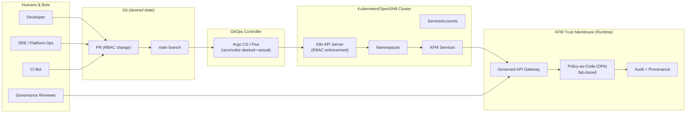

# KFM Platform RBAC (Kubernetes/OpenShift)


Governed, least-privilege **Kubernetes/OpenShift RBAC** for the Kansas Frontier Matrix (KFM) platform.

This folder defines **who can do what** on the *cluster/platform layer* (deployments, namespaces, config, logs, secrets access patterns, etc.) while preserving KFM’s *trust membrane* (clients never touch storage directly; all access via governed APIs + policy boundary).

---

## Table of contents

- [What this folder is](#what-this-folder-is)
- [Non-negotiables](#non-negotiables)
- [RBAC scope vs KFM runtime authorization](#rbac-scope-vs-kfm-runtime-authorization)
- [Repository layout](#repository-layout)
- [Conventions](#conventions)
- [Role catalog](#role-catalog)
- [Binding strategy](#binding-strategy)
- [GitOps workflow](#gitops-workflow)
- [Validation gates](#validation-gates)
- [Break-glass access](#break-glass-access)
- [Troubleshooting](#troubleshooting)
- [Appendix: minimal YAML examples](#appendix-minimal-yaml-examples)

---

## What this folder is

**Platform RBAC manifests** intended to be applied to a Kubernetes/OpenShift cluster by a GitOps controller (Argo CD / OpenShift GitOps / Flux), including:

- `ClusterRole` / `Role`
- `ClusterRoleBinding` / `RoleBinding`
- `ServiceAccount` (only where needed for KFM workloads)
- Optional: environment overlays for group names / namespace names

> [!NOTE]
> This README is written to be **cluster-agnostic** (Kubernetes or OpenShift). Where OpenShift-specific differences exist (e.g., `oc` helpers), they are called out explicitly.

---

## Non-negotiables

> [!IMPORTANT]
> KFM governance invariants apply to infra changes too. These are treated as production changes.

- **Trust membrane is mandatory**  
  UI/external clients must not access databases/object storage directly. All access routes through the governed API + policy boundary.  
- **Fail-closed posture**  
  When policy cannot prove “allow,” the default behavior is **deny**.
- **Least privilege + separation of duties**  
  RBAC is designed so:
  - Most humans are **read-only** at cluster scope.
  - Namespace-scoped admin is preferred over cluster-admin.
  - ServiceAccounts are narrowly permissioned, and never reused across unrelated services.

---

## RBAC scope vs KFM runtime authorization

Kubernetes RBAC controls **Kubernetes API actions** (deploy, scale, read logs, edit configmaps, etc.).

KFM runtime authorization controls **domain/data actions** (query datasets, redact sensitive locations, approve promotions, publish Story Nodes, etc.). That is enforced at the **KFM trust membrane** (governed API gateway + policy-as-code).

**Do not** try to encode KFM dataset-level access rules purely in Kubernetes RBAC.



---

## Repository layout

> [!NOTE]
> The exact folder structure beneath `infra/platform/rbac/` may vary by repo. If your repo does not yet have these directories, consider adopting the layout below (it is designed for GitOps + Kustomize).

```text
infra/
└── platform/
    └── rbac/
        ├── README.md
        ├── base/                          # Common RBAC for all environments/clusters
        │   ├── kustomization.yaml
        │   ├── clusterroles/              # ClusterRole definitions (cluster-scoped)
        │   ├── roles/                     # Role definitions (namespace-scoped)
        │   ├── bindings/                  # RoleBinding / ClusterRoleBinding
        │   └── serviceaccounts/           # SA definitions (only when required)
        ├── overlays/                      # Environment-specific bindings, subjects, namespaces
        │   ├── dev/
        │   ├── stage/
        │   └── prod/
        └── policy/                        # Optional policy-as-code for RBAC hygiene gates
            ├── conftest/                  # conftest test inputs
            └── rego/                      # deny-by-default rules for RBAC changes
```

---

## Conventions

### Naming

- **Prefix** all KFM roles/bindings with `kfm-`:
  - `kfm-platform-viewer`
  - `kfm-namespace-admin`
  - `kfm-gitops-reconciler`
- Use **kebab-case** and keep names stable once shipped.

### Labels & annotations

Attach minimal provenance-friendly metadata to RBAC objects:

- `app.kubernetes.io/part-of: kfm`
- `kfm.dev/owner: platform-security` *(example)*
- `kfm.dev/change-ticket: "<ticket-id>"` *(optional but recommended)*
- `kfm.dev/last-reviewed: "YYYY-MM-DD"`

> [!IMPORTANT]
> Never store secrets, tokens, or personally sensitive data in RBAC YAML annotations.

---

## Role catalog

> [!TIP]
> Favor namespace-scoped `Role`/`RoleBinding` first. Use cluster-scoped roles only when you truly need to touch cluster-scoped resources.

| Role name | Kind | Scope | Intended for | Typical permissions (high level) |
|---|---|---:|---|---|
| `kfm-platform-viewer` | ClusterRole | Cluster | Read-only humans | get/list/watch on non-sensitive resources (namespaces, pods, deployments, events) |
| `kfm-platform-operator` | ClusterRole | Cluster | SRE/ops | manage workloads in `kfm-*` namespaces; **no** RBAC write permissions by default |
| `kfm-namespace-admin` | Role | Namespace | App/team leads | manage deployments/services/configmaps within a namespace |
| `kfm-gitops-reconciler` | Role/ClusterRole | Mixed | GitOps controller SA | apply/update KFM resources per namespace/cluster requirements |
| `kfm-security-rbac-admin` | ClusterRole | Cluster | Security team | manage RBAC objects (roles/bindings) + selected policy resources |

> [!WARNING]
> Avoid granting `cluster-admin` except for **break-glass** workflows. If you must use it, time-bound it and audit it.

---

## Binding strategy

### Humans

Bind humans via **groups** from your IdP (OIDC/LDAP/SAML), not via direct user subjects where possible.

Recommended (example) group names:

- `kfm-platform-viewers`
- `kfm-platform-operators`
- `kfm-security-admins`
- `kfm-governance-reviewers`

> [!NOTE]
> Group names are **(not confirmed in repo)**. Choose names consistent with your IdP and document them here once known.

### ServiceAccounts

- Use **one ServiceAccount per workload** (API, pipeline runner, catalog writer, etc.).
- Bind the SA to the smallest possible Role/ClusterRole.
- Never reuse a “god SA” across multiple components.

---

## GitOps workflow

RBAC should be changed **only via PR**, then applied by GitOps (continuous reconciliation).

Suggested workflow:

1. **Create PR** modifying RBAC YAML under `infra/platform/rbac/`.
2. CI runs:
   - schema lint (`kubeconform`/`kubeval`)
   - policy checks (Conftest/OPA deny rules)
   - basic RBAC safety checks (see [Validation gates](#validation-gates))
3. CODEOWNERS requires review from **platform security**.
4. Merge triggers GitOps reconciliation.
5. Post-merge verification:
   - `kubectl auth can-i …` sanity checks for key personas/SAs
   - confirm GitOps sync status is green

> [!IMPORTANT]
> Repository structure and review boundaries should mirror organizational boundaries (platform admin, security team, release manager, etc.). RBAC belongs in a boundary-owned area of the repo.

---

## Validation gates

Minimum “fail closed” gates recommended for RBAC changes:

### ✅ Static checks (no cluster required)

- YAML formatting + schema validation
- Deny rules (policy-as-code), examples:
  - deny `cluster-admin` bindings (except in `/breakglass/` overlay)
  - deny wildcards like `*` verbs/resources unless explicitly allowed
  - require `app.kubernetes.io/part-of=kfm` label on all RBAC objects

### ✅ Live checks (cluster required)

Run against a target cluster (dev/stage) after apply:

```bash
# Basic RBAC sanity checks (examples)
kubectl auth can-i get pods -n kfm-api --as-group=kfm-platform-viewers
kubectl auth can-i create deployments -n kfm-api --as-group=kfm-platform-viewers   # should be "no"

kubectl auth can-i create deployments -n kfm-api --as-group=kfm-platform-operators # should be "yes" (if intended)
kubectl auth can-i create clusterroles --as-group=kfm-platform-operators           # should be "no"
```

OpenShift convenience equivalents (optional):

```bash
# Who can do X? (OpenShift)
oc adm policy who-can create deployment -n kfm-api
```

---

## Break-glass access

Break-glass exists for emergencies only.

**Rules:**

- Must be time-bound (JIT / expiry).
- Must be attributable to a human identity.
- Must be recorded:
  - PR/commit reference
  - incident ticket
  - start/end timestamp
  - scope of elevated permissions

> [!WARNING]
> Break-glass is a controlled exception—not a normal operations path.

---

## Troubleshooting

### “Forbidden” errors

1. Confirm subject identity:
   - user/group mapping in IdP
   - correct namespace
2. Check bindings:
   - `kubectl get rolebinding,clusterrolebinding -A | grep <subject>`
3. Inspect the referenced role:
   - `kubectl describe role/<name> -n <ns>`
   - `kubectl describe clusterrole/<name>`
4. Validate with `auth can-i`:
   - `kubectl auth can-i <verb> <resource> -n <ns> --as=<user>`
5. If using GitOps:
   - confirm GitOps sync is healthy
   - confirm the live manifests match the repo

---

## Appendix: minimal YAML examples

<details>
<summary><strong>Example: Namespace Role + RoleBinding</strong></summary>

```yaml
apiVersion: rbac.authorization.k8s.io/v1
kind: Role
metadata:
  name: kfm-namespace-admin
  namespace: kfm-api
  labels:
    app.kubernetes.io/part-of: kfm
rules:
  - apiGroups: ["apps"]
    resources: ["deployments", "replicasets"]
    verbs: ["get", "list", "watch", "create", "update", "patch", "delete"]
  - apiGroups: [""]
    resources: ["services", "configmaps", "pods", "pods/log"]
    verbs: ["get", "list", "watch", "create", "update", "patch", "delete"]
---
apiVersion: rbac.authorization.k8s.io/v1
kind: RoleBinding
metadata:
  name: kfm-namespace-admins
  namespace: kfm-api
  labels:
    app.kubernetes.io/part-of: kfm
subjects:
  - kind: Group
    name: kfm-platform-operators
    apiGroup: rbac.authorization.k8s.io
roleRef:
  kind: Role
  name: kfm-namespace-admin
  apiGroup: rbac.authorization.k8s.io
```

</details>

<details>
<summary><strong>Example: ClusterRole + ClusterRoleBinding (read-only)</strong></summary>

```yaml
apiVersion: rbac.authorization.k8s.io/v1
kind: ClusterRole
metadata:
  name: kfm-platform-viewer
  labels:
    app.kubernetes.io/part-of: kfm
rules:
  - apiGroups: [""]
    resources: ["namespaces", "pods", "pods/log", "events"]
    verbs: ["get", "list", "watch"]
  - apiGroups: ["apps"]
    resources: ["deployments", "replicasets", "statefulsets"]
    verbs: ["get", "list", "watch"]
---
apiVersion: rbac.authorization.k8s.io/v1
kind: ClusterRoleBinding
metadata:
  name: kfm-platform-viewers
  labels:
    app.kubernetes.io/part-of: kfm
subjects:
  - kind: Group
    name: kfm-platform-viewers
    apiGroup: rbac.authorization.k8s.io
roleRef:
  kind: ClusterRole
  name: kfm-platform-viewer
  apiGroup: rbac.authorization.k8s.io
```

</details>

---

## Ownership & change control

- RBAC is **security-sensitive**.
- Recommended: add CODEOWNERS rules so `infra/platform/rbac/**` requires review from:
  - platform security team
  - platform SRE lead (optional)

> [!NOTE]
> Once merged, GitOps reconciliation makes RBAC changes “real.” Treat PR review as the primary governance gate.
