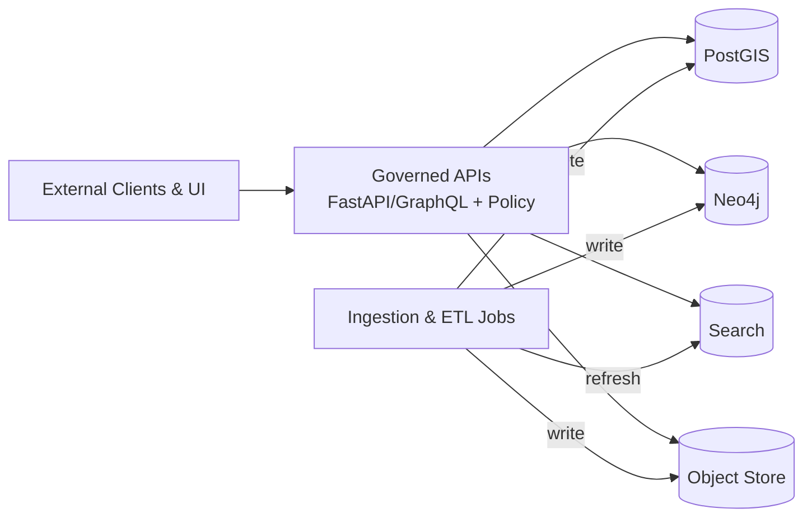

# Storage Platform

`infra/platform/storage/`


KFM uses **multi-model storage**—spatial, graph, search, and object storage—so that the platform can serve maps, lineage, discovery, and large assets together without compromising governance. [oai_citation:1‡KFM_Masterpiece_Vision.pdf](sediment://file_00000000beec71f585a8d7753113734e) [oai_citation:2‡KFM_Masterpiece_Vision.pdf](sediment://file_00000000beec71f585a8d7753113734e)

> [!IMPORTANT]
> **Trust membrane invariant (non-negotiable):**
> - The **UI and external clients never directly access databases**; all access is mediated by the governed API boundary. [oai_citation:3‡Kansas Frontier Matrix (KFM) – Comprehensive Technical Blueprint.pdf](sediment://file_000000006dbc71f89a5094ce310a452d)
> - All reads/writes crossing the membrane must pass **auth → policy eval → redaction/query shaping → audit/provenance logging** (CI-enforced). [oai_citation:4‡KFM_Comprehensive_Data_Source_Integration_Blueprint_v1_massive.pdf](sediment://file_000000000bbc722f8debeb7985ab63ea)

---

## What lives in this directory

This folder is the **platform storage infra** layer. It should contain:
- Kubernetes/OpenShift or Helm/Kustomize resources for storage services
- PersistentVolume/PersistentVolumeClaim and storage-class references
- Backup/restore job manifests and scripts
- Monitoring/alerts for storage services
- Storage security guardrails (NetworkPolicy, service accounts, secret references)

This folder should **not** contain:
- Domain models or business logic
- Direct-to-database access patterns from frontend code
- Plaintext secrets

---

## Storage services in scope

KFM’s core storage set is:

- **PostGIS** for spatial and relational data
- **Neo4j** for graph relationships/lineage
- **Search** for discovery and fast lookup (engine choice may vary)
- **Object store** for raw and large assets (S3-compatible common choice)

These are explicitly called out in the KFM architecture materials. [oai_citation:5‡KFM_Masterpiece_Vision.pdf](sediment://file_00000000beec71f585a8d7753113734e) [oai_citation:6‡KFM_Comprehensive_Data_Source_Integration_Blueprint_v1_massive.pdf](sediment://file_000000000bbc722f8debeb7985ab63ea)

### Components at a glance

| Component | Role in KFM | Typical contents | Notes |
|---|---|---|---|
| PostGIS | Spatial + structured query backbone | Places, boundaries, time-valid geometries, query-ready tables | Spatial ETL commonly uses GDAL/OGR and PostGIS loaders |
| Neo4j | Graph relationships + lineage assistance | Entity links, provenance edges, cross-dataset relationships | Neo4j persistence requires durable storage; avoid ephemeral pods |
| Search | Fast discovery | Indexes for datasets, entities, text, tags | Implementation may be Elasticsearch/OpenSearch *(not confirmed in repo)* |
| Object store | Large/raw assets + STAC assets | Raw ingests, derived rasters/vectors, binaries, manifests | S3-compatible *(not confirmed in repo)* |

---

## Data zones and promotion gates

Every dataset should flow through the KFM zones with promotion gates. Promotion to “Processed” is only allowed when machine-checkable artifacts and validations succeed. [oai_citation:7‡KFM_Comprehensive_Data_Source_Integration_Blueprint_v1_massive.pdf](sediment://file_000000000bbc722f8debeb7985ab63ea)

| Zone | Purpose | Allowed operations | Required artifacts before promotion |
|---|---|---|---|
| Raw | Immutable capture of source-of-truth data | Append-only writes; no transforms | Checksums + raw manifest; source license captured |
| Work | Repeatable transforms and QA staging | Derivation, normalization, enrichment | PROV activity; intermediate QA reports |
| Processed | Query-ready and exposed via API | Read-optimized storage + indexing | DCAT (+ STAC/PROV as needed); signed policy labels |

> [!NOTE]
> When promoting, the pipeline should update catalogs and trigger index refresh (search/graph). [oai_citation:8‡KFM_Comprehensive_Data_Source_Integration_Blueprint_v1_massive.pdf](sediment://file_000000000bbc722f8debeb7985ab63ea)

---

## Access pattern

KFM is designed so partners and UIs can build on governed APIs **without direct database access**. [oai_citation:9‡KFM_Masterpiece_Vision.pdf](sediment://file_00000000beec71f585a8d7753113734e)



---

## Suggested directory layout

> [!NOTE]
> This is the **intended** structure for `infra/platform/storage/`. If some folders do not exist yet, create them as you add manifests. *(Exact structure not confirmed in repo.)*

```text
infra/platform/storage/
├─ README.md
├─ _shared/
│  ├─ monitoring/               # Dashboards/alerts for storage SLIs/SLOs
│  ├─ backups/                  # CronJobs, Jobs, scripts, restore guides
│  ├─ networkpolicies/          # Default deny + allowlists for storage namespaces
│  └─ secrets/                  # References only (ExternalSecret/SealedSecret), never plaintext
├─ postgis/
│  ├─ base/                     # Base manifests (StatefulSet/Service/PVC/Config)
│  ├─ overlays/                 # env overlays (dev/stage/prod)
│  └─ migrations/               # Schema migration jobs and tooling
├─ neo4j/
│  ├─ base/
│  ├─ overlays/
│  └─ backups/
├─ search/
│  ├─ base/
│  └─ overlays/
└─ object-store/
   ├─ base/
   └─ overlays/
```

---

## Local development expectations

KFM’s dev onboarding describes a Docker Compose stack that includes at least:
- `db` running PostgreSQL + PostGIS
- `graph` running Neo4j
- optional search (e.g., Elasticsearch) depending on features [oai_citation:10‡Kansas Frontier Matrix (KFM) – Comprehensive Technical Blueprint.pdf](sediment://file_000000006dbc71f89a5094ce310a452d)

The `.env` typically contains DB settings such as `POSTGRES_USER`, `POSTGRES_PASSWORD`, `POSTGRES_DB`, and `NEO4J_AUTH` (or equivalents). [oai_citation:11‡Kansas Frontier Matrix (KFM) – Comprehensive Technical Blueprint.pdf](sediment://file_000000006dbc71f89a5094ce310a452d)

> [!WARNING]
> **Persistence matters even in dev.** Use durable volume mounts (for Neo4j, mounting `/data` is explicitly recommended to avoid data loss). [oai_citation:12‡Data Spaces.pdf](sediment://file_0000000053c071f5a9733b1b09cc9f76)

---

## Deployment baseline

### Neo4j on Kubernetes

A supported baseline is to deploy Neo4j via official Helm charts (common Kubernetes practice). [oai_citation:13‡Data Spaces.pdf](sediment://file_0000000053c071f5a9733b1b09cc9f76)

### GitOps-friendly overlays

If you are deploying via GitOps, prefer a `base/` + `overlays/{dev,stage,prod}` layout for storage workloads (example repository structure shown in GitOps guidance). [oai_citation:14‡Docker-GitOps-OpenShift.pdf](sediment://file_00000000004c71f8a55fb8ae2e980ace)

---

## Backup and restore

> [!IMPORTANT]
> Backup/restore must be planned and tested as a **runbook**, not implied. Neo4j backup/restore is explicitly called out as requiring planning and a runbook in KFM support materials. [oai_citation:15‡Data Spaces.pdf](sediment://file_0000000053c071f5a9733b1b09cc9f76)

<details>
<summary><strong>Backup matrix template</strong></summary>

| Component | Backup method | Frequency | Retention | Restore test cadence |
|---|---|---:|---:|---:|
| PostGIS | Snapshot + logical dump (choose per env) | TBD | TBD | TBD |
| Neo4j | Online backup / snapshot (per deployment) | TBD | TBD | TBD |
| Search | Snapshot API | TBD | TBD | TBD |
| Object store | Versioning + lifecycle rules + replication | TBD | TBD | TBD |

</details>

---

## Security baseline

- **No direct DB access from UI**; all access through governed API and policy enforcement. [oai_citation:16‡Kansas Frontier Matrix (KFM) – Comprehensive Technical Blueprint.pdf](sediment://file_000000006dbc71f89a5094ce310a452d) [oai_citation:17‡KFM_Comprehensive_Data_Source_Integration_Blueprint_v1_massive.pdf](sediment://file_000000000bbc722f8debeb7985ab63ea)
- Use **secret references** (Vault / ExternalSecret / SealedSecrets patterns), never plaintext in Git.
- Use **network segmentation**: storage services should be reachable only from API and internal pipeline jobs.
- Ensure **audit/provenance logging** happens at the trust membrane boundary (not inside UI code). [oai_citation:18‡KFM_Comprehensive_Data_Source_Integration_Blueprint_v1_massive.pdf](sediment://file_000000000bbc722f8debeb7985ab63ea)

---

## Definition of Done for changes in this folder

- [ ] Manifest changes are environment-scoped (dev/stage/prod) and reviewable
- [ ] Persistent storage (PVC/volume) is declared for stateful services
- [ ] Backup plan updated + restore runbook updated + restore test documented
- [ ] Monitoring added (health, storage saturation, latency) + alert routing
- [ ] NetworkPolicy/RBAC validated
- [ ] No secrets committed; only sealed/external references
- [ ] Trust membrane invariant preserved (no bypass paths)

---

## Sources

- KFM Masterpiece Vision (Generated 2026-02-16)
- KFM Data Source Integration Blueprint v1.0 (2026-02-12)
- KFM Comprehensive Technical Blueprint
- KFM Software Support notes (PostGIS ETL, Neo4j ops)
