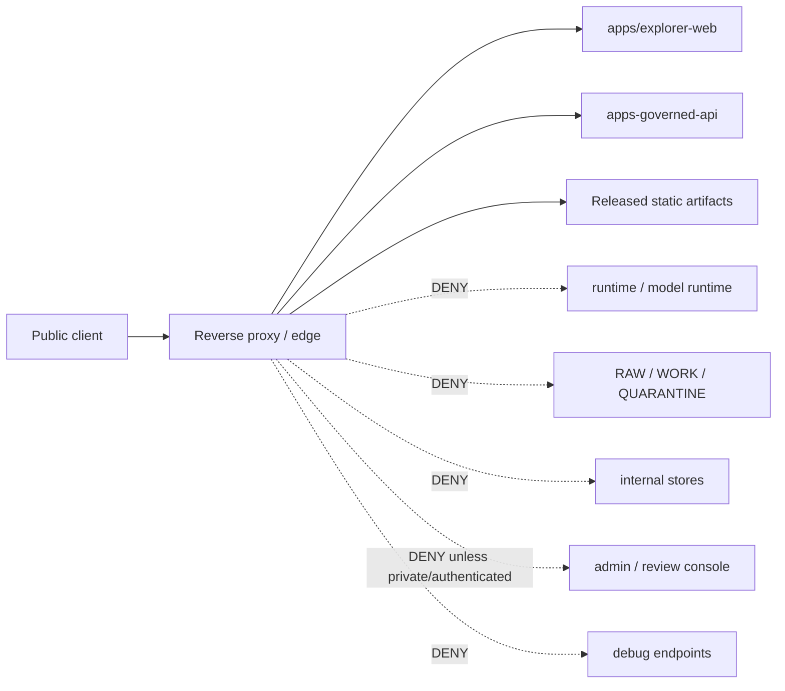

<!-- [KFM_META_BLOCK_V2]
doc_id: kfm://doc/infra-reverse-proxy-readme
title: infra/reverse_proxy/ — Reverse Proxy, Edge Routing, and Public Exposure Guardrails
type: per-directory-readme
version: v1
status: draft
owners:
  - <infra-steward>
  - <security-owner>
  - <ops-steward>
created: 2026-07-03
updated: 2026-07-03
policy_label: public
related:
  - infra/README.md
  - infra/hardening/README.md
  - infra/hardening/CHECKLIST.md
  - infra/firewall/
  - infra/vpn/
  - infra/systemd/
  - infra/docker/
  - infra/compose/
  - infra/kubernetes/
  - infra/terraform/
  - configs/
  - runtime/
  - apps/governed-api/
  - apps/explorer-web/
  - docs/doctrine/directory-rules.md
  - docs/security/README.md
  - docs/security/EXPOSURE_PLAN.md
  - docs/architecture/deployment-topology.md
  - docs/runbooks/
  - policy/
  - release/
  - data/published/
tags:
  - kfm
  - infra
  - reverse-proxy
  - edge-routing
  - exposure
  - trust-membrane
  - governed-api
  - deny-by-default
  - least-privilege
  - tls
  - cors
notes:
  - "Reverse proxy configuration is infrastructure. It must not become policy authority, release authority, secret storage, or a public bypass around governed APIs."
  - "Public edge routes must expose only governed API surfaces and released static artifacts. RAW, WORK, QUARANTINE, unpublished candidates, direct model endpoints, internal stores, and steward/admin paths are denied by default."
[/KFM_META_BLOCK_V2] -->

<a id="top"></a>

# `infra/reverse_proxy/` — Reverse Proxy, Edge Routing, and Public Exposure Guardrails

> **One-line purpose.** Define the reverse-proxy lane for KFM so public ingress is explicit, deny-by-default, auditable, rollback-safe, and routed only to governed public surfaces or released artifacts.


---

## Quick jump

[Purpose](#purpose) · [Status & authority](#status--authority) · [Repo fit](#repo-fit) · [What belongs here](#what-belongs-here) · [What does not belong here](#what-does-not-belong-here) · [Public edge contract](#public-edge-contract) · [Route classes](#route-classes) · [Configuration expectations](#configuration-expectations) · [Validation](#validation) · [Review burden](#review-burden) · [Open verification](#open-verification)

---

## Purpose

`infra/reverse_proxy/` is the reverse-proxy and public-edge routing lane for Kansas Frontier Matrix. It may hold sanitized proxy configuration, route maps, TLS/header/CORS guidance, upstream service routing notes, deny rules, validation notes, and environment templates for tools such as Nginx, Caddy, Traefik, Envoy, or a Kubernetes ingress controller when that edge behavior is owned here.

The reverse proxy is part of the KFM trust membrane. It must protect the same lifecycle boundary as the rest of KFM:

```text
RAW -> WORK / QUARANTINE -> PROCESSED -> CATALOG / TRIPLET -> PUBLISHED
```

Public traffic must terminate at explicitly allowed public surfaces:

```text
public client -> reverse proxy -> apps/governed-api/ or released static artifacts
```

Public traffic must not route to direct model endpoints, RAW / WORK / QUARANTINE data, unpublished candidates, internal/canonical stores, source credentials, steward-only admin surfaces, or ad-hoc debugging endpoints.

[Back to top](#top)

---

## Status & authority

| Field | Value |
|---|---|
| **Document type** | Per-directory README |
| **Owning responsibility root** | `infra/` |
| **Subpath role** | `reverse_proxy/` — reverse-proxy configuration, public-edge routing, TLS/header/CORS posture, deny rules, and validation notes |
| **Authority level** | Draft deployment guidance. KFM doctrine, accepted ADRs, `policy/`, and release gates outrank this README. |
| **Lifecycle phase** | n/a — deployment mechanics, not lifecycle data |
| **Default posture** | DENY unless a route is explicitly allowed, governed, reviewed, release-safe, and rollback-addressable |
| **Owners** | `<infra-steward>`, `<security-owner>`, `<ops-steward>` — fill from CODEOWNERS when assigned |
| **Reviewers required** | Infra steward + security owner for route, TLS, header, CORS, auth, admin, model-runtime, raw-data, or public exposure changes |
| **Directory Rules basis** | `infra/` owns deployment, host, network, and exposure posture; `reverse_proxy/` is a named lane under the expected `infra/` tree. |

[Back to top](#top)

---

## Repo fit

```text
Kansas-Frontier-Matrix/
└── infra/
    ├── README.md
    ├── docker/
    ├── compose/
    ├── reverse_proxy/       ◀── you are here
    │   └── README.md
    ├── vpn/
    ├── firewall/
    ├── systemd/
    ├── kubernetes/
    ├── terraform/
    └── hardening/
```

### Responsibility split

| Location | Owns | Does not own |
|---|---|---|
| `infra/reverse_proxy/` | Edge route maps, proxy snippets/templates, TLS/header/CORS posture, upstream mapping, deny rules, proxy validation notes | KFM policy semantics, app route implementation, real secrets, release decisions, schemas |
| `infra/firewall/` | Network firewall rules before or around the reverse proxy | HTTP route behavior |
| `infra/vpn/` | Steward-only private access path | Public edge route authority |
| `infra/hardening/` | Cross-infra hardening baseline and review checklist | Concrete proxy config unless delegated here |
| `infra/kubernetes/` | Kubernetes ingress/Gateway resources when the cluster owns edge behavior | External reverse proxy config unless delegated here |
| `configs/` | Non-secret defaults and templates | Real certs, keys, tokens, or production secrets |
| `policy/` | Enforceable allow / deny / restrict / abstain decisions | Proxy syntax or deployment mechanics |
| `apps/governed-api/` | Trust membrane app behavior | Edge TLS/CORS/routing implementation |
| `release/` | Release decisions, manifests, rollback cards, corrections | Reverse-proxy config |
| `data/published/` | Released artifacts that may be served after release gates | Proxy route definitions |

[Back to top](#top)

---

## What belongs here

Use `infra/reverse_proxy/` for reverse-proxy and edge-routing materials such as:

- Sanitized Nginx, Caddy, Traefik, Envoy, or equivalent reverse-proxy templates.
- Route maps showing which public paths route to `apps/governed-api/`, `apps/explorer-web/`, or released static artifact hosting.
- Explicit deny rules for RAW, WORK, QUARANTINE, unpublished candidates, direct model endpoints, source credentials, internal stores, admin routes, and debug endpoints.
- TLS termination guidance and certificate reference patterns that do not commit private keys or live certificates.
- Header posture notes: HSTS, content security policy, frame options, content type options, referrer policy, cache-control, and security headers where applicable.
- CORS guidance for governed API and released static artifacts.
- Upstream service naming and port mapping with public/private status labels.
- Range and caching notes for released PMTiles, COGs, static assets, styles, sprites, glyphs, and public exports.
- Auth handoff notes for steward-only review/admin surfaces when reverse proxy participates in auth.
- Redacted validation outputs proving public routes and deny paths.
- Rollback notes for proxy changes.

Accepted file types are Markdown, sanitized config templates, route maps, non-secret examples, and validation notes. Live certificates, private keys, tokens, and environment-specific secrets are never accepted.

[Back to top](#top)

---

## What does not belong here

Do **not** use `infra/reverse_proxy/` as a parallel security or publication authority.

The following must not live here:

- Private keys, live certificates, password files, bearer tokens, API keys, OAuth secrets, source credentials, `.env` files, or production secret material.
- Raw source data, WORK data, QUARANTINE data, catalog records, triplets, proofs, receipts, release manifests, or published data artifacts.
- Policy bundles or Rego rules that belong in `policy/`.
- JSON Schemas or machine contracts that belong under `schemas/contracts/v1/...`.
- Application code, API handlers, UI source, runtime adapters, or model code.
- Release decisions, rollback cards, correction notices, or publication approvals.
- Direct public routes to model runtime, source credentials, RAW / WORK / QUARANTINE stores, internal stores, admin panels, review consoles, or debug endpoints.
- Wildcard proxy rules that accidentally expose internal service names or unreviewed paths.
- Unredacted incident data, exploit payloads, internal IP inventories, private hostnames, or vulnerability working notes for unfixed issues.

If secret or sensitive operational material is committed here, treat it as a security incident: rotate, audit, remove, and record the response through the incident/runbook process.

[Back to top](#top)

---

## Public edge contract

Every exposed route must answer four questions:

| Question | Required answer |
|---|---|
| What is exposed? | Governed API route, public UI asset, or released artifact only |
| Who may access it? | Public, steward-only, local-only, VPN-only, or denied |
| What governs it? | Governed API, release manifest, policy gate, or explicit deny rule |
| What happens on failure? | DENY, ABSTAIN, ERROR, or route not found — never silent bypass |

### Public edge diagram



[Back to top](#top)

---

## Route classes

| Route class | Default | Notes |
|---|---:|---|
| Public web shell | ALLOW with review | Routes to `apps/explorer-web/`; browser still uses governed API for trust-bearing data. |
| Governed API | ALLOW with review | Routes to `apps/governed-api/`; must preserve finite outcomes and policy/evidence gates. |
| Released static artifacts | ALLOW with release proof | Serve only artifacts tied to release state and rollback path. |
| Tiles / PMTiles / COGs | ALLOW with release proof | Range/CORS/cache behavior must be reviewed; sensitive content must already be generalized/redacted. |
| Styles / sprites / glyphs | ALLOW with manifest discipline | Serve versioned public assets only. |
| Public exports | ALLOW with release/export policy | Rights, sensitivity, provenance, and rollback references must travel with export or be denied. |
| Health endpoint | RESTRICT | Must not leak internals, secrets, source names, raw paths, or debug detail. |
| Metrics endpoint | RESTRICT | Steward-only or internal; no sensitive labels or payloads. |
| Admin / review console | DENY public | Private/VPN/authenticated/audited only. |
| Model runtime | DENY public | Only governed API adapters may reach it. |
| RAW / WORK / QUARANTINE | DENY public | Never proxy directly. |
| Internal/canonical stores | DENY public | Never proxy directly. |
| Source credentials | DENY | No route, no static serving, no logs. |
| Debug routes | DENY public | Local/steward-only only when explicitly justified. |

[Back to top](#top)

---

## Configuration expectations

### TLS and certificates

- Do not commit live certificates or private keys.
- Document certificate names or secret references only.
- Redirect HTTP to HTTPS for public surfaces when deployment supports it.
- HSTS may be enabled for stable public domains after verifying local/dev workflows are not broken.

### Headers

Review public route headers for:

- `Strict-Transport-Security` where appropriate.
- `Content-Security-Policy` for public UI.
- `X-Content-Type-Options: nosniff`.
- `Referrer-Policy`.
- `X-Frame-Options` or CSP `frame-ancestors`.
- Cache policy that does not cache private, steward-only, or error payloads incorrectly.

### CORS

- Do not use broad wildcard CORS for credentialed or trust-bearing API routes.
- Public static assets may have broader CORS only when release/public-safety posture allows it.
- Governed API CORS should name allowed origins or be environment-scoped.
- Preflight behavior must not reveal sensitive internal route details.

### Upstreams

- Use clear upstream names that distinguish public, internal, model-runtime, worker, admin, and static artifact services.
- Do not expose internal service names directly through wildcard path proxying.
- Prefer explicit route blocks over catch-all proxying.
- Keep model-runtime upstreams private.

### Static assets and released artifacts

- Serve only released, reviewed, rollback-addressable static artifacts.
- Do not expose build directories, local caches, raw data folders, working folders, candidate releases, proof internals, or workspace scratch files.
- PMTiles/COG/tile routes should document Range support, cache posture, and CORS behavior.

### Admin and steward-only routes

- Admin and review surfaces must be private, authenticated, audited, and excluded from the normal public path.
- If reverse proxy participates in auth, document the trusted headers and ensure they cannot be spoofed from public traffic.
- Emergency bypasses require an expiration date, owner, reason, and rollback path.

[Back to top](#top)

---

## Proposed structure

The exact proxy engine is **NEEDS VERIFICATION**. Keep this structure small until KFM chooses the actual edge stack.

```text
infra/reverse_proxy/
├── README.md
├── ROUTES.md                    # public/steward/internal route inventory
├── SECURITY_HEADERS.md          # header posture and validation notes
├── CORS.md                      # allowed origin posture by route class
├── TLS.md                       # certificate reference pattern; no live keys
├── DENY_RULES.md                # required negative routes
├── examples/
│   ├── caddyfile.example
│   ├── nginx.conf.example
│   ├── traefik-dynamic.example.yaml
│   └── envoy.example.yaml
├── validation/
│   ├── README.md
│   └── route-denial-checks.md
└── rollback/
    └── README.md
```

Do not create engine-specific config until the deployment topology and proxy choice are verified.

[Back to top](#top)

---

## Validation

Reverse-proxy changes require both positive and negative evidence.

| Check | Expected result | Evidence |
|---|---|---|
| Config parse | Proxy config parses and can reload safely | Engine-specific validation output |
| Route inventory | Every public route is listed and justified | `ROUTES.md` or PR table |
| Governed API path | API traffic routes to governed API only | Upstream map / route test |
| Public UI path | UI serves static shell but not internal data | Route test |
| Released artifacts | Static artifact paths are released and rollback-addressable | Release reference |
| Raw-data denial | `/raw`, `/work`, `/quarantine`, and equivalent direct paths are denied | Negative test |
| Model denial | Direct model/runtime endpoint is denied | Negative test |
| Admin restriction | Admin/review paths are private/authenticated/audited | Auth/proxy test |
| Header check | Security headers present where required | Header capture |
| CORS check | CORS is explicit and route-appropriate | Preflight test |
| TLS check | No private key committed; TLS path documented | Secret scan / config review |
| Log hygiene | Access/error logs do not leak secrets or restricted payloads | Redacted sample |
| Rollback | Prior proxy config can be restored or forward-fixed | Rollback note |

### Suggested checks

Use the relevant engine once chosen. Examples:

```bash
# Examples only. Do not paste private hosts, live tokens, or unredacted sensitive output.
nginx -t -c <config>
caddy validate --config <Caddyfile>
traefik check --configFile=<config>
curl -I <public-route>
curl -I <must-deny-route>
```

Required deny checks should include equivalent paths for:

```text
/data/raw/
/data/work/
/data/quarantine/
/release/candidates/
/admin/
/review/
/model/
/ollama/
/debug/
/internal/
/.env
/secrets/
```

[Back to top](#top)

---

## Review burden

| Change type | Required review |
|---|---|
| README-only wording with no posture change | Infra steward or docs steward |
| Public route, upstream, ingress, or static asset route change | Infra steward + security owner + governed API owner |
| TLS/certificate reference pattern | Infra steward + security owner |
| CORS or security header change | Security owner + web/governed API owner |
| Model-runtime upstream or denial rule | Runtime owner + security owner |
| RAW / WORK / QUARANTINE / internal-store denial rule | Data steward + security owner |
| Admin/review-console route or auth handoff | Ops steward + security owner |
| Released artifact route | Release steward + infra steward |
| Proxy engine adoption or replacement | ADR or documented architecture decision |
| Exception to deny-by-default | ADR or documented risk acceptance with rollback path |

[Back to top](#top)

---

## Open verification

- [ ] Confirm chosen reverse-proxy / edge stack: Nginx, Caddy, Traefik, Envoy, Kubernetes Ingress/Gateway, hosted platform edge, or hybrid.
- [ ] Confirm whether proxy config lives only here or is generated from Terraform/Kubernetes/Compose.
- [ ] Confirm public domain names and environment names without committing private host details.
- [ ] Confirm TLS certificate management workflow and secret-store reference pattern.
- [ ] Confirm public route inventory for `apps/explorer-web/`, `apps/governed-api/`, and released static assets.
- [ ] Confirm deny tests for RAW, WORK, QUARANTINE, release candidates, internal stores, model runtimes, admin surfaces, and debug routes.
- [ ] Confirm security-header baseline for public UI and governed API.
- [ ] Confirm CORS policy by route class.
- [ ] Confirm Range/CORS/cache behavior for PMTiles, COGs, styles, sprites, glyphs, and exports.
- [ ] Confirm access-log retention and redaction posture.
- [ ] Confirm rollback procedure for proxy changes.
- [ ] Confirm CODEOWNERS for `infra/reverse_proxy/`.

[Back to top](#top)

---

## Last reviewed

| Field | Value |
|---|---|
| Last reviewed | 2026-07-03 |
| Review status | Draft README replacing greenfield stub |
| Next review trigger | First concrete reverse-proxy config, route map, TLS/header/CORS change, public asset route, model-runtime denial, or admin route PR |
