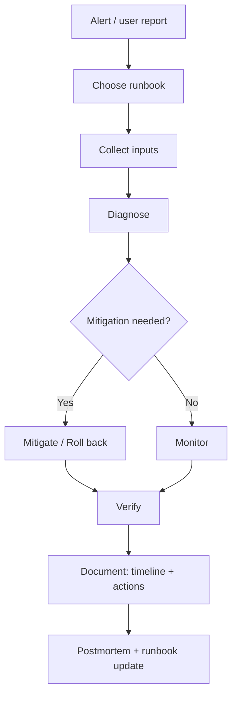

# KFM Infrastructure Runbooks (infra/runbooks)

> Governed 🧭 • Evidence-first 🔎 • Safe-by-default 🛡️  
> **Audience:** platform engineering / SRE / operators  
> **Scope:** *infra-facing* incidents + reliability procedures (clusters, CI/CD, GitOps, storage, networking, backups, policy boundary operations)

---

## Table of contents

- [Purpose](#purpose)
- [Non-negotiables](#non-negotiables)
- [Runbook format](#runbook-format)
- [Directory layout](#directory-layout)
- [How to use a runbook](#how-to-use-a-runbook)
- [Incident workflow](#incident-workflow)
- [Adding or updating a runbook](#adding-or-updating-a-runbook)
- [Sensitive data and safe sharing](#sensitive-data-and-safe-sharing)
- [Source anchors](#source-anchors)

---

## Purpose

This directory contains **operator-facing** runbooks for the KFM platform infrastructure.

These runbooks exist to:
- restore service safely during incidents,
- keep fixes **auditable** and **reproducible**,
- reduce “tribal knowledge” and make operations reviewable,
- protect the KFM governance model (trust membrane + policy boundary + provenance logging).

> [!NOTE]
> If you’re writing reliability guidance that’s *product- or pipeline-design* focused (e.g., trigger/retry patterns, ingestion strategy), that may belong under `docs/runbooks/…` (if present in the repo).  
> This folder is **infra-first**: clusters, deployments, routing, storage, secrets, backups, policy enforcement, and operational readiness.

---

## Non-negotiables

KFM’s architecture treats governance as **system rules**. Infra runbooks must reflect that.

> [!IMPORTANT]
> **Trust membrane invariant:** external clients and the UI must never directly access databases or object stores. All access goes through governed APIs and the policy boundary, with audit/provenance logging.  
> If a runbook step “fixes” an issue by bypassing policy or access boundaries, it is **not an acceptable fix**.

> [!IMPORTANT]
> **Fail-closed posture:** when unsure, default to actions that *reduce exposure* rather than widen it.
> - Prefer temporary rate limiting, narrowing access, or rolling back.
> - Prefer safer degradations over “make it public to unblock.”

> [!CAUTION]
> **No secrets in runbooks.** No tokens, private keys, credentials, or unredacted secret material.
> Use placeholders and point to a secure retrieval mechanism (team procedure) instead.

---

## Runbook format

Runbooks should be written as **checklists** with explicit decision points:

**Inputs → Commands/Checks → Interpretation → Next step**

A good runbook makes it hard to do the wrong thing:
- each command has a **why** and expected output shape,
- each branch has a clear “if X then Y”,
- risky actions are fenced behind **explicit confirmations** and include rollback,
- the end includes **verification** and **prevention** steps.

### Required runbook metadata

Include the following near the top of each runbook (YAML front matter is allowed but optional):

- `runbook_id` (stable)
- `title`
- `owner` (team or role)
- `last_reviewed` (YYYY-MM-DD)
- `severity` (P0/P1/P2…)
- `systems_affected` (cluster, gitops, api, storage, etc.)
- `environments` (dev/staging/prod)
- `related_alerts` (names/IDs, if applicable)
- `prerequisites` (access + tools, no secrets)
- `safety` (impact + rollback)
- `audit_notes` (what to record, where)

<details>
<summary><strong>✅ Runbook template</strong> (copy/paste)</summary>

```markdown
---
runbook_id: RB-<AREA>-<NNN>
title: "<Short, action-oriented title>"
owner: "<Team or role>"
last_reviewed: "YYYY-MM-DD"
severity: "P0|P1|P2|..."
systems_affected:
  - "<system/component>"
environments:
  - "dev|staging|prod"
related_alerts:
  - "<alert name/id>"
prerequisites:
  - "<required access/tools>"
safety:
  impact: "<what can go wrong>"
  rollback: "<how to revert>"
audit_notes:
  - "Record incident id / run id / deployment sha / dataset version id as applicable"
---

# <Title>

## Summary
- **Symptom:**  
- **Impact:**  
- **Most common causes:**  

## Inputs (what to collect first)
- [ ] Time window (UTC + local)
- [ ] Environment / namespace / cluster
- [ ] Service/component names
- [ ] Recent changes (deployments, promotions, policy changes)

## Step 1 — Triage
### Commands/checks
- `...`

### Interpret results
- If `<condition>` → go to Step 2A
- Else → go to Step 2B

## Step 2A — Diagnose <cause A>
...

## Step 2B — Diagnose <cause B>
...

## Step 3 — Mitigation (safe-first)
- [ ] Lowest-risk mitigation first
- [ ] Rollback path known **before** changes

## Step 4 — Verification
- [ ] Smoke checks
- [ ] Metrics trending back to baseline
- [ ] No policy boundary violations introduced

## Step 5 — Prevention / follow-ups
- [ ] Add/adjust alert
- [ ] Add test / gate / validation
- [ ] Update this runbook with what you learned
```

</details>

---

## Directory layout

This is the recommended structure for `infra/runbooks/`. Create subfolders as runbooks materialize.

```text
infra/
  runbooks/
    README.md

    platform/            # cluster runtime: scheduling, nodes, namespaces, quotas, autoscaling
    networking/          # ingress/gateway, DNS, NetworkPolicy, service exposure, connectivity
    storage/             # object store access, PVC/PV, backups, restore drills, retention
    gitops/              # Argo/Flux sync issues, drift, rollbacks, promotion workflows
    cicd/                # CI failures, build provenance, artifact signing/verification, deploy gates
    security/            # secrets handling, cert rotation, RBAC, OPA/policy boundary operations
    data-pipelines/      # ingestion runs, promotion gate failures, catalog emit/validate failures
    observability/       # logs/metrics/traces, dashboards, SLOs, alert routing
    incidents/           # postmortems, comms templates, incident roles, timelines

    _templates/          # canonical runbook template(s)
    _assets/             # diagrams/images used by runbooks (no secrets)
```

### Category registry (what goes where)

| Category | Examples | Typical outputs |
|---|---|---|
| `platform/` | Pod won’t schedule, CrashLoopBackOff, HPA runaway | stabilized workloads, clear root cause hypothesis |
| `networking/` | reachable inside cluster not from internet, DNS failures | restored ingress/gateway, verified routing |
| `gitops/` | drift, sync stuck, wave ordering issues | reconciled desired state, rollback plan |
| `data-pipelines/` | promotion gate failed, catalog invalid, bad provenance emission | re-run plan, corrected artifacts, audit trail |
| `security/` | secret compromise response, RBAC mis-scope | rotation, containment, evidence preserved |
| `storage/` | backup restore drill, object store outage | RPO/RTO validation, documented recovery |

---

## How to use a runbook

1. **Confirm scope**
   - What user-facing impact exists?
   - Which environment? Which cluster/namespace?
   - When did it start?

2. **Select the most specific runbook**
   - Prefer component-specific over general.
   - Prefer “known symptoms” playbooks before deep debugging.

3. **Collect inputs first**
   - Do not skip the “Inputs” section. It prevents guesswork and improves post-incident analysis.

4. **Follow the checklist in order**
   - Runbooks are designed to reduce risk. Skipping steps increases error chance.

5. **Record the audit trail**
   - Incident ID
   - Commands executed (or reference to terminal log)
   - Any deployment SHA / policy bundle version / dataset version involved
   - Mitigation actions and timestamps

---

## Incident workflow



### Minimal incident roles (adapt as needed)
- **Incident Lead:** keeps timeline, coordinates
- **Operator:** executes commands/changes
- **Comms:** updates stakeholders
- **Scribe:** captures details and decisions

> [!TIP]
> A runbook is not “done” when the system is green.  
> It’s done when: **verified**, **documented**, and **the learning is captured** (update runbook / add gate / add alert).

---

## Adding or updating a runbook

### Contribution rules
- Runbooks are **production artifacts** (they change how humans and systems respond).
- Use PRs and require review (CODEOWNERS or equivalent), especially for:
  - `security/`
  - `storage/` (backup/restore)
  - `gitops/` (promotion/deploy)
  - any runbook that changes access/policy behavior

### Definition of Done (DoD)
- [ ] Uses **Inputs → Commands → Interpretation → Next step** structure
- [ ] Includes a **rollback** for any write/change action
- [ ] No secrets, no sensitive location specifics, no private identifiers
- [ ] Lists verification steps (metrics/logs/user impact)
- [ ] Mentions what to record for audit/provenance
- [ ] Reviewed by an owner with the right permissions/role
- [ ] “Last reviewed” updated

### Deprecation
If a runbook becomes obsolete:
- mark it `DEPRECATED` at the top,
- point to the replacement,
- keep it for historical auditability until governance decides removal.

---

## Sensitive data and safe sharing

> [!WARNING]
> Runbooks may be copied into tickets, chats, or incident reviews.  
> Assume they will be seen outside the immediate operator team.

Guidelines:
- **Redact** tokens, credentials, session identifiers, and private URLs.
- Avoid pasting full logs when snippets suffice.
- Do not include precise sensitive locations or culturally restricted knowledge; use generalized descriptions.
- Prefer referencing *internal* evidence bundles / audit records instead of raw sensitive artifacts.

---

## Source anchors

This README is aligned with KFM’s governance model:
- Trust membrane + governed APIs + policy boundary + audit/provenance logging
- Validation gates: schema/license/sensitivity/reproducibility
- Runbooks written as deterministic, checklist-driven operational artifacts

(See governed design documents in the repo’s documentation system for the canonical definitions.)
