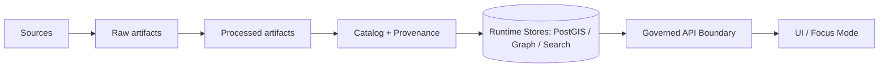

# Backups Runbooks (infra)


> [!IMPORTANT]
> **KFM backup doctrine:**  
> 1) **Artifacts are the source of truth** (raw + processed).  
> 2) **Runtime stores (DBs/indices) are restore-able but also rebuildable caches.**  
> 3) **Restore drills must prove we can rebuild runtime from processed artifacts.**

---

## Why this exists 🎯

This folder holds the **operational runbooks** for KFM backups and restores across **all persistence surfaces** (artifacts, spatial DB, graph DB, search index, config state).

This is a **governed artifact**. If something here affects:
- system behavior,
- public narratives,
- data availability,
- licensing/compliance,
- Focus Mode/Story outputs,

…it must remain **evidence-first**, reproducible, and reviewable.

---

## What “backup” means in KFM

KFM’s pipeline order (conceptually) is:



### Two-layer backup strategy (non-negotiable)

| Layer | What it includes | Why it matters | Restore expectation |
|---|---|---|---|
| **Artifact backups** | Raw + processed artifacts + checksums + receipts/attestations | These are the *source of truth* | Must restore **immutably** with integrity checks |
| **Runtime store backups** | PostGIS + graph + search index | Speeds recovery / reduces rebuild time | Must be restorable **and** verifiably rebuildable from processed artifacts |

> [!NOTE]
> This README assumes KFM uses some combination of:
> - object storage for artifacts (S3-compatible or cloud),
> - Postgres/PostGIS for spatial metadata,
> - Neo4j (or equivalent) for graph,
> - a search index (OpenSearch/Elasticsearch/etc.).
>
> Exact products and deployment details must be confirmed per environment (see **TBD & Verification**).

---

## Folder layout 📁

```text
infra/
  runbooks/
    backups/
      README.md                     # you are here
      _templates/                   # (optional) reusable receipts/checklists
        backup-receipt.template.json
        restore-drill.checklist.md
        change-ticket.template.md
      _evidence/                    # (optional) past drill artifacts/links (no secrets)
        README.md
      components/                   # (recommended) per-store procedures
        artifacts-object-store.md   # artifact snapshot + integrity validation
        postgis.md                  # pg_dump / pg_restore / pg_basebackup notes
        graph-neo4j.md              # neo4j backup/dump + restore patterns
        search-index.md             # snapshot or rebuild procedure
        config-and-secrets.md       # GitOps/IaC + secret-ops expectations
      drills/
        restore-drills.md           # how we schedule + execute + record drills
        rebuild-from-processed.md   # explicit “DB rebuild” procedure
```

> [!TIP]
> Keep this directory “copy/paste friendly” during incidents:
> - minimal assumptions,
> - no hidden dependencies,
> - no secrets in docs,
> - explicit prerequisites + checks.

---

## Roles & escalation 👥

> [!CAUTION]
> Replace placeholders with **real** on-call routes and ownership in your environment.

| Role | Responsibilities | Escalation trigger |
|---|---|---|
| Platform / SRE on-call | Backup job health, storage access, restore orchestration | Backup failures, restore failures, storage outage |
| Data Engineering | Rebuild-from-processed, pipeline replay safety, validation gates | Rebuild mismatch, corrupted artifacts, schema drift |
| Governance / Steward | Licensing/CARE/FAIR constraints, sensitive data handling | Any restore involving restricted/sensitive datasets |
| Security | Key management, access reviews, incident response | Suspected compromise, ransomware indicators |

---

## Backup surfaces & policy matrix 🧾

> [!IMPORTANT]
> Fill this table **per environment** (dev/staging/prod). Defaults below are placeholders.

| Surface | Classification | Backup method | Cadence | Retention | Integrity validation | Restore path |
|---|---|---|---|---|---|---|
| **Raw artifacts** | Source of truth | Object-store snapshots / versioning / immutable retention | daily+ | TBD | checksums + spot-restore | restore snapshot → verify digests |
| **Processed artifacts** | Source of truth | Same as raw | daily+ | TBD | checksums + spot-restore | restore snapshot → verify digests |
| **Catalog + PROV + receipts** | Source of truth | Stored as artifacts + Git history | per change | TBD | schema validation | restore artifacts + repo |
| **PostGIS** | Runtime store | logical dumps + (optional) physical base backups | daily | TBD | test restore | restore DB OR rebuild from processed |
| **Graph DB (Neo4j)** | Runtime store | tool-based backup/dump (edition-specific) | daily | TBD | test restore | restore graph OR rebuild |
| **Search index** | Runtime store | snapshot OR rebuild-only | daily | short | rebuild test | rebuild from catalogs/graph |
| **Config/IaC** | Source of truth | Git (repo), signed tags/releases | per change | forever | CI verification | redeploy from Git |
| **Secrets** | Sensitive | KMS/Vault export policies (if allowed) | TBD | TBD | access review | rehydrate from secret system |

---

## RPO / RTO targets ⏱️

> [!NOTE]
> These are governance/business decisions. **Do not guess**—record what is approved.

| Environment | RPO (max data loss) | RTO (max downtime) | Notes |
|---|---:|---:|---|
| dev | TBD | TBD | Dev may prefer rebuild-only |
| staging | TBD | TBD | Must support restore drills |
| prod | TBD | TBD | Requires immutable backups + drills |

---

## Backup methods quick reference 📚

<details>
  <summary><strong>Full vs Incremental vs Differential</strong></summary>

- **Full**: complete copy of data.
- **Incremental**: changes since last backup (full or incremental) — fastest/smallest but restore is multi-step.
- **Differential**: changes since last full — larger over time but restore needs last full + last differential.

A simple common pattern: **weekly full** + **daily incremental**, or **daily full** if data volume allows.

</details>

---

## Security & ransomware resistance 🔐

> [!IMPORTANT]
> Backups are a prime target during incidents. Treat backup storage as a **separate trust zone**:
> - write once / immutable retention where possible,
> - strong access boundaries (least privilege),
> - logs/audit trails for access,
> - restore should **fail closed** if integrity checks don’t match,
> - consider an **offline** copy cadence for critical backups.

---

## Operational signals & alerts 📈

Minimum signals to expose to observability:

- **Last successful backup timestamp** per surface
- **Backup duration** (trend) + **size**
- **Verification status**: “restore test passed” for the latest backup set
- **Retention drift**: bucket/object lock or lifecycle policy misconfiguration
- **Rebuild test** success (rebuild-from-processed)

> [!TIP]
> Treat “restore verification” as a deploy gate:
> if you can’t restore, you can’t safely deploy.

---

## Standard backup receipt (run ledger) 🧾

Every backup job should emit a small **receipt** (JSON) that is stored as an artifact (and optionally indexed).

```json
{
  "schema": "io.kfm.backup-receipt.v1",
  "backup_id": "bkp-YYYYMMDD-HHMMSSZ-<shortid>",
  "environment": "prod|staging|dev",
  "surface": "artifacts|postgis|neo4j|search",
  "method": "snapshot|logical_dump|physical_basebackup|rebuild_only",
  "started_at": "2026-02-16T07:00:00Z",
  "completed_at": "2026-02-16T07:15:00Z",
  "status": "success|failure",
  "artifacts": [
    {
      "uri": "s3://<bucket>/backups/<path>",
      "sha256": "<digest>",
      "bytes": 123456789
    }
  ],
  "integrity": {
    "validated": true,
    "validation_method": "checksum|spot_restore|full_restore_test",
    "validated_at": "2026-02-16T07:30:00Z"
  },
  "git": {
    "repo": "<repo>",
    "sha": "<commit>",
    "change_ticket": "<optional>"
  },
  "operator": {
    "initiated_by": "automation|human",
    "principal": "<serviceaccount-or-user>"
  },
  "notes": "free-text; no secrets"
}
```

> [!CAUTION]
> Receipts must not contain credentials or sensitive payloads. Store only references + digests.

---

## Restore drills 🧪

### Cadence (recommended)
- **Monthly**: restore runtime stores into staging (PostGIS + graph) from last backup
- **Quarterly**: full scenario drill:
  1) restore artifact snapshot
  2) rebuild runtime from processed artifacts
  3) compare key invariants (counts, digests, sample query results)
  4) record evidence + sign-off

### Drill exit criteria
- [ ] Artifact restore succeeded and integrity checks passed  
- [ ] PostGIS restore succeeded **OR** rebuild-from-processed succeeded  
- [ ] Graph restore succeeded **OR** rebuild-from-processed succeeded  
- [ ] Search index rebuilt and matches expected catalog facets  
- [ ] API smoke tests passed  
- [ ] Evidence recorded (receipt + drill log)  
- [ ] Follow-ups filed for any gaps

---

## Quickstart: manual backup execution (operator) 🧯

> [!IMPORTANT]
> Use this during incidents or when automation is down. Prefer automation for routine backups.

### 0) Pre-flight (always)
- [ ] Confirm environment (`dev/staging/prod`)
- [ ] Confirm surface(s) affected (artifacts / PostGIS / graph / search)
- [ ] Confirm you have approved access (least privilege)
- [ ] Confirm available storage capacity in backup target
- [ ] Confirm you have a place to write a **receipt**

### 1) Execute
- Trigger the relevant job (CronJob / pipeline / script).
- Record start time, operator identity, and job parameters.

### 2) Validate
- Confirm the backup artifact exists.
- Confirm checksums/digests are recorded.
- Run at least one verification step:
  - spot-restore of an artifact, or
  - restore to scratch DB, or
  - rebuild-from-processed test (if runtime stores are down)

### 3) Record evidence
- Store the receipt (JSON) alongside backup artifacts.
- File/append incident notes if this was an outage.

---

## Appendix: command snippets (environment-specific) 🧰

> [!NOTE]
> These are examples. Confirm versions/paths/credentials in your environment.

<details>
  <summary><strong>PostgreSQL / PostGIS (logical backup)</strong></summary>

```bash
# Logical backup (custom format; supports pg_restore)
pg_dump -Fc \
  --host "$PGHOST" --port "$PGPORT" --username "$PGUSER" \
  --dbname "$PGDATABASE" \
  --file "kfm_postgis_$(date -u +%F_%H%M%SZ).dump"

# Restore (into an existing database)
pg_restore \
  --host "$PGHOST" --port "$PGPORT" --username "$PGUSER" \
  --dbname "$PGDATABASE" \
  --clean --if-exists \
  "kfm_postgis_<timestamp>.dump"
```

</details>

<details>
  <summary><strong>PostgreSQL (physical base backup / PITR-oriented)</strong></summary>

```bash
# Physical base backup (requires replication permissions/config)
pg_basebackup \
  --host "$PGHOST" --port "$PGPORT" --username "$PGUSER" \
  --pgdata "/backups/base/$(date -u +%F_%H%M%SZ)" \
  --format=tar --gzip --checkpoint=fast
```

</details>

<details>
  <summary><strong>Neo4j (backup/dump — edition and version dependent)</strong></summary>

```bash
# Example: offline dump (verify command names for your Neo4j version/edition)
neo4j-admin database dump neo4j --to-path=/backups/neo4j/dumps/

# Example: restore/load (verify)
neo4j-admin database load neo4j --from-path=/backups/neo4j/dumps/ --overwrite-destination=true
```

</details>

---

## TBD & verification checklist ✅

> [!CAUTION]
> This section is intentionally explicit: until these are confirmed, treat procedures as **templates**.

- [ ] Confirm artifact store type (S3 / R2 / GCS / Azure / MinIO / Ceph) and immutability mechanism
- [ ] Confirm artifact naming convention + content addressing rules
- [ ] Confirm PostGIS deployment (operator vs managed vs self-managed) and preferred backup method
- [ ] Confirm graph DB product/edition (Neo4j community/enterprise/Aura) and available backup tools
- [ ] Confirm search product (OpenSearch/Elasticsearch/other) and snapshot support vs rebuild-only stance
- [ ] Confirm retention policy + legal/licensing constraints for mirrored content
- [ ] Confirm where backup receipts live (bucket path + indexing rules)
- [ ] Confirm restore drill environment + who signs off

---

## Definition of Done for “Backups are real” ✅

- [ ] Automated backups exist for all required surfaces
- [ ] Retention policies are configured and monitored
- [ ] Integrity validation exists (checksums + restore test)
- [ ] Restore drill cadence exists and is executed
- [ ] Rebuild-from-processed is documented and proven
- [ ] CI/CD includes a deploy gate or operational check for backup freshness
- [ ] Evidence artifacts (receipts/logs) are stored without secrets
