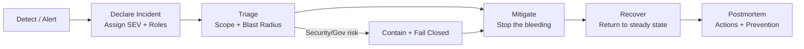

# Incident Response (IR) — KFM Infra Runbooks


KFM is a **governed** platform. Incident Response must protect the platform’s invariants:

- **Trust membrane:** no client / UI / external tooling should bypass governed APIs and policies.
- **Evidence-first:** preserve and produce auditable artifacts (logs, configs, diffs, receipts).
- **Fail-closed:** when uncertain (especially about access or sensitivity), restrict/disable rather than risk leakage.
- **Sensitivity & sovereignty:** treat sensitive locations and restricted knowledge as *machine-enforced* constraints, not prose.

> [!IMPORTANT]
> This README is safe to share within the repo, but **must not contain secrets** (tokens, breakglass creds, private endpoints, or personal phone numbers).
> Store those in your secret manager / internal ops system and reference them as **placeholders**.

---

## Quick start — First 15 minutes 🧯

1. **Declare** an incident and assign a **SEV** (don’t wait for certainty).
2. **Open an incident record** (template below) and start a **timestamped timeline**.
3. **Establish comms**: primary incident channel + fallback (low dependency).
4. **Assign roles**: IC + Tech Lead + Scribe minimum.
5. **Stabilize**: mitigate user harm first; root-cause can follow.
6. **Capture evidence** continuously (screenshots/log refs/config diffs), *redacted if needed*.
7. **Set an update cadence** (every 15/30/60 minutes depending on SEV).

---

## Directory layout 📁

Recommended structure for this folder:

```text
infra/runbooks/incident-response/
  README.md                  # this file (process + templates)
  playbooks/                 # concrete “how-to fix it” runbooks (service-specific)
    api-gateway-outage.md
    ui-degraded.md
    pipelines-stuck.md
    policy-opa-fail-closed.md
    data-integrity-regression.md
    sensitive-location-leak.md
    credential-compromise.md
    supply-chain-alert.md
  templates/
    incident-record.md        # copy/paste-friendly incident template
    status-update.md          # copy/paste-friendly update templates
    postmortem.md             # blameless postmortem template
  incidents/                  # (OPTIONAL) repo-stored incident logs (redaction-safe)
    YYYY/
      MM/
        INC-<id>-<slug>.md
```

> [!NOTE]
> If you choose to store incident logs in-repo, **only store redaction-safe** content. Keep sensitive details in your internal IR system.

---

## What counts as an incident?

Declare an incident if **any** of these are true:

### Availability / performance
- KFM APIs, UI, search, or evidence resolver are down, timing out, or unusably slow.
- Pipeline backfills or scheduled jobs are failing repeatedly or missing freshness targets.
- Cost runaway (e.g., unexpected compute/storage spikes) that threatens operations.

### Integrity / correctness
- A published layer, statistic, Story Node, or Focus Mode response is **wrong**, misleading, or non-reproducible.
- A dataset version was promoted with missing catalogs/provenance or broken links.
- Determinism regression (non-stable IDs, non-reproducible builds/artifacts).

### Confidentiality / governance / safety
- Suspected or confirmed **policy bypass** (trust membrane violation).
- Suspected **sensitive-location** exposure (even partial) or culturally restricted knowledge leakage.
- License/terms breach or uncertainty about whether we can publish/serve a dataset.

### Security / supply chain
- Compromised credentials, suspicious access patterns, malware indicators.
- Dependency or artifact integrity issues (SBOM/attestation failures, signature mismatches).

---

## Severity model (SEV)

Use the **highest applicable** severity. Re-severitize as facts change.

| SEV | User/Partner impact | Data / governance risk | Response target | Updates |
|---:|---|---|---|---|
| SEV0 | Platform unusable for most users OR critical partner outage | Confirmed/suspected sensitive exposure OR trust membrane bypass | Immediate mobilization | 15 min |
| SEV1 | Major feature down, sustained errors, or widespread degradation | High risk of incorrect public claims or policy failure | < 30 min to mitigation attempt | 30 min |
| SEV2 | Partial outage, limited scope, workaround exists | Integrity issue limited to a dataset/version or workflow | < 4 hrs to mitigation | 60 min |
| SEV3 | Minor bug, transient blip, or internal-only issue | Low risk; no exposure; no public misinfo | Next business day | As needed |

> [!TIP]
> If you *might* be leaking sensitive locations, treat as **SEV0 until proven otherwise**.

---

## Incident roles & responsibilities (minimum viable ICS)

| Role | Primary responsibilities | Notes |
|---|---|---|
| **Incident Commander (IC)** | Owns process; assigns roles; sets priorities; makes calls; keeps incident moving | One voice for decisions |
| **Tech Lead (TL)** | Owns technical investigation & mitigation plan | Can delegate to specialists |
| **Scribe** | Maintains timeline, decisions, hypotheses, evidence refs, actions | Timestamp everything |
| **Comms Lead** | Writes stakeholder updates; maintains status page (if any) | Keep messages factual |
| **Governance Steward** | Ensures licensing/sensitivity/policy compliance during response | Must be included for SEV0/SEV1 governance risk |
| **Security Lead** | Leads security containment, forensics coordination, credential hygiene | For suspected compromise |

> [!IMPORTANT]
> Avoid “too many cooks.” Specialists are helpful, but keep decision-making centralized (IC + TL).

---

## Communications plan 📣

### Primary and fallback channels
- **Primary:** `<incident-chat-channel>` (e.g., Slack/Teams) — *low friction, most used*
- **Fallback:** `<phone-bridge-or-IRC-or-SMS-tree>` — *works when internal networking is impaired*

### Update cadence
- **SEV0:** every **15 min**
- **SEV1:** every **30 min**
- **SEV2:** every **60 min**
- **SEV3:** as needed

### Message hygiene
- Separate **facts** from **hypotheses**.
- Don’t paste secrets, tokens, raw access logs with PII, or exact sensitive coordinates.
- Prefer: “ref: log bundle X” or “ref: trace id Y” over dumping raw data.

---

## Response lifecycle (detect → declare → mitigate → recover → learn)



---

## Common containment actions (pick the minimum that reduces harm)

### Stabilize service (availability)
- Pause/rollback the last deploy (prefer reversible actions).
- Reduce blast radius:
  - disable nonessential features
  - rate-limit expensive endpoints
  - temporarily disable introspection / debug endpoints (if applicable)
- Shed load / degrade gracefully rather than failing unpredictably.

### Preserve governance (policy + evidence)
- If policy evaluation is failing or uncertain: **fail closed** (restrict access).
- If evidence resolver is broken: block user-facing claims that require citations (prefer abstain).

### Data integrity containment
- **Quarantine** affected dataset versions (remove from “latest” pointers, block serving).
- Roll forward with a corrected version (don’t “edit in place”).
- Record invalidation/rollback as an auditable event (provenance + change record).

### Suspected sensitive exposure
- Immediately disable the layer/endpoint/export path.
- Rotate credentials / revoke sessions as needed.
- Limit access to need-to-know responders.
- Engage Governance Steward + Security Lead.

---

## Evidence, audit, and provenance during incidents 🔎

**Goal:** make the incident reconstructable and reviewable.

Maintain:
- A single incident record with:
  - timeline (UTC timestamps)
  - decisions and “why”
  - mitigations applied
  - references to evidence (log bundle IDs, trace IDs, dashboards)
- A list of **changed artifacts**:
  - config diffs, deployment hashes, policy bundle versions
  - dataset_id / version_id affected (if applicable)
- A record of any **breakglass** actions:
  - who, when, scope, and justification
  - follow-up to revoke/expire access

> [!IMPORTANT]
> If you capture screenshots/logs, sanitize/redact before attaching to repo artifacts. Treat all evidence as governed.

---

## Definition of Done (DoD) ✅

### “Mitigated”
- [ ] User harm stopped (outage ended / exposure blocked / wrong claims no longer served)
- [ ] Monitoring confirms stability for an agreed window
- [ ] Incident record has a coherent timeline to mitigation
- [ ] Next update includes clear current status + next steps

### “Resolved / Closed”
- [ ] Root cause understood **enough** to prevent immediate recurrence
- [ ] A preventive fix is merged (or tracked as a committed action item with owner + due date)
- [ ] Any temporary access paths (breakglass, debug toggles) are revoked
- [ ] Postmortem scheduled (or completed)
- [ ] Governance review completed if any policy/sensitivity risk occurred

---

## Playbook index (add/extend over time)

| Category | Playbook file (recommended) | Use when |
|---|---|---|
| Availability | `playbooks/api-gateway-outage.md` | API errors/timeouts, 5xx spikes |
| Availability | `playbooks/ui-degraded.md` | UI unusable, map rendering failures |
| Pipelines | `playbooks/pipelines-stuck.md` | Jobs failing, freshness SLO breaches |
| Policy | `playbooks/policy-opa-fail-closed.md` | OPA/policy breaks access or redaction |
| Integrity | `playbooks/data-integrity-regression.md` | Wrong layer/stats, reproducibility failure |
| Safety | `playbooks/sensitive-location-leak.md` | Suspected sensitive location exposure |
| Security | `playbooks/credential-compromise.md` | Token/key leak, unusual auth activity |
| Supply chain | `playbooks/supply-chain-alert.md` | SBOM/attestation/signature anomalies |

> [!NOTE]
> Keep playbooks **short, mechanical, and testable**. If the steps can’t be practiced in a drill, they’re too vague.

---

## Templates (copy/paste)

<details>
<summary><strong>Template: Incident record (redaction-safe)</strong></summary>

```markdown
---
incident_id: INC-YYYYMMDD-###          # unique
opened_at_utc: YYYY-MM-DDTHH:MM:SSZ
sev: SEV?
status: declared|mitigating|mitigated|resolved
ic: <name_or_handle>
tech_lead: <name_or_handle>
scribe: <name_or_handle>
comms: <name_or_handle_optional>
governance_steward: <name_or_handle_optional>
security_lead: <name_or_handle_optional>

systems_affected:
  - <api|ui|search|postgis|neo4j|object-store|pipelines|policy|other>
datasets_affected:
  - dataset_id: <id>
    version_id: <id>
policy_flags:
  - <sensitive-location|license-uncertain|policy-bypass|none>

external_user_impact: |
  <plain language description>

current_status: |
  <what is happening now>

hypotheses:
  - <hypothesis 1>
  - <hypothesis 2>

mitigations_applied:
  - at_utc: YYYY-MM-DDTHH:MM:SSZ
    action: <what changed>
    ref: <deploy hash / config diff / policy bundle / ticket>

evidence_refs:
  - kind: dashboard
    ref: <id or internal link placeholder>
  - kind: logs
    ref: <log bundle id>
  - kind: traces
    ref: <trace id(s)>

timeline_utc:
  - "HH:MMZ — Detected via <alert>"
  - "HH:MMZ — Declared SEV?"
  - "HH:MMZ — Mitigation started: <action>"
  - "HH:MMZ — Mitigated: <evidence of stabilization>"

next_steps:
  - owner: <name>
    task: <next action>
    eta: <time>

notes_redaction: |
  <what was removed/redacted and why>
---
```

</details>

<details>
<summary><strong>Template: Status update</strong></summary>

```markdown
**KFM Incident Update — INC-YYYYMMDD-### (SEV?)**

**Time (UTC):** YYYY-MM-DD HH:MMZ  
**Status:** declared | mitigating | mitigated | resolved

**Impact:**  
- <who/what is affected>

**What we know (facts):**  
- <fact 1>
- <fact 2>

**What we’re doing now:**  
- <mitigation step 1>
- <mitigation step 2>

**Next update:** HH:MMZ
```

</details>

<details>
<summary><strong>Template: Blameless postmortem (outline)</strong></summary>

```markdown
# Postmortem — INC-YYYYMMDD-### — <short title>

## Summary
- What happened (facts)
- User impact
- Data/governance impact (if any)

## Timeline (UTC)
- Timestamped key events from detection → mitigation → recovery

## Root cause(s)
- Primary cause(s)
- Contributing factors (tech + process)

## Detection & response
- How detected vs how we *expected* to detect
- Time to detect / mitigate / recover
- What went well / what didn’t

## Governance & safety review (if applicable)
- Any policy bypass?
- Any sensitive location / restricted knowledge concerns?
- Licensing/terms issues?

## Corrective actions
| Action | Owner | Priority | Due | Verification |
|---|---|---:|---|---|
| <action> | <name> | P0/P1/P2 | YYYY-MM-DD | <test/monitoring gate> |

## Prevention / hardening
- New CI gates / policy tests / monitoring alerts
- Documentation or drills updates
```

</details>

---

## Maintenance & drills 🧪

- Run at least **quarterly tabletop** exercises:
  - one availability scenario
  - one data integrity scenario
  - one governance/sensitivity scenario
- Validate **breakglass** and backup comms on a schedule (and document the exercise outcome).
- Keep playbooks current: last-reviewed date + owner in each playbook.

---

## Governance note (non-negotiable) 🧭

If an incident touches:
- sensitive locations,
- culturally restricted knowledge,
- licensing/access rights,
- or any bypass of policy boundaries,

…then it requires a **Governance Steward** in the room and a documented review outcome before closure.
