<!--
Path: infra/runbooks/oncall/README.md
Purpose: Entry point for on-call responders (platform + pipelines + governance).
Last reviewed: 2026-02-16
-->

# 🧭 KFM On‑Call & Incident Response (Infra)


> [!IMPORTANT]
> **KFM is governed and evidence-first.**
> During incidents, prefer mitigations that preserve the **trust membrane** (clients do *not* touch storage directly) and keep **policy + audit logging** intact. If you must take an emergency action that temporarily relaxes a guardrail, treat it as **breakglass**, time-box it, document it, and revert it ASAP. *(Implementation details for breakglass are project-specific; if not defined yet, log the decision and escalate.)*

---

## 🎯 What this README is

This is the **entrypoint** for anyone who gets paged for the Kansas Frontier Matrix (KFM) platform.

It provides:
- A **first-10-minutes** playbook (what to do when the page hits)
- A standard **severity model**
- Standard **roles** (IC / comms / scribe / SMEs)
- A **minimal incident log** template (so we’re not improvising)
- A consistent format for adding future runbooks in this folder

> [!NOTE]
> KFM operations span three planes (data plane, control plane, product plane). This on-call structure is meant to keep those planes coherent during outages (stabilize first, then correct governance/lineage/citations). *(Exact plane boundaries and component names may evolve.)*

---

## 🗂️ Directory layout

```text
infra/
  runbooks/
    oncall/
      README.md                 # <- you are here
      incidents/                # incident logs (one file per incident)
      playbooks/                # reusable procedures (restart, rollback, scale, disable a feature flag)
      services/                 # service-specific runbooks (API, UI, PostGIS, Neo4j, search, pipelines, catalogs)
      security/                 # security & sensitive-data incidents (leaks, compromised credentials, etc.)
      templates/                # incident log + runbook templates
```

> [!TIP]
> Keep this folder **copy/paste friendly**. In an incident, responders should not need to “remember tribal knowledge” to get to first mitigation.

---

## 🚨 When you get paged (first 10 minutes)

### 0–2 minutes: acknowledge + start a log
- [ ] **Acknowledge** the page (paging tool **TBD / not confirmed in repo**).
- [ ] Create an incident log file under `infra/runbooks/oncall/incidents/`:
  - Naming suggestion: `YYYY-MM-DD__sevX__short-slug.md`
- [ ] Record:
  - start time (local + UTC)
  - symptom (what broke)
  - where it was detected (alert name / dashboard / user report)

### 2–5 minutes: establish severity + roles
- [ ] Assign **Incident Commander (IC)** (can be you initially).
- [ ] Assign **Scribe** (even if it’s you—write everything down).
- [ ] If user impact is likely, assign **Comms** (internal updates).
- [ ] Identify likely SMEs:
  - platform/cluster
  - API boundary
  - pipelines/catalogs/provenance
  - governance/sensitivity (if a policy leak is possible)

### 5–10 minutes: stabilize + communicate
- [ ] **Stabilize the system** (reduce blast radius, rollback, scale, restart) before deep RCA.
- [ ] Post/update an internal status note (channel/tool **TBD / not confirmed in repo**).
- [ ] If a **sensitive-location / restricted-data** leak is suspected:
  - treat as high severity
  - move to security posture (tighten comms, limit distribution)
  - escalate to governance + security leads (**roles/TBD**)

---

## 🧯 Severity model (default)

> [!WARNING]
> If you don’t know the severity yet, start at the higher severity and downgrade later.

| Severity | User impact | Example symptoms | Target response | Update cadence |
|---|---|---|---:|---|
| **SEV0** | Safety/security or major public harm risk | Sensitive/restricted data exposure; broad compromise | Immediate | 15 min |
| **SEV1** | Major outage | Governed API down; UI unusable; pipelines fully blocked | ≤ 15 min | 30 min |
| **SEV2** | Partial outage / degraded service | High latency; partial dataset unavailability; catalog resolver failing intermittently | ≤ 30 min | 60 min |
| **SEV3** | Minor impact / localized | Single connector failing; non-critical UI feature degraded | ≤ 1 business day | As needed |

**Rule of thumb:** if it touches **policy enforcement**, **audit integrity**, or **sensitive-location handling**, treat as at least **SEV1** (often **SEV0** if exposure is plausible).

---

## 🧑‍✈️ Roles (who does what)

**Incident Commander (IC)**  
Owns decisions, keeps the response coordinated, assigns tasks, runs handoffs.

**Scribe**  
Maintains timeline, captures actions + outputs, records decisions and “why”.

**Comms Lead**  
Keeps stakeholders informed with a single source of truth.

**SMEs**  
Pulled in as needed:
- Platform/cluster (OpenShift/Kubernetes)
- API boundary (auth, rate limit, policy checks)
- Storage (PostGIS, Neo4j, object store, search)
- Pipelines (ingest/validate/promote)
- Governance (licensing, sensitivity, CARE constraints)

> [!NOTE]
> Roles are **roles**, not people. One person may hold multiple roles in small incidents.

---

## 🧩 KFM system map (mental model)

```mermaid
flowchart LR
  A[Data Sources] --> B[Pipelines]
  B --> C[Catalogs & Provenance]
  C --> D[Governed APIs<br/>policy • auth • audit]
  D --> E[Experiences<br/>Map UI • Focus Mode • Story Nodes]
  subgraph Storage
    S1[(PostGIS)]
    S2[(Neo4j)]
    S3[(Search)]
    S4[(Object Store)]
  end
  B --> Storage
  C --> Storage
  D --> Storage
```



**Operational principle:** mitigate issues without bypassing the governed API/policy boundary.

---

## 🔍 Standard triage commands (OpenShift/Kubernetes)

> [!CAUTION]
> Do **not** paste secrets into incident logs. Redact tokens/headers, and avoid dumping sensitive records.

<details>
<summary><strong>Cluster quick checks</strong> (click to expand)</summary>

```bash
# Namespace/project context (OpenShift)
oc project

# What is failing?
oc get pods -n <namespace>
oc get deploy,rs,svc,route -n <namespace>

# Describe the thing that looks wrong
oc describe pod <pod> -n <namespace>

# Logs
oc logs <pod> -n <namespace>
oc logs <pod> -c <container> -n <namespace>

# Events (cluster or namespace)
oc get events -n <namespace>
oc get events  # cluster-wide (use sparingly)

# Exec into a pod (avoid changing state unless needed)
oc exec -it <pod> -n <namespace> -- sh
```

```bash
# Port-forward (for safe/local access without exposing NodePorts)
oc port-forward <pod> -n <namespace> 8080:8080
```
</details>

---

## 🧷 Incident artifacts (what to capture)

Every incident log should contain:
- **Timeline** (what happened + when)
- **Scope & impact**
- **Mitigations taken** (with commands/PRs/rollbacks)
- **Audit references** (if the system yields `audit_ref` values)
- **Policy state** (if a policy bundle / ruleset was changed)
- **Dataset/catalog context** (if relevant)
  - dataset version IDs
  - catalog IDs
  - provenance run IDs

> [!TIP]
> Treat incident logs like governed artifacts: they should be reviewable, attributable, and safe to share internally.

---

## 📝 Incident log template

<details>
<summary><strong>Copy/paste incident log template</strong></summary>

```markdown
# Incident: <SEV?> — <short title>

- Start time (local): 
- Start time (UTC): 
- Detected by: (alert / user report / dashboard)
- Primary symptom:
- Impacted surfaces: (API / UI / pipelines / catalogs / policy)
- Current status: (investigating | mitigating | monitoring | resolved)

## Roles
- IC:
- Scribe:
- Comms:
- SMEs engaged:

## Executive summary (2–4 sentences)
(What happened, what users saw, current mitigation.)

## Timeline (chronological)
- [time] event
- [time] action taken + result
- [time] decision + rationale

## What we changed (stateful actions)
- Change 1: (what / where / why)
- Change 2:

## Evidence & references
- Dashboards:
- Logs:
- PRs / commits:
- audit_ref(s):
- policy bundle ID(s):
- dataset/catalog/provenance IDs:

## Stabilization checklist
- [ ] Paging noise reduced (alerts quieted or acknowledged)
- [ ] System stable for X minutes
- [ ] No ongoing sensitive-data exposure suspected
- [ ] Rollback plan documented

## Follow-ups (post-incident)
- [ ] Postmortem scheduled
- [ ] Runbook updates filed
- [ ] Monitoring gaps identified
- [ ] Preventative fix owner assigned
```
</details>

---

## 🧱 Writing new runbooks (house style)

### Runbooks should be “LLM-answerable checklists”
Use a structure like:
1) **Inputs / Preconditions**
2) **Commands**
3) **Interpretation**
4) **Next step** (branching, with rollback)

### Definition of Done for a new runbook
- [ ] Safe defaults: **fail-closed** posture preserved where applicable
- [ ] Includes “how to verify the fix”
- [ ] Includes rollback steps
- [ ] Redacts/avoids secrets and sensitive locations
- [ ] Notes governance implications (policy, licensing, sensitivity)
- [ ] Identifies ownership (who to page/escalate)

---

## 🔐 Security & sensitive-data incidents (minimum posture)

If you suspect:
- credential leak
- policy bypass
- restricted/sensitive-location exposure
- unauthorized access

Do this immediately:
- [ ] Escalate to **Security + Governance** owners (**TBD / not confirmed in repo**)
- [ ] Limit distribution of details (need-to-know)
- [ ] Preserve evidence (logs, audit trail, timestamps)
- [ ] Prefer containment (disable endpoint / revoke token / tighten policy) over diagnosis first

---

## ✅ After the incident (closeout checklist)

- [ ] Confirm system stability (monitoring window complete)
- [ ] Close the incident log with a short resolution summary
- [ ] Capture action items (owner + due date)
- [ ] Schedule/complete postmortem (blameless, evidence-first)
- [ ] Update/add runbooks so next time is faster
- [ ] If governance/policy was involved, verify:
  - policy has been reverted to intended state
  - audit trail is complete
  - any required notifications occurred (process **TBD**)

---

## Glossary

- **Trust membrane:** boundary where all reads/writes are mediated by auth + policy + audit.
- **Fail-closed:** if a required governance check is missing, the system blocks promotion/serving.
- **Breakglass:** emergency access/change that must be time-boxed, logged, and reviewed.

---
