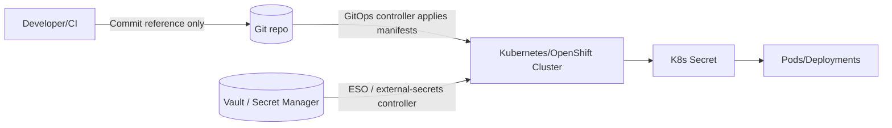

<!--
File: infra/secrets/README.md

KFM Governed Artifact Notice:
- This README documents *how* infrastructure secrets are handled for GitOps and deployments.
- It must NOT contain secret material (tokens, passwords, private keys, seed phrases, etc.).
- If there is any conflict with docs/security/secrets-policy.md, that policy wins.
-->

# 🔐 `infra/secrets/` — Secrets Handling (GitOps-safe)


> [!IMPORTANT]
> **Never commit secret values** (even in private repos).  
> This directory stores *only*:
> - **references** to an external secret manager (preferred), or
> - **encrypted** secret manifests (allowed only when policy permits), plus
> - templates, schemas, and runbooks.

> [!NOTE]
> KFM maintains a canonical policy doc:
> - `docs/security/secrets-policy.md` (source-of-truth for cryptography + key handling)
>
> This README is an operational guide for the `infra/` layer and *defers* to that policy.

---

## 🧭 What this folder is for

This folder is the **trust-membrane-safe** location for deployment-time secret *plumbing*:

- GitOps manifests that **reference** secrets (preferred)
- Optional encrypted secret manifests (**only if policy allows**)
- Naming conventions, templates, and runbooks
- CI gates / checks related to secret hygiene (no leaking)

### Non-goals

- Storing `.env` files, raw passwords, API tokens, or private keys
- Embedding secrets in frontend builds
- Using Git as a secret store (even if “private”)

---

## ✅ Golden rules

> [!IMPORTANT]
> These rules are non-negotiable unless `docs/security/secrets-policy.md` explicitly overrides them.

1. **No plaintext secrets in Git.**
2. **Prefer external secret managers** (Vault / cloud secret manager) and store **only references** in Git.
3. **Secrets must not cross the trust membrane**:
   - frontend/browser bundles must not include backend secrets
   - external clients never receive database credentials
4. **Least privilege by default**:
   - scope tokens to the smallest set of permissions and shortest TTL feasible
5. **No secret values in logs**, CI output, screenshots, tickets, or story content.

---

## 🧩 GitOps secret patterns we support

Two common GitOps-friendly patterns are used for Kubernetes/OpenShift secrets:

| Pattern | Repo contains | Cluster contains | When to use | Main risk |
|---|---|---|---|---|
| **External secret references (preferred)** | `ExternalSecret` / secret-ref manifests | Controller syncs real `Secret` from Vault/cloud | Production & shared envs | Secret manager misconfig / access policy drift |
| **Encrypted secrets in Git (conditional)** | Encrypted secret manifest (e.g., `SealedSecret`) | Controller decrypts to real `Secret` | Small deployments / bootstrap | Key management (“key 0”), accidental plaintext creation |

---

## 🔁 Reference flow diagrams

### Preferred: external secret manager → cluster



### Conditional: encrypted secrets in Git → cluster

```mermaid
flowchart LR
  Dev[Developer/CI] -->|Encrypt (kubeseal etc.)| Enc[Encrypted Secret Manifest]
  Enc --> Git[(Git repo)]
  Git -->|GitOps controller applies| Cluster[Kubernetes/OpenShift Cluster]
  Cluster -->|Sealed Secrets controller decrypts| Secret[K8s Secret]
  Secret --> Workload[Pods/Deployments]
```

---

## 🗂️ Recommended directory layout

> [!NOTE]
> This is the *intended* layout for this folder. If the repo already has a different structure,
> keep the existing structure and update this README accordingly.

```text
infra/
  secrets/
    README.md

    templates/
      external-secret.yaml          # ExternalSecret template (no values)
      sealed-secret.md              # Notes + safe examples

    environments/
      dev/
        external-secrets/           # refs only
      stage/
        external-secrets/
      prod/
        external-secrets/

    runbooks/
      incident-secret-leak.md       # response steps
      rotation.md                   # rotation procedure + verification

    policy/
      README.md                     # how infra ties back to docs/security/*
```

---

## 🧪 Local development guidance

> [!WARNING]
> Local dev secrets must never be committed. Add local files to `.gitignore`.

Recommended local options (pick one based on your environment):

- **Workload identity / SSO** for local dev where possible (preferred)
- Local `.env.local` (ignored by git) injected into dev containers
- A developer-specific secret store integration (vault login, SSO token fetch, etc.)

**Absolute minimum** local discipline:
- No committing `.env*`, `.pem`, `.key`, `.pfx`, `.kubeconfig`, or `config.json` containing tokens
- No pasting secret values into issue comments or PR descriptions

---

## 🧷 Naming conventions for secret references

> [!NOTE]
> Adjust naming if `docs/security/secrets-policy.md` defines an explicit convention.

### Suggested vault path convention

- `kfm/<env>/<component>/<secret_name>`
  - `<env>`: `dev | stage | prod`
  - `<component>`: `api | ingest | catalog | db | graph | search | ui-build` (example)
  - `<secret_name>`: `db_password | jwt_signing_key | oauth_client_secret | ...`

### Suggested Kubernetes Secret naming

- `kfm-<component>-secrets`
- Keys inside Secret: `DATABASE_URL`, `NEO4J_PASSWORD`, `JWT_PRIVATE_KEY`, etc.

---

## 🛠️ Adding or changing a secret (workflow)

### A. Preferred workflow: external secrets (references in Git)

**Checklist** (copy into PR description):

- [ ] Secret classified per `docs/security/secrets-policy.md`
- [ ] Secret stored/updated in external secret manager (Vault/cloud)
- [ ] Repo change contains **only references**, not values
- [ ] Manifests are environment-scoped (`dev/stage/prod`) and least-privilege
- [ ] CI secret scanning passes (no high-entropy strings / known key formats)
- [ ] Rotation and rollback plan documented (see `infra/secrets/runbooks/rotation.md`)
- [ ] Post-deploy verification steps included (health checks, auth checks)

Example *reference-only* manifest (template-level; no real paths/values):

```yaml
apiVersion: external-secrets.io/v1beta1
kind: ExternalSecret
metadata:
  name: kfm-example-secrets
spec:
  refreshInterval: 1h
  secretStoreRef:
    name: kfm-secretstore
    kind: ClusterSecretStore
  target:
    name: kfm-example-secrets
    creationPolicy: Owner
  data:
    - secretKey: DATABASE_PASSWORD
      remoteRef:
        key: kfm/dev/db/database_password
```

### B. Conditional workflow: encrypted secrets in Git (Sealed Secrets)

> [!WARNING]
> Use only if policy explicitly allows encrypted secrets in Git for the target environment.
> This pattern introduces operational/key-management overhead.

High-level steps:

1. Create the secret **locally** (never commit the plaintext manifest)
2. Encrypt/seal using the approved toolchain (e.g., `kubeseal`)
3. Commit only the encrypted artifact
4. GitOps applies encrypted artifact; controller materializes real Secret in cluster
5. Validate workload can read secret; validate logs contain no secret material

---

## 🔄 Rotation & revocation

> [!IMPORTANT]
> Rotation is a **production change**. Treat it like one.

Minimum rotation runbook requirements:

- **Rotate at source** (Vault/cloud) first
- Ensure sync controller refresh interval / forced refresh path is known
- Validate workloads restart/reload correctly
- Confirm old credentials are revoked (where supported)
- Record rotation event (ticket/PR + audit note, per governance)

See:
- `infra/secrets/runbooks/rotation.md`
- `infra/secrets/runbooks/incident-secret-leak.md`

---

## 🚨 Incident response: suspected secret leak

> [!DANGER]
> If a secret is suspected to be exposed, assume compromise.

Immediate steps (minimum viable response):

1. **Revoke/rotate** the secret at the source (Vault/cloud)
2. **Invalidate sessions/tokens** derived from the secret (where applicable)
3. Identify blast radius:
   - which environments/components used it
   - what permissions it granted
4. Remove secret material from any logs/artifacts
5. If Git exposure occurred:
   - purge history using approved process
   - re-scan repo for additional exposures

Document the incident and attach evidence per security governance.

---

## 🧱 CI / Governance gates (recommended)

- Secret scanning in CI (deny merge on detected secrets)
- Pre-commit hooks for developers (fast feedback)
- “Fail closed” policy: suspected leak blocks merge and promotion
- Environment protections: prod secret changes require elevated review

---

## 📚 References

- `docs/security/secrets-policy.md` — **Secrets Management & Cryptographic Policy** (source-of-truth)
- `docs/security/threat-model.md` — Threat modeling & risk mitigation (if present)
- `docs/security/supply-chain/` — supply-chain hardening guidance (if present)

---

## ✍️ Maintenance

- Owner: `infra/` maintainers + security owners (per CODEOWNERS if present)
- Review cadence: align to governance cadence
- Last updated: **2026-02-16**
