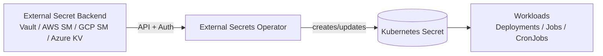

# External Secrets (ESO) — KFM Infra


**Path:** `infra/secrets/external-secrets/`

This folder is the **GitOps-managed** configuration for the **External Secrets Operator (ESO)**: a Kubernetes operator that syncs secrets from an external secrets backend (Vault / AWS Secrets Manager / GCP Secret Manager / Azure Key Vault / etc.) into **Kubernetes Secret** objects.

> [!IMPORTANT]
> **Do not commit plaintext secrets** to Git (including `Secret` manifests with `data:` / `stringData:`).  
> This folder stores **references** and **access configuration**, not secret values.

---

## Why this exists

KFM’s governance posture treats security and policy as *system rules*. Practically, that means:

- **No secrets in Git** — we store **only references** and have the cluster retrieve secrets at runtime.
- **Least privilege** — access to secret backends is scoped per cluster/environment/namespace.
- **Fail-closed** — if a secret cannot be fetched, the system should not “guess” values or proceed silently.
- **Auditable changes** — all changes are PR-reviewed and observable via operator events/logs.

> [!WARNING]
> Kubernetes `Secret` objects are **not encrypted by default** unless the cluster enables **encryption-at-rest** (etcd/KMS). Treat the cluster and RBAC as part of the security boundary.

---

## What ESO is (in one minute)

ESO is a set of CRDs + controllers:

- `SecretStore` / `ClusterSecretStore`: define *how* to authenticate to an external secret backend.
- `ExternalSecret`: defines *what* to fetch and how to project it into a Kubernetes `Secret`.

### Data flow



---

## Repository layout

> (not confirmed in repo) — Adjust to match the repo’s existing GitOps/Kustomize/ArgoCD conventions.

```text
infra/
  secrets/
    external-secrets/
      README.md
      base/
        namespace.yaml
        rbac.yaml
        externalsecrets-crds/        # if you vendor/pin CRDs
        operator/                   # helm/kustomize install manifests
        stores/                     # SecretStore / ClusterSecretStore definitions (NO credentials)
      overlays/
        dev/
        stage/
        prod/
      examples/
        externalsecret.example.yaml
        secretstore.vault.example.yaml
        secretstore.aws.example.yaml
```

---

## Installation and bootstrap

### Prerequisites

- A chosen **external secrets backend** (Vault, AWS Secrets Manager, etc.).
- A defined **auth mechanism** for the cluster → backend (e.g., Vault Kubernetes auth, AWS IRSA, workload identity, etc.).
- Cluster admin access for initial operator install.
- Network access from the operator namespace to the backend endpoints.

### Install ESO (pick one installation path)

#### Option A — Upstream ESO via Helm (portable, common)
- Recommended when you want upstream parity and version pinning in GitOps.
- You should pin the chart/operator version and record it in Git.

#### Option B — OLM / OperatorHub install (common in OpenShift)
- Often used in OpenShift environments where cluster operators are lifecycle-managed.

#### Option C — Red Hat OpenShift “External Secrets Operator” (productized)
- **Check support level before production.** Some OpenShift distributions may label this as Technology Preview depending on version/channel.

> [!TIP]
> Whatever installation method you choose:
> - Pin versions (operator + CRDs).
> - Treat the operator namespace as **platform-owned** and PR-gated.
> - Do **not** grant broad secret-backend access by default.

---

## Core resources you will manage here

| Resource | Scope | Purpose | Owned by |
|---|---:|---|---|
| `SecretStore` | Namespace | Namespaced backend config | App/platform (depending on policy) |
| `ClusterSecretStore` | Cluster | Shared backend config | Platform/Security |
| `ExternalSecret` | Namespace | Declares remote keys → local Secret | App team (PR reviewed) |
| `Secret` | Namespace | **Output** created by ESO | ESO controller |

---

## Minimal example: create a secret reference (ExternalSecret)

> Replace placeholders with your org’s conventions. The *remote key path* must not contain sensitive values.

```yaml
apiVersion: external-secrets.io/v1beta1
kind: ExternalSecret
metadata:
  name: kfm-api-db
  namespace: kfm-api
spec:
  refreshInterval: 1h
  secretStoreRef:
    kind: ClusterSecretStore
    name: kfm-prod-store
  target:
    name: kfm-api-db          # name of the Kubernetes Secret ESO will create/update
    creationPolicy: Owner
    deletionPolicy: Retain
    template:
      type: Opaque
  data:
    - secretKey: DATABASE_URL
      remoteRef:
        key: kfm/prod/kfm-api/DATABASE_URL
```

### Consume the created Kubernetes Secret in a Deployment

```yaml
envFrom:
  - secretRef:
      name: kfm-api-db
```

> [!IMPORTANT]
> Workloads should reference the **generated Kubernetes Secret** (e.g., `kfm-api-db`), **not** the `ExternalSecret` object.

---

## Store configuration patterns

### ClusterSecretStore vs SecretStore

- Prefer **`SecretStore`** when teams should be isolated by namespace and the platform wants hard boundaries.
- Prefer **`ClusterSecretStore`** when you want a centrally-managed “gateway” that multiple namespaces can use, but you still enforce access by:
  - backend-side policies (Vault policies / IAM conditions)
  - Kubernetes RBAC to create `ExternalSecret` objects
  - admission/policy checks (OPA/Gatekeeper/Kyverno) to restrict allowed stores and key prefixes

> (not confirmed in repo)  
> Decide and document: **who** is allowed to create stores, and whether app teams can create `SecretStore` in their own namespaces.

---

## Security, governance, and CI gates

### Non-negotiables

- ✅ No plaintext secrets in git
- ✅ No “temporary” secrets in PRs
- ✅ No secret values in logs, build args, Helm values, or manifests
- ✅ Least privilege from cluster → backend
- ✅ Rotation tested + documented

### Recommended CI checks

- **Secret scanning:** `gitleaks` / `trufflehog` (block merges)
- **Policy-as-code:** `conftest` (OPA/Rego) to deny:
  - `kind: Secret` with `data`/`stringData` in `infra/`
  - `ExternalSecret` referencing disallowed key prefixes
  - `ClusterSecretStore` changes without platform approval
- **Kubernetes manifest validation:** `kubeconform` / `kubeval` against pinned CRDs

### Definition of Done

- [ ] ESO installed and healthy (pods ready; CRDs present)
- [ ] Store configured (SecretStore/ClusterSecretStore) with least privilege
- [ ] ExternalSecret produces a Secret successfully (events show synced state)
- [ ] App uses the generated Secret (and fails closed if missing)
- [ ] Rotation drill completed (backend rotate → ESO sync → app stable)
- [ ] CI gates enforce “no secrets in Git”

---

## Troubleshooting

### Quick checks

```bash
# List externalsecrets and their status
kubectl -n <ns> get externalsecret
kubectl -n <ns> describe externalsecret <name>

# Confirm the output Secret exists
kubectl -n <ns> get secret <targetSecretName>

# Operator logs (namespace varies by install method)
kubectl -n external-secrets logs deploy/external-secrets -f
```

### Common failure modes

- **Auth denied**: store credentials/identity not mapped to backend policy.
- **Wrong key path**: `remoteRef.key` doesn’t exist or is mis-typed.
- **Network**: operator cannot reach backend endpoint.
- **RBAC**: app namespace cannot create `ExternalSecret`, or operator lacks permission to write `Secret`.

---

## References

- External Secrets Operator docs: https://external-secrets.io/
- API reference: `ExternalSecret`, `SecretStore`, `ClusterSecretStore` (match your pinned operator version)
- OpenShift install patterns (if applicable): OperatorHub/OLM channels and support status

---

## Assumptions and verification steps

> These are intentionally explicit to keep the system evidence-first.

1. **Secret backend** is not specified in repo.  
   **Verify:** identify which backend is approved (Vault / AWS / GCP / Azure) and record it here.

2. **GitOps controller** (Argo CD / OpenShift GitOps / Flux) is not specified in this folder.  
   **Verify:** confirm the bootstrap mechanism and align `base/` + `overlays/` accordingly.

3. **Policy enforcement** tooling is not specified (OPA/Gatekeeper/Kyverno/Conftest).  
   **Verify:** confirm the policy toolchain and add deny-by-default rules for secrets hygiene.