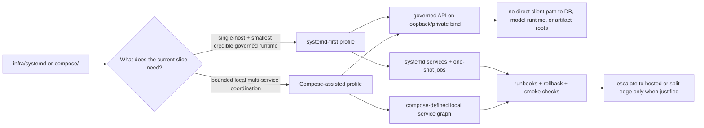

<!-- [KFM_META_BLOCK_V2]
doc_id: kfm://doc/<uuid-NEEDS-VERIFICATION>
title: systemd-or-compose
type: standard
version: v1
status: draft
owners: @bartytime4life
created: YYYY-MM-DD
updated: YYYY-MM-DD
policy_label: NEEDS VERIFICATION
related: [../../README.md, ../README.md, ../systemd/README.md, ../compose/README.md, ../local/README.md, ../../docs/runbooks/README.md, ../../policy/README.md, ../../contracts/README.md]
tags: [kfm, infra, runtime, systemd, compose]
notes: [Live repo evidence confirms this path exists and is currently README-only; doc_id, dates, policy_label, and owner mapping still need live-repo verification before merge.]
[/KFM_META_BLOCK_V2] -->

# systemd-or-compose

Shared runtime-orchestration guidance for KFM’s local-first infrastructure lane: when native `systemd` is preferred, when Compose is acceptable, and how the two must stay doctrine-aligned instead of drifting into parallel runtime universes.

> **Status:** experimental  
> **Owners:** @bartytime4life  
>       
> **Repo fit:** `infra/systemd-or-compose/README.md` → upstream [`../README.md`](../README.md) and [`../../README.md`](../../README.md); adjacent [`../systemd/`](../systemd/), [`../compose/`](../compose/), [`../local/`](../local/); downstream trust surfaces include [`../../contracts/`](../../contracts/), [`../../policy/`](../../policy/), [`../../schemas/`](../../schemas/), [`../../tests/`](../../tests/)  
> **Quick jumps:** [Scope](#scope) · [Repo fit](#repo-fit) · [Accepted inputs](#accepted-inputs) · [Exclusions](#exclusions) · [Directory tree](#directory-tree) · [Quickstart](#quickstart) · [Usage](#usage) · [Diagram](#diagram) · [Operating tables](#operating-tables) · [Task list](#task-list) · [FAQ](#faq) · [Appendix](#appendix)

> [!IMPORTANT]
> **Current repo reality:** this directory is **CONFIRMED** to exist, but it is currently a **README-only scaffold surface**. The same is true for `infra/systemd/` and `infra/local/`. By contrast, `infra/compose/README.md` is already a substantive coordination document, even though `infra/compose/` is also currently README-only.

> [!NOTE]
> KFM’s attached doctrine is **systemd-first** for the thinnest credible phase-one runtime on a single Ubuntu host. This directory does **not** assume Compose is the default. It exists to document lane choice, shared invariants, and anti-drift rules across the local-first runtime family.

## Scope

This directory is the **shared decision surface** between KFM’s native `systemd` lane and its bounded Compose lane.

Its job is to answer four questions clearly:

1. When should KFM stay **native `systemd`**?
2. When is a **Compose-assisted local stack** acceptable?
3. What runtime invariants must remain true in **either** lane?
4. How do `infra/systemd/`, `infra/compose/`, `infra/local/`, and `infra/systemd-or-compose/` avoid becoming contradictory sources of truth?

### Current evidence snapshot

| Item | Status | Meaning here |
|---|---|---|
| `infra/systemd-or-compose/` exists | **CONFIRMED** | This path is present in the live repo. |
| Target file maturity | **CONFIRMED** | The current file at this path is scaffold-only. |
| `infra/systemd/` exists | **CONFIRMED** | Present, currently README-only placeholder surface. |
| `infra/local/` exists | **CONFIRMED** | Present, currently README-only scaffold surface. |
| `infra/compose/README.md` is already substantive | **CONFIRMED** | Compose is not just a one-line placeholder anymore. |
| Parent `infra/README.md` treats this lane as part of the infra runtime family | **CONFIRMED** | The parent infra guide names `systemd-or-compose/` alongside the other operational lanes. |
| This directory should own comparison and lane-selection guidance | **INFERRED** | That is the cleanest role consistent with the current repo split. |
| Active `.service`, `.timer`, or `compose*.yml` files already live here | **NEEDS VERIFICATION** | Not proven by the current visible repo evidence used for this draft. |
| Exact authoritative runtime lane in active use on the branch | **NEEDS VERIFICATION** | Doctrine favors `systemd`-first, but the mounted repo evidence does not prove a live runtime choice. |

### Directory contract

This directory should own **comparison, selection, and anti-drift guidance**.

It should **not** quietly become:

- a second home for `systemd` unit files,
- a second home for Compose manifests,
- a hiding place for policy law,
- or an unreviewed runtime shortcut that bypasses governed interfaces.

[Back to top](#systemd-or-compose)

## Repo fit

| Aspect | Value |
|---|---|
| Path | `infra/systemd-or-compose/README.md` |
| Primary role | Shared runtime choice and coordination guide for KFM’s local-first orchestration surfaces |
| Upstream context | [`../../README.md`](../../README.md), [`../README.md`](../README.md) |
| Adjacent runtime docs | [`../systemd/README.md`](../systemd/README.md), [`../compose/README.md`](../compose/README.md), [`../local/README.md`](../local/README.md) |
| Related trust surfaces | [`../../contracts/`](../../contracts/), [`../../policy/`](../../policy/), [`../../schemas/`](../../schemas/), [`../../tests/`](../../tests/) |
| Must stay out of scope | App logic, canonical contracts, policy bundles, release proof packs, live secrets, and source-of-truth dataset claims |

### Why this directory exists even with `systemd/` and `compose/` beside it

Because the repo already exposes a runtime family rather than a single runtime path:

- `infra/systemd/`
- `infra/compose/`
- `infra/local/`
- `infra/systemd-or-compose/`

That split is useful only if one place explains:

- which lane is preferred,
- which lane owns concrete artifacts,
- which concerns are shared,
- and where contributors should **not** duplicate files.

This README is that place.

[Back to top](#systemd-or-compose)

## Accepted inputs

Material belongs here when it helps compare or coordinate the runtime lanes **without stealing ownership** from more specific directories.

| Accepted input | Why it belongs here |
|---|---|
| Lane-selection notes | This directory should explain **why** one orchestration lane is preferred in a given phase. |
| Shared runtime invariants | Loopback-only binds, governed-API entry, no direct model/database exposure, and similar cross-lane rules belong here. |
| Anti-drift rules | Contributors need one place that says where the authoritative copy of a manifest or unit belongs. |
| Redacted env conventions | Cross-lane naming and placement guidance for env files is shared runtime doctrine. |
| Shared smoke-check guidance | Brief, cross-lane preflight checks fit here, with deeper procedures linked to runbooks. |
| Migration guidance | Local-only → private remote → hosted split-edge progression belongs here because it affects lane choice. |
| Comparison snippets | Minimal `systemd` vs Compose examples are acceptable when used to clarify ownership or invariants. |

## Exclusions

The following material should live elsewhere.

| Do not put this here | Put it here instead | Why |
|---|---|---|
| `*.service` / `*.timer` files as authoritative runtime artifacts | `../systemd/` | Lane-specific native service artifacts should live with the lane that owns them. |
| `compose.yml`, `docker-compose.yml`, or service-specific overrides | `../compose/` | Avoid duplicate manifest universes. |
| Local bootstrap notes that are not specifically about lane selection | `../local/` | Keep local bootstrap separate from orchestration choice. |
| Canonical schemas, OpenAPI, or contract law | `../../contracts/` and `../../schemas/` | Runtime wiring must not become the hidden home of interface truth. |
| Policy bundles, reason codes, or decision vocab | `../../policy/` | Policy law belongs in policy surfaces, not in runtime comparison docs. |
| App, worker, or domain code | `../../apps/`, `../../packages/`, or equivalent code surfaces | Infra guidance is not application authority. |
| Real secrets or live env files | Out-of-repo secret handling | Docs may describe shapes and names, never store live credentials. |
| Release receipts, correction notices, or publication proof packs | `../../docs/runbooks/` plus release/proof surfaces | Promotion is a governed state transition, not just an infra event. |

> [!WARNING]
> If this directory starts carrying actual unit files, Compose manifests, policy logic, and operational procedures at the same time, it has stopped being a coordination surface and become a drift generator.

[Back to top](#systemd-or-compose)

## Directory tree

### Current live repo slice

```text
infra/
├── README.md
├── backup/
├── compose/
│   └── README.md
├── dashboards/
├── gitops/
├── hosted/
├── kubernetes/
├── local/
│   └── README.md
├── monitoring/
├── systemd/
│   └── README.md
├── systemd-or-compose/
│   └── README.md
└── terraform/
```

### Current local-first runtime family

```text
infra/compose/
└── README.md          # substantive coordination doc; directory currently README-only

infra/systemd/
└── README.md          # placeholder surface in current repo

infra/local/
└── README.md          # scaffold surface in current repo

infra/systemd-or-compose/
└── README.md          # this shared choice + anti-drift guide
```

### Suggested future shape (PROPOSED, not current repo fact)

```text
infra/systemd-or-compose/
├── README.md                  # this guide
├── profile-matrix.md          # explicit systemd vs compose selection matrix
├── examples/
│   ├── systemd/
│   └── compose/
├── env/
│   └── README.md              # redacted env naming/placement rules only
└── smoke/
    └── README.md              # cross-lane smoke checks and handoff links
```

> [!TIP]
> Do not create the proposed paths merely to satisfy documentation symmetry. Add them only when the live repo adopts this directory as the canonical shared orchestration decision surface.

[Back to top](#systemd-or-compose)

## Quickstart

Before editing anything under the runtime family, verify what the repo actually contains.

```bash
git rev-parse --show-toplevel

# Inspect the infra family first.
find infra -maxdepth 2 -type d | sort

# Read the parent and adjacent runtime guides.
for p in \
  infra/README.md \
  infra/systemd-or-compose/README.md \
  infra/systemd/README.md \
  infra/compose/README.md \
  infra/local/README.md
do
  [ -f "$p" ] && printf '\n### %s ###\n' "$p" && sed -n '1,260p' "$p"
done

# Inventory candidate runtime artifacts without assuming they exist.
find infra \
  \( -name '*.service' -o -name '*.timer' -o -name 'compose*.yml' -o -name 'docker-compose*.yml' -o -name '*.env.example' \) \
  -print | sort

# Cross-check adjacent trust surfaces before inventing runtime claims.
for p in \
  contracts/README.md \
  schemas/README.md \
  policy/README.md \
  tests/README.md
do
  [ -f "$p" ] && printf '\n### %s ###\n' "$p" && sed -n '1,200p' "$p"
done
```

### Review outcome you want

A contributor should be able to answer all of these before adding files:

- Which lane currently owns real runtime artifacts?
- Which runtime directories are still doc-only?
- Which binds must stay loopback or private in phase one?
- Where do smoke, restore, rollback, and correction procedures belong?
- What evidence would justify switching from native services to Compose for a given slice?

[Back to top](#systemd-or-compose)

## Usage

### 1) Start from `systemd` when proving the first real governed slice

KFM doctrine favors the smallest credible runtime that still preserves:

- the trust membrane,
- governed API mediation,
- explicit plane boundaries,
- local-only model/runtime exposure,
- and fail-closed operations.

For a single Ubuntu host, that usually means:

- `systemd` for long-lived services,
- one-shot jobs for ingest/build/publish/projection work,
- loopback-only or socket-local binds,
- no public reverse proxy in phase one.

### 2) Use Compose when it solves a real coordination problem

Compose is acceptable when it reduces local orchestration pain without weakening runtime doctrine, for example when:

- a contributor needs a bounded multi-service rehearsal,
- local dependency bring-up is otherwise error-prone,
- parity with a containerized downstream surface matters,
- or temporary service bundling is materially clearer than hand-managed native bring-up.

Compose is **not** a reason to expose:

- PostgreSQL/PostGIS,
- Ollama,
- artifact roots,
- review internals,
- or unpublished lifecycle stages.

### 3) Keep this directory as the handoff layer, not the execution bypass

Use `systemd-or-compose/` to answer:

- which lane is preferred now,
- which directory owns which files,
- what both lanes must keep invariant,
- and how migration should happen without stale copies surviving.

Do **not** use it to smuggle in:

- authoritative manifests,
- hidden policy decisions,
- speculative live deployment claims,
- or public-edge defaults that contradict local-first doctrine.

### 4) Keep progression explicit

A clean progression for this guide to describe is:

1. **Local-only** — single host, loopback binds, no public edge.
2. **Private remote** — VPN-mediated access to governed surfaces only.
3. **Small hosted split-edge** — public-safe UI/API outward; canonical, policy, and sensitive lanes remain private or more tightly controlled.
4. **More separated runtime** — only when service count, rollback risk, or blast-radius concerns justify the added operational burden.

[Back to top](#systemd-or-compose)

## Diagram



[Back to top](#systemd-or-compose)

## Operating tables

### Lane selection matrix

| Need | Preferred lane | Why |
|---|---|---|
| Single-host, long-lived service supervision | `../systemd/` | Best fit for native Ubuntu phase-one service management and loopback/socket-local posture. |
| Shared decision and anti-drift guidance | `./` | This directory owns the comparison rules and ownership map. |
| Bounded local multi-service rehearsal | `../compose/` | Good for service coordination when container layering solves a real bring-up problem. |
| Generic local-first bootstrap notes | `../local/` | Bootstrap and orchestration are related but not identical concerns. |
| Hosted or clustered deployment surfaces | `../hosted/`, `../kubernetes/`, `../terraform/`, `../gitops/` | These are later operational surfaces, not the default phase-one answer. |

### Cross-lane runtime rules

| Concern | `systemd`-first posture | Compose posture | KFM rule |
|---|---|---|---|
| Governed API bind | Loopback by default | Loopback/private port map only | Public reachability must be intentional, reviewed, and justified. |
| PostgreSQL/PostGIS | Unix socket or localhost | Internal/private only | Never direct client-visible. |
| Ollama / local inference runtime | Loopback only | Private internal only | Never public-facing and never the normal client boundary. |
| Artifact roots | Filesystem path only | Mounted private volume only | No direct file-sharing exposure of RAW / WORK / QUARANTINE / canonical roots. |
| One-shot jobs | Native units/timers | Explicit one-off jobs or equivalent | Must fail closed and produce diagnosable results. |
| Env handling | Root-owned env files / drop-ins | Redacted examples only in repo | No live secrets committed. |
| Rollback | Unit/service rollback + runbook | Manifest/service rollback + runbook | Runtime rollback must not erase correction lineage. |
| Derived services | Separate ownership and lower authority | Same | Search/vector/tile/scene layers stay derived unless explicitly promoted. |

### Anti-drift authority map

| If this artifact exists… | It should usually live in… | This directory should do… |
|---|---|---|
| `*.service`, `*.timer` | `infra/systemd/` | Link to it, explain why native services are preferred, and document shared invariants. |
| `compose.yml`, `docker-compose.yml`, Compose overrides | `infra/compose/` | Link to it, explain when Compose is allowed, and document shared invariants. |
| Shared runtime-choice notes | `infra/systemd-or-compose/` | Own them here. |
| Local-only bootstrap instructions | `infra/local/` | Point to them from here when relevant. |
| Runbook links for smoke/restore/rollback | `docs/runbooks/` or one canonical runtime surface | Keep a single authoritative copy and link to it. |
| Hosted/public-edge overlays | `infra/hosted/`, `infra/kubernetes/`, `infra/terraform/`, `infra/gitops/` | Point outward; do not duplicate. |

### Confidence table for claims in this README

| Claim family | Current label | Why |
|---|---|---|
| Directory existence and current README-only state | **CONFIRMED** | Verified from the live repo. |
| Parent infra doctrine and systemd-first local-first posture | **CONFIRMED** | Verified from repo-adjacent docs plus attached corpus. |
| This directory as the canonical shared decision surface | **INFERRED** | Strong fit with repo structure, but not yet implemented as a richer subtree. |
| Proposed subpaths, manifest ownership refinements, and expanded handoff patterns | **PROPOSED** | These are build-useful recommendations, not proven current repo reality. |
| Exact runtime artifacts, actual binds, or live deployment state | **NEEDS VERIFICATION** | Not directly visible in the mounted repo evidence used for this draft. |

[Back to top](#systemd-or-compose)

## Task list

### Definition of done for this directory

- [ ] Verify `doc_id`, `created`, `updated`, and `policy_label` in the KFM meta block.
- [ ] Reconcile `owners` with live repo ownership evidence, not just task-supplied ownership.
- [ ] Confirm which lane currently owns real runtime artifacts in the checked-out branch.
- [ ] If `.service`, `.timer`, or Compose manifests already exist elsewhere, link them here instead of duplicating them.
- [ ] Keep `systemd`-first doctrine visible for the phase-one single-host slice.
- [ ] Link smoke, restore, rollback, and correction procedures to the canonical runbook surface.
- [ ] Keep any env examples redacted and explicitly non-secret.
- [ ] Preserve explicit labels for anything still **INFERRED**, **PROPOSED**, or **NEEDS VERIFICATION**.

### Review gates

- [ ] **Architecture review:** trust membrane and phase boundaries remain visible.
- [ ] **Infra review:** bind scopes and ownership map remain coherent.
- [ ] **Policy review:** no policy law has leaked into runtime prose without a home in `policy/`.
- [ ] **Docs review:** adjacent runtime READMEs do not contradict this file.
- [ ] **Operations review:** rollback, smoke, and migration implications are visible.

[Back to top](#systemd-or-compose)

## FAQ

### Why keep this directory if `infra/systemd/` and `infra/compose/` already exist?

Because contributors still need one place that explains **which lane to choose**, **what each lane may own**, and **how not to create duplicate runtime authority**.

### Is Compose forbidden in KFM?

No. But current doctrine does not treat it as the default answer for the first real governed runtime. The default phase-one posture is a bounded, single-host, `systemd`-first Ubuntu profile.

### Can this directory become the home of production manifests?

Only if the repo explicitly standardizes on that choice later. Right now, the strongest fit is as a **shared decision and anti-drift guide**, not the sovereign home of lane-specific runtime artifacts.

### Why not just put everything in `infra/compose/` and call it done?

Because KFM’s doctrine is not “container-first by reflex.” Tool choice should follow governance burden, operational clarity, and the smallest-real-thing bias, not convenience branding.

### What if the repo eventually standardizes on one lane?

Then this directory can shrink into a brief handoff README—or disappear entirely—once the anti-drift problem is gone and one verified runtime home clearly owns the artifacts.

[Back to top](#systemd-or-compose)

## Appendix

<details>
<summary><strong>Verification backlog</strong></summary>

| Item | Current label | How to close it |
|---|---|---|
| `doc_id` | **NEEDS VERIFICATION** | Allocate the canonical KFM document identifier at merge time. |
| `created` / `updated` dates | **NEEDS VERIFICATION** | Resolve from commit history before commit. |
| `policy_label` | **NEEDS VERIFICATION** | Reconcile with live repo labeling convention for infra docs. |
| Owners beyond task-supplied value | **NEEDS VERIFICATION** | Check live ownership markers and CODEOWNERS coverage. |
| Real unit file inventory | **NEEDS VERIFICATION** | Inventory `*.service` and `*.timer` files across `infra/` and related runtime paths. |
| Real Compose manifest inventory | **NEEDS VERIFICATION** | Inventory `compose*.yml` / `docker-compose*.yml` and note authoritative homes. |
| Canonical smoke/rollback home | **NEEDS VERIFICATION** | Confirm whether these live under `docs/runbooks/` or a runtime-specific subtree. |
| Authoritative phase-one runtime lane | **NEEDS VERIFICATION** | Verify with actual manifests, scripts, and runbooks in the checked-out repo. |

</details>

<details>
<summary><strong>Minimal glossary</strong></summary>

| Term | Meaning in this directory |
|---|---|
| `systemd`-first | Native host service management is the default answer for the thinnest credible phase-one KFM runtime. |
| Compose-assisted | A bounded local multi-service coordination layer that is acceptable only when it preserves the same trust boundaries. |
| Shared decision surface | A documentation surface that records lane choice, artifact ownership, and anti-drift rules without pretending to be canonical runtime truth. |
| Anti-drift rule | A rule that prevents duplicate manifests, unit files, or env conventions from turning into conflicting runtime authorities. |
| Local-first | Start with the smallest bounded runtime that can prove the governed path before adding hosted or cluster complexity. |

</details>
