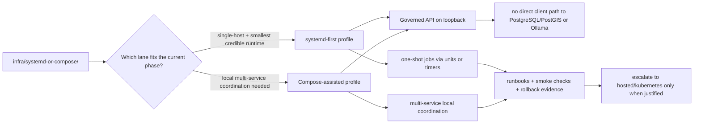

<!-- [KFM_META_BLOCK_V2]
doc_id: kfm://doc/<uuid-NEEDS-VERIFICATION>
title: systemd-or-compose
type: standard
version: v1
status: draft
owners: @bartytime4life
created: YYYY-MM-DD
updated: YYYY-MM-DD
policy_label: NEEDS VERIFICATION
related: [../../README.md, ../README.md, ../systemd/README.md, ../compose/README.md, ../local/README.md, ../../docs/runbooks/README.md, ../../policy/README.md, ../../contracts/README.md]
tags: [kfm, infra, runtime, systemd, compose]
notes: [Current repo evidence confirms this path exists, but the prior README at this path was scaffold-only; doc_id, dates, and policy_label still need live-repo verification before merge.]
[/KFM_META_BLOCK_V2] -->

# systemd-or-compose

Shared runtime-orchestration guidance for KFM’s local-first infrastructure lane: when native `systemd` is preferred, when Compose is acceptable, and how to keep the two from drifting apart.

> **Status:** experimental  
> **Owners:** @bartytime4life  
>       
> **Repo fit:** `infra/systemd-or-compose/` → upstream [`infra/`](../README.md) and [`repo root`](../../README.md); adjacent [`systemd/`](../systemd/), [`compose/`](../compose/), [`local/`](../local/); downstream [`runbooks/`](../../docs/runbooks/), [`policy/`](../../policy/), [`contracts/`](../../contracts/), [`tests/`](../../tests/)  
> **Quick jumps:** [Scope](#scope) · [Repo fit](#repo-fit) · [Accepted inputs](#accepted-inputs) · [Exclusions](#exclusions) · [Directory tree](#directory-tree) · [Quickstart](#quickstart) · [Usage](#usage) · [Diagram](#diagram) · [Operating tables](#operating-tables) · [Task list](#task-list) · [FAQ](#faq) · [Appendix](#appendix)

> [!IMPORTANT]
> **Current evidence boundary:** this path is **CONFIRMED** to exist, but its prior `README.md` was scaffold-only. The sibling `infra/systemd/` and `infra/compose/` lanes also exist and currently carry placeholder README surfaces, so this document is written as the first substantive orchestration guide for this part of the repo.

> [!NOTE]
> KFM’s current doctrine is **systemd-first** for the thinnest credible single-host phase-one runtime. This directory does **not** assume Compose is the default. Instead, it documents when a narrow Compose layer is still acceptable and what must remain invariant in either path.

## Scope

This directory is the **shared orchestration decision surface** for KFM’s smallest governed runtime profiles.

It exists to answer four questions:

1. When should KFM stay **native `systemd`**?
2. When is a **Compose-assisted local stack** acceptable?
3. What runtime invariants must hold in **either** lane?
4. How do we stop `infra/systemd/`, `infra/compose/`, and `infra/systemd-or-compose/` from becoming three drifting copies of the same half-truth?

### Current evidence snapshot

| Item | Label | Meaning here |
|---|---|---|
| Path presence | **CONFIRMED** | `infra/systemd-or-compose/` exists in the current repo. |
| Prior content maturity | **CONFIRMED** | The prior file at this path was only a scaffold README. |
| Sibling runtime lanes | **CONFIRMED** | `infra/systemd/`, `infra/compose/`, and `infra/local/` also exist. |
| Directory role as a shared decision lane | **INFERRED** | This is the best fit given the repo’s current split across `systemd/`, `compose/`, and `systemd-or-compose/`. |
| Live units, timers, Compose files, or env templates | **NEEDS VERIFICATION** | They were not proven from current repo evidence used for this draft. |
| Exact production/runtime choice | **NEEDS VERIFICATION** | The repo does not yet prove which lane is authoritative in live operation. |

### Directory contract

This directory should own **comparison, selection, and shared rules**. It should not quietly become an unreviewed duplicate home for every runtime artifact in the repo.

[Back to top](#systemd-or-compose)

## Repo fit

| Aspect | Value |
|---|---|
| Path | `infra/systemd-or-compose/` |
| Primary role | Shared guidance for choosing, documenting, and reviewing KFM’s local-first orchestration lane |
| Upstream context | [`../../README.md`](../../README.md), [`../README.md`](../README.md) |
| Adjacent runtime lanes | [`../systemd/`](../systemd/), [`../compose/`](../compose/), [`../local/`](../local/) |
| Downstream operational surfaces | [`../../docs/runbooks/`](../../docs/runbooks/), [`../../policy/`](../../policy/), [`../../contracts/`](../../contracts/), [`../../tests/`](../../tests/) |
| Must stay out of scope | Application logic, policy law, canonical contracts, real secrets, dataset truth, and silent promotion behavior |

### Why this directory exists even if `systemd/` and `compose/` already exist

Because the repo currently exposes **three** related runtime lanes:

- `infra/systemd/`
- `infra/compose/`
- `infra/systemd-or-compose/`

A good repo does not leave contributors guessing which one is the decision surface, which one is the artifact home, and which one is historical drift. This README turns `systemd-or-compose/` into the place where that boundary is made explicit.

[Back to top](#systemd-or-compose)

## Accepted inputs

The following material belongs here when it helps compare or coordinate the runtime lanes without taking ownership away from more specific directories.

| Accepted input | Why it belongs here |
|---|---|
| Profile-selection notes | This directory should record **why** one orchestration lane is preferred in a given phase. |
| Shared runtime invariants | Loopback-only binds, no direct database/model exposure, one-shot job posture, and similar rules apply across lanes. |
| Anti-drift guidance | If both `systemd/` and `compose/` exist, contributors need one place that says which copy is authoritative. |
| Redacted env conventions | Example names such as `kfm-api.env` or `.env.example` patterns are cross-cutting infra concerns. |
| Shared smoke-check notes | Quick verification steps that apply before handing off to a lane-specific runbook belong here. |
| Migration notes | This directory is the right place to describe a clean move from local-only → private remote → more separated deployment. |
| Minimal example fragments | Only when used for comparison, review, or handoff—not as the silent canonical home of runtime truth. |

## Exclusions

The following material does **not** belong here.

| Do not put this here | Put it here instead | Why |
|---|---|---|
| App or worker source code | `apps/` or `packages/` | Runtime orchestration is not the same thing as domain/application law. |
| Canonical schemas or API contracts | `contracts/` | Shared object families must remain independently versioned and reviewed. |
| Policy bundles, rule tests, or decision vocab | `policy/` and `contracts/vocab/` | Policy law must not hide inside infra wiring. |
| Real secrets, tokens, signed URLs, or private `.env` files | Out-of-repo secret management | Repo docs may describe shapes, never store live credentials. |
| Dataset truth or published artifacts | `data/` and related release surfaces | Infra is a delivery/control layer, not authoritative truth. |
| Compose files duplicated from `../compose/` | `../compose/` | Avoid parallel manifest universes. |
| Unit files duplicated from `../systemd/` | `../systemd/` | Keep lane-specific runtime artifacts in the lane that owns them. |
| Public-edge defaults for phase one | `infra/hosted/`, `infra/kubernetes/`, or later hosted surfaces | This directory should remain local-first and trust-boundary aware. |

> [!WARNING]
> If a manifest, unit file, or helper script begins to carry **business meaning**, **policy logic**, or **publication state**, it has escaped this directory’s scope and should be promoted into the proper package, contract, or policy surface.

[Back to top](#systemd-or-compose)

## Directory tree

### Current repo evidence (orchestration-relevant slice)

```text
infra/
├── README.md
├── backup/
├── compose/
│   └── README.md
├── dashboards/
├── gitops/
├── hosted/
├── kubernetes/
├── local/
│   └── README.md
├── monitoring/
├── systemd/
│   └── README.md
├── systemd-or-compose/
│   └── README.md
└── terraform/
```

### Suggested role of this directory (PROPOSED)

```text
infra/systemd-or-compose/
├── README.md                  # this guide
├── profile-matrix.md          # when to use systemd vs compose
├── examples/
│   ├── systemd/
│   └── compose/
├── env/
│   └── README.md              # redacted env conventions only
└── smoke/
    └── README.md              # cross-lane verification steps
```

> [!TIP]
> Do **not** create the proposed child paths just to satisfy the tree. Add them only when the live repo adopts this directory as the shared orchestration lane.

[Back to top](#systemd-or-compose)

## Quickstart

Start by verifying current repo reality before moving any files or declaring one lane authoritative.

```bash
git rev-parse --show-toplevel

# Inspect the infra surface first.
find infra -maxdepth 2 -type d | sort

# Read the shared infra guidance and the three local orchestration lanes.
for p in \
  infra/README.md \
  infra/systemd-or-compose/README.md \
  infra/systemd/README.md \
  infra/compose/README.md \
  infra/local/README.md
do
  [ -f "$p" ] && printf '\n### %s ###\n' "$p" && sed -n '1,220p' "$p"
done

# Inventory candidate runtime artifacts without assuming they exist.
find infra \
  \( -name '*.service' -o -name '*.timer' -o -name 'compose*.yml' -o -name 'docker-compose*.yml' -o -name '*.env.example' \) \
  -print | sort

# Cross-check adjacent operational surfaces that this lane must not bypass.
for p in \
  docs/runbooks/README.md \
  policy/README.md \
  contracts/README.md \
  tests/README.md
do
  [ -f "$p" ] && printf '\n### %s ###\n' "$p" && sed -n '1,200p' "$p"
done
```

### Review outcome you want

By the end of the quickstart, a contributor should be able to answer:

- Which lane currently owns real runtime artifacts?
- Which documents are still placeholders?
- Which binds must stay loopback/private in phase one?
- Where do rollback, restore, and smoke checks live?
- What would have to change before Compose or hosted surfaces become the better fit?

[Back to top](#systemd-or-compose)

## Usage

### 1) Use `systemd` as the default phase-one answer

For KFM’s smallest credible governed runtime, the default posture is:

- single host,
- loopback-only governed API,
- local-only Ollama,
- PostgreSQL/PostGIS on socket or localhost,
- one-shot ingest/build/publish/projection jobs,
- no public reverse proxy by default.

That is the **starting assumption** this directory should preserve.

### 2) Use Compose only when it solves a real local coordination problem

A Compose-assisted lane may be useful when:

- contributor bring-up needs several cooperating services,
- local parity matters more than pure host-native simplicity,
- the service graph is big enough that hand-managed startup becomes error-prone,
- the team can keep bind scopes, env handling, and receipts as disciplined as the native lane.

Compose is **not** a license to expose PostgreSQL/PostGIS, Ollama, artifact roots, or unpublished stages directly.

### 3) Treat this directory as the handoff layer, not the bypass layer

Use `systemd-or-compose/` to answer:

- which lane is preferred now,
- which lane owns concrete artifacts,
- how both lanes must honor the same trust membrane,
- how to migrate without leaving stale copies behind.

Do **not** use this directory to smuggle in:

- policy logic,
- canonical contracts,
- app behavior,
- public-edge defaults,
- silent deployment rules that change trust state.

### 4) Keep phase progression explicit

A clean progression for this directory to describe is:

1. **Local-only:** single host, local binds, no public edge.
2. **Private remote:** VPN-mediated access to governed surfaces only.
3. **Hosted split-edge:** public-safe UI/API can move outward; canonical and sensitive lanes stay private.
4. **More separated runtime:** only once concurrency, rollback risk, or operational drift justify it.

[Back to top](#systemd-or-compose)

## Diagram



[Back to top](#systemd-or-compose)

## Operating tables

### Selection matrix

| Profile | Best fit | What must remain true | What this directory should record |
|---|---|---|---|
| `systemd`-first | Single-host Ubuntu phase one; smallest credible governed runtime | Loopback/private binds; least privilege; one-shot job discipline; no direct client path to DB or Ollama | Why native services are enough and which artifacts live under `infra/systemd/` |
| Compose-assisted local stack | Contributor convenience or local multi-service coordination | Same trust boundaries as the native lane; explicit port maps; no secret leakage; no public-edge creep | Why Compose is justified and which artifacts live under `infra/compose/` |
| Mixed handoff | Some services host-native, some containerized | One authority map; no duplicate manifests becoming sovereign; same rollback and audit expectations | Which side owns each service and where the canonical docs/manifests live |
| Later hosted separation | When local-only is no longer enough | Hosted move does not collapse the trust membrane or publication law | Handoff notes to `infra/hosted/`, `infra/kubernetes/`, `infra/terraform/`, or `infra/gitops/` |

### Cross-lane runtime rules

| Concern | `systemd`-first posture | Compose posture | KFM rule |
|---|---|---|---|
| Governed API bind | Loopback by default | Loopback/private port map only | Public reachability must be intentional and justified |
| PostgreSQL/PostGIS | Local socket or localhost | Internal service only | Never direct client-visible |
| Ollama / local model runtime | Local only | Private internal only | Never public-facing |
| One-shot jobs | Units/timers preferred | Explicit one-off service/task only if equivalent receipts/logging exist | Fail closed and emit diagnosable status |
| Env handling | Root-owned env files or equivalent | Redacted `.env.example` only in repo | No live secrets committed |
| Rollback | Service/unit reversal + runbook | Manifest/service rollback + runbook | Deploy rollback does not erase correction lineage |
| Growth trigger | Simpler until proven insufficient | Useful once local coordination cost is real | Tool choice follows authority seams, not fashion |

### Authority map rule

| If this artifact exists… | It should usually live in… | This directory should do… |
|---|---|---|
| `*.service`, `*.timer` | `infra/systemd/` | Link to it, explain when it is preferred, and document shared invariants |
| `compose.yml`, `docker-compose.yml` | `infra/compose/` | Link to it, state why it is allowed, and document shared invariants |
| Shared orchestration decision note | `infra/systemd-or-compose/` | Own it here |
| Runtime smoke steps used across both lanes | `infra/systemd-or-compose/` or `docs/runbooks/` | Keep one canonical copy and link outward |
| Hosted/public-edge manifests | `infra/hosted/`, `infra/kubernetes/`, `infra/terraform/`, `infra/gitops/` | Point to them; do not duplicate them here |

[Back to top](#systemd-or-compose)

## Task list

### Definition of done for this directory

- [ ] Owners, dates, and policy label are verified and the KFM meta block is updated.
- [ ] The repo’s authoritative local orchestration lane is explicit: `systemd`, `compose`, or a documented mixed handoff.
- [ ] No document in this directory implies direct client access to PostgreSQL/PostGIS, Ollama, artifact roots, or unpublished lifecycle stages.
- [ ] If real unit files or Compose manifests exist, their canonical home is documented and duplicate copies are either removed or clearly marked non-authoritative.
- [ ] Cross-lane smoke checks and rollback notes are linked to the runbooks surface.
- [ ] Any example env shapes are redacted and clearly non-secret.
- [ ] The sibling placeholder READMEs are either expanded or clearly linked from this guide so contributors are not stranded.
- [ ] All target-state language remains labeled **INFERRED**, **PROPOSED**, or **NEEDS VERIFICATION** where the live repo still does not prove it.

### Review gates

- [ ] Architecture review: trust seams still visible
- [ ] Infra review: bind scopes and service boundaries still correct
- [ ] Policy review: no hidden governance logic moved into infra docs
- [ ] Docs review: path ownership, navigation, and placeholders are clear
- [ ] Operations review: smoke, rollback, and migration implications are visible

[Back to top](#systemd-or-compose)

## FAQ

### Why does this directory exist if `infra/systemd/` and `infra/compose/` already exist?

Because contributors still need one place that explains **which lane to choose**, **what each lane may own**, and **how to keep them from drifting into parallel runtime universes**.

### Is Compose forbidden in KFM?

No. But it is not the assumed phase-one default. KFM’s smallest credible single-host runtime is `systemd`-first unless a real coordination burden justifies Compose.

### Can this directory own production manifests?

Only if the repo explicitly standardizes on that choice. Until then, treat this directory as the **shared decision surface**, not the silent sovereign home of lane-specific artifacts.

### Where should real secrets live?

Outside the repo, in the environment or secret-management path appropriate to the chosen runtime lane. This directory may document **shapes** and **names**, but not live credentials.

### What if the repo later standardizes on one lane and drops the other?

Then this directory can shrink into a short handoff README—or disappear entirely—once the repo has one clear, verified orchestration home and the anti-drift problem is gone.

[Back to top](#systemd-or-compose)

## Appendix

<details>
<summary><strong>Verification backlog and placeholder retirement</strong></summary>

| Item | Current label | How to close it |
|---|---|---|
| `doc_id` in KFM meta block | **NEEDS VERIFICATION** | Allocate the repo’s canonical document identifier. |
| `created` / `updated` dates | **NEEDS VERIFICATION** | Use commit/history evidence at merge time. |
| `policy_label` | **NEEDS VERIFICATION** | Confirm the repo’s labeling convention for infra README surfaces. |
| Exact lane authority | **NEEDS VERIFICATION** | Inventory `infra/systemd/`, `infra/compose/`, and any live manifests/units. |
| Live units/timers | **NEEDS VERIFICATION** | Inspect `*.service` and `*.timer` inventory directly. |
| Live Compose manifests | **NEEDS VERIFICATION** | Inspect `compose*.yml` / `docker-compose*.yml` directly. |
| Smoke/rollback home | **NEEDS VERIFICATION** | Confirm whether canonical operational steps live under `infra/` or `docs/runbooks/`. |
| Hosted escalation boundary | **NEEDS VERIFICATION** | Cross-check `infra/hosted/`, `infra/kubernetes/`, `infra/terraform/`, and `infra/gitops/`. |

</details>

<details>
<summary><strong>Minimal glossary</strong></summary>

| Term | Meaning in this directory |
|---|---|
| `systemd`-first | Native host service management is the starting assumption for the thinnest credible KFM phase-one runtime. |
| Compose-assisted | A local multi-service coordination layer that is acceptable only when it preserves the same trust boundaries. |
| Shared decision surface | A documentation surface that records lane choice, ownership, and anti-drift rules without pretending to be the source of domain truth. |
| Anti-drift rule | A rule that prevents duplicate unit files, manifests, or env conventions from turning into conflicting runtime sources of truth. |
| Local-first | Start with the smallest bounded runtime that proves the governed path before increasing surface area or orchestration complexity. |

</details>
