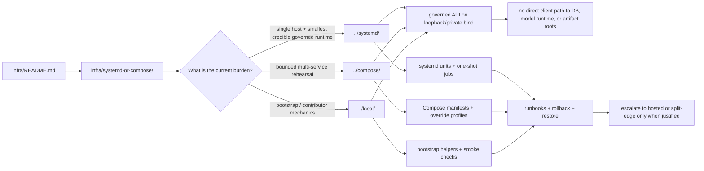

<!-- [KFM_META_BLOCK_V2]
doc_id: kfm://doc/<uuid-NEEDS-VERIFICATION>
title: systemd-or-compose
type: standard
version: v1
status: draft
owners: @bartytime4life
created: YYYY-MM-DD
updated: YYYY-MM-DD
policy_label: NEEDS VERIFICATION
related: [../../README.md, ../README.md, ../systemd/README.md, ../compose/README.md, ../local/README.md, ../../docs/runbooks/README.md, ../../policy/README.md, ../../contracts/README.md, ../../.github/CODEOWNERS]
tags: [kfm, infra, runtime, systemd, compose]
notes: [Current public main confirms this path exists and the directory is README-only; sibling runtime lanes are also README-only directories, but their README surfaces are substantive. doc_id, created/updated dates, and policy_label still need repo-history verification before merge.]
[/KFM_META_BLOCK_V2] -->

# systemd-or-compose

Shared runtime-orchestration guidance for KFM’s local-first infrastructure lane: when native `systemd` is preferred, when Compose is acceptable, and how the two must stay doctrine-aligned instead of drifting into parallel runtime universes.

> **Status:** experimental  
> **Owners:** `@bartytime4life` *(current public `/infra/` CODEOWNERS coverage; narrower lane-specific ownership still needs verification)*  
>        
> **Repo fit:** `infra/systemd-or-compose/README.md` → upstream [`../README.md`](../README.md) and [`../../README.md`](../../README.md); adjacent [`../systemd/`](../systemd/), [`../compose/`](../compose/), [`../local/`](../local/); downstream trust surfaces include [`../../contracts/`](../../contracts/), [`../../policy/`](../../policy/), [`../../schemas/`](../../schemas/), [`../../tests/`](../../tests/), [`../../docs/runbooks/README.md`](../../docs/runbooks/README.md), and [`../../.github/CODEOWNERS`](../../.github/CODEOWNERS)  
> **Quick jumps:** [Scope](#scope) · [Repo fit](#repo-fit) · [Accepted inputs](#accepted-inputs) · [Exclusions](#exclusions) · [Directory tree](#directory-tree) · [Quickstart](#quickstart) · [Usage](#usage) · [Diagram](#diagram) · [Operating tables](#operating-tables) · [Task list](#task-list) · [FAQ](#faq) · [Appendix](#appendix)

> [!IMPORTANT]
> **Current public repo reality:** `infra/systemd-or-compose/`, `infra/compose/`, `infra/systemd/`, and `infra/local/` are all **README-only directories** on public `main`. That is a directory-inventory fact, not a statement that the README surfaces themselves are thin. This guide, the sibling Compose guide, the sibling systemd guide, and the sibling local guide are all substantive README surfaces, but the public tree still does **not** prove active manifests, live deployment use, or branch-specific runtime authority.

> [!NOTE]
> KFM’s attached doctrine remains **systemd-first** for the thinnest credible phase-one runtime on a single Ubuntu host. This directory does **not** assume Compose is the default. It exists to document lane choice, shared invariants, and anti-drift rules across the local-first runtime family.

## Scope

This directory is the **shared decision surface** between KFM’s native `systemd` lane and its bounded Compose lane.

Its job is to answer four questions clearly:

1. When should KFM stay **native `systemd`**?
2. When is a **Compose-assisted local stack** acceptable?
3. What runtime invariants must remain true in **either** lane?
4. How do `infra/systemd/`, `infra/compose/`, `infra/local/`, and `infra/systemd-or-compose/` avoid becoming contradictory sources of truth?

### Current evidence snapshot

| Item | Status | Meaning here |
|---|---|---|
| `infra/systemd-or-compose/` exists | **CONFIRMED** | This path is present on public `main`. |
| `infra/systemd-or-compose/` directory inventory | **CONFIRMED** | The directory currently exposes `README.md` only. |
| This README is already substantive | **CONFIRMED** | The current public file is a real lane-selection and anti-drift guide, not a one-line placeholder. |
| `infra/compose/` directory inventory | **CONFIRMED** | Public `main` shows `README.md` only. |
| `infra/compose/README.md` is a substantive coordination doc | **CONFIRMED** | Compose is documented as its own lane, even though the directory is currently README-only. |
| `infra/systemd/` directory inventory | **CONFIRMED** | Public `main` shows `README.md` only. |
| `infra/systemd/README.md` is substantive but source-bounded | **CONFIRMED** | The systemd lane already carries real guidance, even while keeping stronger runtime claims visibly bounded. |
| `infra/local/` directory inventory | **CONFIRMED** | Public `main` shows `README.md` only. |
| `infra/local/README.md` is a substantive contributor-facing guide | **CONFIRMED** | The local lane already documents bootstrap and environment mechanics. |
| Public owner coverage for `/infra/` maps to `@bartytime4life` | **CONFIRMED** | Current public `CODEOWNERS` assigns the broad `/infra/` surface there. |
| This directory should own comparison and lane-selection guidance | **INFERRED** | That remains the cleanest role consistent with the repo split and sibling-doc responsibilities. |
| Exact authoritative runtime lane in active use on the checked-out branch | **NEEDS VERIFICATION** | Doctrine favors `systemd`-first, but current public docs do not prove the active branch/runtime choice. |
| Checked-in `.service`, `.timer`, or Compose manifests that govern current operation | **NEEDS VERIFICATION** | Not proven from the current public directory inventory used for this revision. |

### Current sibling lane snapshot

| Lane | Public-main directory state | README stance | Primary burden |
|---|---|---|---|
| `./` | README-only directory | Shared choice + anti-drift guide | Lane arbitration, shared invariants, ownership map |
| `../compose/` | README-only directory | Compose-specific coordination guide | Compose manifests, overrides, lane-local wiring if adopted |
| `../systemd/` | README-only directory | Source-bounded native-host guide | Native units, overrides, host wiring if adopted |
| `../local/` | README-only directory | Contributor-facing local bootstrap guide | Single-machine bootstrap, smoke checks, local environment mechanics |

### Directory contract

This directory should own **comparison, selection, and anti-drift guidance**.

It should **not** quietly become:

- a second home for `systemd` unit files,
- a second home for Compose manifests,
- a hiding place for policy law,
- or an unreviewed runtime shortcut that bypasses governed interfaces.

[Back to top](#systemd-or-compose)

## Repo fit

| Aspect | Value |
|---|---|
| Path | `infra/systemd-or-compose/README.md` |
| Primary role | Shared runtime choice and coordination guide for KFM’s local-first orchestration surfaces |
| Current public owner coverage | `/infra/` → `@bartytime4life` in public `CODEOWNERS`; narrower lane-specific ownership still needs verification |
| Upstream context | [`../../README.md`](../../README.md), [`../README.md`](../README.md) |
| Adjacent runtime docs | [`../systemd/README.md`](../systemd/README.md), [`../compose/README.md`](../compose/README.md), [`../local/README.md`](../local/README.md) |
| Related trust surfaces | [`../../contracts/`](../../contracts/), [`../../policy/`](../../policy/), [`../../schemas/`](../../schemas/), [`../../tests/`](../../tests/), [`../../docs/runbooks/README.md`](../../docs/runbooks/README.md) |
| Must stay out of scope | App logic, canonical contracts, policy bundles, release proof packs, live secrets, and source-of-truth dataset claims |

### Why this directory exists even with `systemd/` and `compose/` beside it

Because the repo already exposes a runtime family rather than a single runtime path:

- `infra/systemd/`
- `infra/compose/`
- `infra/local/`
- `infra/systemd-or-compose/`

That split is useful only if one place explains:

- which lane is preferred,
- which lane owns concrete artifacts,
- which concerns are shared,
- and where contributors should **not** duplicate files.

This README is that place.

[Back to top](#systemd-or-compose)

## Accepted inputs

Material belongs here when it helps compare or coordinate the runtime lanes **without stealing ownership** from more specific directories.

| Accepted input | Why it belongs here |
|---|---|
| Lane-selection notes | This directory should explain **why** one orchestration lane is preferred in a given phase. |
| Shared runtime invariants | Loopback-only binds, governed-API entry, no direct model/database exposure, and similar cross-lane rules belong here. |
| Anti-drift rules | Contributors need one place that says where the authoritative copy of a manifest or unit belongs. |
| Redacted env conventions | Cross-lane naming and placement guidance for env files is shared runtime doctrine. |
| Shared smoke-check guidance | Brief, cross-lane preflight checks fit here, with deeper procedures linked to runbooks. |
| Migration guidance | Local-only → private remote → hosted split-edge progression belongs here because it affects lane choice. |
| Comparison snippets | Minimal `systemd` vs Compose examples are acceptable when used to clarify ownership or invariants. |
| Ownership and review notes for the runtime family | This is the narrowest runtime doc that can explain broad `/infra/` ownership coverage without pretending lane-specific reviewers are already settled. |

## Exclusions

The following material should live elsewhere.

| Do not put this here | Put it here instead | Why |
|---|---|---|
| `*.service` / `*.timer` files as authoritative runtime artifacts | `../systemd/` | Lane-specific native service artifacts should live with the lane that owns them. |
| `compose.yml`, `docker-compose.yml`, or service-specific overrides | `../compose/` | Avoid duplicate manifest universes. |
| Local bootstrap notes that are not specifically about lane selection | `../local/` | Keep local bootstrap separate from orchestration choice. |
| Canonical schemas, OpenAPI, or contract law | `../../contracts/` and `../../schemas/` | Runtime wiring must not become the hidden home of interface truth. |
| Policy bundles, reason codes, or decision vocab | `../../policy/` | Policy law belongs in policy surfaces, not in runtime comparison docs. |
| App, worker, or domain code | `../../apps/`, `../../packages/`, or equivalent code surfaces | Infra guidance is not application authority. |
| Real secrets or live env files | Out-of-repo secret handling | Docs may describe shapes and names, never store live credentials. |
| Release receipts, correction notices, or publication proof packs | `../../docs/runbooks/` plus release/proof surfaces | Promotion is a governed state transition, not just an infra event. |
| Broad runtime ownership policy beyond what public `CODEOWNERS` proves | `../../.github/CODEOWNERS` and governance surfaces | This doc may point to coverage; it should not become the hidden owner registry. |

> [!WARNING]
> If this directory starts carrying actual unit files, Compose manifests, policy logic, and operational procedures at the same time, it has stopped being a coordination surface and become a drift generator.

[Back to top](#systemd-or-compose)

## Directory tree

### Current live repo slice

```text
infra/
├── README.md
├── backup/
├── compose/
│   └── README.md
├── dashboards/
├── gitops/
├── hosted/
├── kubernetes/
├── local/
│   └── README.md
├── monitoring/
├── systemd/
│   └── README.md
├── systemd-or-compose/
│   └── README.md
└── terraform/
```

### Current local-first runtime family

```text
infra/compose/
└── README.md          # substantive compose lane guide; directory currently README-only

infra/systemd/
└── README.md          # substantive but source-bounded systemd lane guide; directory currently README-only

infra/local/
└── README.md          # substantive local mechanics guide; directory currently README-only

infra/systemd-or-compose/
└── README.md          # substantive shared decision + anti-drift guide; directory currently README-only
```

### Suggested future shape (PROPOSED, not current repo fact)

```text
infra/systemd-or-compose/
├── README.md                  # this guide
├── profile-matrix.md          # explicit systemd vs compose selection matrix
├── examples/
│   ├── systemd/
│   └── compose/
├── env/
│   └── README.md              # redacted env naming/placement rules only
└── smoke/
    └── README.md              # cross-lane smoke checks and handoff links
```

> [!TIP]
> Do not create the proposed paths merely to satisfy documentation symmetry. Add them only when the live repo adopts this directory as the canonical shared orchestration decision surface.

[Back to top](#systemd-or-compose)

## Quickstart

Before editing anything under the runtime family, verify what the repo actually contains.

```bash
git rev-parse --show-toplevel

# Inspect the infra family first.
find infra -maxdepth 2 -type d | sort

# Read the parent and adjacent runtime guides.
for p in \
  infra/README.md \
  infra/systemd-or-compose/README.md \
  infra/systemd/README.md \
  infra/compose/README.md \
  infra/local/README.md
do
  [ -f "$p" ] && printf '\n### %s ###\n' "$p" && sed -n '1,260p' "$p"
done

# Inventory candidate runtime artifacts without assuming they exist.
find infra \
  \( -name '*.service' -o -name '*.timer' -o -name 'compose*.yml' -o -name 'docker-compose*.yml' -o -name '*.env.example' \) \
  -print | sort

# Cross-check adjacent trust surfaces and current public owner coverage before inventing runtime claims.
for p in \
  contracts/README.md \
  schemas/README.md \
  policy/README.md \
  tests/README.md \
  docs/runbooks/README.md \
  .github/CODEOWNERS
do
  [ -f "$p" ] && printf '\n### %s ###\n' "$p" && sed -n '1,220p' "$p"
done
```

### Review outcome you want

A contributor should be able to answer all of these before adding files:

- Which lane currently owns real runtime artifacts?
- Which runtime directories are still directory-only even when their README docs are substantive?
- Which binds must stay loopback or private in phase one?
- Where do smoke, restore, rollback, and correction procedures belong?
- What does current `CODEOWNERS` actually say about `/infra/`?
- What evidence would justify switching from native services to Compose for a given slice?

[Back to top](#systemd-or-compose)

## Usage

### 1) Start from `systemd` when proving the first real governed slice

KFM doctrine favors the smallest credible runtime that still preserves:

- the trust membrane,
- governed API mediation,
- explicit plane boundaries,
- local-only model/runtime exposure,
- and fail-closed operations.

For a single Ubuntu host, that usually means:

- `systemd` for long-lived services,
- one-shot jobs for ingest/build/publish/projection work,
- loopback-only or socket-local binds,
- no public reverse proxy in phase one.

### 2) Use Compose when it solves a real coordination problem

Compose is acceptable when it reduces local orchestration pain without weakening runtime doctrine, for example when:

- a contributor needs a bounded multi-service rehearsal,
- local dependency bring-up is otherwise error-prone,
- parity with a containerized downstream surface matters,
- or temporary service bundling is materially clearer than hand-managed native bring-up.

Compose is **not** a reason to expose:

- PostgreSQL/PostGIS,
- Ollama,
- artifact roots,
- review internals,
- or unpublished lifecycle stages.

### 3) Treat `../local/` as bootstrap, not as lane arbitration

`infra/local/` is where contributor-facing local mechanics belong.

That means:

- bootstrap helpers,
- dev-only persistence notes,
- smoke/start-stop guidance,
- and single-machine environment mechanics.

This directory should point to `../local/` when bootstrap is the question, and keep **lane arbitration** here.

### 4) Keep this directory as the handoff layer, not the execution bypass

Use `systemd-or-compose/` to answer:

- which lane is preferred now,
- which directory owns which files,
- what both lanes must keep invariant,
- and how migration should happen without stale copies surviving.

Do **not** use it to smuggle in:

- authoritative manifests,
- hidden policy decisions,
- speculative live deployment claims,
- or public-edge defaults that contradict local-first doctrine.

### 5) Keep progression explicit

A clean progression for this guide to describe is:

1. **Local-only** — single host, loopback binds, no public edge.
2. **Private remote** — VPN-mediated access to governed surfaces only.
3. **Small hosted split-edge** — public-safe UI/API outward; canonical, policy, and sensitive lanes remain private or more tightly controlled.
4. **More separated runtime** — only when service count, rollback risk, or blast-radius concerns justify the added operational burden.

[Back to top](#systemd-or-compose)

## Diagram



[Back to top](#systemd-or-compose)

## Operating tables

### Lane selection matrix

| Need | Preferred lane | Why |
|---|---|---|
| Single-host, long-lived service supervision | `../systemd/` | Best fit for native Ubuntu phase-one service management and loopback/socket-local posture. |
| Shared decision and anti-drift guidance | `./` | This directory owns the comparison rules and ownership map. |
| Bounded local multi-service rehearsal | `../compose/` | Good for service coordination when container layering solves a real bring-up problem. |
| Generic local-first bootstrap notes | `../local/` | Bootstrap and orchestration are related but not identical concerns. |
| Hosted or clustered deployment surfaces | `../hosted/`, `../kubernetes/`, `../terraform/`, `../gitops/` | These are later operational surfaces, not the default phase-one answer. |

### Current public sibling posture

| Lane | Public inventory | Current README posture | Safe interpretation |
|---|---|---|---|
| `infra/systemd-or-compose/` | README-only directory | Substantive decision guide | Public `main` proves documentation, not live runtime use |
| `infra/compose/` | README-only directory | Substantive compose lane guide | Public `main` proves lane intent, not an active committed Compose stack |
| `infra/systemd/` | README-only directory | Substantive but source-bounded systemd lane guide | Public `main` proves the lane exists, not that native units already govern current runtime |
| `infra/local/` | README-only directory | Substantive local mechanics guide | Public `main` proves bootstrap guidance, not exact branch/runtime defaults |

### Cross-lane runtime rules

| Concern | `systemd`-first posture | Compose posture | KFM rule |
|---|---|---|---|
| Governed API bind | Loopback by default | Loopback/private port map only | Public reachability must be intentional, reviewed, and justified. |
| PostgreSQL/PostGIS | Unix socket or localhost | Internal/private only | Never direct client-visible. |
| Ollama / local inference runtime | Loopback only | Private internal only | Never public-facing and never the normal client boundary. |
| Artifact roots | Filesystem path only | Mounted private volume only | No direct file-sharing exposure of `RAW`, `WORK`, `QUARANTINE`, or canonical roots. |
| One-shot jobs | Native units/timers | Explicit one-off jobs or equivalent | Must fail closed and produce diagnosable results. |
| Env handling | Root-owned env files / drop-ins | Redacted examples only in repo | No live secrets committed. |
| Rollback | Unit/service rollback + runbook | Manifest/service rollback + runbook | Runtime rollback must not erase correction lineage. |
| Derived services | Separate ownership and lower authority | Same | Search/vector/tile/scene layers stay derived unless explicitly promoted. |

### Anti-drift authority map

| If this artifact exists… | It should usually live in… | This directory should do… |
|---|---|---|
| `*.service`, `*.timer` | `infra/systemd/` | Link to it, explain why native services are preferred, and document shared invariants. |
| `compose.yml`, `docker-compose.yml`, Compose overrides | `infra/compose/` | Link to it, explain when Compose is allowed, and document shared invariants. |
| Shared runtime-choice notes | `infra/systemd-or-compose/` | Own them here. |
| Local-only bootstrap instructions | `infra/local/` | Point to them from here when relevant. |
| Runbook links for smoke/restore/rollback | `docs/runbooks/` or one canonical runtime surface | Keep a single authoritative copy and link to it. |
| Hosted/public-edge overlays | `infra/hosted/`, `infra/kubernetes/`, `infra/terraform/`, `infra/gitops/` | Point outward; do not duplicate. |

### Current public ownership note

| Path / concern | Current public evidence | What it does **not** prove |
|---|---|---|
| `/infra/` owner coverage | Broad public `CODEOWNERS` coverage maps to `@bartytime4life` | Narrower lane-specific owner assignments, reviewer availability, or required-review settings |
| This README’s current owner line | Reasonable to align with broad `/infra/` coverage | Final lane-specific stewardship without checkout/platform verification |

### Confidence table for claims in this README

| Claim family | Current label | Why |
|---|---|---|
| Directory existence and current README-only inventory | **CONFIRMED** | Verified from the live public repo. |
| README maturity across the sibling local runtime lanes | **CONFIRMED** | The sibling directories are README-only, but their README surfaces are substantive. |
| Parent infra doctrine and systemd-first local-first posture | **CONFIRMED** | Verified from repo-adjacent docs plus the attached corpus. |
| Broad `/infra/` owner coverage on public `main` | **CONFIRMED** | Current public `CODEOWNERS` assigns that surface to `@bartytime4life`. |
| This directory as the canonical shared decision surface | **INFERRED** | Strong fit with repo structure, but not yet proven by a richer subtree or active manifest set. |
| Proposed subpaths, manifest ownership refinements, and expanded handoff patterns | **PROPOSED** | These are build-useful recommendations, not proven current repo reality. |
| Exact runtime artifacts, actual binds, or live deployment state | **NEEDS VERIFICATION** | Not directly visible in the current public evidence used for this revision. |

[Back to top](#systemd-or-compose)

## Task list

### Definition of done for this directory

- [ ] Verify `doc_id`, `created`, `updated`, and `policy_label` in the KFM meta block.
- [ ] Confirm the owner line against live repo ownership evidence, not just broad `/infra/` fallback coverage.
- [ ] Keep **directory inventory** and **README maturity** distinct in every repo-state claim.
- [ ] Confirm which lane currently owns real runtime artifacts in the checked-out branch.
- [ ] If `.service`, `.timer`, or Compose manifests already exist elsewhere, link them here instead of duplicating them.
- [ ] Keep `systemd`-first doctrine visible for the phase-one single-host slice.
- [ ] Link smoke, restore, rollback, and correction procedures to the canonical runbook surface.
- [ ] Keep any env examples redacted and explicitly non-secret.
- [ ] Preserve explicit labels for anything still **INFERRED**, **PROPOSED**, or **NEEDS VERIFICATION**.

### Review gates

- [ ] **Architecture review:** trust membrane and phase boundaries remain visible.
- [ ] **Infra review:** bind scopes and ownership map remain coherent.
- [ ] **Policy review:** no policy law has leaked into runtime prose without a home in `policy/`.
- [ ] **Docs review:** adjacent runtime READMEs do not contradict this file.
- [ ] **Operations review:** rollback, smoke, migration, and owner-coverage implications are visible.

[Back to top](#systemd-or-compose)

## FAQ

### Why keep this directory if `infra/systemd/` and `infra/compose/` already exist?

Because contributors still need one place that explains **which lane to choose**, **what each lane may own**, and **how not to create duplicate runtime authority**.

### Why distinguish “README-only directory” from “README maturity”?

Because those are different facts. A directory can contain only `README.md` and still have a substantive guide. Conflating inventory with maturity turns accurate repo description into stale or misleading prose.

### Is Compose forbidden in KFM?

No. But current doctrine does not treat it as the default answer for the first real governed runtime. The default phase-one posture is a bounded, single-host, `systemd`-first Ubuntu profile.

### Can this directory become the home of production manifests?

Only if the repo explicitly standardizes on that choice later. Right now, the strongest fit is as a **shared decision and anti-drift guide**, not the sovereign home of lane-specific runtime artifacts.

### Why not just put everything in `infra/compose/` and call it done?

Because KFM’s doctrine is not “container-first by reflex.” Tool choice should follow governance burden, operational clarity, and the smallest-real-thing bias, not convenience branding.

### What if the repo eventually standardizes on one lane?

Then this directory can shrink into a brief handoff README—or disappear entirely—once the anti-drift problem is gone and one verified runtime home clearly owns the artifacts.

[Back to top](#systemd-or-compose)

## Appendix

<details>
<summary><strong>Verification backlog</strong></summary>

| Item | Current label | How to close it |
|---|---|---|
| `doc_id` | **NEEDS VERIFICATION** | Allocate the canonical KFM document identifier at merge time. |
| `created` / `updated` dates | **NEEDS VERIFICATION** | Resolve from commit history before commit. |
| `policy_label` | **NEEDS VERIFICATION** | Reconcile with the live repo labeling convention for infra docs. |
| Narrower lane-specific owner mapping | **NEEDS VERIFICATION** | Check whether live ownership controls narrow beyond broad `/infra/` fallback coverage. |
| Real unit file inventory | **NEEDS VERIFICATION** | Inventory `*.service` and `*.timer` files across `infra/` and related runtime paths. |
| Real Compose manifest inventory | **NEEDS VERIFICATION** | Inventory `compose*.yml` / `docker-compose*.yml` and note authoritative homes. |
| Canonical smoke/rollback home | **NEEDS VERIFICATION** | Confirm whether these live under `docs/runbooks/` or a runtime-specific subtree. |
| Authoritative phase-one runtime lane | **NEEDS VERIFICATION** | Verify with actual manifests, scripts, and runbooks in the checked-out repo. |

</details>

<details>
<summary><strong>Minimal glossary</strong></summary>

| Term | Meaning in this directory |
|---|---|
| `systemd`-first | Native host service management is the default answer for the thinnest credible phase-one KFM runtime. |
| Compose-assisted | A bounded local multi-service coordination layer that is acceptable only when it preserves the same trust boundaries. |
| Shared decision surface | A documentation surface that records lane choice, artifact ownership, and anti-drift rules without pretending to be canonical runtime truth. |
| Anti-drift rule | A rule that prevents duplicate manifests, unit files, or env conventions from turning into conflicting runtime authorities. |
| README-only directory | A directory-inventory fact that says nothing by itself about how mature the README content is. |
| Local-first | Start with the smallest bounded runtime that can prove the governed path before adding hosted or cluster complexity. |

</details>
