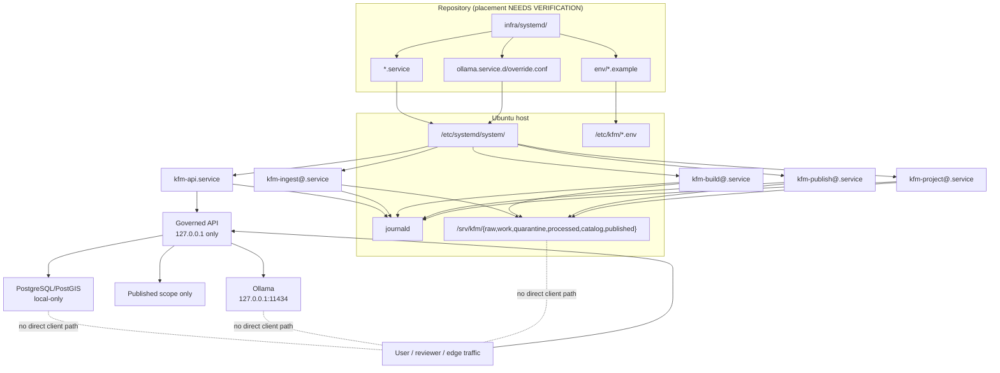

<!-- [KFM_META_BLOCK_V2]
doc_id: kfm://doc/TODO-VERIFY-UUID
title: infra/systemd
type: standard
version: v1
status: draft
owners: TODO-VERIFY-OWNERS
created: TODO-VERIFY-YYYY-MM-DD
updated: TODO-VERIFY-YYYY-MM-DD
policy_label: TODO-VERIFY-POLICY-LABEL
related: [TODO-VERIFY-RELATED-PATHS]
tags: [kfm, infra, systemd, linux, ubuntu, operations]
notes: [Target path was user-provided; freshest mounted KFM runtime starter paths point to runtime/phase1/*; no repo tree was directly visible in this session, so placement, owners, dates, and related links require verification.]
[/KFM_META_BLOCK_V2] -->

# infra/systemd

Ubuntu/systemd host wiring for the KFM phase-one runtime, when this repository chooses to place that material under `infra/systemd/`.

> **Status:** experimental  
> **Owners:** `TODO-VERIFY-OWNERS`  
>      
> **Quick jump:** [Scope](#scope) · [Repo fit](#repo-fit) · [Inputs](#inputs) · [Exclusions](#exclusions) · [Directory tree](#directory-tree) · [Quickstart](#quickstart) · [Usage](#usage) · [Diagram](#diagram) · [Tables](#tables) · [Task list](#task-list) · [FAQ](#faq) · [Appendix](#appendix)

> [!IMPORTANT]
> This README is intentionally source-bounded. The mounted March 2026 KFM corpus confirms a **systemd-first**, **Ubuntu-first**, **localhost-first** phase-one runtime posture. It does **not** confirm that the live repo currently exposes `infra/systemd/`, nor that the unit files shown below already exist here. The freshest corpus starter paths point instead to `runtime/phase1/*`, so this file should remain at `infra/systemd/` only if the mounted repo intentionally maps that runtime material into `infra/`.

> [!WARNING]
> Treat every path, filename, owner, and install command in this document as **CONFIRMED**, **INFERRED**, **PROPOSED**, or **UNKNOWN** according to the evidence available in this session. No mounted repo tree, workflow inventory, manifest set, or live unit files were directly inspected here.

## Scope

This directory is the host-wiring layer for KFM services that run as native `systemd` units on Ubuntu. When this path is the repo’s chosen home for host wiring, it is where unit files, override snippets, environment-file examples, and operational notes should live.

Three KFM ideas make this directory consequential rather than incidental:

- the governed API is the public-facing truth boundary;
- canonical stores, artifact roots, and local model runtime stay behind that boundary;
- service identity, write scope, restart behavior, and logging are part of the trust system, not mere ops trivia.

### Truth posture for this document

| Posture | Meaning here |
| --- | --- |
| **CONFIRMED** | The corpus supports a single-host Ubuntu phase-one runtime, systemd-first packaging, loopback-only governed API, loopback-only Ollama, local-only PostgreSQL/PostGIS, and explicit lifecycle zones such as `raw`, `work`, `quarantine`, `processed`, `catalog`, and `published`. |
| **INFERRED** | `infra/systemd/` is a repo-local remap of the fresher corpus starter shape under `runtime/phase1/systemd_units/*`. |
| **PROPOSED** | Exact file layout, service filenames, example install commands, and sibling documentation placement in this directory. |
| **UNKNOWN** | Whether the mounted repo already contains this path, these files, matching CI checks, or a different host-runtime directory convention. |

## Repo fit

### Path resolution note

The target path for this file was user-provided: `infra/systemd/`.

The freshest runtime-oriented starter paths in the mounted KFM corpus are:

- `runtime/phase1/local_ubuntu_profile.md`
- `runtime/phase1/systemd_units/*`
- `runtime/phase1/ollama_adapter_contract.md`
- `runtime/phase1/api_membrane.md`

That means this README is best understood as one of two things:

1. a valid directory README for a repo that intentionally places phase-one Ubuntu wiring under `infra/systemd/`, or
2. a near-final draft that should move to the verified runtime path once the actual tree is inspected.

### Repo fit matrix

| Field | Value |
| --- | --- |
| **Path** | `infra/systemd/` |
| **Role in repo** | Native Ubuntu/systemd host wiring for KFM phase-one runtime. |
| **Freshest corpus starter paths** | `runtime/phase1/*` (**CONFIRMED** as doctrinal placeholders, not mounted repo fact). |
| **Upstream inputs** | `apps/` entrypoints or binaries, policy/config surfaces, service-account expectations, artifact-root layout, publication scope rules. **NEEDS VERIFICATION** against the live repo. |
| **Downstream targets** | `/etc/systemd/system/`, `/etc/systemd/system/ollama.service.d/`, `/etc/kfm/*.env`, journald, loopback binds, firewall/VPN policy, and host-owned lifecycle directories such as `/srv/kfm/*`. |
| **Upstream links** | `TODO-VERIFY-UPSTREAM-LINKS` |
| **Downstream links** | `TODO-VERIFY-DOWNSTREAM-LINKS` |

## Inputs

What belongs here:

| Input class | Examples | Why it belongs |
| --- | --- | --- |
| Unit files | `kfm-api.service`, `kfm-ingest@.service`, `kfm-build@.service`, `kfm-publish@.service`, `kfm-project@.service` | These are the explicit service families proposed in the mounted Ubuntu/systemd runtime guidance. |
| Override snippets | `ollama.service.d/override.conf` | The corpus explicitly calls for a local-only Ollama override surface. |
| Environment examples | `env/kfm-api.env.example`, `env/kfm-worker.env.example`, `env/kfm-publish.env.example`, `env/ollama.override.env.example` | KFM host docs name the `/etc/kfm/*.env` pattern; repo copies should remain sanitized examples only. |
| Operator notes | install, reload, journal, verification, rollback, and hardening guidance | This is the layer where host wiring becomes reviewable and auditable instead of folk knowledge. |

## Exclusions

What does **not** belong here:

| Keep out of `infra/systemd/` | Put it here instead | Why |
| --- | --- | --- |
| Policy logic and reason/obligation law | `policy/` | Policy is shared backend law, not host glue. |
| Schemas, OpenAPI, vocabularies, fixtures | `contracts/` or `schemas/` | Contract surfaces need independent versioning and validation. |
| App code, workers’ business logic, domain transforms | `apps/` or `packages/` | Infra should not become the hiding place for real domain behavior. |
| Canonical datasets, receipts, or released artifacts | governed lifecycle zones and release-bearing stores | Unit files may mount or reference these, but they do not define them. |
| Real secrets or live credentials | host-only `/etc/kfm/*.env` or approved secret mechanism | The repo may hold examples, never live values. |
| Reverse-proxy publication policy | runtime/edge docs or verified hosted deployment docs | Phase one is explicitly local-first, not “open the port and hope.” |

## Directory tree

**PROPOSED** starter shape if the repo keeps phase-one host wiring here:

```text
infra/systemd/
├── README.md
├── kfm-api.service
├── kfm-ingest@.service
├── kfm-build@.service
├── kfm-publish@.service
├── kfm-project@.service
├── env/
│   ├── kfm-api.env.example
│   ├── kfm-worker.env.example
│   ├── kfm-publish.env.example
│   └── ollama.override.env.example
└── ollama.service.d/
    └── override.conf
```

A lean tree is a feature here. A reviewer should be able to answer three questions in under a minute:

1. Which services exist?
2. What is each service allowed to start, read, write, and restart?
3. Which live host-owned files must exist outside Git before any of this becomes real?

> [!NOTE]
> If adjacent docs already use `units/` or `runtime/phase1/systemd_units/` instead of a flat layout, prefer the established local pattern over this draft tree.

## Quickstart

### 1) Verify this path against the real repo

```bash
# REVIEW ONLY
find infra/systemd -maxdepth 2 -type f | sort

# ALSO CHECK THE FRESHER CORPUS STARTER SHAPE
find runtime/phase1 -maxdepth 2 -type f | sort
```

If the mounted repo already uses `runtime/phase1/`, move or cross-link this README instead of duplicating doctrine.

### 2) Validate unit syntax before install

```bash
# REVIEW ONLY
systemd-analyze verify infra/systemd/*.service
```

### 3) Install example units on a host

```bash
# EXAMPLE ONLY — adjust paths, users, groups, and ExecStart values before use
sudo install -m 0644 infra/systemd/*.service /etc/systemd/system/

sudo install -d -m 0750 /etc/kfm
sudo install -m 0640 infra/systemd/env/kfm-api.env.example /etc/kfm/kfm-api.env
sudo install -m 0640 infra/systemd/env/kfm-worker.env.example /etc/kfm/kfm-worker.env
sudo install -m 0640 infra/systemd/env/kfm-publish.env.example /etc/kfm/kfm-publish.env
sudo install -m 0640 infra/systemd/env/ollama.override.env.example /etc/kfm/ollama.override.env

sudo install -d -m 0755 /etc/systemd/system/ollama.service.d
sudo install -m 0644 infra/systemd/ollama.service.d/override.conf \
  /etc/systemd/system/ollama.service.d/override.conf

sudo systemctl daemon-reload
sudo systemctl enable --now kfm-api.service
```

### 4) Inspect live status, logs, and bind scope

```bash
# REVIEW / OPERATIONS
systemctl status kfm-api.service
systemctl status ollama.service

journalctl -u kfm-api.service -b --no-pager
journalctl -u ollama.service -b --no-pager

ss -lntp | grep -E '127\.0\.0\.1:(8080|11434)'
```

## Usage

### Unit strategy

Use long-running units for stable runtime surfaces and bounded units for explicit jobs.

- **Long-running:** governed API and any always-on support service that should survive operator login/logout.
- **One-shot or bounded batch:** ingest, build, publish, and projection work where a run should either complete or fail closed with diagnosable evidence.

### Network posture

Phase-one KFM is explicitly **not** a “just expose the service” design.

- Bind the governed API to loopback in the thinnest phase-one profile.
- Keep PostgreSQL/PostGIS on Unix socket or localhost only.
- Keep Ollama on loopback only.
- Keep RAW / WORK / QUARANTINE and direct artifact-root access off the public network.
- Introduce remote operator access through VPN or overlay before any public edge exists.

### Environment and secret boundary

The repo may store examples. Live service environment should resolve from host-owned files such as:

- `/etc/kfm/kfm-api.env`
- `/etc/kfm/kfm-worker.env`
- `/etc/kfm/kfm-publish.env`
- `/etc/kfm/ollama.override.env`

Treat them as root-owned, tightly permissioned, and outside casual operator read by default.

### Hardening profile

Recommended defaults for many units:

- `NoNewPrivileges=yes`
- `PrivateTmp=yes`
- `ProtectSystem=strict`
- `ProtectHome=read-only`
- `ReadWritePaths=` limited to required locations only
- `RuntimeDirectory=`, `StateDirectory=`, and `LogsDirectory=` where appropriate
- `RestrictSUIDSGID=yes`
- `ProtectKernelLogs=yes` where compatible
- distinct service users with one clear function each

> [!CAUTION]
> `PrivateNetwork=` is not a safe blanket default. Some KFM services still need host loopback communication to reach local-only API, database, or model-adapter boundaries.

### Logging and audit-join discipline

Host wiring should preserve the IDs that make KFM reconstructable, not merely “up.”

Recommended join fields to preserve end to end include:

- `request_id`
- `audit_ref`
- `release_id`
- `dataset_version_id`
- `decision_id`
- `bundle_id`

Where local audit continuity matters, persist journald rather than relying only on volatile runtime logs.

### Host validation loop

A host is not trustworthy merely because the processes are running. A reasonable local validation loop includes:

```bash
# SERVICE HEALTH
systemctl is-active kfm-api.service
systemctl is-active ollama.service

# BIND SCOPE
ss -lntp | grep 127.0.0.1:8080
ss -lntp | grep 127.0.0.1:11434

# POLICY / PUBLISHED SCOPE / EVIDENCE ROUTE
test -r /etc/kfm/kfm-api.env
test -d /srv/kfm/published
test -d /srv/kfm/catalog

# JOURNAL CONTINUITY
journalctl -u kfm-api.service -b --no-pager | tail -n 50
```

### Restart and rollback mindset

- Long-running services should generally prefer `Restart=on-failure`.
- One-shot jobs should not enter blind restart loops.
- Runtime rollback and public correction are distinct actions in KFM: a failed deploy may require a host rollback, while a release-bearing semantic problem may require correction or withdrawal artifacts.

## Diagram



## Tables

### Unit family matrix

| Unit family | Service shape | Purpose | Expected write scope | Posture |
| --- | --- | --- | --- | --- |
| `kfm-api.service` | long-running | governed API | runtime state, logs, limited catalog/published reads, explicit small writes only | unit name **PROPOSED**, role **CONFIRMED** |
| `kfm-ingest@.service` | templated one-shot | intake and landing | `raw/` and `work/` writes only | **PROPOSED** |
| `kfm-build@.service` | templated one-shot | build / transform / projection work | `processed/` and related derived writes as required | **PROPOSED** |
| `kfm-publish@.service` | bounded batch | catalog closure and publication movement | `catalog/` and `published/` only | **PROPOSED** |
| `kfm-project@.service` | templated one-shot | derived-layer rebuilds | derived outputs only | **PROPOSED** |

### Service dependency law

| Order | Why it matters |
| --- | --- |
| Database before governed API | The API should not advertise readiness against a missing canonical store. |
| Artifact mounts before workers | Intake/build/publish jobs need known paths before they start. |
| Policy/config readability before API readiness | KFM does not treat policy as decorative. |
| Local model runtime before AI-enabled answer path | AI support is subordinate, but if enabled it must be reachable through the governed adapter. |
| Projection rebuilds only after a published release exists | Derived layers trail release-bearing truth; they do not race ahead of it. |

### Environment and managed directories

| Surface | Example | Notes |
| --- | --- | --- |
| Environment file | `/etc/kfm/kfm-api.env` | host-owned, not committed with live values |
| Runtime directory | `RuntimeDirectory=kfm-api` | transient runtime files and sockets |
| State directory | `StateDirectory=kfm-api` | durable service-owned state when needed |
| Logs directory | `LogsDirectory=kfm-api` | pair with journald-driven inspection |
| Explicit writes | `ReadWritePaths=/run/kfm /var/lib/kfm-api /srv/kfm/catalog /srv/kfm/published` | narrow write scope is preferred over broad ownership |
| Lifecycle roots | `/srv/kfm/raw`, `/srv/kfm/work`, `/srv/kfm/quarantine`, `/srv/kfm/processed`, `/srv/kfm/catalog`, `/srv/kfm/published` | example host pattern from the mounted corpus; actual host path choice is **NEEDS VERIFICATION** |

### Host validation signals

| Check | Healthy signal | Why it matters |
| --- | --- | --- |
| `systemctl is-active` | `active` for long-running units | Running process is necessary, not sufficient |
| Bind scope | API and Ollama listen on `127.0.0.1` only | Prevents trust-boundary collapse |
| Published scope | mounted and readable | UI/runtime surfaces should not read unpublished scope |
| Policy/config | readable at boot | readiness should fail closed without them |
| Journald continuity | persistent logs available after reboot | keeps runtime evidence reconstructable |
| Worker behavior | bounded success or fail-closed logs | prevents silent retry loops and hidden data drift |

## Task list

| Gate | Done when | Evidence to capture |
| --- | --- | --- |
| Path fit | The mounted repo confirms whether `infra/systemd/` is the right home, or this README is moved to the verified runtime path. | repo tree snapshot or PR diff |
| Ownership | `TODO-VERIFY-OWNERS` is replaced with real team or names. | README update |
| Unit realism | `ExecStart`, `WorkingDirectory`, user, and group map to real binaries and host paths. | reviewed unit files + `systemd-analyze verify` |
| Secret boundary | Live values are outside Git and repo copies are example-only. | host permissions + sanitized examples |
| Loopback discipline | API, DB, and Ollama exposure match approved host boundary. | bind config + firewall / VPN review |
| Least privilege | Service users and `ReadWritePaths=` reflect stage-specific rights. | unit review + filesystem permissions |
| Logging | Operators can inspect health and failure via journald without guesswork. | `systemctl`, `journalctl`, joined IDs visible |
| Rollback readiness | Disable/stop/reload steps exist and do not depend on folklore. | runbook note or PR checklist |

### Definition of done

- [ ] Repo path and local directory convention verified against the mounted tree.
- [ ] Owners, dates, and related links replaced with real values.
- [ ] Unit names, paths, and environment examples aligned to real binaries and directories.
- [ ] Host-only env files and service users documented with verified permissions.
- [ ] At least one long-running unit and one one-shot template verified end to end.
- [ ] Journald inspection and rollback steps exercised once on a non-production host.
- [ ] Any conflict between `infra/systemd/` and `runtime/phase1/*` is resolved explicitly, not silently.

## FAQ

### Why is the path itself flagged?

Because the user provided `infra/systemd/`, but the freshest mounted runtime placeholders in the corpus point to `runtime/phase1/*`. The doctrine is strong; the live repo placement is not verified in this session.

### Why systemd here instead of a container-first README?

Because the current KFM Linux guidance treats **systemd-first packaging** as the thinnest credible phase-one start on Ubuntu. It keeps loopback and Unix-socket boundaries simple while the governed path is still being proven.

### Why keep real secrets out of this directory?

Because this repo surface is for reviewable host wiring. Live credentials belong on the host, not in Git. This directory should carry sanitized examples and clear installation rules, not operational leakage.

### Why are PostgreSQL/PostGIS and Ollama treated so cautiously?

Because KFM’s trust membrane depends on keeping canonical stores and model runtime behind the governed API. Direct client access would collapse the boundary the rest of the architecture is trying to preserve.

### Why no public reverse proxy in phase one?

Because the corpus’s phase-one posture is local-first: prove the governed path, keep services on loopback, and add VPN or split-edge exposure only when real operational burden justifies it.

## Appendix

<details>
<summary><strong>Illustrative skeleton unit — <code>kfm-api.service</code></strong></summary>

```ini
[Unit]
Description=KFM Governed API
After=network-online.target postgresql.service
Wants=network-online.target
Requires=postgresql.service

[Service]
User=kfm-api
Group=kfm-api
WorkingDirectory=/opt/kfm/api
EnvironmentFile=/etc/kfm/kfm-api.env
ExecStart=/path/to/actual-kfm-api-binary --bind 127.0.0.1:8080
Restart=on-failure
RestartSec=5

RuntimeDirectory=kfm-api
StateDirectory=kfm-api
LogsDirectory=kfm-api

NoNewPrivileges=yes
PrivateTmp=yes
ProtectSystem=strict
ProtectHome=read-only
ReadWritePaths=/run/kfm /var/lib/kfm-api /srv/kfm/catalog /srv/kfm/published
RestrictSUIDSGID=yes
ProtectKernelLogs=yes
UMask=0027

[Install]
WantedBy=multi-user.target
```

</details>

<details>
<summary><strong>Illustrative Ollama override — local-only bind</strong></summary>

```ini
[Service]
Environment="OLLAMA_HOST=127.0.0.1:11434"
Environment="OLLAMA_MODELS=/var/lib/ollama/models"
```

</details>

<details>
<summary><strong>Illustrative operator verification commands</strong></summary>

```bash
# SERVICE ACTIVITY
systemctl is-active kfm-api.service
systemctl is-active ollama.service

# BIND SCOPE
ss -lntp | grep 127.0.0.1:8080
ss -lntp | grep 127.0.0.1:11434

# UNIT INSPECTION
systemctl cat kfm-api.service
systemd-analyze verify /etc/systemd/system/kfm-api.service

# LOGS
journalctl -u kfm-api.service -b --no-pager | tail -n 100
journalctl -u ollama.service -b --no-pager | tail -n 100
```

</details>

[Back to top](#infrasystemd)
